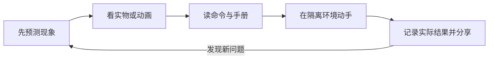

# 从这里开始：选择你的 Linux 学习路线

本项目借鉴 [WaytoAGI](https://www.waytoagi.com) 将知识、工具、提示词和实践入口集中组织的方式，把 Linux 学习串成“看概念 → 选工具 → 做实验 → 核对结果 → 分享改进”。以下路线、实验与素材编排由本项目独立制作。

## 先选一个目标

| 我现在想做什么 | 推荐入口 | 第一个可验收成果 |
|---|---|---|
| 从零认识 Linux | [启蒙认知](docs/00-onboarding/01-为什么人人都要学Linux.md) → [安装环境](docs/00-onboarding/04-安装你的第一个Linux.md) | 能自己打开终端并保存环境名片 |
| 提高日常命令行效率 | [文件操作](docs/01-basics/01-文件与目录操作.md) → [管道](docs/02-advanced/01-管道与重定向.md) | 从模拟日志统计 Top 项目 |
| 管好自己的服务器 | [systemd](docs/02-advanced/06-systemd服务与日志.md) → [安全加固](docs/03-pro/03-安全加固.md) | 服务可访问、日志可查、认证策略有证据 |
| 在 Linux 上使用 AI | [容器](docs/03-pro/04-容器与虚拟化.md) → [本地 AI 项目](docs/04-projects/项目4-Linux跑本地AI.md) | 命令行和 WebUI 都能调用模型 |
| 让 AI 帮我学习和排障 | [AI 辅助学习](docs/03-pro/07-AI辅助学习与运维.md) → [提示词练习](resources/prompt-lab.md) | 一份区分事实、假设和实测结果的笔记 |
| 用树莓派做出实物 | [选型与配件](docs/05-raspberry-pi/01-树莓派是什么与选购.md) → [GPIO](docs/05-raspberry-pi/04-GPIO硬件编程.md) | 正确接线点灯，或记录按钮 CSV |

没有树莓派可以先完成软件路线；没有 GPU 可以从小模型的 CPU 路线开始。不要为了勾选教程任务先买一堆设备。

## 每个知识点走五步

动手前用 [实验环境对照表](resources/environment-matrix.md) 确认工具、内核能力和权限，尤其是 systemd、磁盘、Docker 和 GPIO 实验。

1. **先预测**：命令会读什么、写什么、失败会怎样？
2. **看得见**：用 [实物图鉴](resources/hardware-gallery.md) 识别设备，用 [动画实验室](resources/visual-lab.md) 看清数据流。
3. **选工具**：到 [工具导航](resources/toolbox.md) 找对应检查方法，解释不清参数时查手册。
4. **做实验**：保留源数据、完整命令和实际输出；AI 的答案只是待核对的建议。
5. **留下成果**：完成 [练习](exercises/README.md)，用 [Git](docs/02-advanced/09-Git与学习笔记协作.md) 记录修正，再按 [贡献说明](CONTRIBUTING.md) 分享。

## 七天体验路线

适合先体验学习方法；它不是替代完整教程的“七天精通”。每天可以拆成多次完成。

| 天 | 任务 | 交付物 |
|---|---|---|
| 1 | 获得 Linux 环境，运行 pwd、ls、uname | 环境名片 |
| 2 | 认识内存、SSD、网络接口，记录系统视图 | 脱敏硬件记录 |
| 3 | 看管道动画，逐段运行日志处理命令 | 每一步的输入/输出 |
| 4 | 创建备份、预演第六次备份、恢复一个文件 | 恢复后内容一致的证据 |
| 5 | 阅读容器卷动画，重建容器并读取同一文件 | 容器与卷关系图 |
| 6 | 让 AI 解释一条错误，用手册和实验核对 | 提示词与验证笔记 |
| 7 | 用 Git 保存成果，选择一个项目继续 | 学习记录与下一步计划 |

完整节奏见 [八周路线图](ROADMAP.md)。新增章节可以穿插对应周，也可以作为巩固任务延长学习时间。

## 我的成果清单

- [ ] 一份不含敏感标识的环境与硬件记录。
- [ ] 一份通过恢复验证的备份。
- [ ] 一个可复现、可停止、可说明数据位置的服务。
- [ ] 一份经过核对的 AI 辅助排障笔记。
- [ ] 一次有证据和测试说明的知识库贡献。
- [ ] 可选：一次真机 GPIO 或图像采集实验，模拟结果明确标记。

## 这与 WaytoAGI 如何对应

| 借鉴的组织方式 | 本项目的落地方式 |
|---|---|
| 知识库入口 | 42 章分阶段知识地图，附前后章节导航 |
| 工具分类 | 按任务选 Linux 工具，说明输入、输出与限制 |
| 提示词入口 | 命令解释、错误分析、脚本审阅、复盘四类模板 |
| 硬件与实践 | 有署名的实物照片、动画和可验收的本地实验 |
| 持续共建 | Git 学习、贡献模板、自动链接和素材检查 |

这里对齐的是学习与共建方式，不复制 WaytoAGI 的文章、品牌素材或站点界面。
