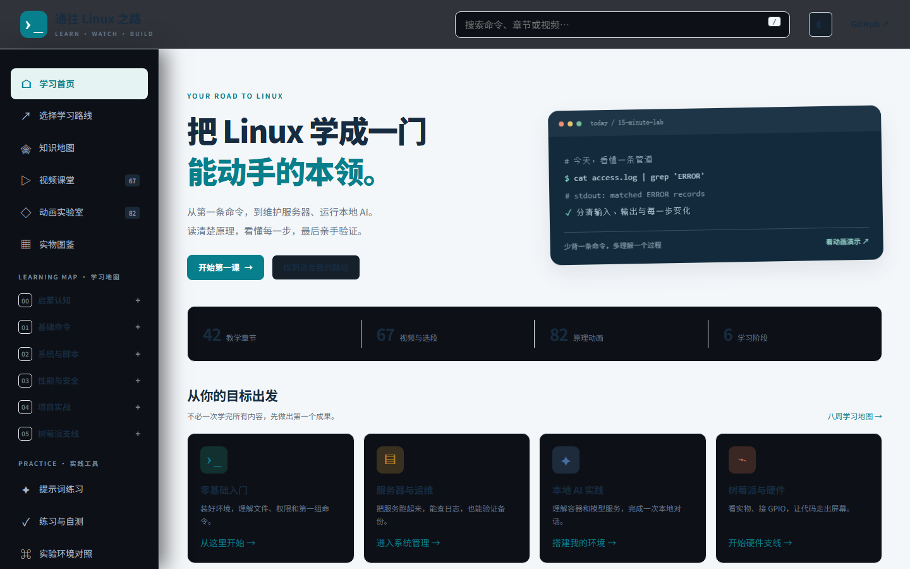
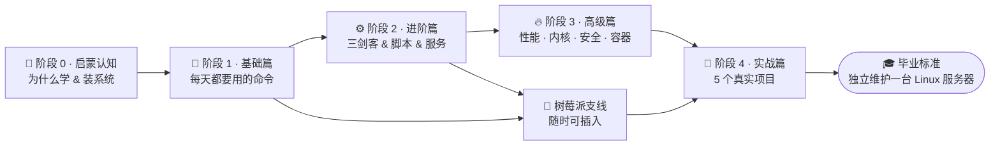

<div align="center">

# 🐧 通往 Linux 之路

**The Road to Linux Mastery —— 一套人人可学、边看边练的中文 Linux 系统教学工程**

[](#-学习地图) [](#-目录导航) [](resources/visual-lab.md) [](resources/videos.md) [](https://github.com/zhuguang-ZFG/linux/actions/workflows/check.yml) [](LICENSE)

**[进入在线学习站 →](https://zhuguang-zfg.github.io/linux/)** · [站内视频课堂](https://zhuguang-zfg.github.io/linux/#videos) · [可控制的动画演示](https://zhuguang-zfg.github.io/linux/#animations)




> 灵感源自「通往 AGI 之路」：**用清晰的路线图，把一件复杂的事拆成每天都能走的一小步。**
> AI 时代，许多模型服务、容器和云服务器以 Linux 为基础 —— 从命令行到本地 AI，沿着这条路一步步动手。

</div>

---

## ✨ 这是什么

这是一套**完整的 Linux 中文教学工程**，遵循「通往 AGI 之路」的知识地图式编排：

- 🗺️ **路线图驱动**：6 个阶段 42 个章节，从「什么是 Linux」到「树莓派边缘 AI」，增加硬件识别、Git 协作、AI 辅助运维与按钮数据记录
- 🎬 **原理动画**：87 部原创 SVG 动画，新增 管道缓冲、umask 位运算、页缓存、OOM 选择、journald 日志流、cgroup 限额、TCP 握手、Git 变基、SSH 隧道、归档管道、awk 三段、sed 地址、硬件总线、发行版包管理、开机四棒、DHCP/mDNS、Git 分支、重定向、sed/awk、服务重启、信号、内存缓存、inode、DNS、LNMP、消抖、批量改名、Pi 与 Pico、无头安装、3-2-1 备份、云端 vs 边缘、PATH/grep、归档、Vim 模式、安装选型、边缘 OCR、本地模型、apt 依赖、文件操作、内网穿透、排障四段式、烧录启动、内核与发行版、发行版家族、man 手册、硬件识别、选购要点、远程配置、家庭服务器、系统调用切换、防火墙规则链、容器隔离、负载判读、sudo 借权、Git 提交三区、环境变量继承、apt 全流程、Ansible 批量、Vim 整行操作、模型选型、退出码协议、journalctl 检索、按钮数据记录、trap 善终、命令旅程、每日巡检、路径解析、grep 选项、按钮输入、许可证对照、求助四件套与结构化提问；学习站支持暂停、单步、拖动和重播
- 📷 **实物图鉴**：26 张 Wikimedia Commons 图片，新增内存、SSD、网线、交换机、摄像头、电阻、显卡、NAS、主板、键盘、路由器、鼠标、显示器与机箱实拍，附完整[署名清单](assets/images/CREDITS.md)
- 📺 **视频课堂**：76 条视频选段（60 条 B站分P + 16 条 YouTube），记录作者、时长和核验状态，学习站使用官方播放器并保留原站入口
- 🧪 **边学边练**：每章自带「动手实验 + 自测清单」，配套 6 套练习题与答案、11 张速查表

## 🧭 先选入口，再开始学习

借鉴 [WaytoAGI](https://www.waytoagi.com) 的知识库、工具、提示词与实践入口，把学习资料组织成可以动手验证的路线：

| 入口 | 适合什么时候打开 |
|---|---|
| 🗺️ [选择学习路线](LEARNING_PATHS.md) | 零基础、服务器、本地 AI、树莓派，各自从哪里开始 |
| 🕸️ [知识地图](resources/knowledge-map.md) | 42 章的前置、产出与后续：知识在哪用、卡住去哪查 |
| 🧪 [确认实验环境](resources/environment-matrix.md) | 判断当前环境能做哪些实验，避免照搬不同系统的命令 |
| 🖼️ [实物图鉴](resources/hardware-gallery.md) | 先认识硬件，再读系统命令 |
| 🎬 [动画实验室](resources/visual-lab.md) | 先预测数据流，再逐步验证 |
| 🧰 [工具导航](resources/toolbox.md) | 按任务选择工具，知道它能证明什么 |
| 🚨 [错误信息索引](resources/error-index.md) | 看到报错先查表：第一诊断与只读检查命令 |
| ❌ [常见误解 30 条](resources/misconceptions.md) | 先破再立，每条都附自己验证的方法 |
| 💬 [提示词练习](resources/prompt-lab.md) | 用 AI 解释、提问和审阅，再用手册与实验核对 |
| 📝 [练习与作品](exercises/README.md) | 把看过的内容变成可复做的成果 |



---

## 🗺️ 学习地图



---

## 📂 目录导航

### 阶段 0 · 启蒙认知 —— 建立世界观（约 1 周）

| # | 章节 | 你将学到 |
|---|------|---------|
| 01 | [为什么人人都要学 Linux](docs/00-onboarding/01-为什么人人都要学Linux.md) | AI 时代 Linux 的地位：云、容器、超算、嵌入式 |
| 02 | [Linux 的前世今生](docs/00-onboarding/02-Linux的前世今生.md) | Unix→Linux 历史、内核与发行版的区别、开源文化 |
| 03 | [发行版全景图](docs/00-onboarding/03-发行版全景图.md) | Ubuntu / Debian / RHEL / Arch 怎么选 |
| 04 | [安装你的第一个 Linux](docs/00-onboarding/04-安装你的第一个Linux.md) | WSL2 / 虚拟机 / 云主机 / 双系统四条路线 |
| 05 | [初见终端与 Shell](docs/00-onboarding/05-初见终端与Shell.md) | 命令行世界观，敲下人生第一组命令 |

### 阶段 1 · 基础篇 —— 每天都要用的命令（约 2 周）

| # | 章节 | 关键命令 |
|---|------|---------|
| 01 | [文件与目录操作](docs/01-basics/01-文件与目录操作.md) | `pwd` `ls` `cd` `cp` `mv` `rm` `find` |
| 02 | [查看与编辑文件 · Vim](docs/01-basics/02-查看与编辑文件-Vim.md) | `cat` `less` `head` `tail` + Vim 生存指南 |
| 03 | [用户与权限](docs/01-basics/03-用户与权限.md) | `sudo` `chmod` `chown` `useradd` |
| 04 | [压缩与归档](docs/01-basics/04-压缩与归档.md) | `tar` `gzip` `zip` 四大场景 |
| 05 | [软件包管理](docs/01-basics/05-软件包管理.md) | `apt` / `dnf` / `pacman` 三系对比 |
| 06 | [进程管理](docs/01-basics/06-进程管理.md) | `ps` `top` `kill` 信号机制 |
| 07 | [环境变量与 PATH](docs/01-basics/07-环境变量与PATH.md) | `export` `$PATH` `alias` 配置文件加载顺序 |
| 08 | [高效求助 · man 与 tldr](docs/01-basics/08-高效求助-man与tldr.md) | `man` `--help` `tldr` 自学能力养成 |
| 09 | [从实物认识 Linux 硬件](docs/01-basics/09-从实物认识Linux硬件.md) | 内存、SSD、网卡与 `lscpu` / `lsblk` / `lsusb` |

### 阶段 2 · 进阶篇 —— 系统管理与脚本（约 2 周）

| # | 章节 | 主题 |
|---|------|------|
| 01 | [管道与重定向](docs/02-advanced/01-管道与重定向.md) | `\|` `>` `>>` `2>&1` `xargs` |
| 02 | [grep 文本搜索](docs/02-advanced/02-grep文本搜索.md) | 正则、上下文、递归搜索 |
| 03 | [sed 流编辑器](docs/02-advanced/03-sed流编辑器.md) | 批量替换、增删改 |
| 04 | [awk 文本分析](docs/02-advanced/04-awk文本分析.md) | 按列处理、统计报表 |
| 05 | [Bash 脚本编程](docs/02-advanced/05-Bash脚本编程.md) | 变量/条件/循环/函数/调试 |
| 06 | [systemd 服务与日志](docs/02-advanced/06-systemd服务与日志.md) | `systemctl` `journalctl` 开机自启 |
| 07 | [磁盘与文件系统](docs/02-advanced/07-磁盘与文件系统.md) | 分区、LVM、挂载、inode |
| 08 | [网络基础与远程连接](docs/02-advanced/08-网络基础与远程连接.md) | `ip` `ss` `ssh` `scp` `rsync` |
| 09 | [Git 与学习笔记协作](docs/02-advanced/09-Git与学习笔记协作.md) | 工作区、提交、分支、证据与知识库贡献 |

### 阶段 3 · 高级篇 —— 性能、内核与安全（约 1 周，可按基础延长）

| # | 章节 | 主题 |
|---|------|------|
| 01 | [性能观测与调优](docs/03-pro/01-性能观测与调优.md) | 负载、`vmstat`、`iostat`、火焰图 |
| 02 | [内核与系统调用](docs/03-pro/02-内核与系统调用.md) | `/proc` `/sys`、内核模块 |
| 03 | [安全加固](docs/03-pro/03-安全加固.md) | 防火墙、SSH 加固、fail2ban |
| 04 | [容器与虚拟化](docs/03-pro/04-容器与虚拟化.md) | Docker 入门、K8s 认知地图 |
| 05 | [自动化运维](docs/03-pro/05-自动化运维.md) | Ansible、定时任务、Git 化运维 |
| 06 | [Shell 脚本进阶](docs/03-pro/06-Shell脚本进阶.md) | `getopts`、`trap`、并发、Expect |
| 07 | [AI 辅助学习与运维](docs/03-pro/07-AI辅助学习与运维.md) | 上下文、提示词、只读排查、人工审阅与实测 |

### 阶段 4 · 实战篇 —— 用项目固化能力（约 2 周，可按项目延长）

| # | 项目 | 产出 |
|---|------|------|
| 1 | [搭建 LNMP 网站服务器](docs/04-projects/项目1-LNMP网站服务器.md) | 一台能跑 WordPress 的公网服务器 |
| 2 | [服务器巡检脚本](docs/04-projects/项目2-服务器巡检脚本.md) | 一键输出健康报告的 Bash 工具 |
| 3 | [个人云盘与内网穿透](docs/04-projects/项目3-个人云盘与内网穿透.md) | Nextcloud + Tailscale 私有网盘 |
| 4 | [用 Linux 跑本地 AI](docs/04-projects/项目4-Linux跑本地AI.md) | Docker 部署 Ollama + Open WebUI，本地大模型 |
| 5 | [故障排查 20 例](docs/04-projects/项目5-故障排查20例.md) | 面试与生产环境高频故障复盘 |

### 🍓 树莓派支线 —— 把 Linux 握在手心（可随时插入）

| # | 章节 | 主题 |
|---|------|------|
| 01 | [树莓派是什么与选购](docs/05-raspberry-pi/01-树莓派是什么与选购.md) | 型号对比、配件清单、避坑指南 |
| 02 | [烧录系统与首次启动](docs/05-raspberry-pi/02-烧录系统与首次启动.md) | Raspberry Pi Imager、microSD、无头安装 |
| 03 | [远程连接与基础配置](docs/05-raspberry-pi/03-远程连接与基础配置.md) | SSH、换源、`raspi-config`、VNC |
| 04 | [GPIO 硬件编程](docs/05-raspberry-pi/04-GPIO硬件编程.md) | 点亮 LED、按键、传感器，gpiozero |
| 05 | [家庭服务器实战](docs/05-raspberry-pi/05-家庭服务器实战.md) | NAS、Pi-hole 去广告、Docker 家园 |
| 06 | [树莓派与边缘 AI](docs/05-raspberry-pi/06-树莓派与边缘AI.md) | 摄像头视觉、本地小模型、语音助手 |
| 07 | [从按钮到数据记录](docs/05-raspberry-pi/07-从按钮到数据记录.md) | GPIO 状态、CSV、模拟与真机结果区分 |

---

## 🧰 配套资源

| 资源 | 说明 |
|------|------|
| 📺 [视频资源库](resources/videos.md) | 76 条视频或选段；资料已核对，完整实播状态单独记录 |
| 📚 [书单与网站](resources/books-and-sites.md) | 5 本书与 10+ 学习网站，包含 TLDP、ArchWiki、explainshell |
| 📝 [练习题与答案](exercises/) | 六个阶段各一套，选择+实操，答案可折叠 |
| ⚡ [速查表](cheatsheets/) | 常用命令 / 权限与用户 / 磁盘与存储 / 性能观测 / Vim / 三剑客 / systemd / 网络 / Git / 容器 / 树莓派 |
| 🎬 [原创动画](resources/visual-lab.md) | 87 部 SVG 动画，学习站提供播放控制、文字步骤和实操入口 |
| 🖼️ [实物图片](resources/hardware-gallery.md) | 26 张图片 + [授权署名](assets/images/CREDITS.md)，照片与示意分开标注 |
| 🛠️ [配套源码与检查](scripts/README.md) | 备份、巡检、Docker、GPIO 与内容质量检查 |

## 🚀 快速开始

```bash
# 1. 克隆本仓库
git clone https://github.com/zhuguang-ZFG/linux.git
cd linux

# 2. 打开学习地图，从阶段 0 第 1 章开始
#    推荐顺序：README 路线图 → docs/00-onboarding → 逐章练习

# 3. 每章学完，完成「动手实验」并勾选「自测清单」
```

> 💡 **没有 Linux 机器？** 没关系，第 4 章教你 10 分钟内用 WSL2 或云主机获得一个。

## 🗓️ 八周学习计划

详见 [ROADMAP.md](ROADMAP.md)：按周拆解的目标、检查点与里程碑。

## 🤝 参与贡献

欢迎提交 PR 补充章节、修正命令、分享实验！请先阅读 [CONTRIBUTING.md](CONTRIBUTING.md)（含 issue/PR 模板与检查清单）。社区规范见 [CODE_OF_CONDUCT.md](CODE_OF_CONDUCT.md)，安全漏洞请走 [SECURITY.md](SECURITY.md) 的私有渠道，变更历史见 [CHANGELOG.md](CHANGELOG.md)。

## 🙏 致谢

- 编排思路致敬 [通往 AGI 之路（WaytoAGI）](https://www.waytoagi.com) —— 让复杂知识人人可学
- 图片素材来自 [Wikimedia Commons](https://commons.wikimedia.org)，详见 [署名清单](assets/images/CREDITS.md)
- 视频资源归 B站 / YouTube 各 UP 主与频道所有，本仓库仅作学习导航

---

<div align="center">

**如果这条路帮到了你，请点一个 ⭐ Star，让更多人看到。**

</div>
