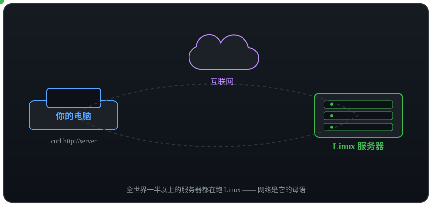
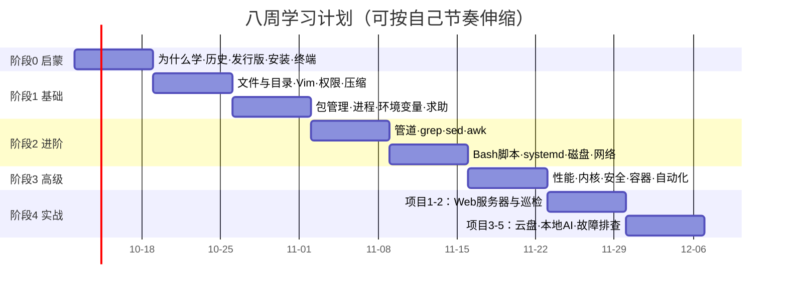
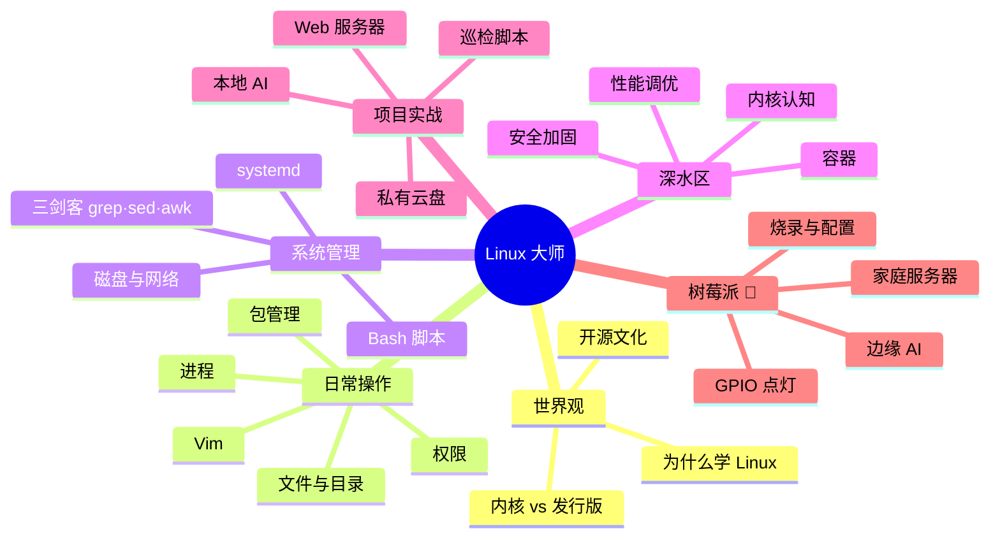
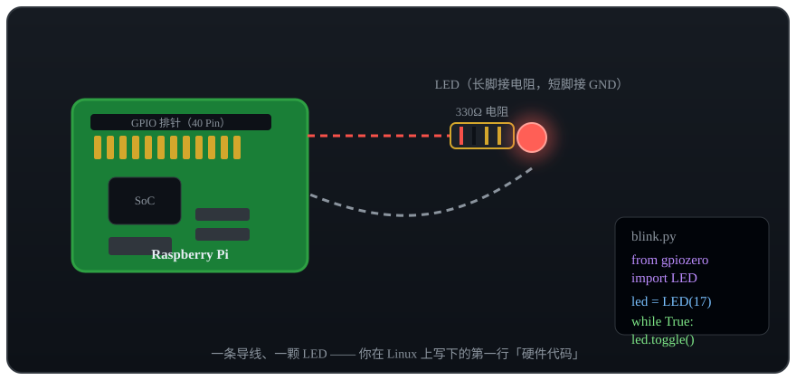

# 🗓️ ROADMAP · 八周通往 Linux 之路

> 路线图是这张地图的「放大版」：每个阶段有目标、检查点与里程碑。
> 顺序可以微调，但**每个阶段的动手实验不能跳过** —— Linux 是敲出来的，不是看出来的。

## 总览

---

## 阶段 0 · 启蒙认知（第 1 周）

**目标**：知道 Linux 是什么、能干什么，并真正拥有一个可用的 Linux 环境。

| 天 | 内容 | 检查点 |
|----|------|--------|
| 1-2 | [为什么人人都要学 Linux](docs/00-onboarding/01-为什么人人都要学Linux.md)、[Linux 的前世今生](docs/00-onboarding/02-Linux的前世今生.md) | 能向朋友讲清「内核」与「发行版」的区别 |
| 3 | [发行版全景图](docs/00-onboarding/03-发行版全景图.md) | 选定自己的第一个发行版并说明理由 |
| 4-5 | [安装你的第一个 Linux](docs/00-onboarding/04-安装你的第一个Linux.md) | ✅ **里程碑：拥有可登录的 Linux** |
| 6-7 | [初见终端与 Shell](docs/00-onboarding/05-初见终端与Shell.md) + [练习](exercises/00-启蒙认知练习.md) | 完成 10 组「看命令猜作用」 |

## 阶段 1 · 基础篇（第 2-3 周）

**目标**：脱离鼠标，完成日常 90% 的文件操作；看懂权限报错并修复。

| 周 | 内容 | 检查点 |
|----|------|--------|
| 2 | 章节 01-04：文件操作、Vim、权限、压缩 | 用纯命令行整理一个 100+ 文件的目录；Vim 内完成「保存退出」不再查表 |
| 3 | 章节 05-08：包管理、进程、环境变量、求助 | 安装并卸载 htop；能杀掉失控进程；✅ **里程碑：通过[基础篇练习](exercises/01-基础篇练习.md) 80%** |

## 阶段 2 · 进阶篇（第 4-5 周）

**目标**：写出 100 行以内可用的 Bash 脚本；把一个程序做成 systemd 服务。

| 周 | 内容 | 检查点 |
|----|------|--------|
| 4 | 章节 01-04：管道、grep、sed、awk | 一条管道命令从日志里统计 Top10 访客 IP |
| 5 | 章节 05-08：Bash 脚本、systemd、磁盘、网络 | ✅ **里程碑：把自己写的脚本注册成开机自启服务** |

## 阶段 3 · 高级篇（第 6 周）

**目标**：建立性能与安全的「仪器盘」；理解 Docker 为什么改变了运维。

- [性能观测与调优](docs/03-pro/01-性能观测与调优.md) → 能说清 load average 与 CPU 使用率的区别
- [内核与系统调用](docs/03-pro/02-内核与系统调用.md) → 在 /proc 里找到某个进程的内存占用
- [安全加固](docs/03-pro/03-安全加固.md) → ✅ 给自己的服务器关掉密码登录
- [容器与虚拟化](docs/03-pro/04-容器与虚拟化.md)、[自动化运维](docs/03-pro/05-自动化运维.md)、[Shell 脚本进阶](docs/03-pro/06-Shell脚本进阶.md)

## 阶段 4 · 实战篇（第 7-8 周）

**目标**：五个真实项目，做完即是简历。

1. [LNMP 网站服务器](docs/04-projects/项目1-LNMP网站服务器.md) — 第 7 周前半
2. [服务器巡检脚本](docs/04-projects/项目2-服务器巡检脚本.md) — 第 7 周后半
3. [个人云盘与内网穿透](docs/04-projects/项目3-个人云盘与内网穿透.md) — 第 8 周
4. [用 Linux 跑本地 AI](docs/04-projects/项目4-Linux跑本地AI.md) — 第 8 周（呼应「通往 AGI 之路」）
5. [故障排查 20 例](docs/04-projects/项目5-故障排查20例.md) — 随时当字典用

## 🍓 树莓派支线（弹性周/周末项目）

不占用主线 8 周，适合当作周末实验或给孩子/朋友的入门玩具：

1. [选购](docs/05-raspberry-pi/01-树莓派是什么与选购.md) → 2. [烧录](docs/05-raspberry-pi/02-烧录系统与首次启动.md) → 3. [远程配置](docs/05-raspberry-pi/03-远程连接与基础配置.md) → 4. [GPIO 点灯](docs/05-raspberry-pi/04-GPIO硬件编程.md) → 5. [家庭服务器](docs/05-raspberry-pi/05-家庭服务器实战.md) → 6. [边缘 AI](docs/05-raspberry-pi/06-树莓派与边缘AI.md)

## 🎓 毕业标准

- [ ] 能独立安装、配置、远程维护一台 Linux 服务器
- [ ] 能用 grep/sed/awk 快速分析日志文件
- [ ] 能写出带参数、带日志、带错误处理的 Bash 运维脚本
- [ ] 能用 Docker 部署一个完整应用（如 Ollama / Nextcloud）
- [ ] （加分）用树莓派点亮过 LED，或跑起过一个本地模型

完成以上任意四条，你就已经超过大多数「会用电脑」的人了。继续进阶的方向：[书单与网站](resources/books-and-sites.md)。
