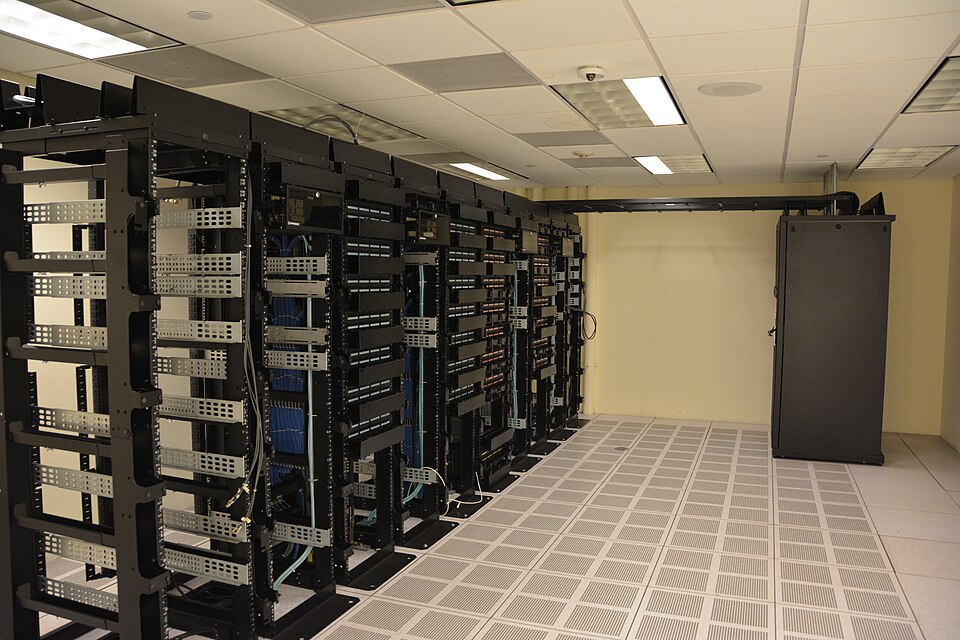
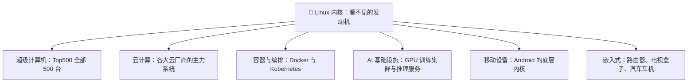

> 📍 位置：阶段 0 · 启蒙认知 · 第 1 章 ｜ ⏱ 预计用时：30-45 分钟 ｜ 难度：★☆☆☆☆

⬅️ 上一章：[如何使用本教程](../00-如何使用本教程.md) ｜ ➡️ 下一章：[Linux 的前世今生](02-Linux的前世今生.md)

# 第 1 章 · 为什么人人都要学 Linux

> 先说结论：**今天这个数字世界的地基，绝大部分是 Linux 铺的。**
> 学 Linux，不是为了把自己逼成极客，而是为了拿到通往云计算与 AI 时代的门票。

---

## 🎯 学习目标

学完本章，你将能够：

- 说出 Linux（读作「里纳克斯」）在超级计算机、云计算、容器与 AI 基础设施中的真实地位；
- 解释一个看似矛盾的现象：服务器世界几乎全是 Linux，而普通办公电脑几乎全是 Windows；
- 说清楚学 Linux 的三类收益：就业、效率、思维方式；
- 对着一张「Linux 在哪里」全景图，指出 Linux 藏在你生活的哪些角落；
- 放下对 Linux 的三个常见恐惧：黑窗口、命令难记、动不动把电脑搞坏。

---

## 🧠 核心概念

### 1.1 三个改变认知的事实

#### 事实一：全球最快的 500 台计算机，全部运行 Linux

超级计算机（Supercomputer）是人类算力的天花板，负责气象预报、航天模拟、核聚变仿真
这类「国家级难题」。而统计全球最快超算的 Top500 榜单上，从 2017 年 11 月起，
500 台超级计算机无一例外，全部运行 Linux 内核（Kernel，操作系统的核心程序）。

为什么不是 Windows？超算动辄几十万颗 CPU 核心，要求操作系统足够稳定、足够轻量、
还能被工程师深度定制——这三件事恰好都是 Linux 的强项。你会在第 2 章看到，这种
「想怎么改就怎么改」的自由，正是 Linux 与生俱来的基因。

#### 事实二：你在云上租的每一台服务器，大概率是 Linux

云计算（Cloud Computing）时代，公司不再自己买机器，而是向云厂商租用云服务器
（Cloud Server）。无论国内还是国外的云厂商，机房里最常见的主角就是 Linux：
可选的系统镜像（Image，即预装好的系统盘）里，Ubuntu、AlmaLinux 这类
发行版（Distribution，打包好的完整 Linux 系统，第 3 章细讲）永远排在最前面。

你的数字生活，其实一直被 Linux 托着：

- 刷短视频时，视频文件从 Linux 服务器上流出来；
- 点外卖时，订单被 Linux 服务器上的程序接单、派送、结算；
- 玩网游时，判定「谁先开枪」的法官，也是一台 Linux 服务器。



> 📷 图片：Carl Lender，授权 CC BY 2.0（Wikimedia Commons）

#### 事实三：容器与 AI，天生站在 Linux 上

最近十年两大技术浪潮，都把地基直接打在了 Linux 内核上：

- **容器（Container）**：Docker 让应用「一次打包、到处运行」，它依赖的隔离能力
  直接来自 Linux 内核。Kubernetes（容器编排系统，常简称 K8s）负责管理成千上万个
  容器，是云原生世界的调度中枢——而它本身就是为 Linux 设计的。
- **AI 基础设施**：大模型的训练集群由成千上万张 GPU 组成，配套的服务器操作系统
  几乎清一色是 Linux。训练、部署、对外提供服务，每一环都跑在 Linux 上。

一句话：**没有 Linux，就没有今天的云，也没有今天的大模型竞赛。**

### 1.2 「Linux 在哪里」全景图

一张图看懂 Linux 的势力范围——你会发现它早就包围了你的生活：



而你在手机上点一下按钮，数据如何从你的设备出发、跨越网络、最终被那台 Linux
服务器处理再原路返回？看这条数据包的旅程（Packet Journey）：


### 1.3 学 Linux 的三类收益

#### 收益一：就业——岗位描述里到处是它

打开任意招聘网站搜「Linux」，你会看到它出现在海量岗位的任职要求里。很多面试的
第一轮，就是几道 Linux 命令题。常见方向和 Linux 的关系如下：

| 技术方向 | 和 Linux 的关系 |
|---|---|
| 后端 / 服务端开发 | 服务部署在 Linux 上，日志、进程、网络都要在终端里排查 |
| 运维 / SRE | Linux 就是主战场，每天的工作界面就是终端 |
| 云计算 / 云原生 | Kubernetes 集群的每个节点，都是一台 Linux 机器 |
| AI / 大数据 | 训练任务和数据管道跑在 Linux 集群上，GPU 环境搭建绕不开它 |
| 嵌入式 / 物联网 | 路由器、车机、开发板，多数是裁剪过的嵌入式 Linux |

#### 收益二：效率——命令行是效率放大器

图形界面（GUI，Graphical User Interface）一次只能点一下，命令行（CLI，
Command Line Interface）一句话能处理一千个文件。当同事还在手工改名 200 张图片时，
会写一行简单命令的你，3 秒钟下班。这种「把重复劳动交给机器」的能力，会伴随你的
整个职业生涯。



[在学习站暂停、单步或重播](https://zhuguang-zfg.github.io/linux/#animation=batch-rename.svg)。动画中的输入输出为教学示意，需用本章实验验证。

#### 收益三：思维——理解计算机真正的样子

Linux 把系统的运转过程摊开给你看：文件、进程（Process，运行中的程序）、权限、
网络，一切都有清晰而统一的模型。学会它，你得到的不仅是几十条命令，而是一套
「知其所以然」的思维方式——以后学任何新技术，都会快人一步。

### 1.4 三个常见恐惧，逐个拆掉

| 恐惧 | 真相 |
|---|---|
| 「全是黑窗口，太吓人」 | 终端只是另一种交流方式，本教程会一步一步陪你敲；而且现代 Linux 也有漂亮的图形桌面。 |
| 「命令太多，根本记不住」 | 高频命令只有几十条，用着用着就熟了；还有 Tab 补全和历史记录帮你（第 5 章见）。 |
| 「一不小心就把电脑搞坏」 | 第 4 章教你用虚拟机或 WSL 练习——在一个「沙盒」里折腾，怎么玩都不伤真机。 |

---

## 🛠 命令实操

本章先「看熟」命令的样子，不用动手——你的第一台 Linux 将在第 4 章就位。下面
三条命令，装好系统后你都会亲手敲到。先记住一个公式：

```text
命令  选项  参数     ← 一条命令 = 一个动词 + 修饰词 + 作用对象
```

**命令一：`uname -a`——系统信息全家福。**

```bash
uname -a    # 显示内核名称、主机名、内核版本、硬件架构等一行信息
```

预期输出（不同机器细节不同）：

```text
Linux ubuntu 6.8.0-45-generic #45-Ubuntu SMP PREEMPT_DYNAMIC x86_64 GNU/Linux
```

**命令二：`cat /etc/os-release`——查看发行版身份。**

```bash
cat /etc/os-release    # cat 是「读取并显示文件内容」，这里读取发行版的身份文件
```

预期输出：

```text
PRETTY_NAME="Ubuntu 24.04.1 LTS"
NAME="Ubuntu"
VERSION_ID="24.04"
```

**命令三：`free -h`——看看内存还剩多少。**

```bash
free -h    # -h 表示「人类可读」，用 G 和 M 显示，而不是一大串字节数
```

预期输出：

```text
               total        used        free      shared  buff/cache   available
Mem:           7.8Gi       1.2Gi       5.1Gi        12Mi       1.5Gi       6.3Gi
Swap:          2.0Gi          0B       2.0Gi
```

看，命令并不是天书：`uname -a` 里的 `-a` 是 all（全部），`free -h` 里的 `-h`
是 human-readable（人类可读）。第 5 章我们会把第一组命令逐个敲一遍，到时候你会
发现——终端其实很温柔。

---

## 💡 避坑指南

| 坑 | 现象 | 正确姿势 |
|---|---|---|
| 把「学 Linux」理解成「立刻抛弃 Windows」 | 一上来就删掉旧系统重装，寸步难行就放弃 | 先用虚拟机或 WSL 并行使用，熟练了再决定 |
| 上来就背命令大全 | 三天就忘，越背越焦虑 | 命令是「用会的」不是「背会的」，跟着每章实操敲 |
| 在唯一的电脑上直接装双系统练手 | 删错分区，毕业论文当场蒸发 | 第一次接触务必用虚拟机或 WSL，双系统见第 4 章的风险清单 |
| 迷信「三天精通 Linux」 | 囫囵吞枣，面试一问就露馅 | Linux 是练出来的手感，跟着本教程八周走完就是扎实入门 |
| 见到报错就慌 | 连错误信息都不看就重装 | 报错信息通常直接指出问题，复制完整报错去搜索或问 AI，是工程师日常 |

---

## ✍️ 动手实验

### 实验 1：Linux 侦探（10 分钟，不开电脑也能做）

找出你身边的 5 样「嫌疑设备」，判断它们背后是否可能有 Linux，并写下你的证据链。

参考嫌疑对象：安卓手机、家里的路由器、智能电视或电视盒子、汽车中控屏、电梯里的
广告屏。

要求：每样设备写一句「为什么我怀疑它」，并给出一个可以验证的方法（比如在设置里
找「内核版本」字样）。

### 实验 2（选做）：和 AI 面试官过三招

向任意 AI 助手提问：「为什么超级计算机都用 Linux？」把 AI 的回答与本章 1.1 节
对照，标出你认为最有说服力的两点理由，再补充一个 AI 没提到、但你读完本章后能
想到的角度。

<details><summary>💡 参考解法（先自己试！）</summary>

**实验 1 参考答案：**

1. 安卓手机：Android 底层就是 Linux 内核，验证方法——设置 → 关于手机 → 内核版本。
2. 路由器：家用路由器固件大多基于嵌入式 Linux，登录管理页面常能看到「系统日志」。
3. 智能电视 / 盒子：大量基于 Linux 定制（如 Android TV 系统）。
4. 汽车中控：车机系统很多运行 Linux 或其衍生系统。
5. 电梯广告屏：本质是一台小型嵌入式电脑，多数运行裁剪版 Linux。

结论：Linux 早已从机房走进客厅和口袋——这正是「人人都要学」的底气。

**实验 2 参考要点：**

- 稳定：超算要连续计算数月不宕机，Linux 的稳定性与可维护性高度契合；
- 可定制：工程师可以裁剪内核，只保留需要的部分，把每一分性能都留给计算任务；
- 开放生态：全球超算中心可以协作修问题、共享优化成果，不受制于单一商业厂商；
- 补充角度：Top500 全是 Linux 也说明高性能软件生态（MPI、调度器、驱动）都在
  Linux 上成熟，换系统反而没有可用的配套。

</details>

---

## 📺 推荐视频

- [YouTube · Linux 的第一印象](https://www.youtube.com/watch?v=rrB13utjYV4) — Fireship，2分41秒。观看对应主题后，回到本章用实际输入和输出验证。
- [B站 · Linux 应用领域](https://www.bilibili.com/video/BV1Sv411r7vd/?p=2) — 韩顺平，P2，5分5秒。观看对应主题后，回到本章用实际输入和输出验证。

[](https://www.youtube.com/watch?v=rrB13utjYV4)

[在学习站查看配套媒体](https://zhuguang-zfg.github.io/linux/#read=docs%2F00-onboarding%2F01-%E4%B8%BA%E4%BB%80%E4%B9%88%E4%BA%BA%E4%BA%BA%E9%83%BD%E8%A6%81%E5%AD%A6Linux.md) · [视频资料与核验说明](../../resources/videos.md)。标题、作者和分P已核对，未逐条完成实播，播放限制以原站为准。

## ✅ 自测清单

对照检查，全部能打勾就可以进入下一章：

- [ ] 我能说出至少三个「Linux 统治」的领域（超算、云、容器、AI、Android、嵌入式任选三个）。
- [ ] 我能解释为什么服务器偏爱 Linux，而普通办公电脑仍常用 Windows。
- [ ] 我能说出学 Linux 的三类收益，并讲出最打动我的一类的理由。
- [ ] 我能对着「Linux 在哪里」全景图，复述出主干分支。
- [ ] 我知道新手练 Linux 最安全的两种方式：虚拟机与 WSL。
- [ ] 我不再害怕黑窗口：我知道一条命令 = 动词 + 选项 + 参数。
- [ ] 我知道遇到报错的第一反应是「读完整报错信息」，而不是重装。

---

## 🔗 延伸阅读

- [Linux - Wikipedia](https://en.wikipedia.org/wiki/Linux)：Linux 词条，10 分钟补全全局认知。
- [The Linux Kernel Archives](https://www.kernel.org)：Linux 内核官方网站，亲眼看看这颗「发动机」的源头。
- 下一章：[Linux 的前世今生](02-Linux的前世今生.md)——这颗发动机是怎么被造出来的？
