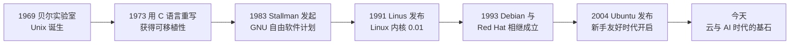
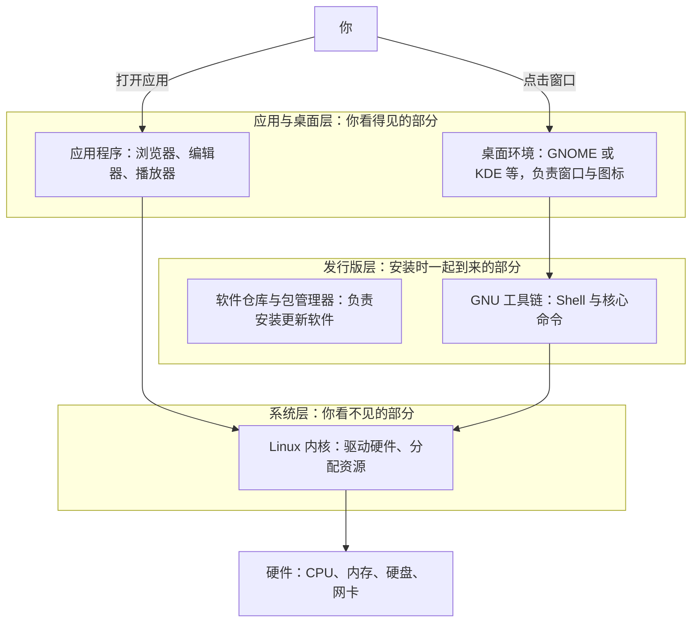
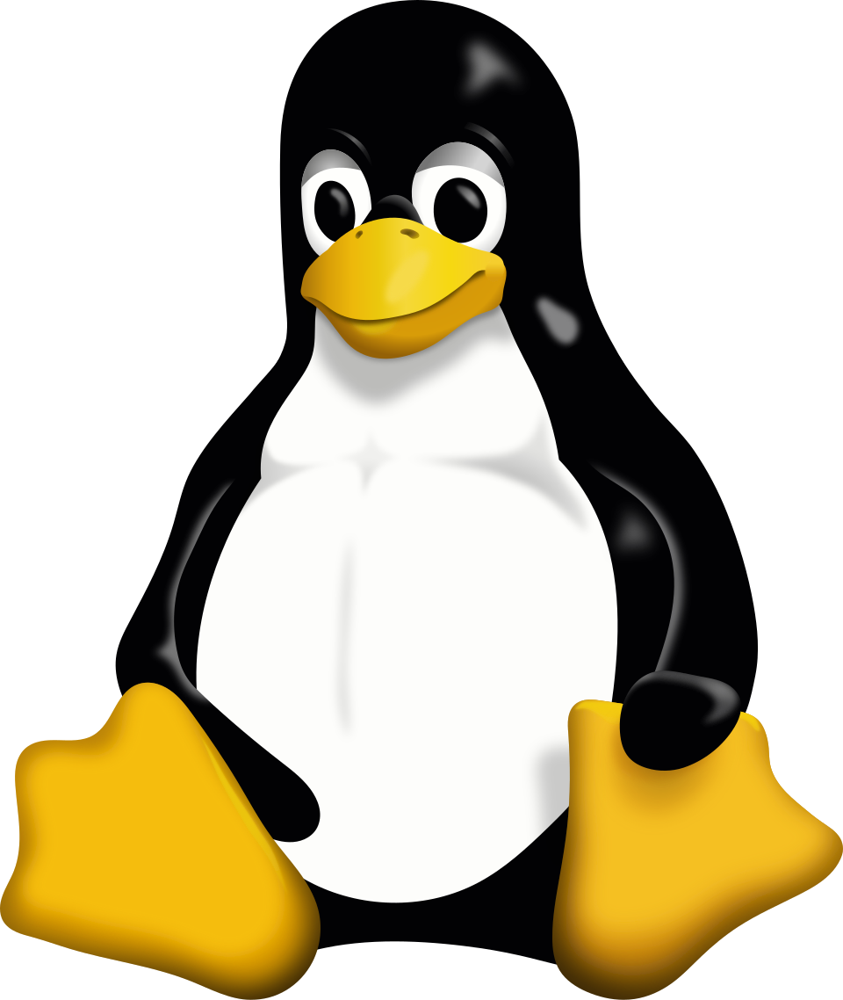
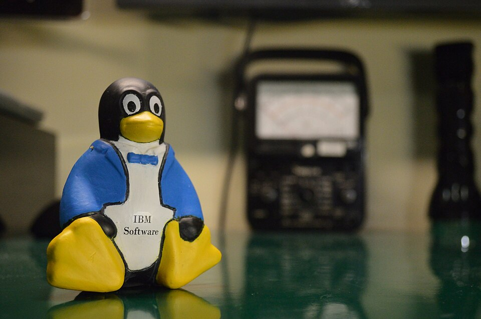

> 📍 位置：阶段 0 · 启蒙认知 · 第 2 章 ｜ ⏱ 预计用时：30-45 分钟 ｜ 难度：★☆☆☆☆

⬅️ 上一章：[为什么人人都要学 Linux](01-为什么人人都要学Linux.md) ｜ ➡️ 下一章：[发行版全景图](03-发行版全景图.md)

# 第 2 章 · Linux 的前世今生

> 每个伟大的产品背后，都有一个「看不惯现状」的人。
> Linux 的故事，要从 1969 年一间贝尔实验室的一台旧电脑讲起。

---

## 🎯 学习目标

学完本章，你将能够：

- 讲出 Unix（优尼克斯）、GNU、Linux 三个名字之间的关系和大致时间线；
- 解释 1991 年那封改变世界的邮件说了什么；
- 分清「内核、发行版、桌面环境」三层结构，不再把它们混为一谈；
- 用一小段话说清 GPL、MIT、Apache 三种开源许可证（License）的气质差异；
- 认识 Linux 的吉祥物 Tux（塔克斯），顺便理解开源社区的协作文化。

---

## 🧠 核心概念



[在学习站暂停、单步或重播](https://zhuguang-zfg.github.io/linux/#animation=license-compare.svg)。动画中的输入输出为教学示意，需用本章实验验证。



[在学习站暂停、单步或重播](https://zhuguang-zfg.github.io/linux/#animation=kernel-distro.svg)。动画中的输入输出为教学示意，需用本章实验验证。

### 2.1 1969：Unix 在贝尔实验室诞生

故事开始于一个失败的项目。20 世纪 60 年代，贝尔实验室（Bell Labs）、麻省理工等
机构合作开发一个名为 Multics 的巨型分时操作系统，目标宏伟，却越做越复杂、越做
越难产，最终贝尔实验室退出了项目。

团队成员肯·汤普逊（Ken Thompson）却不甘心。1969 年，他用一台被淘汰的 PDP-7
小型机，写了一个简化版的系统来自娱自乐。同事布莱恩·柯林汉（Brian Kernighan）
给它起了个 Multics 的「双关小名」：Unics，后来拼写逐渐演变为 Unix。

1973 年是关键一年：丹尼斯·里奇（Dennis Ritchie）与汤普逊用他们发明的 C 语言
把 Unix 重写了一遍。这意味着 Unix 不再绑死某一种硬件——换台机器，重新编译就能
跑。这种**可移植性（Portability）**让 Unix 迅速在大学和企业间传播开来。

20 世纪 70 年代末到 80 年代，加州大学伯克利分校在 Unix 基础上发展出 BSD 系列；
随着 1983 年 AT&T 因反垄断被拆分、获准进入计算机市场，Unix 开始被当作商业产品
收费，各厂商纷纷推出自己的「私改版」。**分裂与封闭**，埋下了人们渴望一个
「自由、统一系统」的种子。



### 2.2 1983：GNU——一场「自由软件」运动

时间回到 1983 年。麻省理工人工智能实验室的程序员理查德·斯托曼（Richard
Stallman）受够了「打印机驱动闭源、有了 Bug 也没法修」的憋屈，愤而发起 **GNU
计划**（GNU's Not Unix，一个有趣的递归缩写），目标是造出一个完全自由、人人可以
使用、学习、修改和分发的类 Unix 系统。

为了给「自由」立规矩，他在 1985 年成立了自由软件基金会（FSF，Free Software
Foundation），又在 1989 年发布了 **GPL 许可证**（GNU General Public License）。
GPL 的核心思想叫「Copyleft」：你可以自由使用和修改代码，但基于它的新作品也必须
以同样的自由条款开源回馈社区——自由要像左轮枪的转轮一样传下去。

到 1990 年前后，GNU 已经造好了几乎一切：编译器 GCC、编辑器 Emacs、命令行工具集
Coreutils、Shell……唯独最核心的部分——**内核**（代号 GNU/Hurd）迟迟难产。
万事俱备，只欠东风。

### 2.3 1991：赫尔辛基的地下车库故事（其实是宿舍）

东风来自芬兰赫尔辛基大学的一名 21 岁大学生：**林纳斯·托瓦兹（Linus Torvalds）**。
他嫌教学用的 Minix 系统功能有限，便动手给自己写一个「玩具内核」。1991 年 8 月
25 日，他在 comp.os.minix 新闻组发了一封著名邮件，大意是：

> 我正在做一个（自由的）操作系统，只是个爱好，不会像 GNU 那样又大又专业……

一个月后，Linux 0.01 版本发布，只有约一万行代码。Linus 把它放上了 FTP 服务器，
管理员阿里·莱姆克（Ari Lemmke）不喜欢 Linus 起的名字 Freax，顺手把目录名改成了
「linux」——Linus 的 Unix，这个名字就这么定了下来。

真正精彩的是接下来发生的事：全世界的程序员通过邮件列表和互联网自发参与，把
GNU 的工具装到 Linux 内核上，一个**完整的自由操作系统**就此拼图完成——今天很多
发行版因此自称「GNU/Linux」。1992 年，Linux 改用 GPL 许可证；1994 年，1.0 正式
发布。一个学生作业，长成了人类历史上最大规模的协作项目之一。

### 2.4 内核、发行版、桌面环境：别再傻傻分不清

新手最常见的混淆是「Linux 到底指什么」。答案：它是一台三层嵌套的机器。



用一个汽车类比记住它：

- **内核（Kernel）** 是发动机：负责驱动轮子和分配动力，但你不会直接开发动机上路；
- **发行版（Distribution，简称 Distro）** 是整车厂：把发动机、底盘、内饰组装成
  一辆能开的车，还附赠一家「4S 店」（软件仓库），随装随用；
- **桌面环境（Desktop Environment）** 是驾驶舱：方向盘、仪表盘、空调旋钮——
  也就是你天天看见的窗口、图标和任务栏。

同一颗内核，可以装进完全不同的「整车」——这正是下一章「发行版全景图」的由来。

### 2.5 Tux：一只圆滚滚的企鹅

1996 年前后，社区开始讨论吉祥物。Linus 本人表达了对企鹅的偏好，理由据说和他
年轻时被企鹅咬过一口的趣事有关。设计师拉里·尤因（Larry Ewing）用 GIMP 画出了
这只坐在地上憨态可掬的企鹅，取名为 **Tux**——通常被解读为 Torvalds' Unix 的
缩写，也恰好和晚礼服 Tuxedo 谐音：穿上礼服的 Unix，体面又亲民。



> 📷 图片：Larry Ewing, Simon Budig, Garrett LeSage，授权 Attribution（Wikimedia Commons）



> 📷 图片：Renato.pierri，授权 CC BY-SA 4.0（Wikimedia Commons）

在开源大会和技术沙龙里，Tux 玩偶随处可见。它象征着这个社区最独特的东西：
**技术很硬核，姿态很柔软**。

### 2.6 开源许可证：一小段话讲清楚

Linux 能长大，靠的是一套「法律层面的互信」——开源许可证。新手只需记住三种气质：

- **GPL**：带「传染性」的许可证，用了我的代码，你的衍生作品也必须开源。Linux
  内核采用 GPLv2，它保证了「自由」永远传递下去；
- **MIT**：极简极宽松，几乎随便用，只要在代码里保留原作者的版权声明；
- **Apache 2.0**：同样宽松，额外附赠明确的专利授权条款，企业最爱。

宽松与「传染」，是开源世界的两大流派。本教程不深入法律细节，你只需要记住：
**Linux 是 GPL 的孩子，它天生属于全人类**。

---

## 🛠 命令实操

历史讲完了，来点仪式感：等你在第 4 章装好系统，就能用两条命令「验明正身」，
亲眼看到本章历史在你机器上的投影。

**命令一：`uname -r`——查看你的内核版本号。**

```bash
uname -r    # -r 表示 release，只显示内核版本号这一行精华
```

预期输出（数字不同完全正常）：

```text
6.8.0-45-generic
```

读法：`6.8.0` 是内核主版本，`-45` 是发行方打的第 45 个补丁级别，`generic` 表示
通用内核（与之相对的有面向低延迟场景的特殊内核）。

**命令二：`cat /proc/version`——内核的完整身份证。**

```bash
cat /proc/version    # 读取内核版本、编译它的编译器版本与编译时间
```

预期输出（一行，此处折行展示）：

```text
Linux version 6.8.0-45-generic (buildd@lcy02-amd64-019)
(gcc (Ubuntu 13.2.0-23ubuntu4) 13.2.0, GNU ld (GNU Binutils for Ubuntu) 2.42)
#45-Ubuntu SMP PREEMPT_DYNAMIC
```

看，`gcc` 和 `GNU Binutils`——正是 2.2 节里 GNU 计划造出的工具。1991 年那场
「内核 + GNU 工具」的拼图，此刻就躺在你的电脑里。

**命令三：`cat /etc/os-release`——发行版的身份证。**

```bash
cat /etc/os-release    # 显示你装的是哪个发行版、哪个版本
```

预期输出：

```text
PRETTY_NAME="Ubuntu 24.04.1 LTS"
NAME="Ubuntu"
VERSION_ID="24.04"
```

内核版本和发行版版本是两回事：前者来自 kernel.org（第 2.3 节的 Linus 一系），
后者来自发行版厂商（第 3 章的主角）。记住这个区别，论坛提问时你就能说清楚
「我用的是 Ubuntu 24.04，内核 6.8」——老手听了都会高看你一眼。

---

## 💡 避坑指南

| 坑 | 现象 | 正确姿势 |
|---|---|---|
| 把「Linux」当成完整操作系统 | 严格说 Linux 只是内核，完整的系统 = 内核 + GNU 工具 + 发行版软件 | 日常口语说「Linux 系统」没问题，但心里要清楚三层结构 |
| 在论坛纠正别人「那叫 GNU/Linux」 | 引发无意义的命名圣战，招人反感 | 理解历史即可，别拿命名当武器 |
| 以为 Linus 1991 年「发明了操作系统」 | 他站在 Unix 与 GNU 的肩膀上 | 讲历史时把 Unix、GNU、Linux 三者串成一条线 |
| 把 Free Software 的 Free 理解成「免费」 | 误以为开源等于不要钱、没版权 | Free 的本意是「自由」：使用、学习、修改、分发的自由 |
| 把 GPL 的「传染性」当成病毒 | 以为装了 Linux 电脑上的东西都会被开源 | 它只约束「基于 GPL 代码的衍生作品」的发布行为，是许可证条款不是程序行为 |

---

## ✍️ 动手实验

### 实验 1：给三层结构写「自我介绍」（10 分钟）

假设你是内核、发行版、桌面环境三个角色的配音演员，每个角色写一句不超过 30 字
的自我介绍，要体现出三者的分工关系。写完后对照 2.4 节的类比图自查。

### 实验 2（选做）：画出你的「Linux 家谱」

不看原文，凭记忆在纸上画出 1969 → 1983 → 1991 的关键节点，每个节点标注年份、
关键人物和一句话贡献。画完后和 2.1 节的时间线图对照补漏。

<details><summary>💡 参考解法（先自己试！）</summary>

**实验 1 参考答案（示例，言之成理即可）：**

- 内核：「我是发动机，看管 CPU、内存和每一块硬件，桌面和游戏都得靠我调度。」
- 发行版：「我是整车厂，把发动机和上万个零件组装成一台开箱即用的车，还管售后
  ——软件仓库里的几万个软件随你装。」
- 桌面环境：「我是驾驶舱，窗口、图标、任务栏都是我画的。你不直接指挥发动机，
  你跟我说话。」

**实验 2 参考时间线：**

1. 1969 年：肯·汤普逊在贝尔实验室用 PDP-7 写出 Unix 雏形；
2. 1973 年：与丹尼斯·里奇用 C 语言重写 Unix，获得可移植性；
3. 1983 年：斯托曼发起 GNU 计划，宣布自由软件运动，后发布 GPL；
4. 1991 年：Linus Torvalds 发布 Linux 内核 0.01，社区将其与 GNU 工具结合，
   自由操作系统拼图完成。

</details>

---

## 📺 推荐视频

- [YouTube · Linux 的第一印象](https://www.youtube.com/watch?v=rrB13utjYV4) — Fireship，2分41秒。先建立内核与发行版的背景，不代替本章历史阅读。
- [B站 · Linux 内核与发行版](https://www.bilibili.com/video/BV1ZZ37zdEp2/?p=9) — Linux-老林，P9，21分16秒。先建立内核与发行版的背景，不代替本章历史阅读。
- [B站 · Linux 与 Unix 渊源](https://www.bilibili.com/video/BV1Sv411r7vd/?p=4) — 韩顺平，P4，18分9秒。先建立内核与发行版的背景，不代替本章历史阅读。

[](https://www.youtube.com/watch?v=rrB13utjYV4)

[在学习站查看配套媒体](https://zhuguang-zfg.github.io/linux/#read=docs%2F00-onboarding%2F02-Linux%E7%9A%84%E5%89%8D%E4%B8%96%E4%BB%8A%E7%94%9F.md) · [视频资料与核验说明](../../resources/videos.md)。标题、作者和分P已核对，未逐条完成实播，播放限制以原站为准。

## ✅ 自测清单

对照检查，全部能打勾就可以进入下一章：

- [ ] 我能按顺序讲出 Unix（1969）、GNU（1983）、Linux（1991）三个关键节点。
- [ ] 我能说清内核、发行版、桌面环境各自负责什么，并举出汽车类比。
- [ ] 我知道 GNU/Linux 这个名字的由来，以及 GPL 的基本思想。
- [ ] 我能用一段话说出 GPL、MIT、Apache 三种许可证的气质差异。
- [ ] 我能读出 `uname -r` 输出里的内核版本号。
- [ ] 我知道 Tux 是谁画的、名字是怎么来的。

---

## 🔗 延伸阅读

- [GNU Operating System](https://www.gnu.org)：GNU 计划官方网站，自由软件运动的大本营。
- [Linux - Wikipedia](https://en.wikipedia.org/wiki/Linux)：词条中的 History 一节，比本章更详尽的编年史。
- [The Linux Kernel Archives](https://www.kernel.org)：内核官网，看看 0.01 的精神如何延续到今天。
- 下一章：[发行版全景图](03-发行版全景图.md)——同一颗内核，如何长出上百种「整车」？
