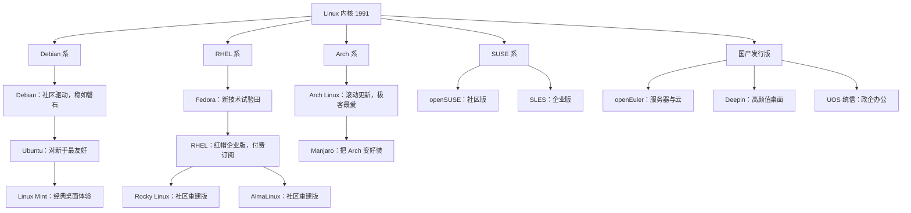

> 📍 位置：阶段 0 · 启蒙认知 · 第 3 章 ｜ ⏱ 预计用时：30-45 分钟 ｜ 难度：★☆☆☆☆

⬅️ 上一章：[Linux 的前世今生](02-Linux的前世今生.md) ｜ ➡️ 下一章：[安装你的第一个 Linux](04-安装你的第一个Linux.md)

# 第 3 章 · 发行版全景图

> Linux 内核只有一颗，但围绕它长出了上百种「整车」。
> 这一章不让你背名单，而是给你一张地图和一台选车指南。

---

## 🎯 学习目标

学完本章，你将能够：

- 解释为什么「Linux」有上百种发行版（Distribution / Distro）；
- 认出四大家族：Debian 系、RHEL 系、Arch 系、SUSE 系，以及国产发行版的位置；
- 说出各家族的包管理器（Package Manager）名字：apt、dnf、pacman、zypper；
- 用一张决策表，为「新手、服务器、极客、国产化」四类人群选出合适发行版；
- 读懂 `/etc/os-release`，一眼判断眼前的系统属于哪个家族。

---

## 🧠 核心概念



[在学习站暂停、单步或重播](https://zhuguang-zfg.github.io/linux/#animation=distro-family.svg)。动画中的输入输出为教学示意，需用本章实验验证。

### 3.1 为什么会有上百种发行版

第 2 章说过：Linux 内核只是发动机。要让普通人能用，还需要把内核、GNU 工具、
桌面环境、几万个应用软件**组装、打包、维护**起来——这项工作就叫发行版。

由于 GPL 保证了「组装自由」，任何人和公司都可以按自己的理念造车：

- 追求**极稳**的、追求**极新**的、追求**极简**的，各有各的造法；
- 社区志愿者造的（Debian）、公司商业化的（Red Hat）、公司加社区共建的
  （openEuler），运营模式也各不相同。

这不是「碎片化的混乱」，而是开源世界的自然生态：**总有一款适合你**。

### 3.2 Debian 系：稳字当头的老牌世家

**Debian**（1993 年诞生，名字来自创始人 Ian + 前女友 Debra）是完全由社区驱动的
老牌发行版，以稳定和严谨著称。它的软件包格式是 `.deb`，包管理器是
**apt**（Advanced Packaging Tool）。

**Ubuntu**（2004 年起）基于 Debian 打造，由 Canonical 公司运营，坚持「对新手
友好」：安装图形化、文档丰富、社区庞大。每 6 个月发一个版本，每 2 年出一个
**LTS（Long Term Support，长期支持版）**，提供 5 年安全更新——新手认准 LTS 就对了。

**Linux Mint** 基于 Ubuntu，主打保留传统桌面体验，Windows 转来的用户几乎零
学习成本。

**家族关键词：apt、.deb、稳定、新手友好。**

### 3.3 RHEL 系：企业世界的规则制定者

**Fedora** 由红帽公司（Red Hat）赞助、社区共建，充当「新技术试验田」——激进
但不鲁莽。

**RHEL（Red Hat Enterprise Linux）** 是红帽的企业版，稳定压倒一切，靠付费订阅
提供服务，是很多公司生产服务器的标配。Fedora 的新技术成熟后，会下沉到 RHEL。

**Rocky Linux 与 AlmaLinux**：原本社区版 CentOS 是 RHEL 的免费重建版，2020 年
前后 CentOS 战略转向后，社区另起炉灶，造出 Rocky 与 Alma 两个「与 RHEL 保持
兼容」的免费替代品——如今云上企业环境的主流选择之一。

**家族关键词：dnf、RPM、企业级、免费重建版。**

### 3.4 Arch 系：极客的游乐场

**Arch Linux** 哲学是 KISS（Keep It Simple, Stupid）：安装和配置全手工，从命令行
开始一点点搭出自己的系统。它采用**滚动更新（Rolling Release）**——没有大版本号，
`pacman -Syu` 一条命令永远保持最新。其用户手册 **Arch Wiki** 质量极高，即使不用
Arch 的 Linux 用户也天天去查。

**Manjaro** 基于 Arch 但自动帮你把坑填了：图形化安装器、开箱即用，是「想尝 Arch
但怕劝退」的折中选择。

**家族关键词：pacman、AUR、滚动更新、折腾。**

### 3.5 SUSE 系：低调的欧洲贵族

来自德国的 SUSE 是历史最悠久的 Linux 公司之一，企业版叫 SLES，社区版叫
**openSUSE**，包管理器是 **zypper**，图形化配置工具 YaST 是它的招牌。在国内
企业里能见度略低于红帽系，但在欧洲市场和 SAP 生态里地位稳固。认识它、记住
zypper 即可，新手不必首选。

### 3.6 国产发行版：信创浪潮下的国家队

国产发行版大多基于成熟的社区版本深度定制，近年随着信息技术应用创新（俗称
**信创**）产业快速成长，三个代表：

- **openEuler（欧拉）**：华为主导开源，2021 年捐赠给开放原子开源基金会，主打
  服务器与云计算，如今已衍生出众多商业发行版；
- **Deepin（深度）**：以桌面颜值和本土化体验著称，自研 DDE 桌面环境，曾被
  开源社区评为最美 Linux 桌面之一；
- **UOS（统信）**：基于 Deepin 的技术底座打造，主打政企办公市场，常见于
  机关与国企的信创替换项目。

**一句话定位：openEuler 走服务器，Deepin 与 UOS 走桌面办公。**

### 3.7 发行版家族树

一张图看懂江湖门派（越靠上越接近「上游」，越靠下越面向最终用户）：



### 3.8 包管理器对照表：各家族的「方言」

装软件是最高频操作，各家族说法不同，但套路一致（搜索、安装、更新）：

| 家族 | 代表发行版 | 装软件 | 更新系统 | 软件格式 |
|---|---|---|---|---|
| Debian 系 | Ubuntu、Debian、Mint | `sudo apt install 软件名` | `sudo apt update && sudo apt upgrade` | .deb |
| RHEL 系 | Fedora、Rocky、Alma | `sudo dnf install 软件名` | `sudo dnf upgrade` | .rpm |
| Arch 系 | Arch、Manjaro | `sudo pacman -S 软件名` | `sudo pacman -Syu` | .pkg.tar.zst |
| SUSE 系 | openSUSE、SLES | `sudo zypper install 软件名` | `sudo zypper update` | .rpm |

本教程示例统一使用 **Ubuntu / apt**；遇到其他发行版，按此表「方言转换」即可。

### 3.9 选型决策表：四类人群怎么选

| 人群 | 首选推荐 | 理由 | 备选方案 |
|---|---|---|---|
| 🧑‍🎓 **新手桌面用户** | Ubuntu 24.04 LTS 或 Linux Mint | 文档最多、坑最少、出问题好搜答案 | Deepin（想要本土化颜值） |
| 🖥️ **服务器运维** | Rocky Linux 或 Ubuntu Server LTS | 与主流云环境与企业实践接轨 | Debian（求极稳）、openEuler（国产化要求） |
| 🧙 **极客 / 折腾党** | Arch Linux 或 Manjaro | 滚动更新、软件最新、可定制性拉满 | Fedora（折中尝鲜） |
| 🏛️ **国产化 / 信创场景** | openEuler（服务器）、UOS 或 Deepin（桌面） | 政策契合、本土生态与适配认证完善 | Ubuntu Kylin 等官方合作版 |

选型的黄金法则：**新手别追新，服务器求稳，极客随便折腾，场景决定一切。**

---

## 🛠 命令实操

还没装系统？没关系。这一节教你两条「验明家族」的命令，装好系统后立刻能用。

**命令一：`cat /etc/os-release`——发行版的身份证。**

```bash
cat /etc/os-release    # 读取发行版身份文件，判断眼前的系统属于哪个家族
```

在 Ubuntu 24.04 上，预期输出：

```text
PRETTY_NAME="Ubuntu 24.04.1 LTS"
NAME="Ubuntu"
VERSION_ID="24.04"
ID=ubuntu
ID_LIKE=debian
```

注意 `ID_LIKE=debian` 这一行——系统自己承认了家族出身。在 Rocky Linux 9 上：

```text
PRETTY_NAME="Rocky Linux 9.4 (Blue Onyx)"
NAME="Rocky Linux"
VERSION_ID="9.4"
ID_LIKE="rhel centos fedora"
```

看到 `rhel centos fedora`，你就知道它属于 RHEL 系，装软件要用 `dnf` 而不是 `apt`。

**命令二：查各家族的包管理器版本（在你自己的系统上跑对应的那一条）。**

```bash
apt --version      # Debian 系：查看 apt 版本
dnf --version      # RHEL 系：查看 dnf 版本
pacman --version   # Arch 系：查看 pacman 版本
```

Ubuntu 24.04 上 `apt --version` 的预期输出：

```text
apt 2.7.14 (amd64)
```

版本号不同完全正常——这只证明「这个家族的方言」在你系统上可用。装好系统后，
把三条都跑一遍，跑不通的那两条，说明你的系统不是那个家族——这本身就是实验。

---

## 💡 避坑指南

| 坑 | 现象 | 正确姿势 |
|---|---|---|
| 「发行版收藏癖」 | 一年重装十几次系统，学到的只有安装器 | 选定一个主线发行版至少用三个月，功夫在系统里不在安装器里 |
| 新手追非 LTS 版本 | 半年就要升级一次，坑全是自己踩的 | 桌面与服务器都认准 LTS 长期支持版 |
| 新手直接上 Arch | 卡在分区和联网环节，当晚劝退 | 先用 Ubuntu 走通全流程，想折腾再上 Manjaro 过渡到 Arch |
| 混用来路不明的第三方软件源 | 装一次坏一片依赖，最后重装收场 | 软件源只用官方推荐渠道，第三方源先看官方文档 |
| 给国产发行版下「软件必装齐」的执念 | 找不到 Windows 里的同款软件就弃用 | 关注适配列表与替代软件，办公场景优先验证 WPS、微信等常用件 |

---

## ✍️ 动手实验

### 实验 1：给三位虚拟人物选发行版（15 分钟）

用 3.9 节的决策表，为下面三位人物各选一个发行版，并用两三句话说明理由：

1. **小李**：大学生，第一次接触 Linux，主要想学命令行和写代码；
2. **王工**：公司运维，要为业务系统选一台生产服务器操作系统，求稳；
3. **老张**：单位采购，负责国产化替代项目，桌面办公为主。

### 实验 2（选做）：验明你身边系统的家族

如果你手头有任何一台能跑 Linux 的机器（WSL、虚拟机、云主机都行），运行
`cat /etc/os-release`，根据 `ID` 和 `ID_LIKE` 字段判断它属于哪个家族、该用哪个
包管理器，把结论写在笔记里。

<details><summary>💡 参考解法（先自己试！）</summary>

**实验 1 参考答案（言之成理即可）：**

1. 小李 → **Ubuntu 24.04 LTS**（或 Mint）：文档与社区最厚，遇到问题一搜就有答案；
   LTS 保证两年半内不用操心系统升级，专心学命令行。
2. 王工 → **Rocky Linux**（或 AlmaLinux）：与 RHEL 保持兼容，免费且稳定，企业
   生态成熟；若公司有国产化要求，openEuler 是同样稳的选项。
3. 老张 → **UOS 或 Deepin**：面向政企办公的适配认证完善，WPS、微信等常用办公
   软件有原生或适配版本；服务器端可搭配 openEuler。

**实验 2 参考流程：**

1. 运行 `cat /etc/os-release`；
2. 读 `ID` 字段：如 `ubuntu`，直接对号入座 Debian 系；
3. 读 `ID_LIKE` 字段：如 `rhel centos fedora`，即 RHEL 系；
4. 结论写法示例：「我的系统是 Ubuntu 24.04，ID_LIKE=debian，属于 Debian 系，
   装软件用 `sudo apt install 软件名`。」

</details>

---

## 📺 推荐视频

- [B站 · Linux 内核与发行版](https://www.bilibili.com/video/BV1ZZ37zdEp2/?p=9) — Linux-老林，P9，21分16秒。观看对应主题后，回到本章用实际输入和输出验证。

[](https://www.bilibili.com/video/BV1ZZ37zdEp2/?p=9)

[在学习站查看配套媒体](https://zhuguang-zfg.github.io/linux/#read=docs%2F00-onboarding%2F03-%E5%8F%91%E8%A1%8C%E7%89%88%E5%85%A8%E6%99%AF%E5%9B%BE.md) · [视频资料与核验说明](../../resources/videos.md)。标题、作者和分P已核对，未逐条完成实播，播放限制以原站为准。

## ✅ 自测清单

对照检查，全部能打勾就可以进入下一章：

- [ ] 我能解释「发行版」是什么，以及为什么会有上百种发行版。
- [ ] 我能说出四大家族各自的包管理器：apt、dnf、pacman、zypper。
- [ ] 我能画出或复述发行版家族树的主干：Debian 系、RHEL 系、Arch 系、SUSE 系。
- [ ] 我知道新手应该选 LTS 版本，并说得出至少两个理由。
- [ ] 我能说出 Rocky 与 AlmaLinux 存在的由来（CentOS 转向的空档）。
- [ ] 我能说出 openEuler、Deepin、UOS 各自主打的场景。
- [ ] 我会读 `/etc/os-release` 里的 `ID` 和 `ID_LIKE` 字段来判断家族。

---

## 🔗 延伸阅读

- [Arch Wiki](https://wiki.archlinux.org)：公认质量最高的 Linux 知识库，任何发行版的用户都值得常查。
- [Linux - Wikipedia](https://en.wikipedia.org/wiki/Linux)：词条中的 Distribution 一节，有更完整的发行版谱系。
- [鸟哥的 Linux 私房菜](https://linux.vbird.org)：中文经典教程，对服务器发行版的选择有更工程化的讨论。
- 下一章：[安装你的第一个 Linux](04-安装你的第一个Linux.md)——选好车了，现在开回家。
