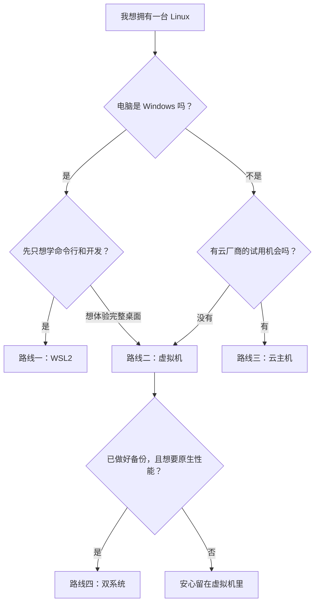

> 📍 位置：阶段 0 · 启蒙认知 · 第 4 章 ｜ ⏱ 预计用时：30-45 分钟 ｜ 难度：★☆☆☆☆

⬅️ 上一章：[发行版全景图](03-发行版全景图.md) ｜ ➡️ 下一章：[初见终端与 Shell](05-初见终端与Shell.md)

# 第 4 章 · 安装你的第一个 Linux

> 装系统是新手最大的心理关卡，其实也是最不需要天赋的一步。
> 这一章给你四条路线：从「一条命令」到「真机双系统」，按胆量自取。

---

## 🎯 学习目标

学完本章，你将能够：

- 用一张对比表说清 WSL2、虚拟机（Virtual Machine）、云主机、双系统（Dual Boot）
  四条路线的优劣与适用人群；
- 独立走通 WSL2 安装全流程（Windows 用户首选）；
- 用 VirtualBox 安装一台 Ubuntu 24.04 桌面虚拟机；
- 首次 SSH 登录一台云主机，并知道新用户的省钱玩法；
- 说清双系统的风险清单，判断自己现阶段该不该碰它。

---

## 🧠 核心概念




[在学习站暂停、单步或重播](https://zhuguang-zfg.github.io/linux/#animation=install-choices.svg)。动画中的输入输出为教学示意，需用本章实验验证。
### 4.1 四条路线总览：先看地图再上路

| 路线 | 难度 | 系统完整度 | 性能 | 主要成本与风险 | 适合谁 |
|---|---|---|---|---|---|
| ① WSL2 | ★☆☆☆☆ | 无桌面（可后加），命令行完整 | 接近原生 | 几乎无风险 | Windows 用户学命令行与开发 |
| ② 虚拟机 | ★★☆☆☆ | 完整桌面系统 | 约打八折 | 无风险，占点磁盘内存 | 想体验完整桌面、随时可删 |
| ③ 云主机 | ★★☆☆☆ | 服务器版，无桌面 | 真实机器 | 有费用，需注意安全 | 想体验真实公网服务器 |
| ④ 双系统 | ★★★★☆ | 原生完整 | 原生性能 | 分区与引导风险 | 已有备份经验、追求真实性能 |

新手期的黄金组合是 **① + ②**：WSL2 用来天天敲命令，虚拟机用来体验桌面。
下面按难度从低到高逐条展开。



### 4.2 路线一：WSL2——Windows 用户的首选

**WSL（Windows Subsystem for Linux）** 是微软官方提供的「Windows 里的 Linux」，
WSL2 用真正的 Linux 内核跑在轻量虚拟机里，兼容性和性能都很好。它的好处是：
**不分区、不重启选系统、和 Windows 共享文件**，后悔了卸载即可，毫发无伤。

全流程如下（以 Windows 10 2004 以上或 Windows 11 为例）：

**第 1 步：以管理员身份打开 PowerShell**（开始菜单搜 PowerShell → 右键 →
以管理员身份运行），执行：

```powershell
wsl --install    # 一条命令：启用所需功能 + 下载 WSL2 内核 + 安装默认发行版 Ubuntu
```

预期输出（细节因版本而异）：

```text
正在安装: 虚拟机平台
已成功安装 虚拟机平台。
正在安装: 适用于 Linux 的 Windows 子系统
已成功安装 适用于 Linux 的 Windows 子系统。
正在下载: WSL 内核
正在安装: WSL 内核
已成功安装 WSL 内核。
所请求的操作成功。直到重新启动系统前更改将不会生效。
```

**第 2 步：重启电脑。** 重启后 Ubuntu 窗口会自动弹出，让你创建用户名和密码：

```text
Enter new UNIX username: linuxboy
New password:
Retype new password:
passwd: password updated successfully
Installation successful!
```

注意：**输密码时屏幕上不会显示任何字符**（连星号都没有），这是 Unix 传统，
盲打然后回车即可。这个密码将来 `sudo` 提权时要用，记牢。

**第 3 步：验证安装。** 回到 PowerShell：

```powershell
wsl -l -v    # 列出已安装的发行版及其 WSL 版本号
```

预期输出：

```text
  NAME      STATE           VERSION
* Ubuntu    Running         2
```

`VERSION` 是 `2` 才对（WSL2）。若显示 `1` 或安装报错，见本章避坑指南。

**第 4 步：日常使用。** 以后想进 Linux，开始菜单点 Ubuntu，或在终端输入 `wsl`；
想退出，输入 `exit`。进系统后先做首次更新（见本章「命令实操」末尾）。

### 4.3 路线二：VirtualBox 虚拟机——完整桌面体验

虚拟机（Virtual Machine）是用软件模拟出的一台「电脑里的电脑」。VirtualBox 免费
开源，VMware 同样常用，流程几乎一样。以 **Ubuntu 24.04 LTS 桌面版**为例：

1. **下载两样东西**：VirtualBox 安装包（官网免费下载）和 Ubuntu 24.04 LTS 桌面版
   的镜像文件（Image，后缀 `.iso`，从 Ubuntu 官网下载，认准 24.04 LTS 字样）；
2. **安装并打开 VirtualBox**，点「新建」：名称随意，类型选 Linux，版本选
   Ubuntu（64-bit）；
3. **分配资源**：内存给 4 GB 以上（不超过物理内存的一半），CPU 给 2 核以上，
   创建虚拟硬盘 25 GB 以上，选择「动态分配」——硬盘实际占用会按需增长；
4. **挂载镜像**：选中虚拟机 → 设置 → 存储 → 空光驱 → 选择下载好的 `.iso` 文件，
   然后点「启动」；
5. **进入安装器**：选择语言「中文（简体）」→ 点「安装 Ubuntu」→ 键盘布局默认 →
   选择「正常安装」；
6. **安装类型选「清除整个磁盘并安装 Ubuntu」**——放心，它清的是虚拟机的虚拟
   磁盘，动不了你 Windows 的一根毫毛；
7. **时区**点地图选上海，**设置用户名和密码**（密码同样不回显），然后等进度条
   走完，大约 10-20 分钟；
8. **重启**，按提示回车弹出安装介质，进入桌面即大功告成；
9. **（可选）安装增强功能**：菜单「设备 → 安装增强功能」，可获得自适应窗口
   分辨率、剪贴板共享、拖拽文件等便利。

VMware 的流程与上面基本一致：新建虚拟机 → 选 ISO → 分资源 → 装系统，跟着
安装向导走即可。

### 4.4 路线三：云主机——一台真实的服务器

云主机（Cloud Server）是云厂商机房里的真实虚拟服务器，有公网 IP（IP Address，
网络门牌号），从任何设备都能连。它的体验最接近「真实生产环境」，也是本书
网络与服务器章节的好搭档。

**新用户省钱建议：**

- 各大云厂商对**新注册用户**普遍有免费试用或低价秒杀活动，注册时留意活动页；
- 学生认证通常有专属优惠主机，比标准价格便宜很多；
- 练手选**按量付费的最小规格**（如 1 核 2 GB），玩几小时几毛钱，用完就释放；
- 系统镜像选 **Ubuntu 24.04 LTS** 或 22.04 LTS（与本书示例一致）。

**首次 SSH 登录流程：**

1. 购买时在控制台设置登录密码（或选择密钥对），并记下控制台显示的**公网 IP**；
2. 检查**安全组（Security Group，云上的防火墙规则）**：确保放行了 TCP 22 端口
   （SSH 用的端口），这是新手连不上服务器的头号原因；
3. 在你的终端（Windows 10 以上自带 OpenSSH 客户端，WSL、macOS、Linux 天然自带）
   执行：

```bash
ssh ubuntu@203.0.113.10    # ssh 用户名@公网IP，用户名和密码以云厂商控制台为准
```

第一次连接会出现指纹确认（防中间人的一问一答），输入 `yes` 回车：

```text
The authenticity of host '203.0.113.10 (203.0.113.10)' can't be established.
ED25519 key fingerprint is SHA256:AbCdEf1234567890AbCdEf1234567890AbCdE.
Are you sure you want to continue connecting (yes/no/[fingerprint])? yes
```

然后输入密码（同样不回显），看到欢迎信息就登上了一台真·Linux 服务器：

```text
Welcome to Ubuntu 24.04.1 LTS (GNU/Linux 6.8.0-45-generic x86_64)

Last login: Tue Oct  6 20:30:00 2026 from 198.51.100.7
ubuntu@my-server:~$
```

4. **两条纪律**：练手机器上不要放真实业务和数据；**用完及时关机或释放**，
   否则按时计费的主机会悄悄烧钱。

### 4.5 路线四：双系统——先看风险清单，再谈浪漫

双系统指在一台电脑上同时安装 Windows 与 Linux，开机时选择进入哪个。它是唯一
能给你 **100% 原生性能**的方案（跑本地 AI、玩显卡、研究引导原理的场景需要它），
但它也是四条路线里唯一可能**造成真实数据损失**的方案，新手期不建议。

**风险清单（务必读完）：**

- 分区（Partition，给硬盘划分的独立区域）操作失误，可能直接删掉 Windows 数据；
- Windows 大版本更新可能覆盖 Linux 的引导程序，导致某个系统进不去；
- Windows 的「快速启动」与「休眠」机制可能与 Linux 读写同一块磁盘时发生冲突；
- 部分带 BitLocker 磁盘加密的电脑，改分区前必须先确认恢复密钥；
- 个别双显卡笔记本在 Linux 下需要额外配置才能正常点亮与省电。

**适用场景与铁律：** 适合已熟练使用虚拟机、数据有完整备份、想长期把 Linux 当
主力系统的学习者。真要上手，请遵守三条铁律——**先全盘备份；第一次先在虚拟机里
把流程完整彩排一遍；动手前另备一个可引导的修复 U 盘**。具体步骤等你到这一步
再学不迟，网上优质图文很多，本书刻意不展开。

---

## 🛠 命令实操

无论走哪条路线，装好后都要做「开机第一课」——更新系统软件清单并升级软件包：

```bash
sudo apt update && sudo apt upgrade    # 前半句刷新软件源目录，后半句把已装软件升到最新
```

`sudo`（superuser do）表示「以管理员权限执行」，会先要你的密码（不回显）。
预期输出（摘要）：

```text
Hit:1 http://archive.ubuntu.com/ubuntu noble InRelease
Reading package lists... Done
Building dependency tree... Done
Reading state information... Done
Calculating upgrade... Done
0 upgraded, 0 newly installed, 0 to remove and 0 not upgraded.
```

常用巡查命令三连，确认这台新机器的「身体状况」：

```bash
uname -a        # 看内核信息：确认这是 Linux，记下内核版本
free -h         # 看内存：确认分配的内存到位
df -h           # 看磁盘：确认根目录容量符合预期
```

`df -h` 预期输出（WSL 与虚拟机数值不同，看 Size 列即可）：

```text
Filesystem      Size  Used Avail Use% Mounted on
/dev/sda3        25G  7.9G   16G  34% /
tmpfs           3.9G     0  3.9G   0% /dev/shm
```

WSL 用户的补充命令（在 PowerShell 里执行）：

```powershell
wsl --update     # 手动更新 WSL 内核组件，遇到报错先跑它
wsl --shutdown   # 彻底关闭 WSL，想「重启 Linux」时用
```

---

## 💡 避坑指南

| 坑 | 现象 | 正确姿势 |
|---|---|---|
| BIOS 没开虚拟化 | 虚拟机报 VT-x / AMD-V 错误，WSL2 启动失败 | 进 BIOS/UEFI 打开 Intel VT-x 或 AMD-V（ AMD 平台叫 SVM） |
| WSL 安装或启动报错 | 提示内核组件异常或功能未启用 | 管理员 PowerShell 执行 `wsl --update` 后重启再试 |
| 虚拟机卡成幻灯片 | 内存分配过大拖垮宿主机，或只给了 1 核 | 内存不超过物理内存一半、CPU 至少 2 核 |
| 云主机连不上 | `ssh` 一直超时 | 先查控制台安全组是否放行 22 端口，再查用户名与 IP 是否抄对 |
| 输密码以为键盘坏了 | 屏幕毫无反应 | Unix 传统：密码输入不回显，盲打回车即可 |
| 按量付费云主机忘关机 | 月底账单惊喜 | 养成「用完即关机/释放」的肌肉记忆，或设置费用告警 |
| ISO 随便找个网盘下 | 安装器报错或行为诡异 | 一律从发行版官网下载，必要时核对官方提供的校验值 |
| 新手直接上双系统 | 分区失误丢数据、引导损坏 | 先在虚拟机里彩排，数据备份后再考虑，见 4.5 节铁律 |

---

## ✍️ 动手实验

### 实验 1（必做）：拥有你的第一台 Linux

从路线一（WSL2）或路线二（虚拟机）中任选一条，完整走完安装流程，然后收集
「新机三件套」信息并记录在笔记里：

```bash
uname -a    # 内核信息
free -h     # 内存
df -h       # 磁盘
```

把三条命令的输出截图或抄写下来——它们是你第一台 Linux 的「出生证明」。

### 实验 2（选做）：首次 SSH 登录一台云主机

如果你愿意花一杯奶茶钱（或用上新用户试用），开通一台最小规格云主机，完成
首次 SSH 登录，并做三件事：跑一遍 `uname -a`；执行首次系统更新；最后在控制台
把它关机。

<details><summary>💡 参考解法（先自己试！）</summary>

**实验 1 参考要点：**

1. Windows 用户优先选 WSL2：管理员 PowerShell 执行 `wsl --install`，重启，创建
   用户，完成；
2. 验证：`wsl -l -v` 应显示 `VERSION 2`；进入 Ubuntu 后执行三件套命令；
3. 虚拟机路线自检清单：内存 ≥ 4 GB、CPU ≥ 2 核、磁盘 ≥ 25 GB、安装类型选
   「清除整个磁盘」、装完装增强功能；
4. 「出生证明」示例（数值因机器而异）：

```text
Linux ubuntu 6.8.0-45-generic #45-Ubuntu SMP PREEMPT_DYNAMIC x86_64 GNU/Linux
Mem:           7.8Gi       1.1Gi       5.2Gi        12Mi       1.5Gi       6.4Gi
Filesystem      Size  Used Avail Use% Mounted on
/dev/sda3        25G  7.9G   16G  34% /
```

**实验 2 参考流程：**

1. 控制台创建主机：最小规格、Ubuntu 24.04 LTS、设置密码、确认安全组放行 22；
2. 本机终端执行 `ssh ubuntu@你的公网IP`，首次输入 `yes` 确认指纹，再输密码；
3. 依次执行 `uname -a` 与 `sudo apt update && sudo apt upgrade`；
4. 收尾：控制台「停止」或「释放」实例，确认计费状态已停止。

</details>

---

## 📺 推荐视频

- [YouTube · Linux 入门课程](https://www.youtube.com/watch?v=ROjZy1WbCIA) — freeCodeCamp.org，167分55秒。基础操作预习；安装步骤与版本以本章为准。

[](https://www.youtube.com/watch?v=ROjZy1WbCIA)

[在学习站查看配套媒体](https://zhuguang-zfg.github.io/linux/#read=docs%2F00-onboarding%2F04-%E5%AE%89%E8%A3%85%E4%BD%A0%E7%9A%84%E7%AC%AC%E4%B8%80%E4%B8%AALinux.md) · [视频资料与核验说明](../../resources/videos.md)。标题、作者和分P已核对，未逐条完成实播，播放限制以原站为准。

## ✅ 自测清单

对照检查，全部能打勾就可以进入下一章：

- [ ] 我能说清四条路线各自的优缺点和适用人群。
- [ ] 我已实际拥有一台可用的 Linux（WSL2、虚拟机或云主机任一）。
- [ ] 我能解释为什么输密码时屏幕上什么都不显示。
- [ ] 我知道 `sudo apt update && sudo apt upgrade` 这条命令的含义，并已在新系统上跑过。
- [ ] 我知道云主机连不上时先查安全组的 22 端口。
- [ ] 我能背出双系统的三条铁律：先备份、先彩排、备好修复盘。
- [ ] 我知道按量付费云主机用完要关机或释放。

---

## 🔗 延伸阅读

- [鸟哥的 Linux 私房菜](https://linux.vbird.org)：安装与磁盘分区原理讲解得最透彻的中文教程，将来上双系统前必读。
- [The Linux Documentation Project](https://tldp.org)：老牌英文文档库，安装引导相关主题的深度参考。
- 下一章：[初见终端与 Shell](05-初见终端与Shell.md)——系统装好了，现在敲下第一行命令。
