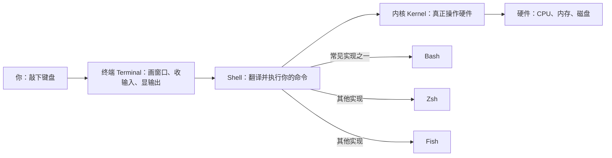

> 📍 位置：阶段 0 · 启蒙认知 · 第 5 章 ｜ ⏱ 预计用时：30-45 分钟 ｜ 难度：★☆☆☆☆

⬅️ 上一章：[安装你的第一个 Linux](04-安装你的第一个Linux.md) ｜ ➡️ 下一章：[文件与目录操作](../01-basics/01-文件与目录操作.md)

# 第 5 章 · 初见终端与 Shell

> 黑窗口不是「旧时代的遗物」，而是这个系统最诚实的对话窗口。
> 这一章，你将敲出人生第一批 Linux 命令——并且从此离不开它们。

---

## 🎯 学习目标

学完本章，你将能够：

- 分清终端（Terminal）、Shell、Bash 三个词到底指什么；
- 读懂命令提示符（Prompt）的每一个字段，知道自己在哪、是谁；
- 独立敲出人生第一组命令：`whoami`、`pwd`、`ls`、`echo`、`date`、`uname -a`、
  `clear`、`exit`；
- 用三个救命快捷键（Tab 补全、历史记录、清屏）把敲命令的速度提升一倍；
- 知道终端模拟器可以怎么「化妆」，让它越用越顺手。

---

## 🧠 核心概念

### 5.1 Terminal、Shell、Bash：一间厨房三个角色

三个词天天被混用，其实分工明确。先看一张数据流向图：



用餐厅类比记住它们：

- **终端（Terminal）** 是餐桌和点菜屏：那个黑窗口本身。它只负责「显示」和
  「收发字符」，如今在图形界面里的正式名字叫终端模拟器（Terminal Emulator），
  比如 GNOME Terminal、Windows Terminal；
- **Shell** 是服务生：负责「翻译」你敲的命令，转交给厨房。它是一个命令解释器
  （Command Interpreter）程序；
- **Bash**（Bourne Again Shell，GNU 计划的招牌 Shell）是这位服务生的名字——
  Shell 这个岗位有很多候选人（Zsh、Fish……），Ubuntu 默认雇的是 Bash，本书
  也以它为准。

一句话：**你 staring 的黑窗口是终端，窗口里跑的翻译官是 Shell，这位翻译官
名叫 Bash。**

### 5.2 第一次登录后的世界：提示符怎么读

打开终端（或在第 4 章装好的系统里登录），你会看到这样一行字：

```text
linuxboy@ubuntu:~$
```

别小看这一行，它是系统的「自我介绍」，逐段拆解：

| 字段 | 含义 |
|---|---|
| `linuxboy` | 你的用户名（User Name） |
| `@` | 分隔符，读作 at，「某用户在某台机器」 |
| `ubuntu` | 主机名（Host Name），这台机器的名字 |
| `:` | 分隔符 |
| `~` | 当前所在目录。波浪号是「家目录（Home Directory）」的缩写，普通用户是 `/home/用户名` |
| `$` | 命令提示符，意思是「请下命令」。普通用户显示 `$`，超级用户 root 显示 `#` |

读提示符是 Linux 最重要的肌肉记忆：**任何时候先看提示符，就知道「我是谁、
我在哪」**。看到 `#` 结尾要格外清醒——那是 root（超级用户），一句话就能删掉
整个系统。

### 5.3 命令的结构：动词、选项、参数

```text
命令    选项        参数
ls     -l          /home
↑      ↑           ↑
做什么  怎么做      对谁做
```

- **命令**：一个动词，如 ls（列出）；
- **选项（Option）**：修饰执行方式，短选项常以 `-` 开头，长选项以 `--` 开头，
  如 `-a`（all）与 `--all`；
- **参数（Argument）**：作用对象，如某个目录或文件名；
- 选项与参数之间用空格隔开，**Linux 严格区分大小写**：`LS` 不是 `ls`。

---

## 🛠 命令实操

先看一眼你即将进入的战场——终端打字的样子：


下面 8 条命令按「初见顺序」逐个演示。请打开你第 4 章装好的系统，**逐条敲**，
每条敲完观察输出——本章是全书唯一「不许复制粘贴」的一章，手敲才有肌肉记忆。

**1. `whoami`——我是谁？**

```bash
whoami    # who am i 的缩写：显示当前登录的用户名
```

预期输出：

```text
linuxboy
```

**2. `pwd`——我在哪？**

```bash
pwd    # print working directory：显示当前所在的完整目录路径
```

预期输出：

```text
/home/linuxboy
```

**3. `ls`——这里有什么？**

```bash
ls    # list：列出当前目录下的文件和文件夹
```

预期输出（Ubuntu 家目录下的默认文件夹，颜色可能不同）：

```text
Desktop  Documents  Downloads  Music  Pictures  Videos
```

蓝色名字通常是目录。此刻都是空文件夹，所以只列出名字。

**4. `echo`——让系统复读你**

```bash
echo "你好，Linux"    # echo：把引号里的内容原样打印到屏幕
```

预期输出：

```text
你好，Linux
```

它看似无聊，将来却是脚本（Script）世界里最重要的输出工具，也是验证「Shell
会不会替你展开变量」的试纸——第 1 章预告过的 `$` 家族，以后常见到它。

**5. `date`——现在几点？**

```bash
date    # 显示系统的当前日期与时间
```

预期输出（格式因系统语言设置而异）：

```text
2026年 10月 06日 星期二 20:30:00 CST
```

**6. `uname -a`——这台机器的底细**

```bash
uname -a    # 显示内核名称、主机名、内核版本、架构的系统信息全家福
```

预期输出：

```text
Linux ubuntu 6.8.0-45-generic #45-Ubuntu SMP PREEMPT_DYNAMIC x86_64 GNU/Linux
```

第 1 章看过的老朋友，现在你能读出：内核叫 Linux、机器叫 ubuntu、内核版本
6.8.0、64 位 x86_64 架构。

**7. `clear`——擦黑板**

```bash
clear    # 清空当前屏幕显示，光标回到顶部（屏幕内容可滚动找回，不会丢）
```

它没有任何输出——干净本身，就是输出。

**8. `exit`——优雅离场**

```bash
exit    # 结束当前 Shell 会话；WSL 用户执行后回到 Windows，虚拟机用户关掉标签页
```

恭喜，你已经完成和 Linux 的第一次完整对话：进门（登录）、聊天（敲命令）、
关门（退出）。

### 救命三键：先于一切命令学会

**救命键一：Tab——补全之王。** 命令和路径敲到一半，按一下 Tab 自动补全；
若响铃没反应，连按两下列出所有可能。例如：

```bash
cd Doc<Tab>    # 自动补全为 cd Documents，少敲 7 个字符，还不会拼错
```

**救命键二：↑ 历史记录。** 按上方向键调出上一条命令，再按继续往前翻，↓ 返回；
改一两个参数就能重跑，不用整条重敲。

```bash
# 敲错了很长的命令？别慌：
# 按 ↑ 调出它 → 左右键移动光标 → 改好 → 回车
```

**救命键三：Ctrl + L——一秒清屏。** 效果同 `clear`，但不用离开主键盘区。
顺带认识一位新朋友：**Ctrl + C** 可以立刻终止正在运行的命令——将来某个命令
卡住时，它会救你于水火。

---

## 💡 避坑指南

| 坑 | 现象 | 正确姿势 |
|---|---|---|
| 大小写随手敲 | `LS`、`Pwd` 报 command not found | Linux 严格区分大小写，命令一律小写、照着提示符敲 |
| Tab 没反应还硬回车 | 命令拼错，输出一脸懵的报错 | Tab 响铃或无反应说明前缀有歧义或拼错，按两次 Tab 看候选 |
| `clear` 与 `exit` 用混 | 想清屏结果把整个窗口关了 | 清屏用 `clear` 或 Ctrl+L；退出会话才用 `exit` |
| 看到 `$` 就随手复制别人的命令 | 不知不觉执行了危险操作 | 敲之前读一遍：它是动词+选项+参数的哪三部分，作用于谁 |
| 以为黑窗口输出丢了 | 滚动后找不到刚才的结果 | 多数终端可滚动查看历史；确认终端模拟器的滚动设置 |
| 追求美化超过使用 | 花两小时配主题，忘了学命令 | 美化是锦上添花，先把本教程的阶段 1 走完 |

---

## ✍️ 动手实验

### 实验 1：终端初体验笔记（15 分钟）

打开终端，按本章顺序敲完 8 条命令，然后合上本页，凭记忆新建一个笔记，回答：

1. 你的用户名和主机名分别是什么？（哪两条命令的输出能回答？）
2. 提示符里 `~` 代表什么？它的完整路径是什么？
3. `clear` 和 `exit` 的区别是什么？

### 实验 2：快捷键肌肉记忆挑战（10 分钟）

依次完成以下动作，全程不碰鼠标：

1. 用 Tab 补全进入你的 Documents 目录；
2. 随便敲一条 `echo` 长句子；
3. 用 ↑ 键调出它，把句子改一个词再执行；
4. 用 Ctrl + L 清屏；
5. 用 `pwd` 确认自己还在 Documents，最后 `exit` 退出会话。

<details><summary>💡 参考解法（先自己试！）</summary>

**实验 1 参考答案：**

1. `whoami` 给出用户名；`uname -a` 输出第二段是主机名（或观察提示符 `@` 后的
   字段）；
2. `~` 是家目录缩写；以用户 `linuxboy` 为例，完整路径是 `/home/linuxboy`，
   用 `pwd` 在刚登录时执行即可验证；
3. `clear` 只清屏幕显示，会话还在；`exit` 结束整个 Shell 会话，窗口关闭或回到
   宿主系统。

**实验 2 参考操作序列（以用户 linuxboy 为例）：**

```bash
cd Doc<Tab>        # Tab 补全 → cd Documents
echo "今天开始学 Linux 啦"
# 按 ↑，用左右键把「开始」改成「认真开始」，回车
# Ctrl + L 清屏
pwd                # 输出 /home/linuxboy/Documents
exit               # 会话结束
```

全部五步不碰鼠标完成，快捷键就真正长在你手上了。

</details>

---

## 📺 推荐视频

本章暂无专属视频，推荐两个「复习位」：

1. 第 1 章 freeCodeCamp 入门课的终端基础部分，讲法与本章互补：
   [01-为什么人人都要学Linux.md](01-为什么人人都要学Linux.md)；
2. 第 4 章韩顺平课程的前几集正好演示终端与常用命令，装好系统后边看边敲：
   [04-安装你的第一个Linux.md](04-安装你的第一个Linux.md)。

---

## ✅ 自测清单

对照检查，全部能打勾就可以进入阶段 1：

- [ ] 我能用自己的话说清终端、Shell、Bash 三者的关系。
- [ ] 我能逐字段读出 `linuxboy@ubuntu:~$` 的含义。
- [ ] 我能不看笔记敲出本章 8 条命令并说出各自用途。
- [ ] 我知道 `$` 与 `#` 结尾的提示符分别代表什么，并对后者保持警惕。
- [ ] 我能熟练使用 Tab 补全、↑ 历史记录、Ctrl+L 清屏三个快捷键。
- [ ] 我能说出 `clear` 与 `exit` 的区别。
- [ ] 我知道 Linux 命令严格区分大小写。

---

## 🔗 延伸阅读

- [The Linux Documentation Project](https://tldp.org)：Shell 入门与 Bash 指南的老牌英文文档库。
- [鸟哥的 Linux 私房菜](https://linux.vbird.org)：中文世界最经典的 Shell 与基础命令讲解。
- [Arch Wiki](https://wiki.archlinux.org)：想深挖终端模拟器与各类 Shell 的特性，从这里开始。
- 阶段 1 下一章：[文件与目录操作](../01-basics/01-文件与目录操作.md)——从这里开始，你的 Linux 之路正式上路。
