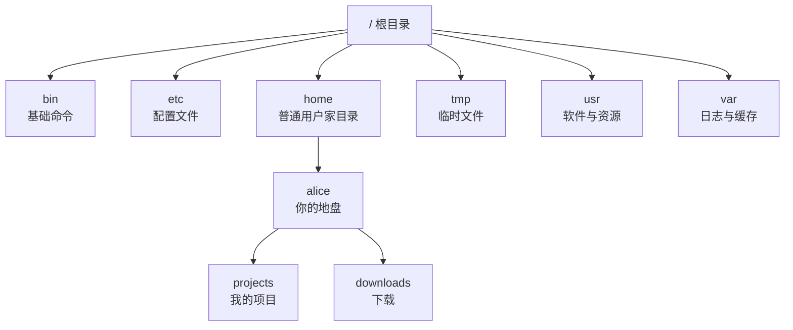

# 第 1 章 · 文件与目录操作

> 📍 位置：阶段 1 · 基础篇 · 第 1 章 ｜ ⏱ 预计用时：30-45 分钟 ｜ 难度：★★☆☆☆
>
> ⬅️ 上一章：[05-初见终端与Shell](../00-onboarding/05-初见终端与Shell.md) ｜ ➡️ 下一章：[02-查看与编辑文件-Vim](02-查看与编辑文件-Vim.md)

Linux 没有"C 盘、D 盘"，整台机器的所有文件都挂在一棵以 `/` 为根的大树上。这一章你将学会在这棵树上"走路"（`cd`）、"看路牌"（`pwd`/`ls`）、"盖房子"（`mkdir`/`touch`），以及"搬家与拆房"（`cp`/`mv`/`rm`）。这些命令将占你未来命令行操作的绝大部分，值得练到肌肉记忆。

## 🎯 学习目标

学完本章，你应该能够：

- 说清 Linux 目录树的形状：**一切从 `/`（根目录）开始**；
- 区分**绝对路径**与**相对路径**，熟练使用 `~`、`.`、`..`、`-` 四个快捷方式；
- 用 `pwd`、`ls`、`tree` 回答"我在哪、周围有什么"；
- 用 `mkdir`、`touch`、`cp`、`mv`、`rm` 完成日常文件增删改；
- 说清 `rm -rf` 为什么危险，以及 Ubuntu 的 `rm -i` 别名如何保护你；
- 养成一套不给自己挖坑的**文件命名习惯**。

## 🧠 核心概念

### 一切从 / 开始

Windows 的世界从"C 盘"出发，每个盘符一棵树；Linux 的世界只有**一棵树（Directory Tree，目录树）**，树根就是 `/`（读作 root，根目录）。硬盘、U 盘、光盘将来都只是"挂"在树上某个枝干上的子目录（挂载，Mount，阶段 4 再细讲）。

另一个反直觉但重要的事实：在 Linux 里**"一切皆文件"（Everything is a file）**——普通文件是文件，目录是文件，设备、进程信息甚至也是特殊的文件。所以"管理文件"是整个 Linux 的地基。

典型 Ubuntu 系统的目录树骨架长这样：



先记住几个高频目录就够用：

| 目录 | 放什么 | 一句话记忆 |
|---|---|---|
| `/bin`、`/usr/bin` | 可执行命令（ls、cp……） | 工具箱 |
| `/etc` | 系统与应用的配置文件 | 控制台 |
| `/home` | 普通用户的家目录 | 你自己的房间 |
| `/root` | root（管理员）的家目录 | 管理员房间 |
| `/tmp` | 临时文件，重启可能被清空 | 草稿纸 |
| `/var` | 日志、缓存等会变化的数据 | 监控室 |

> 📚 这种"谁放哪里"的约定叫 **FHS**（Filesystem Hierarchy Standard，文件系统层次标准），出处见延伸阅读。

### 绝对路径 vs 相对路径

- **绝对路径（Absolute Path）**：从 `/` 写起，例如 `/home/alice/projects`。从任何位置引用都不会迷路。
- **相对路径（Relative Path）**：从**当前所在目录**写起，例如 `projects/web`。写得短，但依赖当前位置。

四个快捷方式务必练熟：

| 写法 | 含义 |
|---|---|
| `~` | 当前用户的家目录（如 `/home/alice`） |
| `.` | 当前目录 |
| `..` | 上一级目录 |
| `-` | 上一次所在的目录（配合 `cd` 使用） |

### 命名习惯（少踩坑从取名开始）

- 全小写 + 单词之间用 `-` 或 `_`，例如 `my-notes.md`；
- **不要用空格**：空格在命令行里是参数分隔符，`my file.txt` 会被当成两个文件，必须写成 `"my file.txt"` 才安全；
- 避开 `* ? $ & ; ( ) < > |` 等特殊字符，它们在 Shell 里有特殊含义；
- 名字要有意义：一年后你能看懂 `logs-2026-10.txt`，但未必看得懂 `新建文件夹(3)`。

## 🛠 命令实操

以下示例假设你已登录自己的普通用户（示例中叫 `alice`）并在家目录练习。

### pwd：我在哪

`pwd` = **p**rint **w**orking **d**irectory，打印当前工作目录。

```bash
pwd
```

```text
/home/alice
```

### ls：这里有什么

`ls` = **l**i**s**t。三个最常用选项可以自由组合：

```bash
ls              # 列出文件名
ls -l           # 长格式：权限、大小、时间……（第 3 章细讲）
ls -a           # all：连隐藏文件（以 . 开头）一起列出
ls -lh          # l + human-readable：大小用 K/M 显示
ls -alh /etc    # 组合拳 + 指定目录
```

```text
$ ls -lh
total 12K
-rw-rw-r-- 1 alice alice  682 Oct  6 10:00 notes.txt
drwxrwxr-x 2 alice alice 4.0K Oct  6 10:01 photos
```

以 `.` 开头的文件默认不显示，例如 `~/.bashrc`——这就是 `ls -a` 存在的意义。

### cd：走路

`cd` = **c**hange **d**irectory。

```bash
cd /etc         # 绝对路径：从根出发
cd projects     # 相对路径：从当前目录出发
cd ~            # 回家（只写 cd 也一样）
cd ..           # 去上一级
cd -            # 回到上一个目录（再敲一次又回来）
```

```text
$ cd /usr/share/doc
$ cd -
/home/alice
$ cd -
/usr/share/doc
```

### mkdir 与 touch：盖房与挂匾

```bash
mkdir photos                    # 建一个目录
mkdir -p projects/web/html      # -p：父目录不存在就顺手创建，一次建多层
mkdir a b c                     # 一次建多个
touch notes.txt                 # 文件不存在则新建空文件；存在则只更新时间戳
```

`touch` 的本意是"摸一下时间戳"，只是顺手成了"建空文件"的惯用法。

### cp：复制

`cp` = **c**o**p**y。复制**目录**必须加 `-r`（recursive，递归）；`-i`（interactive）在覆盖同名文件前先问你。

```bash
cp notes.txt notes-backup.txt   # 复制并改名
cp notes.txt photos/            # 复制进目录
cp -r photos photos-bak         # 复制目录（少了 -r 会报错）
cp -i notes.txt photos/         # 覆盖前先询问
```

### mv：搬家 + 改名一肩挑

`mv` = **m**o**v**e。目标不存在就是"改名"，目标是目录就"搬进去"。

```bash
mv notes.txt diary.txt          # 改名
mv diary.txt photos/            # 移动
mv photos ~/documents/          # 移动到家目录下
```

`mv` 会静默覆盖同名文件——加 `-i` 更稳妥。

### rm：拆房（危险！）

`rm` = **r**e**m**ove。**Linux 没有回收站，rm 掉就真没了。**

```bash
rm notes-backup.txt     # 删除文件
rm -r photos-bak        # 递归删除目录（目录必须加 -r）
rm -i diary.txt         # 每删一个问一次
rm -rf projects/test    # 递归 + 不询问：威力最大的"格式化按钮"
```

`-f`（force）的含义是强制删除、不再提示。`rm -rf` 是"无影手"，敲错一个字母就可能删掉整个家目录。

好消息：Ubuntu 默认把 `rm` 别名（alias，第 7 章细讲）成了 `rm -i`——

```text
$ alias rm
alias rm='rm -i'
$ rm notes.txt
rm: remove regular file 'notes.txt'? y
```

但要注意：一旦加了 `-f`，`-i` 就失效了。**把 `rm -i` 当安全带，把手指从 `rm -rf` 上挪开**。

### tree：一眼看全树

```bash
sudo apt install tree   # Ubuntu/Debian 需先安装
tree projects
```

```text
projects
└── web
    ├── css
    └── html

3 directories, 0 files
```

> 💡 发行版注记：Fedora 用 `sudo dnf install tree`，Arch 用 `sudo pacman -S tree`（包管理器详见第 5 章）。

## 💡 避坑指南

1. **没有回收站**：`rm` 不可逆。删除前先 `ls` 确认目标；也可以学老手，先 `mv` 进一个 `trash/` 目录，攒一批再删。
2. **空格文件名**：删除 `my file.txt` 时写成 `rm my file.txt`，只会删掉 `my`（然后报错）。用引号或转义：`rm "my file.txt"` 或 `rm my\ file.txt`。
3. **别在系统目录练习**：练习请在 `/tmp` 或自己的家目录进行。`/etc`、`/usr` 是系统重地。
4. **Tab 补全是最好的防错工具**：路径记不清就敲两下 Tab，比手打靠谱得多。
5. **`rm -rf` 永远多看一眼**：尤其涉及变量时——`rm -rf "$DIR/"` 若 `$DIR` 为空，就变成了 `rm -rf /`。变量加引号、路径别带尾斜杠。

## ✍️ 动手实验

### 实验 1：搭一个标准项目目录

只用本章命令，在 `~/practice` 下搭出下面的结构（`docs/` 与 `src/` 为空目录，`README.md` 为空文件）：

```text
practice/
├── docs
├── README.md
└── src
```

<details><summary>💡 参考解法（先自己试！）</summary>

```bash
mkdir -p ~/practice/docs ~/practice/src
touch ~/practice/README.md
tree ~/practice
```

`mkdir -p` 一条命令建出多层目录；`touch` 创建空文件。没装 tree 就用 `ls -R ~/practice` 代替。
</details>

### 实验 2：体验"绝对 vs 相对"与 `cd -`

从任意目录出发，仅用相对路径走到 `/etc`，再一步回到出发地。

<details><summary>💡 参考解法（先自己试！）</summary>

```bash
cd /tmp         # 随便选个出发点
pwd             # 例如 /tmp
cd ../../etc    # /tmp 的上两级是 /，再进 etc —— 纯相对路径走法
pwd             # /etc
cd -            # 一键回到 /tmp
```

相对路径的 `..` 可以连续叠加，从任意深度"走"到目标；`cd -` 则永远记住你上一站。
</details>

## 📺 推荐视频

freeCodeCamp 的《The 50 Most Popular Linux & Terminal Commands》一次讲透 50 个终端命令，前半部分与本章高度重合，适合当"随堂跟练"：

[](https://www.youtube.com/watch?v=ZtqBQ68cfJc)

## ✅ 自测清单

- [ ] 我能不看笔记说出 `/etc`、`/home`、`/var` 各放什么
- [ ] 我能解释 `/home/alice/notes.txt` 与 `./notes.txt` 的区别
- [ ] 我会用 `cd -` 在两个目录之间来回切换
- [ ] 我知道复制目录必须加 `-r`，而 `mv` 不用
- [ ] 我能说出 `rm -r` 与 `rm -rf` 的差别，以及为什么后者危险
- [ ] 我知道隐藏文件长什么样，以及怎么让它们现形
- [ ] 我给新文件取名时不再使用空格和特殊字符

## 🔗 延伸阅读

- [man7.org · Linux man-pages](https://man7.org/linux/man-pages/)：`pwd(1)`、`ls(1)` 的权威出处
- [The Linux Documentation Project](https://tldp.org)：Path HOWTO 等经典文档
- [鸟哥的 Linux 私房菜](https://linux.vbird.org)：中文世界里最扎实的文件与目录管理讲解
- [explainshell.com](https://explainshell.com)：把 `ls -alh` 拆开逐词解释
- 📝 巩固练习：[01-基础篇练习](../../exercises/01-基础篇练习.md)
