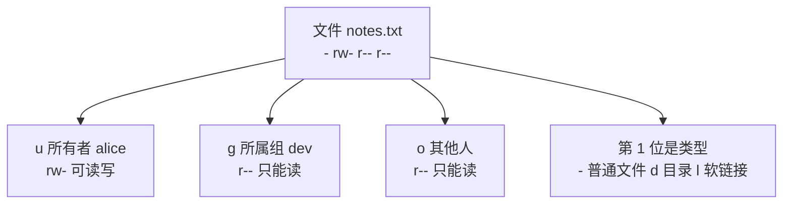

# 第 3 章 · 用户与权限

> 📍 位置：阶段 1 · 基础篇 · 第 3 章 ｜ ⏱ 预计用时：30-45 分钟 ｜ 难度：★★★☆☆
>
> ⬅️ 上一章：[02-查看与编辑文件-Vim](02-查看与编辑文件-Vim.md) ｜ ➡️ 下一章：[04-压缩与归档](04-压缩与归档.md)

Windows 时代你可能从来不管"权限"，但 Linux 从出生起就是**多用户（multi-user）操作系统**——一台机器上同时住着很多人、跑着很多服务，权限就是他们之间的"围墙"。读懂 `ls -l` 那一串 `rwx`，是你从"会用命令"走向"理解系统"的第一步。

## 🎯 学习目标

学完本章，你应该能够：

- 建立 Linux 的**多用户世界观**：所有者、所属组、其他人；
- 会用 `id`、`whoami` 查身份，用 `useradd` + `passwd` 建新用户；
- 说清 `su` 与 `sudo` 的区别，知道 `/etc/sudoers` 是谁的地盘；
- 逐列读懂 `ls -l` 的输出，背下 `rwx` 对**文件**与**目录**的不同含义；
- 用八进制法与 `ugoa±=` 符号法两种方式 `chmod`，会 `chown`/`chgrp`，理解 `umask`；
- 说清为什么 `chmod -R 777` 是反模式（antipattern）。

## 🧠 核心概念

### 多用户世界观

Linux 里每个使用者都是一个**用户（User）**，用户可以归入**组（Group）**；每个文件都登记着三个归属问题：**谁的所有者（Owner）？哪个组（Group）？其他人（Others）怎么办？**

还有一个超然的存在：**root**，UID 恒为 0，能越过一切权限检查。日常干活用普通账号，需要时借 root 的力，这才是安全姿势。

对任意一个文件，权限被切成三组、每组三位：



### 身份三件套：whoami / id / groups

```text
$ whoami
alice
$ id
uid=1000(alice) gid=1000(alice) groups=1000(alice),27(sudo)
$ groups
alice sudo
```

`id` 一条顶三样：UID（用户号）、GID（组号）、所在组列表。上面 `sudo` 组的存在，意味着 alice 有资格用 `sudo`。

再看一眼"户口本" `/etc/passwd`——每个用户占一行，冒号分隔七个字段：

| 字段 | 示例值 | 含义 |
|---|---|---|
| 1 | `alice` | 用户名 |
| 2 | `x` | 密码占位符（真密码在 `/etc/shadow`） |
| 3 | `1000` | UID（用户号） |
| 4 | `1000` | GID（初始组号） |
| 5 | `Alice Zhang,,,` | 备注全名（GECOS） |
| 6 | `/home/alice` | 家目录 |
| 7 | `/bin/bash` | 登录 Shell |

### 创建用户：useradd + passwd

```bash
sudo useradd -m -s /bin/bash bob   # -m 建家目录，-s 指定登录 Shell
sudo passwd bob                    # 给 bob 设置密码
```

```text
New password:
Retype new password:
passwd: password updated successfully
```

> 💡 发行版注记：Debian/Ubuntu 还有个交互式向导 `sudo adduser bob`，会顺手建家目录、问密码，更适合新手；Fedora/RHEL 的 `useradd` 默认就建家目录。

想给 bob 发"管理员资格证"，把他加进 `sudo` 组：

```bash
sudo usermod -aG sudo bob   # -a 追加，-G 指定组；-a 不能丢，否则 bob 会被踢出其他组
groups bob                  # bob : bob sudo
```

bob 重新登录后就能 `sudo` 了——这也是第 3 列"所在组"的实际用途。

### su vs sudo：借权的两种姿势

```bash
su - bob         # 切换身份为 bob（- 表示连同环境变量一起切）
exit             # 退出，回到 alice
sudo apt update  # 只以 root 身份执行这一条命令
sudo -i          # 临时获得一个 root Shell（用完记得 exit）
```

| 对比项 | `su` | `sudo` |
|---|---|---|
| 做什么 | 彻底切换成另一个用户（默认 root） | 以其他身份执行单条命令 |
| 输谁的密码 | 目标用户（root）的密码 | 自己的密码 |
| 权限范围 | 切过去之后全程 root | 只限被放行的命令 |
| 推荐度 | 长期借用时用 | **日常首选**，可审计 |

谁有资格用 `sudo`，由 `/etc/sudoers` 文件决定——这个文件**必须用 `sudo visudo` 编辑**（自带语法检查），直接用普通编辑器改写坏了会把自己锁在管理员门外。

### ls -l 输出逐列解读

```text
$ ls -l
total 8
-rw-r--r-- 1 alice dev      1024 Oct  6 10:00 notes.txt
drwxr-xr-x 3 alice dev      4096 Oct  6 10:01 scripts
lrwxrwxrwx 1 alice dev         9 Oct  6 10:02 latest.txt -> notes.txt
```

| 列 | 示例值（第 1 行） | 含义 |
|---|---|---|
| 1 | `-rw-r--r--` | 类型 + 三组权限：`-` 普通文件；`rw-` 所有者；`r--` 组；`r--` 其他人 |
| 2 | `1` | 硬链接数 |
| 3 | `alice` | 所有者（Owner） |
| 4 | `dev` | 所属组（Group） |
| 5 | `1024` | 大小（字节） |
| 6~7 | `Oct 6 10:00` | 最后修改时间 |
| 8 | `notes.txt` | 文件名（软链接会跟 `->` 指向目标） |

### rwx 对文件与目录，含义不一样

这是新手最容易懵的点——同一串 `rwx`，放在文件上和放在目录上是**两套含义**：

| 位 | 对文件 | 对目录 |
|---|---|---|
| `r`（4，read） | 读取内容（`cat`、`less`） | 列出目录里有哪些**文件名**（`ls`） |
| `w`（2，write） | 修改文件内容 | 在目录里**新建 / 删除 / 改名**文件 |
| `x`（1，execute） | 把文件当程序执行（脚本、二进制） | **进入**目录（`cd`），访问其中文件 |

两个推论值得背下来：目录只有 `r` 没有 `x` 时，只能"报菜名"却进不去；**能否删除一个文件，取决于它所在目录的 `w` 权限**，跟文件本身无关。

权限位到底长什么样？看这个动画最直观：



## 🛠 命令实操

### chmod：改权限的两种写法

**八进制法**：`r=4`、`w=2`、`x=1`，每组三位相加得一个数字，三组拼三个数字。

```text
rwx r-x r--  →  4+2+1  4+0+1  4+0+0  →  754
```

```bash
chmod 644 notes.txt     # rw-r--r--，配置文件的常见权限
chmod 755 deploy.sh     # rwxr-xr-x，脚本/目录的常见权限
chmod 700 ~/.ssh        # rwx------，私密目录只留给自己
```

**符号法**：`ugoa`（所有者/组/其他人/所有人）+ `+-=`（加/减/恰好设为）+ `rwx`。

```bash
chmod u+x deploy.sh     # 给所有者加执行权
chmod go-r notes.txt    # 组和其他人去掉读权限
chmod a=r notes.txt     # 所有人恰好可读，不多不少
chmod -R g+w scripts/   # -R 递归处理整个目录
```

一张常用权限参照表，遇到场景直接对号入座：

| 权限 | 典型对象 | 场景 |
|---|---|---|
| 644 | 普通文件 | 配置、文本：自己可读写，别人只读 |
| 600 | 私密文件 | `~/.ssh/id_rsa` 等密钥：只有自己能碰 |
| 755 | 目录与脚本 | 网页目录、Shell 脚本：人人可进可执行，只留自己写 |
| 700 | 私密目录 | `~/.ssh`：仅本人可进入 |
| 777 | （几乎没有） | 反模式，见下方避坑指南 |

### chown / chgrp：换主人

```bash
sudo chown bob report.txt          # 换所有者
sudo chown bob:dev report.txt      # 所有者和组一起换
sudo chgrp dev report.txt          # 只换组
```

`chown`/`chgrp` 涉及"改别人的东西"，普通用户只能对自己文件操作，跨归属要 `sudo`。

### umask：新文件的"出厂默认权限"

`umask` 是掩码：从默认权限里**减去**（按位清除）掩码位，就是新建文件的权限。

```text
$ umask
0002
$ touch fresh.txt && ls -l fresh.txt
-rw-rw-r-- 1 alice alice 0 Oct  6 10:30 fresh.txt
```

演算：文件基数为 `666`、目录为 `777`；掩码 `002` 清掉"其他人"的 `w`，于是新文件 `664`、新目录 `775`。想让新文件更私密，就把 `umask 027` 写进 `~/.bashrc`。

临时体验不同掩码（只影响当前会话，退出即恢复）：

```text
$ umask 027
$ touch secret.txt && ls -l secret.txt
-rw-r----- 1 alice alice 0 Oct  6 10:31 secret.txt
```

## 💡 避坑指南

1. **`chmod -R 777` 是反模式**：让全世界可读可写可执行，等于拆掉围墙，网页目录被篡改十有八九是它干的。正确姿势：目录 `755`、文件 `644`，归属不对用 `chown` 解决。
2. **`x` 不要随手加**：给普通文件加 `x` 没意义还危险；给**目录**加 `x` 反而是必须的，否则进不去。
3. **删不掉文件先看目录权限**：权限报错时，检查的应是**所在目录**的 `w` 位，而不是文件本身。
4. **`/etc/sudoers` 只用 `visudo` 碰**：手改写坏语法，可能让所有管理员进不了 root。
5. **`su` 与 `sudo -i` 用完记得 `exit`**：挂着 root Shell 干活，敲错一条命令的代价是系统级的。

## ✍️ 动手实验

### 实验 1：让权限围墙"看得见"

创建用户 `bob`，然后在 alice 家目录放一个仅自己可读的文件，切到 bob 试试访问，再把权限放开对比效果。

<details><summary>💡 参考解法（先自己试！）</summary>

```bash
sudo useradd -m -s /bin/bash bob
sudo passwd bob
echo "secret" > ~/secret.txt
chmod 600 ~/secret.txt          # rw-------
su - bob                        # 输入 bob 的密码
cat /home/alice/secret.txt      # → cat: /home/alice/secret.txt: Permission denied
exit
chmod 644 ~/secret.txt          # 放开"其他人"的读权限
su - bob
cat /home/alice/secret.txt      # → secret
exit
```

第二次能读通了，因为 `644` 把 `r` 给了"其他人"。实验完记得 `rm ~/secret.txt`。
</details>

### 实验 2：解释系统的"标准答案"

查看 `/etc/passwd` 和 `/etc/shadow` 的权限，用本章知识解释它们为何不同。

<details><summary>💡 参考解法（先自己试！）</summary>

```bash
ls -l /etc/passwd /etc/shadow
```

```text
-rw-r--r-- 1 root root  2789 Oct  6 09:00 /etc/passwd
-rw-r----- 1 root shadow 1290 Oct  6 09:00 /etc/shadow
```

`/etc/passwd` 存的是"公开花名册"（用户名、Shell、家目录），无敏感信息，所以 `644` 人人可读；`/etc/shadow` 存**加密后的密码**，只有 root 可读写、shadow 组可读，普通用户连看都不行——这就是"最小权限原则"的教科书示例。
</details>

## 📺 推荐视频

freeCodeCamp 的《Linux Operating System - Crash Course for Beginners》把用户、组、权限放在系统全景里讲，正好覆盖本章：

[](https://www.youtube.com/watch?v=ROjZy1WbCIA)

## ✅ 自测清单

- [ ] 我能说出 `ls -l` 前十个字符各代表什么
- [ ] 我能背出 `rwx` 对文件和对目录的两套含义
- [ ] 我会用八进制法把权限改成 `750`，也会用符号法写 `g-w`
- [ ] 我知道 `su` 和 `sudo` 的核心区别，以及 `/etc/sudoers` 该用 `visudo` 改
- [ ] 我能解释 `umask 002` 下新建文件为什么是 `664`
- [ ] 我能说清 `chmod -R 777` 错在哪，并给出正确替代
- [ ] 我知道"能否删除文件"取决于目录的 `w` 权限

## 🔗 延伸阅读

- [man7.org · Linux man-pages](https://man7.org/linux/man-pages/)：`chmod(1)`、`chown(1)`、`credentials(7)`
- [The Linux Documentation Project](https://tldp.org)：Users & Groups 相关 HOWTO
- [Arch Wiki · Users and groups](https://wiki.archlinux.org/title/Users_and_groups)：同类知识的高密度整理
- [鸟哥的 Linux 私房菜](https://linux.vbird.org)：权限篇讲解非常透彻
- 📝 巩固练习：[01-基础篇练习](../../exercises/01-基础篇练习.md)
