# 第 4 章 · 压缩与归档

> 📍 位置：阶段 1 · 基础篇 · 第 4 章 ｜ ⏱ 预计用时：30-45 分钟 ｜ 难度：★★☆☆☆
>
> ⬅️ 上一章：[03-用户与权限](03-用户与权限.md) ｜ ➡️ 下一章：[05-软件包管理](05-软件包管理.md)

下载源码包、备份配置、翻服务器日志，都躲不开 `.tar.gz`、`.tar.xz`、`.zip` 这些后缀。本章用一张图分清"归档"和"压缩"两件事，再把 `tar` 的几条组合拳练熟——之后你看到任何 `tar xxxvf` 都不再发怵。

## 🎯 学习目标

学完本章，你应该能够：

- 用一张图说清**归档（Archive）≠ 压缩（Compression）**；
- 背出 `tar` 的"四大金刚"：`czvf` 打包压缩、`tzvf` 查看、`xzvf` 解压，并知道 `-C` 解到指定目录；
- 在 `gzip`/`bzip2`/`xz` 之间按"压缩率 vs 速度"做选择；
- 会用 `zip`/`unzip` 处理跨平台场景；
- 看到陌生后缀（`.tgz`、`.tar.bz2`）也知道该敲哪条命令。

## 🧠 核心概念



[在学习站暂停、单步或重播](https://zhuguang-zfg.github.io/linux/#animation=archive-pipe.svg)。动画中的输入输出为教学示意，需用本章实验验证。



[在学习站暂停、单步或重播](https://zhuguang-zfg.github.io/linux/#animation=archive-compress.svg)。动画中的输入输出为教学示意，需用本章实验验证。

### 归档 ≠ 压缩

- **归档（Archiving）**：把一堆文件和目录**装进一个文件**，方便传输，体积基本不变；
- **压缩（Compression）**：用算法**缩小体积**，但不负责"装袋"。

Windows 的 `.zip` 是一步到位（归档+压缩二合一），而 Unix 传统是**两步分开**：先 `tar` 打包，再交给压缩算法。所以 `.tar.gz` 要读作"tar 归档、gzip 压缩"。


理解了这张图，后缀只是"记号"：

| 后缀 | 含义 |
|---|---|
| `.tar` | 只归档，未压缩 |
| `.tar.gz` / `.tgz` | tar 归档 + gzip 压缩 |
| `.tar.bz2` | tar 归档 + bzip2 压缩 |
| `.tar.xz` | tar 归档 + xz 压缩 |
| `.zip` | 归档 + 压缩一体（跨平台） |

为什么不学 Windows 合二为一？分步的好处是**自由组合**：同一份 `.tar` 归档，今天可以配 gzip 图快，明天可以换 xz 图小，压缩工具之间互不干扰。这正是 Unix "每个程序只做好一件事" 哲学的体现。

> 📝 Linux 不靠扩展名判断文件类型（回忆第 2 章的 `file` 命令），后缀纯粹是给人看的记号——但请认真遵守约定，否则工具和你自己都会认错。

### 三大压缩算法怎么选

| 工具 | 扩展名 | 压缩率 | 速度 | 典型场景 |
|---|---|---|---|---|
| `gzip` | `.gz` | 中 | 快 | 日志轮转、日常默认 |
| `bzip2` | `.bz2` | 较高 | 慢 | 老版本源码包常见 |
| `xz` | `.xz` | 最高 | 最慢 | 追求极限体积，如发行版镜像 |

三个工具都是**单文件压缩器**——它们不认识目录，所以目录必须先交给 `tar` 打包，这也再次呼应了"归档"与"压缩"的分工。

一句话：**要快选 gzip，要小选 xz，bzip2 如今多是"兼容存量"。**

## 🛠 命令实操

### tar 四大金刚

`tar` 选项不用记横线，按口诀念：**c 造、t 瞧、x 拆，z 配 gzip，v 喊出过程，f 指定文件名**。`f` 必须紧跟文件名，放在最后。

先认全单个字母，组合就不神秘了：

| 字母 | 全称 | 含义 |
|---|---|---|
| `c` | create | 创建归档 |
| `x` | extract | 解开归档 |
| `t` | list | 列出归档内容 |
| `f` | file | 后面跟文件名（必须放最后） |
| `v` | verbose | 显示处理过程 |
| `z` | gzip | 配套 gzip（`.tar.gz`） |
| `j` | bzip2 | 配套 bzip2（`.tar.bz2`） |
| `J` | xz | 配套 xz（`.tar.xz`） |
| `C` | directory | 指定解压目标目录 |

```bash
# 1) 创建（create）+ gzip 压缩 + 显示过程 + 指定文件名
tar czvf backup.tar.gz myproject/

# 2) 查看（table）压缩包里有什么，不解开
tar tzvf backup.tar.gz

# 3) 解压（extract）
tar xzvf backup.tar.gz

# 4) 解压到指定目录：-C 后跟目标目录（目录要先存在）
mkdir /tmp/restore
tar xzvf backup.tar.gz -C /tmp/restore
```

```text
$ tar czvf backup.tar.gz myproject/
myproject/
myproject/notes.txt
myproject/src/
myproject/src/main.py
```

```text
$ tar tzvf backup.tar.gz
drwxrwxr-x alice/alice       0 2026-10-06 10:00 myproject/
-rw-rw-r-- alice/alice     682 2026-10-06 10:00 myproject/notes.txt
```

打包时顺手排除杂物（如日志、临时目录）：

```bash
tar czvf project.tar.gz --exclude="*.log" --exclude="tmp" project/
```

换压缩算法只换一个字母：`czjf`/`xzjf` 对 `.tar.bz2`，`cJvf`/`xJvf` 对 `.tar.xz`。只打包某类文件也可以直接写通配符：

```bash
tar czvf logs.tar.gz *.log
```

> 🎁 现代彩蛋：GNU tar 会自动识别压缩格式，**偷懒万金油是 `tar xvf 任何包`**——查看同理 `tar tvf`。

### gzip 家族：单文件压缩

```bash
sudo apt install gzip bzip2 xz-utils
compression_lab=$(mktemp -d)
printf 'Linux compression example\n' > "$compression_lab/big.log"
# -c 把压缩结果写到标准输出，保留同一份原文件供三个工具分别使用
gzip -c "$compression_lab/big.log" > "$compression_lab/big.log.gz"
bzip2 -c "$compression_lab/big.log" > "$compression_lab/big.log.bz2"
xz -c "$compression_lab/big.log" > "$compression_lab/big.log.xz"
zcat "$compression_lab/big.log.gz"
gzip -dc "$compression_lab/big.log.gz" > "$compression_lab/restored.log"
cmp "$compression_lab/big.log" "$compression_lab/restored.log"
```

预期 zcat 输出原文，cmp 无输出且退出码为 0。`gzip`、`bzip2`、`xz` 默认压缩后会移除原文件；直接使用文件参数时可以加 `-k` 保留，也可以像上面一样用 `-c` 单独保存输出。查看压缩信息：

```bash
gzip -l "$compression_lab/big.log.gz"
```

结果中的大小与比率以实际文件为准。很小的文件可能因格式头部开销而越压越大，这不表示压缩命令失败。

### zip / unzip：跨平台场景

给 Windows 同事发文件、从网页下载的压缩包，多半是 `.zip`：

```bash
sudo apt install zip unzip      # Ubuntu 默认未必预装
zip -r photos.zip photos/       # -r：递归打包目录
unzip photos.zip                # 解到当前目录
unzip photos.zip -d /tmp/pic    # -d：解到指定目录
```

```text
$ unzip photos.zip -d /tmp/pic
Archive:  photos.zip
  creating: /tmp/pic/photos/
  inflating: /tmp/pic/photos/cat.jpg
  inflating: /tmp/pic/photos/dog.jpg
```

不想解开先看清单：`unzip -l photos.zip`。

### du：先看看有多大再决定怎么压

```bash
du -sh /var/log      # -s 汇总，-h 人类可读
```

```text
2.3G    /var/log
```

打包前用 `du -sh` 估个体积，免得"压了半小时，才发现目录里藏着十个 G 的视频"。

### 常用组合速查

| 目标 | 命令 |
|---|---|
| 打包并 gzip 压缩 | `tar czvf out.tar.gz 目录/` |
| 打包并 xz 压缩 | `tar cJvf out.tar.xz 目录/` |
| 看包里有什么 | `tar tzvf out.tar.gz` |
| 解压到当前目录 | `tar xzvf out.tar.gz` |
| 解压到指定目录 | `tar xzvf out.tar.gz -C 目标目录` |
| 只解压包内单个文件 | `tar xzvf out.tar.gz 路径/文件名` |
| 万金油解压 | `tar xvf out.任意后缀` |
| 压缩单个文件 | `gzip 文件` / `xz -k 文件` |
| zip 跨平台打包 | `zip -r out.zip 目录/` |
| zip 解到指定目录 | `unzip out.zip -d 目录` |
| zip 只看清单 | `unzip -l out.zip` |

## 💡 避坑指南

1. **`f` 必须贴着文件名**：`tar cfz backup.tar.gz` 在部分版本会报错——正确习惯是 `czvf`/`xzvf`，`f` 永远最后。
2. **解压前先 `tzvf` 看一眼**：有些包解开不带顶层目录，直接把几十个文件"泼"在当前目录；先确认再解压，必要时 `-C` 到空目录。
3. **`gzip` 会吃掉原文件**：单文件压缩工具默认替换原文件，心疼就加 `-k`（xz 支持）或先备份。
4. **Windows zip 的中文文件名乱码**：Windows 常用 GBK 编码打包，Ubuntu 默认按 UTF-8 解会乱码；新版 `unzip` 可试 `unzip -O GBK file.zip`，更稳的方案是请对方改发 `.tar.gz` 或 7z 格式。
5. **压缩比不是越高越好**：`xz` 压一个几个 GB 的日志可能要几分钟，日常备份用 `gzip` 足够。
6. **打包绝对路径会有提示**：`tar czvf a.tar.gz /home/alice/x` 会报 `tar: Removing leading '/' from member names`——tar 故意剥掉开头的 `/`，防止解压时覆盖系统同名文件。习惯用相对路径打包更省心。
7. **别压"压缩过"的东西**：`.jpg`、`.mp4`、`.zip` 本身已是压缩格式，再压一遍几乎不变小，还白费时间。

## ✍️ 动手实验

### 实验 1：走完"打包 → 查看 → 解压"全流程

把第 1 章练习目录 `~/practice` 打包成 `practice.tar.gz`，先不解压查看内容清单，再解压到 `/tmp/restore`，最后比较两边文件数。

<details><summary>💡 参考解法（先自己试！）</summary>

```bash
tar czvf practice.tar.gz ~/practice
tar tzvf practice.tar.gz
mkdir -p /tmp/restore
tar xzvf practice.tar.gz -C /tmp/restore
tree /tmp/restore && tree ~/practice    # 两边结构一致
```

若 `~/practice` 还没建，先回第 1 章实验 1 补一下。`tree` 可以换成 `find` 或 `ls -R`。
</details>

### 实验 2：三大算法实测

把同一个目录分别压成 `.tar.gz` 和 `.tar.xz`，用 `ls -lh` 对比体积和耗时，体会"压缩率 vs 速度"的取舍。

<details><summary>💡 参考解法（先自己试！）</summary>

```bash
time tar czf a.tar.gz /usr/share/doc
time tar cJf a.tar.xz /usr/share/doc
ls -lh a.tar.gz a.tar.xz
```

```text
real    0m2.1s        # gzip：快
real    0m18.7s       # xz：慢得多
-rw-r--r-- 1 alice alice 2.1M Oct  6 11:00 a.tar.gz
-rw-r--r-- 1 alice alice 1.6M Oct  6 11:01 a.tar.xz
```

xz 体积更小但时间贵了一个数量级——数据自己会说话。测完 `rm a.tar.gz a.tar.xz`。
</details>

## 📺 推荐视频

- [B站 · 压缩与解压](https://www.bilibili.com/video/BV1Sv411r7vd/?p=37) — 韩顺平，P37，11分18秒。压缩与解压进阶；参数组合与覆盖风险以本章为准。
- [B站 · 压缩和解压（进阶）](https://www.bilibili.com/video/BV1Sv411r7vd/?p=38) — 韩顺平，P38，9分59秒。压缩与解压进阶；参数组合与覆盖风险以本章为准。
- [B站 · 压缩与解压实战](https://www.bilibili.com/video/BV1At41137xm/?p=34) — Java基基，P34，22分10秒。压缩与解压进阶；参数组合与覆盖风险以本章为准。

[](https://www.bilibili.com/video/BV1Sv411r7vd/?p=37)

[在学习站查看配套媒体](https://zhuguang-zfg.github.io/linux/#read=docs%2F01-basics%2F04-%E5%8E%8B%E7%BC%A9%E4%B8%8E%E5%BD%92%E6%A1%A3.md) · [视频资料与核验说明](../../resources/videos.md)。标题、作者和分P已核对，未逐条完成实播，播放限制以原站为准。

## ✅ 自测清单

- [ ] 我能用一句话说清"归档"和"压缩"的区别
- [ ] 我能背出 `czvf`/`tzvf`/`xzvf` 分别对应创建、查看、解压
- [ ] 我会用 `-C` 把压缩包解到指定目录
- [ ] 我知道 `gzip` 压缩后原文件会消失
- [ ] 我能按"要快用 gzip、要小用 xz"做选型
- [ ] 我知道 `tar xvf` 几乎能通吃所有 tar 系后缀
- [ ] 我解压陌生压缩包前会先 `tzvf` 看内容

## 🔗 延伸阅读

- [man7.org · Linux man-pages](https://man7.org/linux/man-pages/)：`tar(1)`、`gzip(1)`、`xz(1)`
- [The Linux Documentation Project](https://tldp.org)：Compression HOWTO 等文档
- [Arch Wiki · Archiving and compression](https://wiki.archlinux.org/title/Archiving_and_compression)：格式对比的高密度参考
- [tldr.sh](https://tldr.sh)：`tldr tar` 三秒找到能抄的例子
- 📝 巩固练习：[01-基础篇练习](../../exercises/01-基础篇练习.md)
