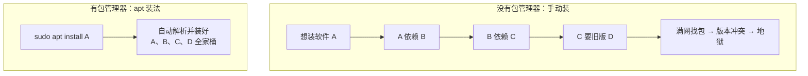

# 第 5 章 · 软件包管理

> 📍 位置：阶段 1 · 基础篇 · 第 5 章 ｜ ⏱ 预计用时：30-45 分钟 ｜ 难度：★★☆☆☆
>
> ⬅️ 上一章：[04-压缩与归档](04-压缩与归档.md) ｜ ➡️ 下一章：[06-进程管理](06-进程管理.md)

在 Windows 上装软件，通常是"下载安装包 → 下一步下一步"；在 Linux 上，你只需一条 `apt install`。这背后是一整套**软件包管理（Package Management）**体系：软件从哪来、依赖谁来解决、如何卸载干净。本章以 Ubuntu/Debian 的 `apt` 为主角，兼顾 Fedora 与 Arch 的对照。

## 🎯 学习目标

学完本章，你应该能够：

- 说清包管理器到底解决了什么问题（依赖地狱）；
- 走通 `apt` 全流程：`update` → `install` → `search`/`show` → `remove`/`autoremove`；
- 用一张表对照 `dnf`（Fedora）与 `pacman`（Arch）的常用操作；
- 会用 `dpkg -i` / `rpm -ivh` 手动装包，并知道遇到依赖缺失怎么办；
- 一句话说清 **PPA** 是什么、风险在哪；
- 把系统源换成国内镜像（以清华源为例）。

## 🧠 核心概念



[在学习站暂停、单步或重播](https://zhuguang-zfg.github.io/linux/#animation=apt-flow.svg)。动画中的输入输出为教学示意，需用本章实验验证。



[在学习站暂停、单步或重播](https://zhuguang-zfg.github.io/linux/#animation=apt-deps.svg)。动画中的输入输出为教学示意，需用本章实验验证。

### 包管理器解决什么问题

一个 Linux 软件很少孤立存在：A 依赖 B，B 依赖 C，C 又要求特定版本的 D……这就是著名的**依赖地狱（Dependency Hell）**。包管理器的本事是：维护一个官方仓库（repository，软件仓库），自动解析并安装全部依赖，还能统一升级、干净卸载。



`apt update` 刷新的"货架目录"，就是镜像站上的索引文件，下载后存放在 `/var/lib/apt/lists/`。目录越新鲜，搜索和依赖解析就越准确——所以"装东西前先 `apt update`"要养成肌肉记忆。

### 三大派系一张表

| 派系 | 发行版 | 包格式 | 包管理器 |
|---|---|---|---|
| Debian 系 | Ubuntu、Debian | `.deb` | `apt`（底层 `dpkg`） |
| Red Hat 系 | Fedora、RHEL | `.rpm` | `dnf`（底层 `rpm`） |
| Arch 系 | Arch、Manjaro | `.pkg.tar.zst` | `pacman` |

本书主线是 Debian 系（Ubuntu 22.04 / Debian 12），另两派在实操一节给对照表。

### PPA 是什么

**PPA**（Personal Package Archive，个人软件包档案）是 Ubuntu 官方仓库之外的第三方仓库，托管在 Launchpad 上，用 `sudo add-apt-repository ppa:作者名/软件名` 添加。好处是能装到官方仓库没有或更新版本的软件；代价是**这些包不经 Ubuntu 审查**，第三方说更新就更新——加之前先想想"我信不信这个作者"。

实际加一个 PPA 的完整动作长这样：

```bash
sudo apt install software-properties-common   # 提供 add-apt-repository 命令
sudo add-apt-repository ppa:作者名/ppa名      # 加入源列表
sudo apt update                               # 刷新目录
sudo apt install 软件名
```

后悔了就删源：`sudo add-apt-repository --remove ppa:作者名/ppa名`。

## 🛠 命令实操

### apt 全流程（Ubuntu 22.04 / Debian 12）

```bash
# 1) 更新本地"货架目录"（不升级软件本身！）
sudo apt update

# 2) 把已装软件升到最新
sudo apt upgrade

# 3) 安装软件
sudo apt install tree

# 4) 搜索软件（不需要 sudo）
apt search archive

# 5) 查看软件详情（版本、大小、依赖、维护者）
apt show tree

# 6) 列出已安装的包（管道 grep 在下一阶段细讲）
apt list --installed | grep tree

# 7) 卸载 + 清理不再被依赖的包
sudo apt remove tree
sudo apt autoremove
```

```text
$ sudo apt update
Hit:1 https://mirrors.tuna.tsinghua.edu.cn/ubuntu jammy InRelease
Reading package lists... Done
Building dependency tree... Done
All packages are up to date.
```

```text
$ apt show tree
Package: tree
Version: 2.0.2-1
Priority: optional
Description: displays an indented directory tree, in color
```

> 📝 `apt update` 只是刷新"目录"，`apt upgrade` 才真正升级——很多教程出错的根源就是混了这两步。另外日常用 `apt` 即可，`apt-get` 是更老的底层接口。

顺手记三个辅助命令：

```bash
apt list --upgradable   # 看哪些软件等着升级
sudo apt clean          # 清空本地下载的 .deb 缓存
sudo apt autoclean      # 只清掉已经"过期"的旧版本缓存
```

```text
$ apt list --upgradable
Listing... Done
openssl/jammy-updates 3.0.2-0ubuntu1.15 amd64 [upgradable from: 3.0.2-0ubuntu1.12]
...
```

版本号如 `1.18.0-6ubuntu14`：前半 `1.18.0` 是上游软件版本，后半 `-6ubuntu14` 是发行版的打包修订号。看到"版本变了但前面没变"，多半是打了安全补丁。

### dnf / pacman 对照表

在 Fedora 或 Arch 的机器上，把下面的左列换成对应命令即可：

| 操作 | apt（Debian 系） | dnf（Fedora/RHEL） | pacman（Arch） |
|---|---|---|---|
| 刷新软件目录 | `sudo apt update` | `sudo dnf check-update` | 与完整升级一起执行 `sudo pacman -Syu` |
| 升级全部软件 | `sudo apt upgrade` | `sudo dnf upgrade` | `sudo pacman -Syu` |
| 安装 | `sudo apt install 包名` | `sudo dnf install 包名` | `sudo pacman -Syu 包名`（先完整升级） |
| 卸载 | `sudo apt remove 包名` | `sudo dnf remove 包名` | `sudo pacman -Rns 包名` |
| 搜索 | `apt search 关键词` | `dnf search 关键词` | `pacman -Ss 关键词` |
| 查看详情 | `apt show 包名` | `dnf info 包名` | `pacman -Si 包名` |

Arch 不支持部分升级：单独刷新仓库再安装少量新包，可能使系统库和应用版本失配。不要把 apt 的分步习惯原样套给 pacman；先阅读 [Arch 系统维护说明](https://wiki.archlinux.org/title/System_maintenance#Partial_upgrades_are_unsupported)。`dnf check-update` 有更新时可能返回 100，不应一概当成执行失败。

### 手动安装 .deb / .rpm

从官网下载到安装包时才需要这一步：

```bash
# Debian 系
sudo dpkg -i app.deb          # 安装本地 .deb
sudo apt -f install           # 若报"依赖不满足"，用它自动补依赖
sudo apt install ./app.deb    # 更推荐：一步到位自动解析依赖

# Red Hat 系（Fedora/RHEL）
sudo rpm -ivh app.rpm         # i 安装，v 显示过程，h 显示进度
sudo dnf install ./app.rpm    # 更推荐，自动处理依赖
```

`dpkg -i` 和 `rpm -ivh` 的共同短板是**不会自动下载依赖**，缺了就报错退出；所以"先试包管理器、手动安装是兜底"。

`dpkg` 还有两个好用的查询姿势：包里装了哪些文件、某文件属于哪个包。

```text
$ dpkg -L tree          # 列出 tree 包安装到系统的所有文件
/usr/bin/tree
/usr/share/man/man1/tree.1.gz
$ dpkg -S /usr/bin/tree # 反查：这个文件属于哪个包
tree: /usr/bin/tree
```

### 换国内源（以清华源为例）

官方源服务器在国外，国内访问慢。换镜像（mirror）就是改一份"仓库地址清单"——`/etc/apt/sources.list`。

```bash
sudo cp /etc/apt/sources.list /etc/apt/sources.list.bak   # 先备份！
sudo vim /etc/apt/sources.list
```

Ubuntu 22.04（代号 jammy）替换为清华源内容：

```text
deb https://mirrors.tuna.tsinghua.edu.cn/ubuntu/ jammy main restricted universe multiverse
deb https://mirrors.tuna.tsinghua.edu.cn/ubuntu/ jammy-updates main restricted universe multiverse
deb https://mirrors.tuna.tsinghua.edu.cn/ubuntu/ jammy-backports main restricted universe multiverse
deb https://mirrors.tuna.tsinghua.edu.cn/ubuntu/ jammy-security main restricted universe multiverse
```

保存后必须刷新目录才生效：

```bash
sudo apt update
```

输出里的 URL 变成 `mirrors.tuna.tsinghua.edu.cn`，说明新源已经生效。

> 💡 发行版注记：Debian 12 的行以 `deb https://mirrors.tuna.tsinghua.edu.cn/debian/ bookworm ...` 开头，安全更新仓库为 `bookworm-security`；各发行版官方镜像站都提供现成的配置生成器，照抄即可。

## 💡 避坑指南

1. **装包前先 `apt update`**：软件目录过期会导致"明明有却装不到"，或装到很旧的版本。
2. **改源先备份**：`sources.list` 写错一行，`apt update` 立刻罢工；有 `.bak` 才能秒回滚。
3. **别混用第三方源与官方源装同一个软件**：同一软件多来源会互相覆盖、依赖错乱，出问题极难排查。
4. **PPA 只加必要的**：每个 PPA 都是一条长期生效的"进货渠道"，来源不明等于在系统里开后门。
5. **看到教程里的 `apt install` 先看发行版**：Fedora/Arch 机器上敲 `apt` 只会收获 `command not found`，翻回上面对照表即可。
6. **报"无法获得锁 /var/lib/dpkg/lock"**：多半是另一个 apt 正在跑（或自动更新在后台）。等它结束，或用 `ps aux | grep apt` 确认没有残留进程再试；新手不要直接删锁文件。
7. **`autoremove` 先看清单再回车**：执行前它会列出"打算删除"的包，扫一眼没有自己在意的软件再确认。

## ✍️ 动手实验

### 实验 1：完整走一遍 apt 生命周期

安装经典小彩蛋 `sl`（会开出一辆火车），运行它，然后干净地卸载并回收依赖。

<details><summary>💡 参考解法（先自己试！）</summary>

```bash
sudo apt update
apt search sl | head -n 5        # 先看看货架
sudo apt install sl
sl                               # 一辆火车开过去
apt show sl                      # 看看它的档案
sudo apt remove sl
sudo apt autoremove              # 清理不再被依赖的包
```

`apt search` 输出较长，用 `| head -n 5` 只看前 5 行——管道是下一阶段的主角，先抄用即可。
</details>

### 实验 2：盘点你的系统

数一数系统里装了多少个包，并确认 `tree` 是否在册。

<details><summary>💡 参考解法（先自己试！）</summary>

```bash
apt list --installed | wc -l          # 总数（含若干说明行）
apt list --installed | grep ^tree/    # 精确查 tree
```

```text
2137
tree/jammy,now 2.0.2-1 amd64 [installed]
```

两千多个包正是包管理器替你打理的"家底"，这条命令在排查"某个命令属于哪个包"时也常用。
</details>

## 📺 推荐视频

- [B站 · APT 原理](https://www.bilibili.com/video/BV1Sv411r7vd/?p=112) — 韩顺平，P112，9分45秒。软件源与更新实例；不要直接套用其他发行版的源结构。
- [B站 · APT 更新源与实例](https://www.bilibili.com/video/BV1Sv411r7vd/?p=113) — 韩顺平，P113，12分28秒。软件源与更新实例；不要直接套用其他发行版的源结构。
- [B站 · apt 软件包管理实操](https://www.bilibili.com/video/BV1At41137xm/?p=76) — Java基基，P76，35分1秒。软件源与更新实例；不要直接套用其他发行版的源结构。

[](https://www.bilibili.com/video/BV1Sv411r7vd/?p=112)

[在学习站查看配套媒体](https://zhuguang-zfg.github.io/linux/#read=docs%2F01-basics%2F05-%E8%BD%AF%E4%BB%B6%E5%8C%85%E7%AE%A1%E7%90%86.md) · [视频资料与核验说明](../../resources/videos.md)。标题、作者和分P已核对，未逐条完成实播，播放限制以原站为准。

## ✅ 自测清单

- [ ] 我能用"依赖地狱"一句话解释包管理器存在的意义
- [ ] 我分得清 `apt update` 和 `apt upgrade` 各干什么
- [ ] 我知道 `apt remove` 与 `apt autoremove` 的配合
- [ ] 我能说出 `.deb`、`.rpm`、`pacman` 分别属于哪一派
- [ ] 我知道 `dpkg -i` 缺依赖时该怎么办
- [ ] 我能一句话说清 PPA 是什么、风险在哪
- [ ] 我改过 sources.list，并且改前做了备份

## 🔗 延伸阅读

- [man7.org · Linux man-pages](https://man7.org/linux/man-pages/)：`dpkg(1)`、`rpm(8)` 的手册
- [Arch Wiki · Pacman](https://wiki.archlinux.org/title/Pacman)：pacman 用法的权威整理
- [tldr.sh](https://tldr.sh)：`tldr apt` / `tldr dnf` / `tldr pacman` 速查例子
- [鸟哥的 Linux 私房菜](https://linux.vbird.org)：软件安装：RPM 与 dpkg 机制讲解
- 📝 巩固练习：[01-基础篇练习](../../exercises/01-基础篇练习.md)
