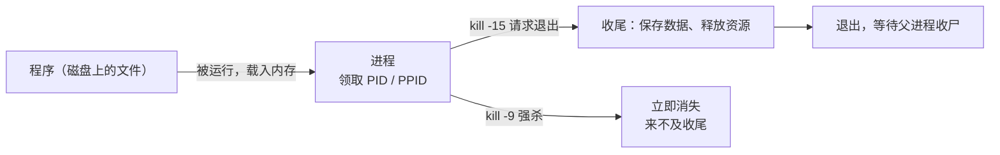
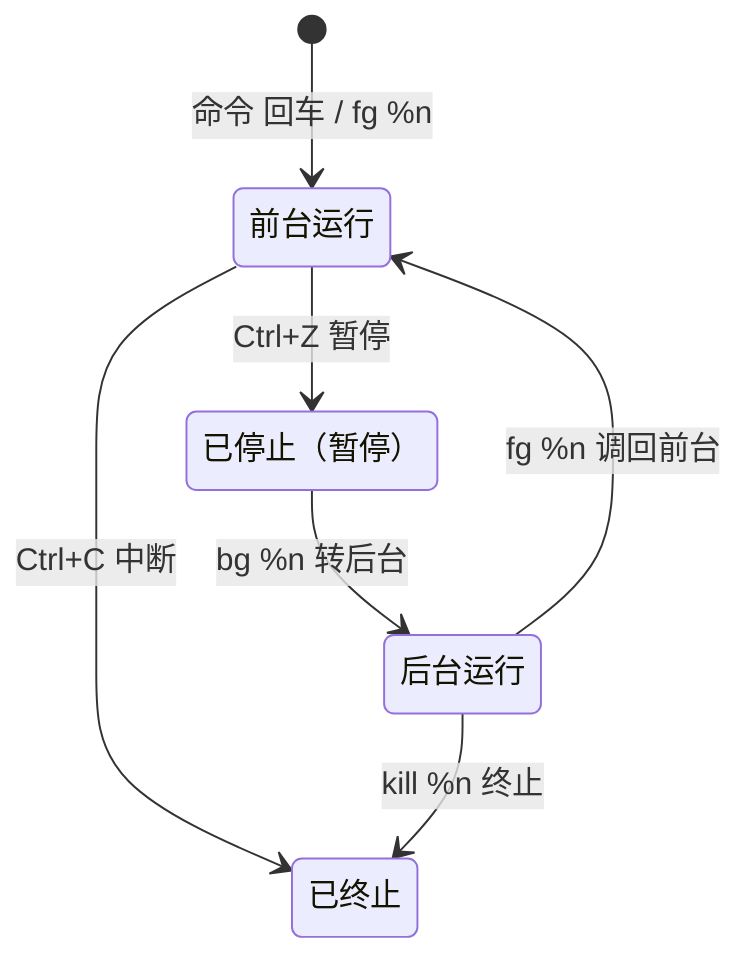

# 第 6 章 · 进程管理

> 📍 位置：阶段 1 · 基础篇 · 第 6 章 ｜ ⏱ 预计用时：30-45 分钟 ｜ 难度：★★★☆☆
>
> ⬅️ 上一章：[05-软件包管理](05-软件包管理.md) ｜ ➡️ 下一章：[07-环境变量与PATH](07-环境变量与PATH.md)

程序躺在磁盘上是死代码，跑起来才是活进程（Process）。服务器上"谁在偷吃 CPU""这个卡死的程序怎么退"" SSH 断了任务会不会没"，答案全在进程管理。本章带你读 `ps` 与 `top`，玩转 `kill` 与前后台任务。

## 🎯 学习目标

学完本章，你应该能够：

- 区分**程序（Program）**与**进程（Process）**，说出 PID 与 PPID 的含义；
- 读懂 `ps aux` 与 `ps -ef` 的输出，找到目标进程；
- 逐行读懂 `top` 首屏，重点掌握 load average、`%CPU`、`RES`；
- 会用 `kill` 发送 HUP/INT/KILL/TERM 信号，并知道它们强弱次序；
- 玩转 `jobs`/`fg`/`bg`/`&`，说清 `nohup` 与 `Ctrl+C` 的区别；
- 知道僵尸进程（zombie）是什么、为什么杀不死。

## 🧠 核心概念

### 程序 vs 进程

- **程序**：躺在磁盘上的可执行文件（`/usr/bin/python3`），静态的；
- **进程**：程序被运行后载入内存的动态实例——一个程序可以同时跑出多个进程（开三个终端跑三个 `python3`）。

每个进程启动时都会领到一个**进程号 PID**（Process ID），而它由谁生下来，就记在 **PPID**（Parent PID，父进程号）里。Linux 的所有进程都源自 PID 1（通常是 `systemd`），像一棵家族树。

进程的一生：创建 → 就绪/运行 → 等待资源 → 终止 → 被父进程"收尸"。看动画更直观：




### 僵尸进程：一段话讲明白

子进程退出后会留下一个"遗体"等父进程调用 `wait` 收尸；父进程一直不收，它就变成**僵尸进程（Zombie）**——`ps` 里状态为 `Z`。僵尸不占 CPU 和内存，但占着一个 PID；它已经死了，所以 `kill -9` 也杀不动，正确的解法是找它的**父进程**（`ps -ef` 查 PPID）解决问题，或重启父进程。偶尔出现一两个无伤大雅，长期堆积说明有程序写坏了。

## 🛠 命令实操

概念就位，开始上手：先拍快照，再读仪表盘，最后学发信号。

### ps：进程快照

`ps`（process status）给系统里的进程"拍张照"。最常用的两种拍法：

```text
$ ps aux | head -n 4
USER         PID %CPU %MEM    VSZ   RSS TTY      STAT START   TIME COMMAND
root           1  0.0  0.1 167312 11552 ?       Ss   09:00   0:02 /sbin/init splash
root           2  0.0  0.0      0     0 ?       S    09:00   0:00 [kthreadd]
alice       1234  0.5  3.1 512340 128760 pts/0 Sl  10:12   0:05 python3 app.py
```

`aux` 风格的常用列：`%CPU` 占用 CPU 百分比、`%MEM` 占内存百分比、`RSS` 常驻内存（KB）、`STAT` 状态（`R` 运行、`S` 睡眠、`Z` 僵尸）、`COMMAND` 命令名。

```text
$ ps -ef | head -n 3
UID          PID    PPID  C STIME TTY          TIME CMD
root           1       0  0 09:00 ?        00:00:02 /sbin/init splash
alice       1234    1180  0 10:12 pts/0    00:00:05 python3 app.py
```

`-ef` 风格重点看 `PPID` 列（父子关系）和 `STIME`（启动时间）。两种拍法没有优劣，顺手用哪个都行；找特定进程配合 `grep`：

```bash
ps aux | grep python3
```

想直观看到"家族树"，用 `pstree`：

```text
$ pstree | head -n 3
systemd─┬─ModemManager───{ModemManager}
        ├─NetworkManager─┬─{gmain}
        │                └─{NetworkManager}
```

翻到树梢你会找到 `bash───pstree`——最后一层就是你正在敲的这个命令，父节点就是你的 Shell。

### top：动态仪表盘

`top` 每 3 秒刷新一次，按 `q` 退出。首屏长这样：

```text
top - 10:30:01 up  1:30,  1 user,  load average: 0.52, 0.58, 0.59
Tasks: 245 total,   1 running, 244 sleeping,   0 stopped,   0 zombie
%Cpu(s):  6.2 us,  2.1 sy,  0.0 ni, 91.2 id,  0.3 wa,  0.0 hi,  0.2 si,  0.0 st
MiB Mem :   3925.0 total,   1200.5 free,   1500.2 used,   1224.3 buff/cache
MiB Swap:   2048.0 total,   2048.0 free,      0.0 used.   2130.4 avail Mem

    PID USER      PR  NI    VIRT    RES    SHR S  %CPU  %MEM     TIME+ COMMAND
   1234 alice     20   0 1023456 256320  38220 S  12.5   6.4   1:23.45 firefox
```

**前三行是全系统的账**：

- 第 1 行 `load average: 0.52, 0.58, 0.59`：**过去 1 / 5 / 15 分钟的平均负载**（平均有多少任务在跑或在等 CPU）。经验判断：数值长期高于 CPU 核数，说明机器超载；

用 `nproc` 查核数、`uptime` 看负载，与 top 首行同源：

```text
$ uptime
 10:30:01 up  1:30,  1 user,  load average: 0.52, 0.58, 0.59
$ nproc
4
```
- 第 2 行 Tasks 总数与各状态数——`0 zombie` 就是在数僵尸；
- 第 3 行 `%Cpu(s)`：`us` 用户空间、`sy` 内核、`id` 空闲（idle）、`wa` 等 IO。

**进程表格里最该看的三列**：

- `%CPU`：该进程占用的 CPU 百分比，多核机器上可超过 100%；
- `RES`（Resident）：进程**实际占用的物理内存**；旁边的 `VIRT` 是虚拟地址空间，大得吓人却没都真用，看内存占用认准 `RES`；
- `TIME+`：累计吃掉的 CPU 时间。

top 里还能直接操作，常用按键：

| 按键 | 作用 |
|---|---|
| `P` / `M` | 按 CPU / 按内存排序 |
| `k` | 输入 PID 发信号（默认 TERM） |
| `1` | 展开 / 收起每个 CPU 核心 |
| `h` | 帮助 |
| `q` | 退出 |

> 🎓 进阶推荐 `htop`：彩色界面、鼠标可点、方向键选进程，`sudo apt install htop` 装上就回不去。

### kill 与信号：温和劝退 vs 武力清场

`kill` 不是"杀"，是"发信号（Signal）"。四个必会信号：

| 信号 | 名称 | 编号 | 常见触发 | 含义 |
|---|---|---|---|---|
| SIGHUP | HUP | 1 | 终端断开 | 挂起；许多服务把它当"重读配置" |
| SIGINT | INT | 2 | `Ctrl+C` | 中断前台进程，可被捕获 |
| SIGTERM | TERM | 15 | `kill` 默认 | 请求优雅退出：收拾好东西再走 |
| SIGKILL | KILL | 9 | `kill -9` | 强制处决，不可捕获、不可忽略 |

```bash
kill 1234          # 默认发 SIGTERM(15)，先讲道理
kill -9 1234       # 讲不通再动武
kill -l            # 列出全部信号
kill -HUP 1234     # 让支持的服务重读配置
```

**正确次序：先 `TERM`，等几秒无效再 `KILL`**——`-9` 不给进程保存数据的机会，数据库被 `-9` 可能损坏。

批量动手时用名字点名：

```bash
killall firefox    # 按进程名杀（同名全杀）
pkill python3      # 按模式匹配杀，比 killall 更灵活
```

### 前后台：& 、jobs、fg、bg、nohup

```bash
sleep 600 &        # 行尾 & ：直接丢到后台跑
jobs               # 看当前 Shell 的后台任务清单
fg %1              # 把 1 号任务调回前台
sleep 600 &        # 再次后台
Ctrl+Z             # 前台暂停（不退出）
bg %1              # 让暂停的任务转后台继续跑
```

```text
$ sleep 600 &
[1] 2345
$ jobs
[1]+  运行中              sleep 600 &
```

任务在四个状态间流转，一张状态图看明白：



**`nohup` 与 `Ctrl+C` 的区别**：`Ctrl+C` 发送 SIGINT，前台进程立刻中断；而 `nohup 命令 &` 让进程免疫挂断信号（SIGHUP）并丢到后台——终端关掉、SSH 断开，它照跑不误：

```bash
nohup python3 -m http.server 8000 &    # 断开 SSH 也在服务
ps aux | grep http.server              # 换个终端还能找到它
```

不加 `nohup` 的后台任务，在所属终端关闭时会被 SIGHUP 连坐。输出默认写进当前目录的 `nohup.out`。

> 📝 相关小招：对已经忘加 `nohup` 的后台任务，`disown %1` 也能把它从当前 Shell 的"家属名单"里除名，终端关闭时不再连坐。

## 💡 避坑指南

1. **别把 `kill -9` 当第一反应**：先 `-15`（默认）给进程收尾机会，实在不听话再动武。
2. **`killall`、`pkill` 慎对系统进程**：`pkill ssh` 可能把你自己踢下线；动手前先 `ps aux | grep` 确认真凶。
3. **`Ctrl+C` ≠ `Ctrl+Z`**：前者是终止（SIGINT），后者只是暂停挂起；暂停后要 `bg` 恢复或 `fg` 回前台，别把暂停当成已退出。
4. **看内存认 `RES`，别被 `VIRT` 吓到**：VIRT 包含映射但未使用的地址空间，报警看 RES 与 `%MEM`。
5. **load average 要对比核数**：4 核机器 load 到 3.8 属于满负荷边缘，8 核机器同样数值只算一半压力；用 `nproc` 查核数。
6. **`ps aux | grep xxx` 会抓到自己**：grep 进程的命令行里也含 "xxx"，所以总会多出一行干扰判断。用 `pgrep -l xxx` 代替，或写成 `grep "[x]xx"` 规避。
7. **负载高 ≠ CPU 高**：`%Cpu(s)` 里 `wa`（等 IO）偏大说明瓶颈在磁盘；load 里也包含不可中断的 IO 等待，别一见数字高就砍进程，先看 CPU 拆解行。

## ✍️ 动手实验

### 实验 1：前后台任务全流程

用 `sleep` 完成一次"后台 → 前台 → 暂停 → 转后台 → 温柔终止"的闭环。

<details><summary>💡 参考解法（先自己试！）</summary>

```bash
sleep 600 &          # 丢后台
jobs                 # [1]+ 运行中 sleep 600 &
fg %1                # 调回前台，光标卡住（正常，它在睡）
Ctrl+Z               # 暂停
jobs                 # [1]+ 已停止 sleep 600
bg %1                # 转后台继续睡
kill %1              # 按"任务号"发 SIGTERM，温柔终止
jobs                 # [1]+ 已终止 sleep 600
```

`kill %1` 的 `%1` 是 job 编号，等价于先查 PID 再 `kill PID`——这是本章最容易惊艳到初学者的一招。
</details>

### 实验 2：现场"破案"一次

找出系统里当前最吃 CPU 的进程，查出它的 PID 和 PPID，再温柔地终止你自己的一个练习进程（不要动别人的进程）。

<details><summary>💡 参考解法（先自己试！）</summary>

```bash
top                  # 按 P 观察 CPU 排序，按 q 退出
ps -ef | grep sleep  # 找到实验 1 剩余的 sleep（若无就再起一个）
```

```text
alice       3456    2380  0 11:02 pts/0    00:00:00 sleep 600
```

第二列 3456 是 PID，第三列 2380 是父进程（你的 Shell）。测试收尾：

```bash
kill 3456            # SIGTERM 温柔劝退
ps -ef | grep sleep  # 再看，已经没了
```

> ⚠️ `kill` 只对你自己的进程动手，root 进程没有 sudo 权限杀不动——这本身就是第 3 章权限的现场复习。
</details>

## 📺 推荐视频

> 本模块未为本章指定嵌入视频。建议回看第 3 章推荐的 freeCodeCamp《Linux Operating System - Crash Course for Beginners》（[03-用户与权限](03-用户与权限.md)），其中进程与信号部分覆盖本章；也可在 B 站搜索关键词「Linux 进程管理 top kill 教程」跟练。

## ✅ 自测清单

- [ ] 我能说清程序与进程的区别，并举一个"一程序多进程"的例子
- [ ] 我知道 PID 和 PPID 各是什么，能用 `ps -ef` 看出父子关系
- [ ] 我能解释 load average 三个数字的含义，并与 CPU 核数比较
- [ ] 我知道看内存占用该看 `RES` 而不是 `VIRT`
- [ ] 我能按 TERM → KILL 的次序终止进程，并说出为什么
- [ ] 我会用 `&`、`jobs`、`fg`、`bg`、`Ctrl+Z` 管理后台任务
- [ ] 我能说清 `nohup` 防的是什么信号、`Ctrl+C` 发的是什么信号
- [ ] 我知道僵尸进程杀不死，问题要出在父进程身上

## 🔗 延伸阅读

- [man7.org · Linux man-pages](https://man7.org/linux/man-pages/)：`ps(1)`、`top(1)`、`signal(7)`
- [The Linux Documentation Project](https://tldp.org)：Process Management 相关文档
- [Arch Wiki · signal](https://wiki.archlinux.org/title/Signal)：信号机制的速查整理
- [tldr.sh](https://tldr.sh)：`tldr ps`、`tldr kill`、`tldr nohup` 现成例子
- 📝 巩固练习：[01-基础篇练习](../../exercises/01-基础篇练习.md)
