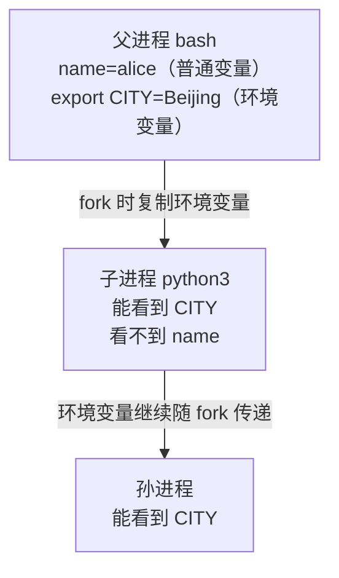
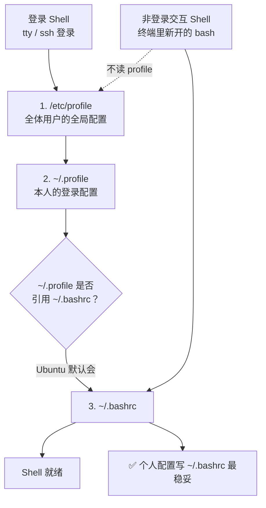

# 第 7 章 · 环境变量与 PATH

> 📍 位置：阶段 1 · 基础篇 · 第 7 章 ｜ ⏱ 预计用时：30-45 分钟 ｜ 难度：★★☆☆☆
>
> ⬅️ 上一章：[06-进程管理](06-进程管理.md) ｜ ➡️ 下一章：[08-高效求助-man与tldr](08-高效求助-man与tldr.md)

为什么敲 `ls` 不用写全路径 `/usr/bin/ls`？为什么你自己编译的程序要写 `./app` 才能跑？为什么"这个命令我的电脑上明明装了，却说 command not found"？答案都藏在**环境变量（Environment Variable）**，尤其是 `PATH`。本章解开这团迷雾，并教你把配置"永久生效"。

## 🎯 学习目标

学完本章，你应该能够：

- 说清什么是环境变量，用 `printenv`、`echo $HOME` 查看它们；
- 分清**普通变量**与**环境变量**，用 `export` 把变量"传给子进程"；
- 解释 `PATH` 的查找顺序，按"三步法"排查 `command not found`；
- 画出 `/etc/profile` → `~/.profile` → `~/.bashrc` 的加载顺序，知道配置该写进哪个文件；
- 用 `alias` 定义自己的命令缩写，用 `set -x` 做最简单的调试。

## 🧠 核心概念



[在学习站暂停、单步或重播](https://zhuguang-zfg.github.io/linux/#animation=env-scope.svg)。动画中的输入输出为教学示意，需用本章实验验证。



[在学习站暂停、单步或重播](https://zhuguang-zfg.github.io/linux/#animation=path-lookup.svg)。动画中的输入输出为教学示意，需用本章实验验证。

### 什么是环境变量

环境变量是一组**键值对**（如 `HOME=/home/alice`），描述进程所处的"环境"。它最重要的特性是**可继承**：进程诞生的子进程会拿到一份环境变量的拷贝。Shell 靠 `PATH` 找命令，程序靠 `LANG` 知道语言，靠 `HOME` 知道你家在哪。

查看的两种方式：

```text
$ printenv HOME
/home/alice
$ echo $HOME
/home/alice
```

`printenv`（不带参数）能倒出全部环境变量；`echo $变量名` 更随手，也是脚本里最常用的读法。`env` 与不带参数的 `printenv` 等效，还能"临场改环境再执行"，如 `env LANG=C ls` 用英文环境跑一次 `ls`。

几个出场率最高的环境变量，先混个脸熟：

| 变量 | 示例值 | 含义 |
|---|---|---|
| `HOME` | /home/alice | 家目录 |
| `PATH` | /usr/local/bin:... | 命令查找目录清单 |
| `USER` | alice | 当前用户名 |
| `SHELL` | /bin/bash | 当前 Shell |
| `LANG` | zh_CN.UTF-8 | 语言与编码 |
| `EDITOR` | vim | 默认编辑器 |
| `PS1` | \u@\h:\w$ | 命令提示符样式 |

### export：普通变量 vs 环境变量

在 Shell 里直接赋值只是**普通变量（Shell Variable）**，只属于当前 Shell；加上 `export` 才会"升舱"为**环境变量**，被子进程继承：

```text
$ name="alice"          # 普通变量
$ export CITY="Beijing" # 环境变量
$ bash -c 'echo $name'  # 开一个子进程查看

$ bash -c 'echo $CITY'
Beijing
```

子进程看得到 `CITY`，看不到 `name`。继承关系像这样：



> 📝 一句话：**export 决定"要不要传给孩子"**，且传的是拷贝——子进程里改环境变量不影响父进程。

### PATH：命令的"查找目录清单"

`PATH` 是一串用冒号分隔的目录，Shell 按顺序**从左到右**逐个目录找同名可执行文件，**找到第一个就用它**：

```text
$ echo $PATH
/usr/local/sbin:/usr/local/bin:/usr/sbin:/usr/bin:/sbin:/bin
$ which ls
/usr/bin/ls
```

这解释了三件事：敲 `ls` 不用写全路径；同名命令"谁在前面谁赢"；当前目录 `.` 默认不在 `PATH` 里——这是**安全设计**，所以自己的脚本要写 `./script.sh`。

### command not found 三步排查法

1. **拼错了吗？**：用 Tab 补全，别手打；
2. **装了吗？**：`which 命令名` 找不到，多半没装——`apt search` 确认并安装（见第 5 章）；
3. **在 PATH 里吗？**：命令装了但 `which` 仍找不到，用 `echo $PATH` 看它所在目录是否在清单中；不在就补进去，或用全路径执行。

### 配置文件加载顺序：写对地方才"永久生效"

临时 `export` 一重启就没了。想永久生效，要写进启动配置文件，而 Shell 分两种启动方式：



Ubuntu 的默认习惯：**个人变量与 alias 写进 `~/.bashrc`**；改完用 `source ~/.bashrc` 立刻生效（否则要重开终端）。`source` 的意思是"在当前 Shell 里执行这个文件"，正因为不新开进程，配置才会落到当前会话。

> 🎓 判断当前是不是"登录 Shell"：敲 `echo $0`，开头带 `-`（如 `-bash`）就是登录 Shell。

> 📝 系统管理员常把全局变量脚本放进 `/etc/profile.d/*.sh`——`/etc/profile` 会自动加载该目录，比直接改 `/etc/profile` 更干净。

### alias：给长命令起小名

```text
$ alias ll='ls -alF'
$ ll
total 48
drwxr-xr-x 5 alice alice 4096 Oct  6 12:00 .
...
$ unalias ll      # 不想要了就取消
```

`ls -l` 能看到 `ll` 之类的别名多半就来自 `~/.bashrc` 里的内置定义。想永久保留，把 `alias` 行写进 `~/.bashrc` 即可。想临时"绕过"别名用原版命令，在前面加反斜杠：`\ls`。

### set -x：调试的一句话武器

脚本"跑得不对劲"时，`bash -x 脚本.sh` 或在脚本里写 `set -x`，Shell 会打印每条命令展开后的样子；`set +x` 关闭。环境变量疑难杂症时，用它看清"变量到底变成了什么"。

## 🛠 命令实操

### 把目录加进 PATH

```bash
mkdir -p ~/bin
cp mytool ~/bin/                       # 假设你有一个自己的脚本 mytool
export PATH="$PATH:$HOME/bin"          # 追加，而不是覆盖！
which mytool                           # /home/alice/bin/mytool
```

要永久生效，把 `export PATH="$PATH:$HOME/bin"` 这行写进 `~/.bashrc`：

```bash
echo 'export PATH="$PATH:$HOME/bin"' >> ~/.bashrc   # >> 是追加
source ~/.bashrc
```

> 💡 发行版注记：`~/.bashrc` 属于 bash；若你换用 zsh，对应文件是 `~/.zshrc`，规则同理。

### 写一条自己的环境变量

```bash
export EDITOR=vim          # 告诉 git 等工具：默认编辑器用 vim
echo $EDITOR               # vim
printenv | grep EDITOR     # EDITOR=vim
```

变量名后面紧贴其他字符时，用花括号划清边界：

```text
$ echo "the file is $NAME.txt"    # Shell 会去找变量 NAME.txt（不存在）
$ echo "the file is ${NAME}.txt"  # 正确：先取 NAME 再拼上 .txt
```

### 给提示符换装（PS1 一例）

```bash
export PS1='\u@\h:\w\$ '   # 用户@主机:工作目录$
```

回车后提示符立刻变身；满意就写进 `~/.bashrc`。`\u`、`\h`、`\w` 分别是用户、主机名、当前路径的占位符。

### 三步法实战一次

```text
$ mytool
mytool: command not found
$ which mytool                 # 第 1 步：确认存在性
/home/alice/bin/mytool         # 文件在！那就是 PATH 的事
$ echo $PATH                   # 第 2 步：看清单，果然没有 ~/bin
/usr/local/sbin:/usr/local/bin:/usr/sbin:/usr/bin:/sbin:/bin
$ export PATH="$PATH:$HOME/bin"   # 第 3 步：补进去
$ mytool                       # 跑通了
```

### set -x 看一眼变量展开

```text
$ set -x
$ echo $HOME
+ echo /home/alice
/home/alice
$ set +x
```

带 `+` 的行是 Shell 的"内心独白"——变量已被展开成实际值。

## 💡 避坑指南

1. **追加 PATH 千万别丢 `$PATH`**：`PATH=/home/alice/bin` 是覆盖不是追加，等于把你踢出所有系统命令，`ls` 都会失明；永远写 `PATH=$PATH:新目录`。
2. **赋值号两边不要有空格**：`export CITY = "Beijing"` 会报错或把 `=` 当命令；正确是 `export CITY="Beijing"`。
3. **忘了 export**：变量在当前 Shell 里 `echo` 得出来，脚本里却是空——因为脚本运行在子进程里，记住"要传给孩子就 export"。
4. **`~/.bashrc` 改完不生效**：对已开着的终端，需要 `source ~/.bashrc`；对新终端才自动加载。
5. **别把密码写进 `~/.bashrc`**：配置文件常被截图、提交仓库，敏感信息用专用密钥管理工具，或至少放进不进版本库的文件。
6. **别名只是别名**：脚本里看不到你终端里的 alias（非交互 Shell 不加载 `~/.bashrc`），写脚本请用命令全名。
7. **`bash -c` 里要用单引号**：`bash -c 'echo $CITY'` 用单引号才能把"取值"推迟到子进程里做；写成双引号，变量在当前 Shell 就被展开，实验就白做了。

## ✍️ 动手实验

### 实验 1：亲眼看见"继承"这件事

制造一个普通变量和一个环境变量，分别到子进程里查岗，验证继承规则。

<details><summary>💡 参考解法（先自己试！）</summary>

```bash
name="alice"
export CITY="Beijing"
bash -c 'echo "name=$name"'      # name=          （没继承）
bash -c 'echo "CITY=$CITY"'      # CITY=Beijing   （继承了）
```

再把两行赋值写进 `~/.bashrc` 末尾，`source ~/.bashrc` 后重开终端，`printenv | grep CITY` 仍能看到——这就是"永久生效"。
</details>

### 实验 2：给自己造一个 `~/bin` 工具箱

建一个 `~/bin`，写一个两行的小脚本 `hello`，把它加进 PATH，然后做到"在任何目录敲 `hello` 都能跑"。

<details><summary>💡 参考解法（先自己试！）</summary>

```bash
mkdir -p ~/bin
printf '#!/bin/bash\necho hello, $USER\n' > ~/bin/hello
chmod +x ~/bin/hello                     # 加执行位（第 3 章的知识）
export PATH="$PATH:$HOME/bin"
cd /tmp && hello                         # /home/alice/bin/hello → hello, alice
echo 'export PATH="$PATH:$HOME/bin"' >> ~/.bashrc
source ~/.bashrc                         # 永久生效
```

注意缺了 `chmod +x` 会报 `Permission denied`——目录加 PATH 只解决"找得到"，能不能执行还要看权限位。
</details>

## 📺 推荐视频

- [B站 · Shell 环境变量](https://www.bilibili.com/video/BV1ZZ37zdEp2/?p=15) — Linux-老林，P15，37分31秒。观看对应主题后，回到本章用实际输入和输出验证。

[](https://www.bilibili.com/video/BV1ZZ37zdEp2/?p=15)

[在学习站查看配套媒体](https://zhuguang-zfg.github.io/linux/#read=docs%2F01-basics%2F07-%E7%8E%AF%E5%A2%83%E5%8F%98%E9%87%8F%E4%B8%8EPATH.md) · [视频资料与核验说明](../../resources/videos.md)。标题、作者和分P已核对，未逐条完成实播，播放限制以原站为准。

## ✅ 自测清单

- [ ] 我能用 `printenv` 和 `echo $HOME` 查看环境变量
- [ ] 我能说清普通变量与环境变量的区别，以及 `export` 做了什么
- [ ] 我能解释 PATH 的查找规则：冒号分隔、从左到右、先到先得
- [ ] 遇到 `command not found` 我有明确的排查三板斧
- [ ] 我知道个人配置该写进 `~/.bashrc`，改完要 `source`
- [ ] 我会定义 `alias` 并知道脚本里看不到别名
- [ ] 我追加 PATH 时永远带着 `$PATH:`，不会覆盖清单

## 🔗 延伸阅读

- [man7.org · Linux man-pages](https://man7.org/linux/man-pages/)：`bash(1)` 的 INVOCATION 一节讲透启动文件
- [The Linux Documentation Project](https://tldp.org)：Bash Prompt HOWTO 与变量入门
- [Arch Wiki · Environment variables](https://wiki.archlinux.org/title/Environment_variables)：跨 Shell 的全景梳理
- [tldr.sh](https://tldr.sh)：`tldr export`、`tldr alias` 现成例子
- 📝 巩固练习：[01-基础篇练习](../../exercises/01-基础篇练习.md)
