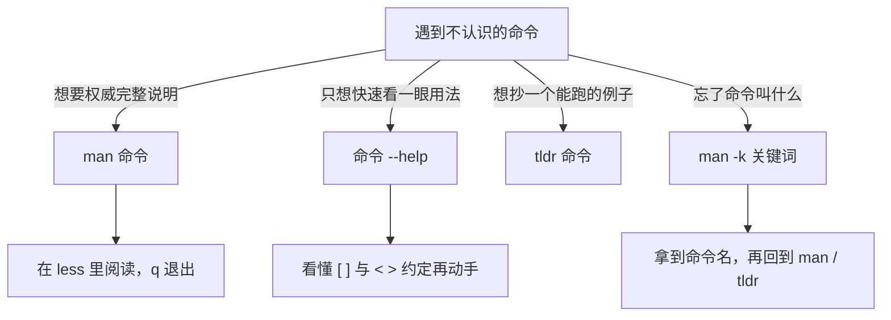

# 第 8 章 · 高效求助：man 与 tldr

> 📍 位置：阶段 1 · 基础篇 · 第 8 章 ｜ ⏱ 预计用时：30-45 分钟 ｜ 难度：★★☆☆☆
>
> ⬅️ 上一章：[07-环境变量与PATH](07-环境变量与PATH.md) ｜ ➡️ 下一章：[09-从实物认识Linux硬件](09-从实物认识Linux硬件.md)

没有人能背下 Linux 的几千条命令。真正拉开差距的，不是记忆量，而是**遇到不认识的命令时，你多久能自己搞明白**。Linux 把完整手册装进了系统（离线可查），本章教你打开这份手册：从"跟着教程走"到"没有教程也能走"，再去下一章把实物与命令对应起来。

## 🎯 学习目标

学完本章，你应该能够：

- 用 `man` 查任何命令的权威手册，知道 1 / 5 / 8 三个重点章节的含义；
- 熟练使用 man 页内导航键：翻页、搜索、退出；
- 用 `man -k`（即 `apropos`）按关键词"反查"命令；
- 分清 `--help`、`which`、`type` 各自回答什么问题；
- 安装并使用 `tldr`，三秒抄到能跑的例子；
- 看懂 `--help` 输出里 `[ ]`、`< >`、`|`、`...` 的约定；
- 开始维护自己的 cheatsheet（速查表）。

## 🧠 核心概念



[在学习站暂停、单步或重播](https://zhuguang-zfg.github.io/linux/#animation=help-path.svg)。动画中的输入输出为教学示意，需用本章实验验证。



[在学习站暂停、单步或重播](https://zhuguang-zfg.github.io/linux/#animation=man-help.svg)。动画中的输入输出为教学示意，需用本章实验验证。

### 为什么"会求助"是第一技能

Linux 的命令、参数多如牛毛，且不同发行版细节有差。靠背诵永远学不完；靠搜索引擎又良莠不齐。Linux 的哲学是：**手册随系统走（offline docs）**——`man` 是权威的"官方说明书"，`--help` 是"速览卡片"，`tldr` 是"网友抄的例题"。三者配合，90% 的问题不出终端就能解决。



### man 的分节：为什么 man 5 passwd 不是 passwd 命令

手册按内容分成 9 节（section），新手重点记三节：

| 节号 | 内容 | 例子 |
|---|---|---|
| 1 | 用户命令 | `man ls`、`man 1 passwd` |
| 5 | 文件格式与配置文件 | `man 5 passwd`（讲 /etc/passwd 文件格式） |
| 8 | 系统管理命令（多需 root） | `man 8 useradd` |

同名条目可能出现在多节——`passwd` 既是命令（第 1 节）又是配置文件（第 5 节）。不带节号默认给最小节号（第 1 节），想要第 5 节就明确写 `man 5 passwd`。

### --help 与 which / type：各答一个问题

| 工具 | 回答的问题 |
|---|---|
| `命令 --help` | "这条命令怎么用？"（速览参数） |
| `which 命令` | "这个命令的可执行文件在哪？" |
| `type 命令` | "这个名字到底是什么？"（别名？内建？还是外部命令） |

`type` 的价值在于**拆穿真相**：

```text
$ which ls
/usr/bin/ls
$ type ls
ls is aliased to `ls --color=auto'
$ type cd
cd is a shell builtin
```

原来你天天敲的 `ls` 其实带着 `--color=auto` 的别名；而 `cd` 根本不是磁盘上的程序，是 Shell 内建（builtin）命令——所以 `which cd` 找不到文件。

### tldr：too long; don't read

`man` 权威但啰嗦，几千字才到例子。`tldr`（社区项目，名字来自网络梗 too long; didn't read）反其道而行：**一页只放几个最常用的例子**，抄了就能跑。

## 🛠 命令实操

### man：打开与翻页

```bash
man ls          # 打开 ls 手册
man 5 passwd    # 指定第 5 节：看 /etc/passwd 文件格式
man -k password # 按关键词反查（等于 apropos password）
```

`man` 内部就是 `less`，导航键与第 2 章一致：

| 按键 | 作用 |
|---|---|
| `空格` / `b` | 下一页 / 上一页 |
| `/关键词` | 向下搜索，`n` 下一个、`N` 上一个 |
| `g` / `G` | 跳到开头 / 结尾 |
| `q` | 退出 |

```text
$ man -k password
chpasswd (8)         - update passwords in batch mode
passwd (1)           - change user password
passwd (5)           - the password file
...
```

（输出因系统而异。）看到合适的条目，再用 `man 5 passwd` 精读——这就是"反查 → 精读"两步走。

### --help：速览卡片与阅读约定

```text
$ mkdir --help | head -n 12
Usage: mkdir [OPTION]... DIRECTORY...
Create the DIRECTORY(ies), if they do not already exist.

  -m, --mode=MODE   set file mode (as in chmod), not a=rwx - umask
  -p, --parents     no error if existing, make parent directories as needed
  -v, --verbose     print a message for each created directory
...
```

读这卡片有四条"密码约定"，看懂就不会被吓到：

```text
[ ]    方括号 → 可选，可写可不写
< >    尖括号 → 必填占位符，替换成你的实际值
a|b    竖线   → 多选一（在表格里写作 a\|b）
...    省略号 → 可重复多个
```

对照 `Usage: mkdir [OPTION]... DIRECTORY...` 翻译成人话："可以带任意多个选项，最后必须给至少一个目录名"。

### 安装并使用 tldr

```bash
sudo apt install tldr     # Ubuntu/Debian（Python 客户端）
# 或者有 Node.js 环境的话：
npm install -g tldr
```

第一次使用会自动下载社区例库，之后：

```text
$ tldr tar
  tar
  Archiving utility.
  Often used with a compression method such as gzip or bzip2.

  - [c]reate an archive from [f]iles:
    tar cf target.tar file1 file2 file3

  - E[x]tract an archive into the current directory:
    tar xf source.tar

  - Create a gzipped archive and write it to a [f]ile:
    tar czf target.tar.gz file1 file2 file3
```

对比 `man tar` 的数百行，`tldr tar` 十行给答案——**先 tldr 抄例子，出问题再 man 精读**，是效率最高的组合。

### 开始攒你自己的 cheatsheet

从今天起，把每个"查了才明白"的命令记进自己的速查表。本项目已为你准备了一份底稿：[常用命令速查](../../cheatsheets/常用命令速查.md)。建议格式极简：

```markdown
## tar
- 打包压缩：tar czvf x.tar.gz dir/
- 解压到指定目录：tar xzvf x.tar.gz -C 目标
- 坑：f 必须贴着文件名
```

**自己抄写一遍 = 记住一半**，而且半年后翻自己整理的表，比翻任何教程都快。

## 💡 避坑指南

1. **`man` 里翻页键和 Vim 无关**：它是 `less`，按 `q` 退出；习惯性敲 `:q` 会在屏幕上留下一个冒号。
2. **搜 man 页认准节号**：`man passwd` 永远给你命令手册；想看 `/etc/passwd` 格式必须 `man 5 passwd`。
3. **`tldr` 是例子不是规范**：特殊参数、边界行为仍以 `man` 为准；两者是"例题与教材"的关系。
4. **网上命令先 `--help` 再粘贴**：复制来路不明的命令直接回车是灾难片开头，先看它的参数合不合理，必要时到 [explainshell.com](https://explainshell.com) 拆解。
5. **`type` 优于 `which`**：`which` 只找外部命令，对 alias 和内建命令无能为力；日常用 `type` 更全面。

## ✍️ 动手实验

### 实验 1：两步反查法

假设你忘了"哪个命令能改文件权限"，用 `man -k` 反查，再用 `man` 精读该命令的节号与 `SYNOPSIS`，最后对照第 3 章验证答案。

<details><summary>💡 参考解法（先自己试！）</summary>

```bash
man -k permission
```

```text
chmod (1)            - change file mode bits
...
```

```bash
man chmod            # 在 SYNOPSIS 里看到两种用法：
                     # chmod [OPTION]... OCTAL-MODE FILE...
                     # chmod [OPTION]... MODE[,MODE]... FILE...
/ugoa                # 在手册内搜索 ugoa，复习符号法
q
```

从"忘了命令名"到"看懂两种语法"，全程没离开终端——这就是本章想教你的自给自足。
</details>

### 实验 2：用 tldr 学一条新命令

安装 tldr，挑一个你没学过的命令（例如 `du`），照着例题跑通一条，再回 `man du` 找到该例子中参数的完整定义。

<details><summary>💡 参考解法（先自己试！）</summary>

```bash
sudo apt install tldr
tldr du
```

```text
  du
  Disk usage: estimate and summarize file and directory space usage.

  - List the sizes of a directory and any subdirectories:
    du -c directory

  - List sizes in human-readable units:
    du -h
```

```bash
du -h ~/practice          # 抄例题：看看练习目录占多大
man du                    # 精读：-h 是 human-readable，-c 是总计
```

"tldr 抄 → man 懂"的循环走顺了，之后任何新命令都能这样速成。
</details>

## 📺 推荐视频

- [B站 · 帮助指令与手册](https://www.bilibili.com/video/BV1Sv411r7vd/?p=27) — 韩顺平，P27，8分46秒。观看对应主题后，回到本章用实际输入和输出验证。
- [B站 · 帮助指令与手册查找](https://www.bilibili.com/video/BV1At41137xm/?p=23) — Java基基，P23，10分21秒。观看对应主题后，回到本章用实际输入和输出验证。

[](https://www.bilibili.com/video/BV1Sv411r7vd/?p=27)

[在学习站查看配套媒体](https://zhuguang-zfg.github.io/linux/#read=docs%2F01-basics%2F08-%E9%AB%98%E6%95%88%E6%B1%82%E5%8A%A9-man%E4%B8%8Etldr.md) · [视频资料与核验说明](../../resources/videos.md)。标题、作者和分P已核对，未逐条完成实播，播放限制以原站为准。

## ✅ 自测清单

- [ ] 我说得出 man 手册 1、5、8 三节各放什么，并会用 `man 5 passwd`
- [ ] 我能不假思索地在 man 页里翻页、搜索、退出
- [ ] 我会用 `man -k`（apropos）从关键词反查命令名
- [ ] 我能说清 `--help`、`which`、`type` 各回答什么问题
- [ ] 我看懂了 `[ ]`、`< >`、`|`、`...` 四个语法约定
- [ ] 我装好了 `tldr`，并养成了"先 tldr 后 man"的习惯
- [ ] 我已经把自己的 cheatsheet 建起来并记了至少 3 条

## 🔗 延伸阅读

- [man7.org · Linux man-pages](https://man7.org/linux/man-pages/)：手册本身，man(1) 与 man-pages(7) 讲分节规则
- [tldr.sh](https://tldr.sh)：tldr 项目主页，浏览器里也能查
- [explainshell.com](https://explainshell.com)：粘贴命令逐词解释参数
- [The Linux Documentation Project](https://tldp.org)：MAN Pages HOWTO 等经典文档
- 📚 我的速查表：[常用命令速查](../../cheatsheets/常用命令速查.md)
- 📝 巩固练习：[01-基础篇练习](../../exercises/01-基础篇练习.md)
