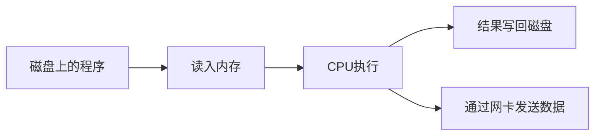

# 第 9 章 · 从实物认识 Linux 硬件

> 📍 阶段 1 · 基础篇 · 第 9 章 ｜ ⏱ 45 分钟 ｜ 难度：★★☆☆☆
> ⬅️ [高效求助](08-高效求助-man与tldr.md) ｜ ➡️ [管道与重定向](../02-advanced/01-管道与重定向.md)

CPU、内存、磁盘和网卡不是终端里的四组抽象数字。先看真实器件，再把它们与系统命令对应起来，排障时才能知道自己正在观察什么。

## 🎯 学习目标

- 分清计算、临时存储、持久存储和网络通信的职责。
- 把实物、内核设备和查看命令联系起来。
- 为自己的 Linux 环境制作一份不含序列号的硬件记录。

## 🧠 核心概念



虚拟机看到的是虚拟硬件，容器可能看到经过限制或共享的视图。命令能看到什么，不一定等于你独占了多少资源。

### 内存：工作台


照片展示服务器用 DDR4 ECC RDIMM 的外形，用于认识金手指、颗粒与缺口，不代表它能插进你的电脑。不同代际、DIMM/SODIMM、ECC/Registered 等规格需要主板支持。来源：Dsimic，CC BY-SA 4.0，详见 [署名](../../assets/images/CREDITS.md)。

### SSD：持久保存数据


图中是 M.2 外形的 NVMe SSD。M.2 描述接口/外形规范中的一部分，NVMe 描述存储协议，不能看到相似缺口就断言兼容。它也不是内存条。来源：D-Kuru，CC BY-SA 4.0。

### 网络：接口与交换机


交换机连接局域网中的设备。连接灯亮只说明物理链路有一定进展，不代表获得了 IP、DNS 正常或网站可访问。照片是较早型号的实物，用于观察端口，不作为性能或选购推荐。来源：Sub，公有领域。

## 🛠 命令实操

Ubuntu/Debian 可按需安装 PCI/USB 查看工具：

```bash
sudo apt install pciutils usbutils
lscpu
free -h
lsblk -o NAME,TYPE,SIZE,FSTYPE,MOUNTPOINTS
lspci
lsusb
ip -br link
```

预期输出包括处理器架构、内存容量、块设备、PCI/USB 设备和网络接口。设备名与数量以实际系统为准；Pi 上 PCI 设备数量、云主机的型号名称都可能与桌面电脑不同。

| 实物问题 | 从哪看 | 不能据此直接推断什么 |
|---|---|---|
| 多少逻辑 CPU | `lscpu`、`nproc` | 逻辑 CPU 不必等于物理核心数 |
| 应用还可用多少内存 | `free -h` 的 available | free 很小不等于内存不足 |
| 数据写在哪块盘 | `findmnt -T 路径`、`lsblk` | `/dev/sda` 不是所有机器的系统盘 |
| USB 摄像头是否枚举 | `lsusb` | 枚举成功不等于能取得画面 |
| 网线接口是否存在 | `ip -br link` | 有接口不等于有可用路由 |

## 💡 避坑指南

- 软件看到的容量与包装数字可能使用不同单位，先区分 GB/GiB。
- 不为了识别型号拆开带电设备；本章只要求观察和只读命令。
- 公开笔记不要贴 MAC 地址、序列号和可识别个人设备的完整信息。
- WSL、虚拟机和容器的设备可见性不同，缺少某个设备不一定是故障。

## ✍️ 动手实验

制作 `hardware-notes.md`，填入架构、逻辑 CPU、可用内存、根文件系统、网络接口名称五项，每项附查看命令。选择一项解释“实物与系统视图为什么可能不同”。

<details><summary>参考记录格式</summary>

```text
环境：虚拟机 / 物理机 / WSL / 容器
架构：实际输出；命令：uname -m
逻辑 CPU：实际输出；命令：nproc
内存：实际输出；命令：free -h
根文件系统：实际输出；命令：findmnt /
接口名称：实际输出；命令：ip -br link
限制：例如虚拟机 CPU 数由分配决定，并非整台宿主机的 CPU 数。
```
</details>

## 📺 推荐视频

先看 [实物图鉴](../../resources/hardware-gallery.md)，再从 [视频库](../../resources/videos.md) 选择对应硬件基础片段。

## ✅ 自测清单

- [ ] 能用自己的话区分内存与 SSD。
- [ ] 能指出数据路径对应的挂载点，而不是猜设备名。
- [ ] 硬件记录不包含不必要的设备标识。

## 🔗 延伸阅读

- [lsblk 手册](https://man7.org/linux/man-pages/man8/lsblk.8.html)
- [基础篇练习](../../exercises/01-基础篇练习.md)
