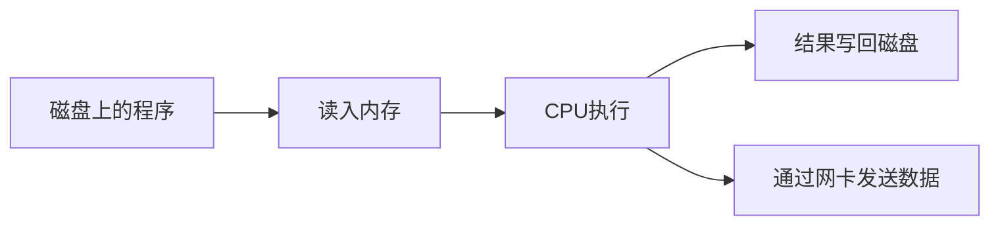

# 第 9 章 · 从实物认识 Linux 硬件

> 📍 阶段 1 · 基础篇 · 第 9 章 ｜ ⏱ 45 分钟 ｜ 难度：★★☆☆☆
> ⬅️ [高效求助](08-高效求助-man与tldr.md) ｜ ➡️ [管道与重定向](../02-advanced/01-管道与重定向.md)

CPU、内存、磁盘和网卡不是终端里的四组抽象数字。**先把它们想象成一台机器里的实物**：大脑、工作台、仓库和邮局。之后再回头看命令输出，你才会知道「正在观察什么」，而不是对着一串百分比发呆。

本章的目标不是背参数，而是搭一座桥：**实物 → 内核设备 → 命令行视图**。桥搭好了，后面性能、磁盘、网络各章的数字都会各归其位。

## 🎯 学习目标

- 分清计算、临时存储、持久存储和网络通信的职责。
- 把实物、内核设备和查看命令联系起来。
- 理解「设备文件」与「驱动」在其中的角色。
- 为自己的 Linux 环境制作一份不含序列号的硬件记录。

## 🧠 核心概念



[在学习站暂停、单步或重播](https://zhuguang-zfg.github.io/linux/#animation=hardware-bus.svg)。动画中的输入输出为教学示意，需用本章实验验证。



[在学习站暂停、单步或重播](https://zhuguang-zfg.github.io/linux/#animation=hardware-detect.svg)。动画中的输入输出为教学示意，需用本章实验验证。

### 9.1 四类硬件，四种职责



| 硬件 | 类比 | 系统里的角色 | 关键特征 |
|---|---|---|---|
| CPU | 大脑 | 执行指令、协调一切 | 速度极快，容量极小（寄存器/缓存） |
| 内存（RAM） | 工作台 | 存放正在运行的程序与数据 | 快、贵、**断电即失** |
| 磁盘（SSD/HDD） | 仓库 | 长期保存数据 | 慢、便宜、断电留存 |
| 网卡 | 邮局 | 与外界收发数据 | 把本机接到网络上 |

**这张表能解释很多现象**：为什么进程要「读入内存才能运行」？因为 CPU 只从内存取指令——仓库里的程序必须先搬到工作台上。为什么断电后正在编辑的内容会丢？因为那还在「工作台」上，没进仓库。带着这四类职责看后面每一章的输出，就不会迷路。

虚拟机看到的是虚拟硬件，容器可能看到经过限制或共享的视图。命令能看到什么，不一定等于你独占了多少资源。

### 9.2 实物长什么样：从主板开始


主板上固定 CPU、内存、硬盘和扩展卡，也提供供电与数据通路。图中是较早的 LGA775 micro-ATX 板，观察 CPU 插座、内存槽、SATA 接口与电容布局即可；具体规格以你的主板型号为准。来源：Davidson F，CC0（公有领域声明），详见 [署名](../../assets/images/CREDITS.md)。

**看主板要看的不是型号，是「接口」**：CPU 插座决定能装哪代处理器；内存槽的数量与代数（DDR4/DDR5）决定扩容空间；SATA 与 M.2 接口决定能接几块盘。升级或排障时，先认接口，再谈部件。


照片展示服务器用 DDR4 ECC RDIMM 的外形，用于认识金手指、颗粒与缺口，不代表它能插进你的电脑。不同代际、DIMM/SODIMM、ECC/Registered 等规格需要主板支持。来源：Dsimic，CC BY-SA 4.0，详见 [署名](../../assets/images/CREDITS.md)。

**内存条上的缺口（notch）是防插错的物理保险**：不同代数位置不同，插不进去就是插不进去——这是硬件层面的「版本检查」，和软件里的依赖检查是一个道理。


图中是 M.2 外形的 NVMe SSD。M.2 描述接口/外形规范中的一部分，NVMe 描述存储协议，不能看到相似缺口就断言兼容。它也不是内存条。来源：D-Kuru，CC BY-SA 4.0。

**M.2 和 NVMe 是两个维度**：M.2 是「长什么样、怎么插」，NVMe 是「怎么说话」。同是 M.2 插槽，可能支持 SATA 协议或 NVMe 协议，买错会「能插但不识别」。这类「外形 × 协议」的坑，在 SSD 上最典型。来源补充见 [署名](../../assets/images/CREDITS.md)。

### 9.3 网络与输入输出设备


交换机连接局域网中的设备。连接灯亮只说明物理链路有一定进展，不代表获得了 IP、DNS 正常或网站可访问。照片是较早型号的实物，用于观察端口，不作为性能或选购推荐。来源：Sub，公有领域。

**「链路通了」和「网络能用」是四层台阶**：物理链路（灯亮）→ 有 IP 地址（DHCP 或静态）→ 能解析域名（DNS）→ 目标服务可访问。排障时从下往上逐层验证，比一上来重启路由器有效得多——第 8 章的网络部分会把这四层展开。


键盘是最直接的输入设备之一。机械键盘每个按键下有独立开关，手感与寿命和薄膜键盘不同；图中彩色灯光只影响外观，不影响按键识别。来源：SolarMainframe，CC BY-SA 4.0。


显示器是主要的输出设备。分辨率、接口（HDMI/DP）与刷新率决定显示体验；Linux 桌面与分辨率设置可在图形界面调整，命令行也能用 `xrandr` 查询。来源：Vyacheslav Argenberg，CC BY 4.0。


鼠标与键盘是最基础的输入设备。滚轮、侧键等按键通常即插即用，Linux 大多无需驱动；`xinput list` 可查看已识别的输入设备。来源：Qurren，CC BY-SA 4.0。


塔式机箱是台式机最常见的形态，内部容纳主板、电源、硬盘与扩展卡；尺寸（中塔/全塔）决定可装部件数量。照片为个人中塔主机，用于认识形态，不作为品牌推荐。来源：TheJosh，公有领域。

## 🛠 命令实操

### 1. 看清这台机器的四类硬件

Ubuntu/Debian 可按需安装 PCI/USB 查看工具：

```bash
sudo apt install pciutils usbutils
lscpu
free -h
lsblk -o NAME,TYPE,SIZE,FSTYPE,MOUNTPOINTS
lspci
lsusb
ip -br link
```

逐条对应职责看输出：

- `lscpu`：处理器架构、核心/线程数 → **大脑的规格**；
- `free -h`：内存与交换分区 → **工作台的容量**（重点看 `available`）；
- `lsblk`：块设备、分区与挂载点 → **仓库的隔间**；
- `lspci` / `lsusb`：总线上的控制器与外设 → **插在主板上的部件**；
- `ip -br link`：网络接口与状态 → **邮局的窗口**。

预期输出包括处理器架构、内存容量、块设备、PCI/USB 设备和网络接口。设备名与数量以实际系统为准；Pi 上 PCI 设备数量、云主机的型号名称都可能与桌面电脑不同。

### 2. 五个容易读错的字段

| 实物问题 | 从哪看 | 不能据此直接推断什么 |
|---|---|---|
| 多少逻辑 CPU | `lscpu`、`nproc` | 逻辑 CPU 不必等于物理核心数 |
| 应用还可用多少内存 | `free -h` 的 available | free 很小不等于内存不足 |
| 数据写在哪块盘 | `findmnt -T 路径`、`lsblk` | `/dev/sda` 不是所有机器的系统盘 |
| USB 摄像头是否枚举 | `lsusb` | 枚举成功不等于能取得画面 |
| 网线接口是否存在 | `ip -br link` | 有接口不等于有可用路由 |

### 3. 内核怎样认识硬件：设备文件与驱动

命令看到的每个设备，背后都有一条链路：

```text
硬件 → 内核驱动识别 → 创建设备文件（/dev、/sys）→ 用户程序访问
```

- **设备文件**：`/dev/sda`、`/dev/video0` 是内核给硬件的「门牌号」。程序打开它，就等于在跟那块硬件说话——`dd` 写 `/dev/sda` 能覆盖整块盘，正是因为它是设备而不是普通文件；
- **驱动**：内核里「听懂」某款硬件的翻译官。驱动没加载，硬件就像没插上；
- **`/sys` 与 `/proc`**：内核把设备与状态信息以文件形式暴露出来，方便脚本读取（前面树莓派章节的 `/proc/device-tree/model` 就是例子）。

这三层解释了经典故障模式：**插上设备但命令看不到** → 可能是驱动没识别（查 `dmesg`）；**能看到设备但打不开** → 可能是权限或占用（查 `/dev` 节点权限与 `lsof`）。

### 4. 硬件视图不等于独占资源

| 环境 | 你看到的硬件 | 容易误判的地方 |
|---|---|---|
| 物理机 | 全部真实部件 | 无（就是全部） |
| 虚拟机 | 虚拟 CPU/内存/磁盘/网卡 | CPU 核心数是分配值，不是宿主机的 |
| 容器 | 宿主机内核 + 受限视图 | 看到的内存是宿主机总量，限值要看 cgroup |
| WSL | 微软提供的兼容层 | 部分设备节点与内核特性行为不同 |

**「命令能看到什么」和「你实际能用多少」是两件事。** 容器里 `free -h` 显示宿主机内存、`nproc` 显示宿主机 CPU，都是常见困惑——限制写在别处（cgroup），不在这些命令的输出里。排障时要先问：**我在哪一层看？**

## 💡 避坑指南

- 软件看到的容量与包装数字可能使用不同单位，先区分 GB/GiB。
- 不为了识别型号拆开带电设备；本章只要求观察和只读命令。
- 公开笔记不要贴 MAC 地址、序列号和可识别个人设备的完整信息。
- WSL、虚拟机和容器的设备可见性不同，缺少某个设备不一定是故障。
- 「灯亮」「能枚举」「有设备节点」都只是中间状态，别把它们当成「能用」。
- 设备名会变（`/dev/sda` 今天是你，明天可能不是），脚本里应使用 `UUID=` 或 `LABEL=` 挂载，而不是硬编码设备名。

## ✍️ 动手实验

制作 `hardware-notes.md`，填入架构、逻辑 CPU、可用内存、根文件系统、网络接口名称五项，每项附查看命令。选择一项解释“实物与系统视图为什么可能不同”。

<details><summary>参考记录格式</summary>

```text
环境：虚拟机 / 物理机 / WSL / 容器
架构：实际输出；命令：uname -m
逻辑 CPU：实际输出；命令：nproc
内存：实际输出；命令：free -h
根文件系统：实际输出；命令：findmnt /
接口名称：实际输出；命令：ip -br link
限制：例如虚拟机 CPU 数由分配决定，并非整台宿主机的 CPU 数。
```
</details>

**进阶挑战（选做）**：在 `dmesg` 里找出至少两条硬件识别记录（网卡、磁盘或 USB 设备任选），抄下时间戳与设备名，并在 `lsblk`、`ip -br link` 或 `lsusb` 的输出里找到对应项。**把「日志里的识别事件」和「当前设备清单」对上号**，是硬件排障的基本功。

## 📺 推荐视频

- [YouTube · Linux 知识全景](https://www.youtube.com/watch?v=LKCVKw9CzFo) — Fireship，12分22秒。知识全景补充，实物识别与机器记录仍需按正文完成。

[](https://www.youtube.com/watch?v=LKCVKw9CzFo)

[在学习站查看配套媒体](https://zhuguang-zfg.github.io/linux/#read=docs%2F01-basics%2F09-%E4%BB%8E%E5%AE%9E%E7%89%A9%E8%AE%A4%E8%AF%86Linux%E7%A1%AC%E4%BB%B6.md) · [视频资料与核验说明](../../resources/videos.md)。标题、作者和分P已核对，未逐条完成实播，播放限制以原站为准。

## ✅ 自测清单

- [ ] 能用自己的话区分内存与 SSD（并说出断电各会怎样）。
- [ ] 能说出四类硬件分别对应哪个命令的输出。
- [ ] 能指出数据路径对应的挂载点，而不是猜设备名。
- [ ] 能解释设备文件与驱动的关系，以及「看不到设备」的两种典型原因。
- [ ] 知道虚拟机/容器里的硬件视图不是独占资源，限制写在别处。
- [ ] 硬件记录不包含不必要的设备标识。

## 🔗 延伸阅读

- [lsblk 手册](https://man7.org/linux/man-pages/man8/lsblk.8.html)：列设备与挂载的首选工具。
- [Linux 内核文档 · 设备树](https://www.kernel.org/doc/html/latest/devicetree/usage-model.html)：ARM 平台「硬件描述」的官方说明。
- [基础篇练习](../../exercises/01-基础篇练习.md)
- 下一章：[管道与重定向](../02-advanced/01-管道与重定向.md)——把这些命令的输出接起来用。
