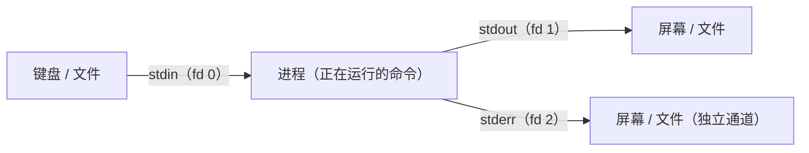

# 第 1 章 · 管道与重定向：一切皆文件

> 📍 位置：阶段 2 · 进阶篇 · 第 1 章 ｜ ⏱ 预计用时：45 分钟 ｜ 难度：★★★☆☆
>
> ⬅️ 上一章：[08-高效求助：man 与 tldr](../01-basics/08-高效求助-man与tldr.md) ｜ ➡️ 下一章：[02-grep文本搜索](02-grep文本搜索.md)

基础篇里你敲的每条命令，都是"输入 → 处理 → 输出"的一次性动作。进阶篇从本章开始教你怎么把这些命令**串起来**：把一条命令的输出喂给另一条命令，把结果写进文件，把错误单独拎出来。掌握管道（Pipe）与重定向（Redirection）之后，你才算真正开始"用 Linux 思考"。

## 🎯 学习目标

学完本章，你将能够：

- 说出"一切皆文件"（Everything is a file）的含义，以及标准输入、标准输出、标准错误各自对应的文件描述符（File Descriptor）；
- 熟练使用 `>`、`>>`、`<`、`2>`、`2>&1`、`&>` 六种重定向写法，并解释它们各自接管了哪条数据流；
- 用一段话向别人解释管道 `|` 的工作原理；
- 使用 `tee` 实现"既看又存"，用 `xargs` 把文本变成命令参数（并知道 `-P` 可以并发）；
- 熟练书写 `wc -l` 统计和 `sort | uniq -c | sort -nr` 排行榜这两类经典管道组合。

## 🧠 核心概念

### 1.1 一切皆文件

Linux 继承自 Unix 的核心哲学是**一切皆文件**：普通数据是文件，目录是文件，键盘、磁盘是设备文件，连进程信息、内核参数也以文件的形式暴露在 `/proc`、`/sys` 里。

这个哲学的好处是：既然万物都能抽象成"可读写的文件"，那么一套统一的小工具就能处理万物——而工具之间的"接线板"，就是本章的主角：重定向与管道。

### 1.2 三个标准流：0、1、2

每个进程启动时，内核都会自动为它打开三条数据流（Standard Streams）：

| 流 | 英文 | 文件描述符 | 默认连接到 |
|---|---|---|---|
| 标准输入 | stdin（Standard Input） | 0 | 键盘 |
| 标准输出 | stdout（Standard Output） | 1 | 屏幕 |
| 标准错误 | stderr（Standard Error） | 2 | 屏幕 |

**文件描述符**（File Descriptor，FD）可以理解为内核给进程打开的每个"文件"发的号码牌，0、1、2 三个号码预留给标准流，之后打开的文件从 3 开始编号。

请注意一个关键细节：stdout 和 stderr 默认虽然都显示在屏幕上，但它们是**两条互相独立的通道**。后面 `2>` 的存在，正是因为错误流可以（也应该）被单独处理。



### 1.3 管道 `|`：把上一条的输出接到下一条的输入

`命令1 | 命令2` 的执行过程是：shell 请内核创建一根**管道**——内核内存中的一段缓冲区（Buffer），shell 把命令 1 的 stdout 接到管道的写端，把命令 2 的 stdin 接到读端，然后两个进程**同时启动、并行工作**。命令 1 的输出写满缓冲区就暂停等待，命令 2 把数据读空了也暂停等待，数据就这样像水流一样单向流动，谁也不会淹没谁。想看底层实现，可以运行 `man 7 pipe` 阅读内核手册。


### 1.4 重定向六式

重定向的本质：**shell 在启动命令前，把 0/1/2 号描述符偷偷接到别的地方**（文件、设备），命令本身毫无察觉。

| 写法 | 读法 | 作用 |
|---|---|---|
| `>` | 覆盖输出 | stdout 写入文件，原内容清空 |
| `>>` | 追加输出 | stdout 写入文件，追加到末尾 |
| `<` | 输入重定向 | 把文件内容当作 stdin |
| `2>` | 错误重定向 | 只把 stderr 写入文件 |
| `2>&1` | 合并错误到标准输出 | 让 fd 2 跟随 fd 1 去同一个地方 |
| `&>` | 全部重定向 | bash 简写，stdout 和 stderr 一起进文件 |

**第一式 `>`：覆盖写入。**

```bash
echo "第一行" > out.txt
cat out.txt
```

```text
第一行
```

再执行一次 `echo "第二行" > out.txt`，`cat out.txt` 就只剩"第二行"了——旧内容被**覆盖**，且不可恢复。

**第二式 `>>`：追加写入。**

```bash
echo "第二行" >> out.txt
cat out.txt
```

```text
第一行
第二行
```

记日志、攒结果就用它。

**第三式 `<`：把文件喂给标准输入。**

```bash
wc -l < /etc/passwd
```

```text
36
```

（数字随系统用户数而异。）对比 `wc -l /etc/passwd`：后者输出里带文件名，前者只有数字——因为 `wc` 根本不知道数据来自哪个文件。

**第四式 `2>`：单独收集错误。**

```bash
ls /etc/hostname /not_exist 2> err.log
```

```text
/etc/hostname
```

屏幕上只显示找得到的文件，错误信息被单独收进了 `err.log`：

```text
ls: 无法访问 '/not_exist': 没有那个文件或目录
```

**第五式 `2>&1`：把错误并进标准输出。**

```bash
ls /etc/hostname /not_exist > all.log 2>&1
cat all.log
```

```text
ls: 无法访问 '/not_exist': 没有那个文件或目录
/etc/hostname
```

读法是"让 2 变成 1 的副本"。**它必须写在 `>` 之后**，原因见避坑指南第 2 条。

**第六式 `&>`：bash 的合体简写。**

```bash
ls /etc/hostname /not_exist &> all.log
```

等价于上一条，更短，但这是 bash 专属写法，移植到其他 shell（如某些精简环境的 sh）可能失效。

### 1.5 tee：一分为二的三通接头

有时你想把结果**同时**存进文件、又继续在屏幕/管道里看到它，这时用 `tee`（像水管的 T 形三通）：

```bash
ls -l | tee listing.txt | wc -l
```

```text
8
```

输出进 `wc -l` 的同时，完整清单也存进了 `listing.txt`。加 `-a` 可追加而不是覆盖。排查长任务时它特别好用：`脚本.sh 2>&1 | tee run.log`，事后有据可查。

### 1.6 xargs：把文本流变成命令参数

管道传递的是**数据流**，但 `rm`、`cp`、`kill` 这类命令只吃**参数**。`xargs` 就是中间的翻译官，把上游每一行文本变成下游命令的参数：

```bash
find /tmp -name "*.tmp" | xargs rm -f
```

进阶一句话：`xargs -P 4` 可以开 4 个进程**并发**处理（比如批量压缩几千张图片时快 4 倍），配合 `-n 1` 表示每个进程一次只吃一个参数。先记住有这回事，用到了再深挖。

## 🛠 命令实操

> 以下命令可直接复制运行（Ubuntu 22.04 / Debian 12 验证通过）。

### 组合一：wc -l 统计行数

```bash
wc -l /etc/passwd          # 直接数
ls /etc | wc -l            # 数 /etc 下的条目数
```

```text
36 /etc/passwd
266
```

统计代码行数也是它：`find src -name "*.py" | xargs wc -l | tail -1`。

### 组合二：sort | uniq -c | sort -nr —— Top N 万能模板

这是整个 Linux 世界最著名的管道组合，分工明确：

- `sort`：先排序——因为 `uniq` 只会合并**相邻**的重复行，必须先排序把它们凑到一起；
- `uniq -c`：去重并在行首计数（-c = count）；
- `sort -nr`：按数字（-n）倒序（-r = reverse）排列，次数最多的在最上面。

统计 `/etc/passwd` 里各种登录 shell 的用户数：

```bash
cut -d: -f7 /etc/passwd | sort | uniq -c | sort -nr
```

```text
     27 /usr/sbin/nologin
      6 /bin/bash
      2 /usr/bin/false
      1 /bin/sync
```

（数字因系统而异。）末尾接 `| head -5` 就是 Top 5——"先统计、再倒序、取前 N"，任何排行榜类需求都是这个套路。

顺便看看你自己最常用的命令：

```bash
history | awk '{print $2}' | sort | uniq -c | sort -nr | head -5
```

（`awk` 在第 4 章会讲，现在照抄感受管道的长度即可。）

### 组合三：过滤 + 提取 + 统计

找出当前目录下最大的 5 个文件（`du -a` 列出所有文件含大小）：

```bash
du -a . 2>/dev/null | sort -nr | head -5
```

```text
122944  ./assets/animations/boot-sequence.svg
98304   ./docs
65536   ./docs/02-advanced
...
```

实时监控日志里的关键字（`tail -f` 持续追踪新行）：

```bash
tail -f /var/log/syslog | grep --line-buffered "systemd"
```

`--line-buffered` 让 grep 每收到一行就立刻输出，否则它会攒够一批缓冲区才吐，看起来像"卡住了"。

## 💡 避坑指南

1. **`>` 覆盖不可恢复**。手一抖 `> 重要文件` 就清空了。可以 `set -C` 开启 noclobber 保护（禁止 `>` 覆盖已存在的文件），确要覆盖时用 `>|` 强制通过。
2. **`2>&1` 顺序不能颠倒**。shell 从左到右处理：`> file 2>&1` 是"1 先去文件，2 再跟着 1"，正确；`2>&1 > file` 则是"2 先跟到屏幕（当时 1 的位置），1 再去文件"，结果 stderr 仍打在屏幕上。
3. **`sudo 命令 > /root/x.log` 会失败**。`>` 是**你的 shell**（普通用户）完成的，sudo 保护不到它。解法：`sudo 命令 | sudo tee /root/x.log`——让高权限的 tee 来写。
4. **文件名带空格时慎用 xargs**。默认按空白切分，`my file.txt` 会变成两个参数。用 `xargs -d '\n'`（GNU 专属选项）按整行切分，或上游用 `find ... -print0` + `xargs -0`。
5. **管道右侧运行在子 shell 里**。`cat file | read line` 中 `read` 读到的变量，管道一结束就消失（bash 如此）。想让变量在当前 shell 生效，改用输入重定向：`read line < file`。
6. **管道不会传递错误码的"真相"**。默认管道的退出状态只看最后一条命令，中间环节失败了也可能"看起来成功"。在第 5 章的 `set -o pipefail` 里我们正式解决它。

## ✍️ 动手实验

### 实验 1：生成用户统计报告

统计 `/etc/passwd` 中**能登录**的用户（shell 不是 `nologin` 也不是 `false`）的数量，要求：结果既显示在屏幕上，又保存到 `~/login-users.txt`。

<details>
<summary>💡 参考解法（先自己试！）</summary>

```bash
grep -vE "nologin|false" /etc/passwd | wc -l | tee ~/login-users.txt
```

还没学 grep？分步版同样满分：先 `grep -v nologin /etc/passwd | grep -v false` 过滤两轮，再交给 `wc -l | tee`。`tee` 是本题唯一的考点。
</details>

### 实验 2：迷你词频排行榜

把下面这些水果名（或自己编的数据）存进 `fruits.txt`，再用一条管道输出出现次数最多的前 3 名及次数。

数据：apple、banana、apple、cherry、banana、apple、banana、cherry

<details>
<summary>💡 参考解法（先自己试！）</summary>

```bash
printf "apple\nbanana\napple\ncherry\nbanana\napple\nbanana\ncherry\n" > fruits.txt
sort fruits.txt | uniq -c | sort -nr | head -3
```

```text
      3 apple
      3 banana
      2 cherry
```

如果次数相同想按字母排，把最后一段换成 `sort -k1,1nr -k2` 即可——管道的乐趣就在于一节一节往上叠。
</details>


## 📺 推荐视频

> 本章暂未收录专属视频。管道与重定向是贯穿整个阶段 2 的主线，[第 5 章 Bash 脚本编程](05-Bash脚本编程.md) 推荐的视频课程中同样会系统演示这些用法；建议先完成上面的动手实验，再去看视频对照巩固。

## ✅ 自测清单

- [ ] 能画出 0、1、2 三个文件描述符与键盘、屏幕、文件之间的流向图
- [ ] 能区分 `>` 与 `>>`，并说出各自的适用场景与危险点
- [ ] 能解释 `2>&1` 为什么必须写在 `>` 之后，写反会发生什么
- [ ] 能用 `tee` 实现"既显示又保存"，并知道 `-a` 的作用
- [ ] 能默写 `sort | uniq -c | sort -nr` 模板，并解释为什么必须先 sort
- [ ] 知道 xargs 解决的是什么问题，以及 `-P` 与 `-n` 的用途
- [ ] 遇到 `sudo 命令 > 文件` 报权限错误时，知道改用 `sudo tee`
- [ ] 知道如何实时过滤一条持续增长的日志

## 🔗 延伸阅读

- 管道内核手册：[pipe(7)](https://man7.org/linux/man-pages/man7/pipe.7.html)
- xargs 手册：[xargs(1)](https://man7.org/linux/man-pages/man1/xargs.1.html)
- tee 手册：[tee(1)](https://man7.org/linux/man-pages/man1/tee.1.html)
- TLDP《Advanced Bash-Scripting Guide》I/O 重定向专章：[io-redirection](https://tldp.org/LDP/abs/html/io-redirection.html)
- 📝 章节练习：[02-进阶篇练习](../../exercises/02-进阶篇练习.md)
