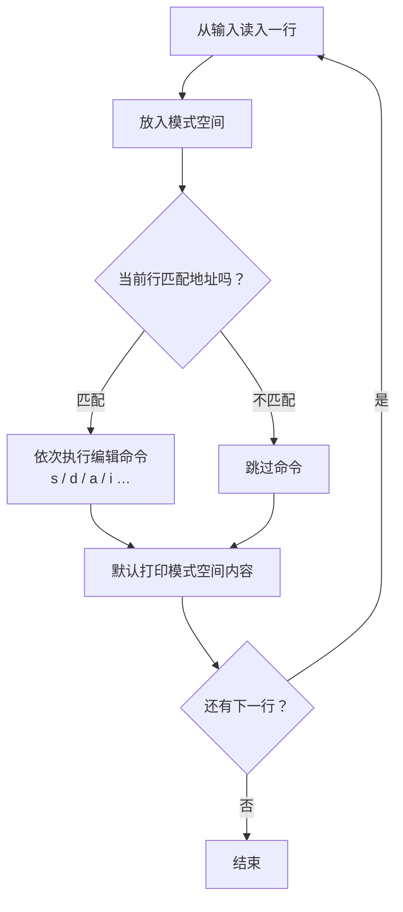

# 第 3 章 · sed 流编辑器

> 📍 位置：阶段 2 · 进阶篇 · 第 3 章 ｜ ⏱ 预计用时：45 分钟 ｜ 难度：★★★☆☆
>
> ⬅️ 上一章：[02-grep文本搜索](02-grep文本搜索.md) ｜ ➡️ 下一章：[04-awk文本分析](04-awk文本分析.md)

grep 只能"挑选"行，而 **sed**（Stream Editor，流编辑器）能"修改"行：替换、删除、追加、插入。它是自动化改配置、清洗日志的主力工具，也是很多人第一次体会"一条命令改一百个文件"爽感的入口。

## 🎯 学习目标

学完本章，你将能够：

- 画出并解释 sed 的核心模型——模式空间（Pattern Space）；
- 熟练使用 `s` 替换命令及其 `g`、`i` 标志，并会在路径类文本里更换分隔符；
- 用数字、`$`、正则、范围四种方式定位行；
- 使用 `d` 删除、`a`/`i` 追加插入、`-n` 配 `p` 精确打印；
- 正确使用 `-i` 在原地修改文件（并知道 `-i.bak` 如何保命）；
- 完成三个经典案例：批量改配置、去空行与注释、从文本中提取 IP。

## 🧠 核心概念

### 3.1 流编辑器的工作方式

sed 不像 vim 那样把整个文件读进内存打开编辑，而是像流水线工人：**每次从输入拿一行，加工完就输出，然后拿下一行**。这个"加工台"就叫**模式空间**（Pattern Space）。



理解了两件事，sed 的所有行为就都能推演出来：

1. **命令是按行执行的**，地址（Address）决定"这一行的命令要不要生效"；
2. **默认每个处理完的行都会被打印**，所以加了替换命令后你会看到全部行（改过的和没改的）。

### 3.2 语法骨架与 s 命令

```bash
sed [选项] '命令' [文件...]
```

最常见的命令是 `s`（substitute，替换）：`s/旧/新/[标志]`，默认只替换每行**第一处**。加 `g`（global）标志替换每行全部；加 `i` 标志忽略大小写：

```bash
echo "cat dog cat" | sed 's/cat/mouse/'       # mouse dog cat
echo "cat dog cat" | sed 's/cat/mouse/g'      # mouse dog mouse
echo "Cat Dog"     | sed 's/cat/mouse/i'      # mouse Dog
```

**分隔符可以换**。要处理的文本里全是 `/`（比如路径）时，把分隔符换成 `#` 或 `|`，免去转义地狱：

```bash
echo "path=/usr/local/bin" | sed 's#/usr/local#/opt#'
```

```text
path=/opt/bin
```

### 3.3 行定位：四种地址

| 地址写法 | 含义 | 示例 |
|---|---|---|
| 数字 `3` | 第 3 行 | `sed '3s/old/new/'` |
| `$` | 最后一行 | `sed '$d'` |
| `/正则/` | 匹配该正则的行 | `sed '/^#/d'` |
| `起,止` | 行号或正则构成的范围 | `sed '2,5d'`、`sed '/START/,/END/d'` |

地址后面直接跟命令，如 `3s/.../` 表示"只对第 3 行执行替换"。

## 🛠 命令实操

> 以下命令可直接复制运行（Ubuntu 22.04 / Debian 12 验证通过）。注意：**GNU sed 与 BSD/macOS sed 在 `-i` 等行为上不兼容**，涉及处均已标注。

### d：删除行

```bash
sed '/^#/d' nginx.conf        # 删所有以 # 开头的行
sed '/^$/d' nginx.conf        # 删所有空行
sed '1d'  nginx.conf          # 删第 1 行
```

删除只是"不输出这一行"，原文件毫发无损——**不加 `-i` 时 sed 永远只改输出**。

### a 与 i：追加与插入

`a`（append）在匹配行**之后**加一行，`i`（insert）在**之前**加一行：

```bash
printf "line1\nline2\nline3\n" | sed '2a\这是追加的行'
printf "line1\nline2\nline3\n" | sed '/line2/i\这是插入的行'
```

```text
line1
line2
这是追加的行
line3
```

```text
line1
这是插入的行
line2
line3
```

典型用途：往配置文件某节后面补一行参数，如 `sed '/^\[mysql\]/a\default-character-set=utf8mb4' my.cnf`。

### -n + p：只打印我要的行

sed 默认打印每一行，加了 `-n`（quiet）就"闭嘴"，此时 `p`（print）命令负责点名：

```bash
sed -n '5,10p' /etc/passwd    # 打印第 5~10 行
sed -n '/root/p' /etc/passwd  # 打印含 root 的行（等价 grep root）
sed -n '/Oct  6/,/Oct  7/p' app.log   # 打印两个时间点之间的所有行
```

第三种"区间截取"是 grep 做不到的，值得记住。

### -i：原地修改（GNU 专属行为）

`-i`（in-place）让 sed 直接改写文件而不是打印到屏幕。

```bash
sed -i 's/hello/hi/g' greet.txt      # 直接改，无提示无撤销
sed -i.bak 's/hello/hi/g' greet.txt  # 先生成 greet.txt.bak 再改
```

`-i.bak` 会在修改前把原文件备份为 `greet.txt.bak`（后缀可自定，如 `-i.bak2026`）。**本教程强烈建议日常一律用 `-i.bak`**，确认无误后再清理备份。

> 📌 注记：GNU sed 的 `-i.bak` 写法在 BSD/macOS sed 上报错（那里必须写 `-i ''` 且不能带备份后缀的这种形式）。Linux 服务器上请放心使用。

### 多条命令：-e 与分号

一次跑多个编辑命令，两种写法：

```bash
sed -e 's/foo/bar/g' -e '/^$/d' data.txt   # 推荐：每个 -e 一条，清晰
sed 's/foo/bar/g;/^$/d' data.txt           # 分号连接，紧凑
```

注意 `a`、`i` 这类命令后面用分号会有歧义（分号可能被当成插入的文本），**用 `-e` 最稳**。

### 经典三案例

#### 案例一：批量改配置文件

把项目目录下所有 `.conf` 里的端口 8080 改成 9090，改前自动留备份：

```bash
grep -rl "8080" conf.d/ --include="*.conf" | xargs sed -i.bak 's/8080/9090/g'
```

`grep -rl` 找出含目标的文件，`xargs` 把文件名交给 sed 逐个原地修改——第 1 章和本章的合体技。

#### 案例二：一键"瘦身"配置文件

看配置时常被注释和空行淹没：

```bash
sed -e '/^#/d' -e '/^$/d' /etc/ssh/sshd_config
```

```text
Include /etc/ssh/sshd_config.d/*.conf
Port 22
AddressFamily any
ListenAddress 0.0.0.0
...
```

想顺便去掉行尾空白？再加一条：`-e 's/[ \t]*$//'`。

#### 案例三：从文本中提取 IP

利用 `-E` 扩展正则 + 分组反向引用 `\1`，把整行"换成"其中的 IP：

```bash
echo "server at 192.168.10.5 port 22 ok" | sed -E 's/.*(([0-9]{1,3}\.){3}[0-9]{1,3}).*/\1/'
```

```text
192.168.10.5
```

原理：正则用括号把 IP 抓进第 1 组，替换式里的 `\1` 引用它，整行被替换成只含 IP 的内容。需要提取全部 IP（一行多个）时，配合 `-n` 和 `p` 更灵活，也可以把活儿交给下一章的 grep -oE。

## 💡 避坑指南

1. **`-i` 没有撤销**。写错正则 = 文件被改坏。铁律：先用不加 `-i` 的版本**预览输出**，确认后再加 `-i.bak` 落地。
2. **替换内容里 `&` 有特殊含义**：`s/old/new&new/` 里的 `&` 代表"匹配到的内容本身"。要输出字面 `&` 请写 `\&`。
3. **忘记 g 标志**。`s/a/b/` 每行只改第一处，长文本里"怎么只改了一个"的元凶就是它。
4. **正则里的 `/` 与分隔符打架**。处理路径请换分隔符 `s#...#...#`，别写一串 `\/`。
5. **`-i` 会"斩断"符号链接**：GNU sed 原地修改实际是"写新文件换旧文件"，链接指向的原文件会被替换成普通文件。涉及链接时加 `--follow-symlinks`（GNU 专属）。
6. **sed 默认按行处理，跨行操作是弱项**。需要"多行合并""跨行替换"时，说明该换工具了——试试 awk（下一章）或 perl。

## ✍️ 动手实验

### 实验 1：配置文件瘦身 + 备份

复制 `/etc/ssh/sshd_config` 到 `/tmp/sshd_test.conf`，用 sed 原地（带 `.bak` 备份）删掉全部注释行和空行，并对比处理前后的行数。

<details>
<summary>💡 参考解法（先自己试！）</summary>

```bash
cp /etc/ssh/sshd_config /tmp/sshd_test.conf
wc -l /tmp/sshd_test.conf
sed -i.bak -e '/^#/d' -e '/^$/d' /tmp/sshd_test.conf
wc -l /tmp/sshd_test.conf /tmp/sshd_test.conf.bak
```

```text
57 /tmp/sshd_test.conf
120 /tmp/sshd_test.conf.bak
```

想更严谨，把"行首可有空白"的注释也算上：`sed -e '/^[ \t]*#/d' -e '/^[ \t]*$/d'`。
</details>

### 实验 2：给文件每行加行号

用 sed 把 `fruits.txt`（第 1 章实验 2 的文件即可）的每一行变成 `1. apple` 这样的"行号. 内容"格式（提示：`=` 命令打印行号，或用正则 `\L` 前不必纠结——用 `sed '=' file` 观察输出，再想办法两行并一行；也可以直接用每行替换的思路绕开）。

<details>
<summary>💡 参考解法（先自己试！）</summary>

最简洁的经典写法是先打印行号再两行合并：

```bash
sed '=' fruits.txt | sed -e 'N' -e 's/\n/\. /'
```

```text
1. apple
2. banana
3. apple
...
```

`N` 命令把下一行读进模式空间（此时里面有"行号\n内容"两行），再把换行替换成 `. `。这也顺带演示了模式空间可以不止一行——sed 的进阶之门就此打开一条缝。
</details>

## 📺 推荐视频

> 本章暂未收录专属视频。sed 与 grep、awk 并称文本三剑客，[第 4 章 awk 文本分析](04-awk文本分析.md) 之后的整体复习阶段，可回看第 2 章推荐的完整课程对照练习。

## ✅ 自测清单

- [ ] 能用自己的话描述模式空间，并解释 sed 为什么默认打印每一行
- [ ] 能说出 `s/cat/mouse/`、`s/cat/mouse/g`、`s/cat/mouse/i` 三者的区别
- [ ] 能用 `#` 等其他分隔符替换含 `/` 的路径
- [ ] 能用数字、`$`、正则、范围四种地址定位行
- [ ] 能用 `d` 删除注释与空行，用 `a`/`i` 在指定位置增补配置
- [ ] 能解释 `-n` 与 `p` 为什么总是成对出现
- [ ] 知道 `-i.bak` 的保命价值，并养成"先预览后原地"的习惯
- [ ] 能写出"提取文本中 IP"的正则并解释 `\1` 的来源

## 🔗 延伸阅读

- GNU sed 官方手册（sed 命令全集）：[GNU sed manual](https://www.gnu.org/software/sed/manual/sed.html)
- GNU sed 手册首页（按版本查阅）：[gnu.org/software/sed/manual](https://www.gnu.org/software/sed/manual/)
- sed 手册页：[sed(1)](https://man7.org/linux/man-pages/man1/sed.1.html)
- 📝 章节练习：[02-进阶篇练习](../../exercises/02-进阶篇练习.md)
- ⏭ 文本三剑客最后一位：[04-awk文本分析](04-awk文本分析.md)
