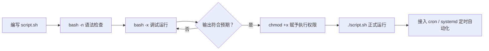

# 第 5 章 · Bash 脚本编程

> 📍 位置：阶段 2 · 进阶篇 · 第 5 章 ｜ ⏱ 预计用时：45 分钟 ｜ 难度：★★★☆☆
>
> ⬅️ 上一章：[04-awk文本分析](04-awk文本分析.md) ｜ ➡️ 下一章：[06-systemd服务与日志](06-systemd服务与日志.md)

前四章攒下了一整套"单发武器"：管道、grep、sed、awk。本章把它们装进**脚本**（Script）里，加上变量、条件、循环和函数，让 Linux 开始替你做"一连串的事"。写脚本是从"使用者"到"自动化者"的分水岭。

## 🎯 学习目标

学完本章，你将能够：

- 解释 shebang 的作用，并用三种方式执行脚本（说出 `source` 与其他方式的区别）；
- 正确完成变量赋值、引用、`${}` 边界、命令替换 `$(...)` 与算术 `$(())`；
- 在脚本中接收位置参数，并用 `set -u` 防止变量名打错；
- 用 `if` + `test` / `[[ ]]` 完成字符串、数字、文件三类判断；
- 用 `for`、`while`、`until`、`case` 组织流程，用函数封装逻辑；
- 理解退出码（Exit Code）与 `$?`，并在脚本开头使用 `set -euo pipefail` 安全模式；
- 用 `bash -x` 调试脚本；读懂并仿写批量重命名与自动备份两个完整脚本。

## 🧠 核心概念


[在学习站暂停、单步或重播](https://zhuguang-zfg.github.io/linux/#animation=bash-exitcode.svg)。动画中的输入输出为教学示意，需用本章实验验证。

### 5.1 shebang 与三种执行方式

脚本第一行 `#!/bin/bash` 叫 **shebang**（sharp + bang），告诉内核"用哪个解释器运行本文件"。同一个脚本的三种跑法：

| 方式 | 是否需要执行权限 | 解释器 | 说明 |
|---|---|---|---|
| `bash script.sh` | 否 | shebang 被**忽略**，就是 bash | 调试常用 |
| `./script.sh` | 是（`chmod +x`） | 按 shebang 找 | 生产推荐 |
| `source script.sh` | 否 | **当前 shell** 亲自执行 | 会改变当前 shell 的环境 |

第三种的本质区别：前两种在**子进程**里跑，脚本里的 `cd`、变量赋值随进程结束而消失；`source` 在当前 shell 里跑，效果像把代码粘到你手边——所以切换环境（如 `source ~/.bashrc`）必须用它。

### 5.2 变量：赋值、引用、替换

```bash
name="Linux"            # 等号两边【不能有空格】
echo "$name 进阶篇"      # 引用推荐加双引号
echo "${name}Scripts"   # ${} 明确变量名边界，防止把 $nameScripts 当变量
now=$(date +%F)         # 命令替换：拿命令输出当值（别用老式反引号）
sum=$((1 + 2))          # 算术：$(( )) 里像写普通数学
i=0; i=$((i+1))         # 计数器
```

双引号与单引号的差别在这里同样生效：`"…$name…"` 会展开变量，`'…$name…'` 原样输出。**涉及变量的地方一律加双引号**，是防"空格分词"灾难的第一习惯。

### 5.3 位置参数与 set -u

脚本能像命令一样收参数：

| 写法 | 含义 |
|---|---|
| `$0` | 脚本名本身 |
| `$1` `$2` … | 第 1、2 个参数（10 以上写 `${10}`） |
| `$#` | 参数个数 |
| `$@` | 全部参数（各自独立成串） |
| `$?` | 上一条命令的退出码 |

脚本开头加 `set -u`（unbound）后，引用未定义的变量会立刻报错退出，而不是静默当作空字符串——专治变量名手滑。

### 5.4 退出码与 $?

每条命令结束时都会留下一个退出码（Exit Code）：**0 表示成功，非 0 表示失败**（具体值由命令自定含义）。`$?` 保存它；脚本末尾的 `exit 1` 则是脚本自己"举手认输"的方式。下游的 `if`、`&&`、`set -e` 全靠退出码工作——它是脚本世界的"错误信号协议"。

### 5.5 判断：if / test / [[ ]]

```bash
if [ "$1" = "-h" ]; then
    echo "用法：$0 <源目录> <备份目录>"
    exit 0
elif [ $# -ne 2 ]; then
    echo "错误：需要 2 个参数" >&2
    exit 1
fi
```

`[ ... ]` 就是 test 命令的马甲，**方括号内侧必须有空格**。`[[ ... ]]` 是 bash 的加强版：变量不用引号也不怕分词、支持 `&&` 与 `||`、支持通配和 `=~` 正则。日常建议直接用 `[[ ]]`。

三类常用判断符速查：

| 类别 | 操作符 | 含义 |
|---|---|---|
| 文件 | `-e` `-f` `-d` | 存在 / 是普通文件 / 是目录 |
| 文件 | `-r` `-w` `-x` `-s` | 可读 / 可写 / 可执行 / 非空 |
| 字符串 | `=` `!=` `-z` `-n` | 相等 / 不等 / 为空 / 非空 |
| 数字 | `-eq` `-ne` `-lt` `-le` `-gt` `-ge` | 等于 / 不等 / 小于 / 小等于 / 大于 / 大等于 |

### 5.6 循环与分支

```bash
for f in *.log; do echo "处理 $f"; done          # 遍历列表（通配符）
for i in {1..5}; do echo "第 $i 次"; done        # 范围
for ((i=0; i<3; i++)); do echo "C 风格 $i"; done  # C 风格
while read -r line; do echo "$line"; done < file.txt  # 逐行读
until ping -c1 -W1 example.com >/dev/null; do sleep 2; done  # 直到 ping 通才停
```

`case` 是"多分支字符串匹配"，服务管理脚本的标配：

```bash
case "$1" in
    start)   echo "启动" ;;
    stop)    echo "停止" ;;
    status)  echo "查看状态" ;;
    *)       echo "用法：$0 {start|stop|status}"; exit 1 ;;
esac
```

### 5.7 函数：return 与 echo 两种"返回值"

```bash
is_empty_dir() {                # ① 返回成败用 return（0 成功 / 1-255 失败）
    [[ -z "$(ls -A "$1")" ]]
}
count_lines() {                 # ② 返回数据用 echo + 命令替换
    wc -l < "$1"
}
if is_empty_dir /tmp; then echo "空"; fi
n=$(count_lines /etc/passwd)
```

记住分工：`return` 传**状态**（能否、成败），`echo` 传**数据**（数值、字符串），函数内部变量用 `local` 声明以免污染全局。

### 5.8 安全模式与调试

正式脚本第一行 shebang 之后，强烈建议立即写：

```bash
set -euo pipefail
```

- `-e`（errexit）：任何命令失败立刻退出，防止错误被悄悄吞掉一路滚雪球；
- `-u`（unbound）：引用未定义变量直接报错；
- `-o pipefail`：管道中**任何一环**失败，整条管道算失败（默认只看最后一环，第 1 章避坑第 6 条的正式解法）。

调试三板斧：`bash -n script.sh` 只查语法不执行；`bash -x script.sh` 逐步回显每条展开后的命令；或在可疑代码段前后用 `set -x` / `set +x` 只放大局部。

### 5.9 脚本的生命周期



## 🛠 命令实操

> 以下脚本可直接复制保存运行（Ubuntu 22.04 / Debian 12 验证通过）。

### 完整示例一：批量重命名（约 20 行）

给目录下所有 `.txt` 文件统一加上日期前缀：`notes.txt` → `2026-10-06_notes.txt`。

```bash
#!/bin/bash
# rename-prefix.sh：为指定目录的 .txt 文件加日期前缀
# 用法：./rename-prefix.sh <目录>
set -euo pipefail

dir="${1:?用法：$0 <目录>}"          # 参数缺失时自动报错退出

if [[ ! -d "$dir" ]]; then
    echo "错误：目录 $dir 不存在" >&2
    exit 1
fi

prefix=$(date +%F)
count=0
for f in "$dir"/*.txt; do
    [[ -e "$f" ]] || { echo "目录里没有 .txt 文件"; exit 0; }
    base=$(basename "$f")
    target="$dir/${prefix}_${base}"
    mv -v -- "$f" "$target"
    count=$((count + 1))
done

echo "完成：共重命名 $count 个文件"
```

两个新语法：`${1:?提示}` 表示"没参数就打印提示并退出"；`mv --` 里的 `--` 用来防止以 `-` 开头的文件名被误当成选项。取文件名除了 `basename`，也可以用参数扩展 `${f##*/}`。

### 完整示例二：自动备份脚本


观察失败应该停在哪一步：没有可用的新归档时，不应清理旧备份。

把源目录打包压缩到专用备份目录，文件名带时间戳，并只保留最近 5 份。完整可运行源码见 [scripts/backup.sh](../../scripts/backup.sh)，正文和练习共用这份实现。从仓库根目录执行：

```bash
mkdir -p "$HOME/backup-lab/source"
printf 'hello\n' > "$HOME/backup-lab/source/hello.txt"
bash scripts/backup.sh "$HOME/backup-lab/source" "$HOME/backup-lab/archives"
```

源码的主线是：路径校验 → 创建目标目录并取得锁 → 在目标文件系统内打包到临时文件 → 校验归档 → 改名发布 → 清理旧备份。归档失败时不会删除旧备份，也不会留下正式文件名的半成品。

查看生成的归档：

```bash
find "$HOME/backup-lab/archives" -maxdepth 1 -type f -name 'backup_*.tar.gz'
```

预期输出：

```text
备份完成：/home/用户名/backup-lab/archives/backup_时间戳_进程号.tar.gz
```

两个细节值得咀嚼：`tar -C` 先切换到源目录的上级再打包，归档里不会带出完整绝对路径；清理用 NUL 分隔记录和 `rm -- "$file"`，完整路径不会因为空格、引号或换行被拆开。专用目标目录只放本脚本的 `backup_*.tar.gz`，不要把它放进源目录。强制断电或 `kill -9` 后可能残留 `.backup.lock`，确认没有备份进程后才可用 `rmdir` 移除空锁目录。

## 💡 避坑指南

1. **`name = "x"` 不是赋值**：等号两边有空格时，bash 把 `name` 当命令执行，报 `command not found`。赋值连写，比较（`[ "$a" = "$b" ]`）才需要空格——两处规则正好相反。
2. **变量不加引号，空格就是刀**：`for f in $list` 遇到带空格的文件名会碎成多项。引用变量一律写 `"$var"`。
3. **`return` 与 `exit` 别混用**：`exit` 终止整个脚本，`return` 只结束函数；函数里写 `exit` 会连主脚本一起带走。
4. **`set -e` 的盲区**：`if 命令; then`、`命令 && 其他` 中的失败**不会**触发退出（因为处在判断语境里），这是设计如此而非 bug；管道默认也绕过它——所以要配 `pipefail`。
5. **Windows 换行符 CRLF**：从 Windows 拷来的脚本报 `/bin/bash^M: bad interpreter`，用 `sed -i 's/\r$//' script.sh` 或安装 `dos2unix` 处理。
6. **`$@` 与 `$*` 默认几乎等价**，但加了双引号后 `"$@"` 保持每个参数独立，`"$*"` 会黏成一串——传参转发永远用 `"$@"`。

## ✍️ 动手实验

### 实验 1：磁盘水位告警脚本

写 `disk-alert.sh`：从 `df` 的输出中提取根分区 `/` 的使用率百分比，超过 80 输出"警告：根分区使用率 X%"并以退出码 1 结束，否则输出"磁盘健康"并以 0 结束。（提示：`df /` 输出共两行，使用率在第 2 行第 5 列且带 `%`。）

<details>
<summary>💡 参考解法（先自己试！）</summary>

```bash
#!/bin/bash
set -euo pipefail

usage=$(df / | awk 'NR==2 {gsub(/%/, "", $5); print $5}')

if (( usage > 80 )); then
    echo "警告：根分区使用率 ${usage}%" >&2
    exit 1
else
    echo "磁盘健康（${usage}%）"
    exit 0
fi
```

`NR==2` 跳过表头，`gsub` 顺手去掉了 `%`——前四章的工具在脚本里各就各位。用 `df /` 和一个虚构的高阈值验证两种分支都走到。
</details>

### 实验 2：验证预演、保留数量与失败路径

用配套脚本完成四件事：① 预演一个不存在的目标目录，确认没有写入；② 连续生成 5 份备份，再预演第 6 份，应该只列出 1 份待删旧备份；③ 实际执行后仍保留 5 份；④ 输入不存在的源目录，确认报错且没有删除旧备份。使用带空格路径，检验文件名边界。

<details>
<summary>💡 参考解法（先自己试！）</summary>

```bash
lab=$(mktemp -d)
mkdir "$lab/source files"
printf 'hello\n' > "$lab/source files/hello world.txt"
bash scripts/backup.sh --dry-run "$lab/source files" "$lab/backup files"
test ! -e "$lab/backup files" && echo '预演没有创建目录'
for i in {1..5}; do
    bash scripts/backup.sh "$lab/source files" "$lab/backup files"
done
bash scripts/backup.sh --dry-run "$lab/source files" "$lab/backup files"
bash scripts/backup.sh "$lab/source files" "$lab/backup files"
find "$lab/backup files" -maxdepth 1 -type f -name 'backup_*.tar.gz' -printf '.\n' | wc -l
bash scripts/backup.sh "$lab/no-such-dir" "$lab/backup files"
echo "退出码：$?"
```

```text
5
realpath: .../no-such-dir: No such file or directory
退出码：1
```

预演必须给将来的新归档留一个位置，所以只能再保留 4 份旧归档；实际清理在新归档校验成功并发布之后进行。这里不需要靠 sleep 避免覆盖，名称同时带高精度时间戳和进程号，同目录写入还有锁保护。失败返回非零，旧备份应保持不变；实验目录保存在 `$lab` 中，结束后检查再自行清理。
</details>

## 📺 推荐视频

- [B站 · Shell 编程入门](https://www.bilibili.com/video/BV1Sv411r7vd/?p=91) — 韩顺平，P91，11分41秒。Shell 循环补充；脚本语法、退出码与失败处理按本章验证。
- [B站 · Shell for 循环](https://www.bilibili.com/video/BV1Sv411r7vd/?p=100) — 韩顺平，P100，12分12秒。Shell 循环补充；脚本语法、退出码与失败处理按本章验证。
- [B站 · Shell 变量详解](https://www.bilibili.com/video/BV1At41137xm/?p=59) — Java基基，P59，19分57秒。Shell 循环补充；脚本语法、退出码与失败处理按本章验证。

[](https://www.bilibili.com/video/BV1Sv411r7vd/?p=91)

[在学习站查看配套媒体](https://zhuguang-zfg.github.io/linux/#read=docs%2F02-advanced%2F05-Bash%E8%84%9A%E6%9C%AC%E7%BC%96%E7%A8%8B.md) · [视频资料与核验说明](../../resources/videos.md)。标题、作者和分P已核对，未逐条完成实播，播放限制以原站为准。

## ✅ 自测清单

- [ ] 能说出三种执行脚本方式的区别，特别是 `source` 为什么会改变当前 shell
- [ ] 能解释 `name=x` 与 `[ "$a" = "$b" ]` 里空格规则为什么不同
- [ ] 会用 `$(...)` 做命令替换、`$((...))` 做算术，并知道为何弃用反引号
- [ ] 能默写文件判断五连：`-e -f -d -r -s`，并说出数字比较六兄弟
- [ ] 能为命令行工具写标准的 `case` 用法分支（含 `*` 兜底）
- [ ] 能区分函数的两种"返回值"：`return` 传状态、`echo` 传数据
- [ ] 能逐字解释 `set -euo pipefail` 三个部分各防什么事故
- [ ] 会用 `bash -n` 与 `bash -x` 定位脚本问题

## 🧭 知识连通

| 方向 | 内容 |
|---|---|
| 前置 | [管道与重定向](01-管道与重定向.md) + [环境变量与 PATH](../01-basics/07-环境变量与PATH.md) |
| 本章产出 | 变量、条件、循环、函数、退出码与失败处理 |
| 后续用到 | [Shell 脚本进阶](../03-pro/06-Shell脚本进阶.md)、[自动化运维](../03-pro/05-自动化运维.md)、[项目 2 巡检](../04-projects/项目2-服务器巡检脚本.md)、本仓库的 `scripts/` 全部脚本 |
| 配套资源 | [三剑客速查](../../cheatsheets/三剑客速查.md) · [提示词练习](../../resources/prompt-lab.md)（脚本审阅卡） |

> 脚本是「把学会的命令固定成资产」的工具；本仓库的 [备份脚本](../../scripts/backup.sh) 与[其回归测试](../../scripts/backup.test.mjs) 就是本章思想的完整示范。

## 🔗 延伸阅读

- 《Advanced Bash-Scripting Guide》（Bash 脚本百科全书）：[ABS Guide](https://tldp.org/LDP/abs/html/)
- 《Bash Beginners Guide》（更平缓的入门）：[Bash-Beginners-Guide](https://tldp.org/LDP/Bash-Beginners-Guide/html/)
- bash 手册页（参数扩展全表在"Parameter Expansion"节）：[bash(1)](https://man7.org/linux/man-pages/man1/bash.1.html)
- 📝 章节练习：[02-进阶篇练习](../../exercises/02-进阶篇练习.md)
- ⏭ 让脚本成为"服务"常驻系统：[06-systemd服务与日志](06-systemd服务与日志.md)
