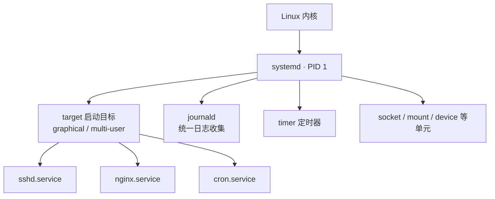

# 第 6 章 · systemd 服务与日志

> 📍 位置：阶段 2 · 进阶篇 · 第 6 章 ｜ ⏱ 预计用时：45 分钟 ｜ 难度：★★★☆☆
>
> ⬅️ 上一章：[05-Bash脚本编程](05-Bash脚本编程.md) ｜ ➡️ 下一章：[07-磁盘与文件系统](07-磁盘与文件系统.md)

第 5 章你写的脚本只能手动运行。想让它在开机时自动启动、崩溃后自动拉起、日志统一归档——就需要把脚本交给系统的"总管家" **systemd**。现代 Linux 上的服务管理、开机流程、日志查询，全部围绕它展开。

## 🎯 学习目标

学完本章，你将能够：

- 用一段话讲清 init 系统的演进，以及 systemd（system daemon）为什么成为主流；
- 说出 unit（单元）的概念，认识 `.service`、`.target` 等常见类型；
- 熟练使用 `systemctl` 的启动、停止、重启、重载、开机自启与状态查询命令；
- 从零写出一个自己的 service 文件，并用 `daemon-reload` 让系统认识它；
- 使用 `journalctl` 按 unit、时间、优先级检索日志，并持续跟踪输出；
- 描述 Linux 的开机流程，说出 target 与传统 runlevel（运行级）的对应关系。

## 🧠 核心概念



[在学习站暂停、单步或重播](https://zhuguang-zfg.github.io/linux/#animation=journal-query.svg)。动画中的输入输出为教学示意，需用本章实验验证。



[在学习站暂停、单步或重播](https://zhuguang-zfg.github.io/linux/#animation=systemd-restart.svg)。动画中的输入输出为教学示意，需用本章实验验证。

### 6.1 init 进化史：一分钟

开机后内核启动的第一个进程（PID 1）叫 **init**，它负责把系统的其余部分"带起来"，历代演进大致是：

- **SysV init**：经典方案，按编号顺序（S01、S02…）串行执行 `/etc/rc?.d` 下的启动脚本。结构简单，但开机慢、服务依赖只靠编号约定；
- **Upstart**：Ubuntu 在 9.10–14.10 期间使用的过渡方案，引入了事件驱动思想，后随 systemd 普及而退场；
- **systemd**：2010 年由 Lennart Poettering 等人发起，Debian 8 / Ubuntu 15.04 起成为默认。它用**单元文件**声明式地描述服务，按依赖关系**并行启动**，还附带 socket 激活、定时器、统一日志等一整套组件。如今几乎所有主流发行版都以它为 PID 1。

### 6.2 unit：systemd 的管理单位

systemd 不直接管理"脚本"，而是管理 **unit（单元）**。每个 unit 就是一个配置文件，常见类型：

| 后缀 | 类型 | 用途 |
|---|---|---|
| `.service` | 服务 | 守护进程（本章主角） |
| `.target` | 目标 | 一组 unit 的集合，类似"启动档位" |
| `.timer` | 定时器 | 定时触发服务（cron 的现代替代品） |
| `.socket` | 套接字 | 端口有连接时才拉起对应服务 |
| `.mount` | 挂载 | 声明挂载点（下一章的 fstab 也有对应单元） |

### 6.3 systemd 架构



作为 PID 1，systemd 是所有进程的祖先：它按 target 的要求拉起服务，**全程监视**它们的生命周期，崩溃了按策略自动重启，并把进程的标准输出、标准错误统统转交给 journald 记录。

### 6.4 开机流程：七步记牢

1. 固件自检（BIOS / UEFI）；
2. 引导加载器 GRUB 读取启动项；
3. 内核载入内存，解包 initramfs（临时根文件系统）；
4. 内核启动 PID 1——现代 Linux 上就是 systemd；
5. systemd 读取默认目标（`graphical.target` 或 `multi-user.target`）；
6. 按依赖关系**并行**启动该目标下的所有 unit；
7. 拉起 getty 或显示管理器，等待用户登录。


## 🛠 命令实操

> 以下命令可直接复制运行（Ubuntu 22.04 / Debian 12 验证通过）。涉及 `sudo systemctl` 的操作建议在虚拟机里练习。先确认你的 PID 1 确实是 systemd：`ps -p 1 -o comm=`，输出应为 `systemd`（WSL1 或部分容器不是，请改用虚拟机完成本章）。

### systemctl：服务的遥控器

```bash
sudo systemctl start ssh        # 启动
sudo systemctl stop ssh         # 停止
sudo systemctl restart ssh      # 重启（先停后启）
sudo systemctl reload ssh       # 重读配置（不中断服务，需服务本身支持）
systemctl status ssh            # 查看状态（不需要 sudo）
systemctl is-active ssh         # 只想知道活没活着：active / inactive
```

`status` 的输出值得逐行看懂：

```text
● ssh.service - OpenBSD Secure Shell server
     Loaded: loaded (/lib/systemd/system/ssh.service; enabled; vendor preset: enabled)
     Active: active (running) since Mon 2026-10-06 09:12:33 CST; 2h 4min ago
   Main PID: 780 (sshd)
      Tasks: 1 (limit: 4602)
     Memory: 4.2M
        CPU: 180ms
```

- `Loaded` 行末尾的 **enabled** 是开机自启状态；
- `Active: active (running)` 是当前运行状态；
- `Main PID` 是主进程号，systemd 就是盯着它判断服务死活。

开机自启与取消：

```bash
sudo systemctl enable ssh        # 设为开机自启（本质是创建符号链接）
sudo systemctl disable ssh       # 取消开机自启
sudo systemctl enable --now ssh  # 自启 + 立即启动，一步到位
systemctl is-enabled ssh         # 查询自启状态
```

**注意：enable ≠ start**。enable 只管"下次开机"，不影响"现在"；反过来 start 也不会改变开机自启设置。两者互相独立，`enable --now` 才是一步到位的写法。

### 写一个自己的服务

systemd 最迷人的地方：一个普通的命令行程序，写个配置文件就能变成"正经服务"。先准备一个最小的 Web 程序——Python 自带的静态文件服务器：

```bash
sudo mkdir -p /srv/www
echo "<h1>Hello systemd</h1>" | sudo tee /srv/www/index.html
```

创建 `/etc/systemd/system/demo-web.service`（需要 sudo 权限编辑）：

```ini
[Unit]
Description=Demo Web Server
After=network.target

[Service]
Type=simple
User=www-data
WorkingDirectory=/srv/www
ExecStart=/usr/bin/python3 -m http.server 8000
Restart=on-failure
RestartSec=5

[Install]
WantedBy=multi-user.target
```

三个小节各司其职：

- `[Unit]`：描述与依赖。`After=network.target` 表示"等网络就绪再启动我"；
- `[Service]`：怎么运行。`ExecStart` 是启动命令（**不经过 shell**，不能在里面写 `>` 或管道）；`Restart=on-failure` 表示异常退出时自动拉起，`RestartSec=5` 是重试间隔；
- `[Install]`：`WantedBy=multi-user.target` 表示"开机进入多用户模式时带上我"——`systemctl enable` 创建的那个符号链接就指向这里。

让 systemd 认识它并启动：

```bash
sudo systemctl daemon-reload            # 重扫所有 unit 文件（改完必须执行！）
sudo systemctl enable --now demo-web.service
systemctl is-active demo-web.service
curl -I http://localhost:8000
```

预期输出：

```text
active
HTTP/1.1 200 OK
Server: SimpleHTTP/0.6 Python/3.10.12
```

试试"杀不死"的效果：用 `kill` 干掉主进程，5 秒内 systemd 会把它拉起来——这就是 `Restart=on-failure` 的价值。不用了就 `sudo systemctl stop demo-web.service` 并 `sudo systemctl disable demo-web.service` 收尾。


### journalctl：统一日志检索

过去日志散落在 `/var/log` 的各个文件里，systemd 把它们统一收进 **journal**，用 `journalctl` 查询：

```bash
journalctl -u demo-web.service                 # 只看这个 unit 的日志
journalctl -u demo-web.service -f              # 持续跟踪（类似 tail -f），Ctrl+C 退出
journalctl -b                                  # 本次开机以来的全部日志
journalctl -b -1                               # 上一次开机（排查"上次为什么挂了"）
journalctl --since "2026-10-06 08:00" --until "2026-10-06 09:00"
journalctl -p err                              # 只看 err 及更严重级别
journalctl -u ssh -p err --since today         # 条件可以叠加
journalctl --disk-usage                        # journal 占了多少磁盘
```

`-p`（priority）接受 `emerg alert crit err warning notice info debug` 八个级别（由重到轻），`-p err` 表示 err 以及比它更严重的都算。日志默认带颜色并进入分页器（less），在分页器里按 `/` 还能继续搜索关键字。

### target 与 runlevel 对照

systemd 用 target 取代了 SysV 的 runlevel（运行级）概念，对应关系如下：

| 传统 runlevel | systemd target | 含义 |
|---|---|---|
| 0 | poweroff.target | 关机 |
| 1（s、S） | rescue.target | 单用户救援模式 |
| 2、3、4 | multi-user.target | 多用户文本界面 |
| 5 | graphical.target | 多用户图形界面 |
| 6 | reboot.target | 重启 |

常用操作：

```bash
systemctl get-default                         # 查看默认启动目标
sudo systemctl set-default multi-user.target  # 服务器"去图形化"：改默认目标
sudo systemctl isolate graphical.target       # 临时切换（不影响下次开机）
```

最后送一条装机后必跑的命令，看看开机到底慢在谁身上：

```bash
systemd-analyze blame | head -5
```

## 💡 避坑指南

1. **改了 unit 文件不生效**：九成是忘了 `sudo systemctl daemon-reload`。systemd 只在重载时才重新读取 unit 文件，这是新手最常撞的一堵墙。
2. **enable 了却没 start**（或反过来）：两者互不包含。养成 `enable --now` 一步到位的习惯。
3. **普通用户看不全系统日志**：journal 默认限制权限。把用户加进 `adm` 组（`sudo usermod -aG adm 用户名`，重新登录生效）即可阅读系统级日志。
4. **`Restart=always` 与 `Restart=on-failure` 别乱选**：前者无论怎么退出都拉起，后者只在异常退出时拉起。常驻服务一般选 `on-failure`；一次性脚本该用 `Type=oneshot`，别硬套重启策略。
5. **直接改发行版自带的 unit 文件**：系统升级时会被覆盖。想定制官方服务，用 `sudo systemctl edit ssh` 生成 drop-in 覆盖片段，而不是改 `/lib/systemd/system` 下的原文件。
6. **端口被占时先查再动**：`ss -ltnp` 找出监听进程，弄清归属再决定换端口还是停服务，不要上来就杀进程。

## ✍️ 动手实验

### 实验 1：上线并"虐待"一个服务

按本节步骤部署 `demo-web.service`，然后：① 用 `curl -I http://localhost:8000` 确认服务可用；② 找到主进程并 `kill` 它，6 秒后再次 curl，验证 systemd 把它拉起来了；③ 用 `journalctl` 找到自动重启的痕迹。

<details>
<summary>💡 参考解法（先自己试！）</summary>

```bash
sudo systemctl start demo-web.service
curl -I http://localhost:8000
kill $(systemctl show -p MainPID --value demo-web.service)
sleep 6
curl -I http://localhost:8000              # 又是 200，说明被拉起
journalctl -u demo-web.service -n 20 --no-pager
```

`systemctl show -p MainPID --value` 直接输出主进程号，省去肉眼从 status 里找。journal 里能看到 "Scheduled restart job" 字样——那就是 systemd 在替你兜底。实验结束后记得 stop 并 disable 服务。
</details>

### 实验 2：做一次日志侦探

只回答三个问题，全部用 journalctl 完成：① 本次开机里，`ssh.service` 有没有 err 级别以上的日志？② 今天 8 点到 9 点之间系统记录了多少条日志？③ 哪个 unit 的日志行数最多？

<details>
<summary>💡 参考解法（先自己试！）</summary>

```bash
# ① 有输出 = 有问题；无输出 = 健康
journalctl -u ssh -p err -b --no-pager

# ② 数行数（时间范围换成你实际练习的时段）
journalctl --since "2026-10-06 08:00" --until "2026-10-06 09:00" | wc -l

# ③ 提取 unit 字段做 Top 榜（前几章的管道在此会师）
journalctl -o verbose --no-pager \
  | grep "_SYSTEMD_UNIT=" | sort | uniq -c | sort -nr | head -5
```

③ 的输出形如 `1234 _SYSTEMD_UNIT=xxx.service`，按次数倒序排列——第 1、2 章的组合拳在日志分析里每天都能用上。
</details>

## 📺 推荐视频

- [B站 · systemctl 管理服务](https://www.bilibili.com/video/BV1ZZ37zdEp2/?p=58) — Linux-老林，P58，23分49秒。服务管理与日志原理补充；journalctl 查询按本章实验。
- [B站 · 日志介绍与实例](https://www.bilibili.com/video/BV1Sv411r7vd/?p=117) — 韩顺平，P117，8分51秒。服务管理与日志原理补充；journalctl 查询按本章实验。
- [B站 · 日志服务原理图](https://www.bilibili.com/video/BV1Sv411r7vd/?p=118) — 韩顺平，P118，4分30秒。服务管理与日志原理补充；journalctl 查询按本章实验。
- [YouTube · systemd 服务管理](https://www.youtube.com/watch?v=Kzpm-rGAXos) — Learn Linux TV，47分40秒。服务管理与日志原理补充；journalctl 查询按本章实验。

[](https://www.bilibili.com/video/BV1ZZ37zdEp2/?p=58)

[在学习站查看配套媒体](https://zhuguang-zfg.github.io/linux/#read=docs%2F02-advanced%2F06-systemd%E6%9C%8D%E5%8A%A1%E4%B8%8E%E6%97%A5%E5%BF%97.md) · [视频资料与核验说明](../../resources/videos.md)。标题、作者和分P已核对，未逐条完成实播，播放限制以原站为准。

## ✅ 自测清单

- [ ] 能说出 init 的作用，并讲清 systemd 相比 SysV init 的两个核心优势
- [ ] 能说出 `.service`、`.target`、`.timer` 三种 unit 的用途
- [ ] 能区分 `enable`、`start` 与 `enable --now` 的效果差异
- [ ] 能默写 service 文件的三个小节，并解释 `ExecStart`、`Restart`、`WantedBy`
- [ ] 知道修改 unit 文件后必须先 `daemon-reload`
- [ ] 会用 `journalctl -u / -f / -b / --since / -p` 五种方式检索日志
- [ ] 能说出 graphical.target 与 multi-user.target 分别对应哪个传统运行级
- [ ] 能按顺序描述从按下电源到出现登录界面的七个步骤

## 🔗 延伸阅读

- systemd 官方主页（组件与设计文档）：[freedesktop.org/wiki/Software/systemd](https://www.freedesktop.org/wiki/Software/systemd/)
- Arch Wiki 的 systemd 页（质量极高的实践参考）：[Systemd](https://wiki.archlinux.org/title/Systemd)
- Arch Wiki 的日志专页：[Systemd/Journal](https://wiki.archlinux.org/title/Systemd/Journal)
- 📝 章节练习：[02-进阶篇练习](../../exercises/02-进阶篇练习.md)
- ⏭ 磁盘与文件系统，让数据有处安放：[07-磁盘与文件系统](07-磁盘与文件系统.md)
