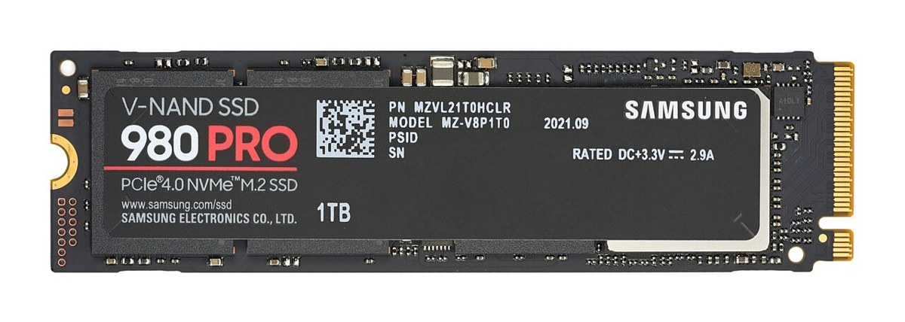
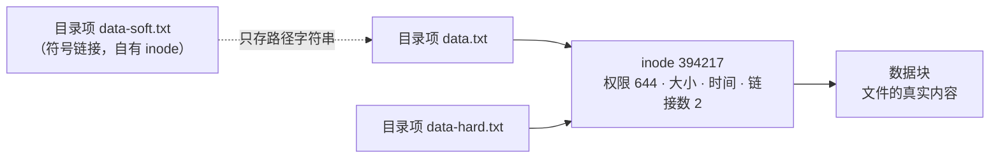
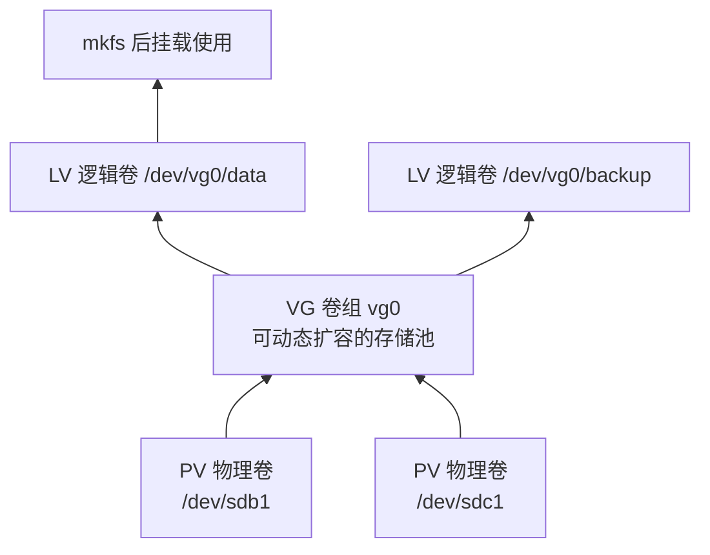

# 第 7 章 · 磁盘与文件系统

> 📍 位置：阶段 2 · 进阶篇 · 第 7 章 ｜ ⏱ 预计用时：45 分钟 ｜ 难度：★★★☆☆
>
> ⬅️ 上一章：[06-systemd服务与日志](06-systemd服务与日志.md) ｜ ➡️ 下一章：[08-网络基础与远程连接](08-网络基础与远程连接.md)

你在阶段 1 就会 `mkdir` 和 `cd` 了，但"文件到底存在哪""目录树背后的磁盘长什么样"还是黑盒。本章打开这个黑盒：看盘、分区、格式化、挂载、排查空间，并搞懂让"链接""恢复删除"等现象说得通的 **inode**。

## 🎯 学习目标

学完本章，你将能够：

- 用 `lsblk` 和 `fdisk -l` 看清系统里的磁盘与分区结构；
- 描述 fdisk 交互式分区的完整步骤，并知道 `partprobe` 的作用；
- 说出 ext4 与 xfs 两代文件系统的取舍；
- 用 `mkfs` 格式化、`mount` 挂载，并用 UUID 方式写入 `/etc/fstab` 实现开机自动挂载；
- 用 `df -h` 与 `du -sh` 组合排查"空间去哪了"；
- 说出软链接与硬链接的区别，并用 inode 解释一切；
- 讲清 LVM 的 PV / VG / LV 三层结构解决什么问题。

## 🧠 核心概念




[在学习站暂停、单步或重播](https://zhuguang-zfg.github.io/linux/#animation=inode-links.svg)。动画中的输入输出为教学示意，需用本章实验验证。




实物照片展示持久存储器件，动画展示它如何接入目录树，两者不是同一层。照片：D-Kuru，CC BY-SA 4.0，见 [署名](../../assets/images/CREDITS.md)。

### 7.1 三层结构：磁盘 → 分区 → 文件系统

一块物理磁盘可以先切成**分区（partition）**，每个分区上建一个**文件系统（filesystem）**，文件系统再**挂载（mount）**到目录树的某个目录上。你在 `/home/zhugu` 里读写文件时，内核根据挂载表把操作翻译成对某块盘某个分区的读写——路径与物理位置就这样对上了。

```bash
lsblk
```

预期输出：

```text
NAME   MAJ:MIN RM  SIZE RO TYPE MOUNTPOINTS
sda      8:0    0   40G  0 disk
├─sda1   8:1    0    1M  0 part
├─sda2   8:2    0  513M  0 part /boot/efi
└─sda3   8:3    0 39.5G  0 part /
sdb      8:16   0   20G  0 disk
```

`sda` 是第一块盘，`sda3` 是它的第三个分区，挂载在根目录；`sdb` 是一块还没分区的空盘——本章的"练习素材"。

### 7.2 文件系统：ext4 与 xfs

文件系统决定"文件和目录如何组织在磁盘上"。两者都是日志式文件系统（journaling，先记账再动笔，断电可恢复）：

| 对比项 | ext4 | xfs |
|---|---|---|
| 常见于 | Ubuntu / Debian 默认 | RHEL / CentOS 默认 |
| 单文件上限 | 16 TiB | 8 EiB |
| 缩容 | 支持（需卸载后进行） | **不支持** |
| 在线扩容 | 支持 | 支持 |
| 修复工具 | fsck.ext4 | xfs_repair |
| 擅长场景 | 通用、小文件居多 | 大文件、高并发读写 |

### 7.3 inode：文件的本质

**inode**（index node，索引节点）是文件系统的"户口本"：权限、大小、时间戳、数据块位置都记在 inode 里，而**文件名只是目录里的一条映射**（"文件名 → inode 号"）。一个 inode 可以有多个名字——这就是硬链接的原理。



### 7.4 LVM：把多块盘拼成一个池子

**LVM**（Logical Volume Manager，逻辑卷管理）在磁盘与文件系统之间加了一层抽象：把分区或整盘初始化成 **PV**（Physical Volume，物理卷），PV 汇入 **VG**（Volume Group，卷组）这个"存储池"，再从池子里划出 **LV**（Logical Volume，逻辑卷）供格式化挂载。好处是空间调度自由：池子里加块盘，任何一个 LV 都能在线扩容，还能做快照备份。



## 🛠 命令实操

> 分区与格式化是**毁灭性操作**：目标写错，数据全无。以下实操在虚拟机的空盘 `/dev/sdb`（对应 7.1 的 lsblk 输出）上进行，**动手前先 `lsblk` 确认设备名，别把系统盘搭进去**。

### 看盘：lsblk 与 fdisk -l

```bash
lsblk -f                 # 连文件系统类型、UUID 一起看
sudo fdisk -l /dev/sdb   # 看这块盘的分区表详情
```

`fdisk -l` 预期输出（空盘只有头两行）：

```text
Disk /dev/sdb: 20 GiB, 21474836480 bytes, 41943040 sectors
Units: sectors of 1 * 512 = 512 bytes
Sector size (logical/physical): 512 bytes / 512 bytes
```

### 分区：fdisk 交互五步

```bash
sudo fdisk /dev/sdb
```

进入交互界面后依次输入（`#` 后是注释）：

```text
命令(输入 m 获取帮助)：n        # new，新建分区
分区类型：p                     # primary，主分区
分区号：回车                    # 默认 1
第一个扇区：回车                # 默认从盘头开始
最后一个扇区：回车              # 默认用满整盘
命令(输入 m 获取帮助)：w        # write，写入分区表并退出
```

让内核重新读取分区表（不重启就生效），然后确认：

```bash
sudo partprobe /dev/sdb
lsblk /dev/sdb
```

预期输出：

```text
NAME   MAJ:MIN RM  SIZE RO TYPE MOUNTPOINTS
sdb      8:16   0   20G  0 disk
└─sdb1   8:17   0   20G  0 part
```

### 格式化与挂载

给分区建文件系统（格式化），再挂到目录树上：

```bash
sudo mkfs.ext4 /dev/sdb1        # 也可 sudo mkfs.xfs /dev/sdb1
sudo mkdir -p /mnt/data
sudo mount /dev/sdb1 /mnt/data
df -h /mnt/data
```

`df -h` 预期输出（Filesystem 一行能看到新分区）：

```text
Filesystem      Size  Used Avail Use% Mounted on
/dev/sdb1        20G   24K   19G   1% /mnt/data
```

### fstab：开机自动挂载（UUID 方式）

用设备名（`/dev/sdb1`）写配置有个隐患：插拔磁盘后字母可能变。**UUID**（Universally Unique Identifier，设备出厂格式化时就确定的唯一编号）才是稳妥方案。先查编号：

```bash
sudo blkid /dev/sdb1
```

预期输出：

```text
/dev/sdb1: UUID="5f2e9c4a-8b3d-4e21-9f7a-1c2d3e4f5a6b" TYPE="ext4" PARTUUID="a1b2c3d4-01"
```

往 `/etc/fstab` 末尾追加一行（六个字段：设备 UUID、挂载点、文件系统、选项、dump 备份位、fsck 检查顺序）：

```text
UUID=5f2e9c4a-8b3d-4e21-9f7a-1c2d3e4f5a6b  /mnt/data  ext4  defaults  0  2
```

**写完 fstab 千万别直接重启验证**，先用这两条命令确认无误（外接盘可加 `nofail` 选项，盘不在也照常开机）：

```bash
sudo findmnt --verify           # 语法与逻辑校验
sudo mount -a                   # 按 fstab 挂载所有未挂载项，报错当场暴露
```

### 排查空间：df 与 du 双剑合璧

`df`（disk free）看**文件系统**整体水位，`du`（disk usage）看**目录**各自占了多少：

```bash
df -h                           # 全局水位，盯 Use% 超 80% 的行
du -sh /var/log                 # 单个目录总量（-s 汇总，-h 人类可读）
du -sh /var/* 2>/dev/null | sort -rh | head -5    # 找出 /var 下最大的 5 个目录
```

`df -h` 预期输出：

```text
Filesystem      Size  Used Avail Use% Mounted on
tmpfs           1.9G  1.1M  1.9G   1% /run
/dev/sda3        39G   12G   25G  32% /
tmpfs           9.4G     0  9.4G   0% /dev/shm
```

### 软链接 vs 硬链接

```bash
mkdir -p ~/disk-lab && cd ~/disk-lab
echo "重要数据" > data.txt
ln data.txt data-hard.txt        # 硬链接
ln -s data.txt data-soft.txt     # 软链接（符号链接）
ls -li
```

预期输出：

```text
394217 -rw-r--r-- 2 zhugu zhugu 15 Oct  6 10:00 data-hard.txt
394218 lrwxrwxrwx 1 zhugu zhugu  8 Oct  6 10:00 data-soft.txt -> data.txt
394217 -rw-r--r-- 2 zhugu zhugu 15 Oct  6 10:00 data.txt
```

两个"真身"共享 inode **394217**、链接数为 2；软链接有自己的 inode（394218），里面只存了路径字符串。删除原文件再验证：

```bash
rm data.txt
cat data-hard.txt                # 正常输出"重要数据"：inode 还在
cat data-soft.txt                # 报错：No such file or directory（悬空链接）
```

| 对比项 | 硬链接 | 软链接（符号链接） |
|---|---|---|
| 本质 | 同一 inode 的另一个名字 | 存放目标路径的独立文件 |
| inode 号 | 与原文件相同 | 自己的 inode |
| 跨文件系统 | 不可以 | 可以 |
| 链接目录 | 不可以 | 可以 |
| 原文件删除后 | 数据仍可访问 | 失效（悬空链接） |
| 创建命令 | `ln 源 目标` | `ln -s 源 目标` |

## 💡 避坑指南

1. **`mkfs`、`fdisk` 认设备不认人**：把 `/dev/sdb1` 手滑写成 `/dev/sda1`，系统盘当场报废。动手前 `lsblk` 双确认，虚拟机快照是好习惯。
2. **fstab 写错 = 开不了机**：改完必须 `findmnt --verify` + `mount -a` 验证；保险起见保留一个已打开的 root 终端，出事可回改。不确定的设备行加 `nofail,x-systemd.device-timeout=5s`。
3. **`df` 与 `du` 结果对不上**：常见原因是"文件已删除但仍被进程打开"（空间没释放），用 `sudo lsof +L1` 找出它们，重启或重启对应进程即可回收。
4. **硬链接的两个"不可以"**：不能跨文件系统（inode 号只在单个文件系统内唯一）、不能对目录（会形成环）。需要跨盘、链目录时，用软链接。
5. **xfs 不能缩容**：想给 xfs 分区"瘦身"只有一个办法——备份、重建、还原。规划时宁可先小后大（扩容易，缩容难）。
6. **挂载会"遮住"原目录内容**：挂载点目录里原有的文件在挂载期间不可见，卸载后回归，不是被删了。

## ✍️ 动手实验

### 实验 1：用 inode 破案

在 `~/disk-lab` 中重建 `data.txt` 与它的软、硬链接，然后依次回答：① 用 `ls -li` 找出与 `data.txt` 同 inode 的文件；② 给 `data.txt` 追加一行内容，两个链接读到的内容变了吗？为什么？③ 删除软链接、再删除硬链接，最后一次 `rm data.txt` 之后数据还找得回来吗？

<details>
<summary>💡 参考解法（先自己试！）</summary>

```bash
cd ~/disk-lab
echo "重要数据" > data.txt
ln data.txt data-hard.txt && ln -s data.txt data-soft.txt
ls -li                                   # ① data.txt 与 data-hard.txt 同 inode
echo "第二行" >> data.txt
cat data-hard.txt                        # ② 变了：三个名字指向同一份数据
rm data-soft.txt data-hard.txt data.txt
# ③ 找不回：链接数归 0 后，文件系统回收了 inode 与数据块
```

②里追加内容改的是**同一个 inode 指向的数据块**，所以所有名字同时"看到"。③说明：删除文件只是删名字，**最后一个名字消失**时数据才真正释放——这也是"恢复删除文件"如此困难的根本原因。
</details>

### 实验 2：在镜像文件里走完"格式化 → 挂载 → 卸载"全流程

没有空盘也能练：用一个 64 MiB 的普通文件冒充分区（loop 设备），安全完成 mkfs、mount、写入、卸载、重挂验证持久化。**全程不要碰任何 `/dev/sd*` 设备。**

<details>
<summary>💡 参考解法（先自己试！）</summary>

```bash
lab=$(mktemp -d ~/disk-lab-img.XXXX)
truncate -s 64M "$lab/disk.img"            # 造一个 64MiB 的"空盘"
mkfs.ext4 -F "$lab/disk.img"               # 在镜像里建 ext4（-F 跳过确认）
mkdir -p "$lab/mnt"
sudo mount -o loop "$lab/disk.img" "$lab/mnt"
printf 'persistent data\n' | sudo tee "$lab/mnt/hello.txt"
sudo umount "$lab/mnt"
ls -A "$lab/mnt"                           # 卸载后目录是空的
sudo mount -o loop "$lab/disk.img" "$lab/mnt"
cat "$lab/mnt/hello.txt"                   # persistent data —— 数据在镜像里
sudo umount "$lab/mnt" && rm -rf "$lab"
```

`-o loop` 让内核把这个文件"看作"块设备。卸载后挂载点空空如也，重新挂载数据又回来了——直观证明**数据跟着文件系统走，不跟着挂载点走**。WSL 或受限容器若不支持 loop 挂载，请在虚拟机中完成。
</details>

## 📺 推荐视频

- [B站 · 磁盘使用情况查询](https://www.bilibili.com/video/BV1Sv411r7vd/?p=60) — 韩顺平，P60，7分57秒。观看对应主题后，回到本章用实际输入和输出验证。

[](https://www.bilibili.com/video/BV1Sv411r7vd/?p=60)

[在学习站查看配套媒体](https://zhuguang-zfg.github.io/linux/#read=docs%2F02-advanced%2F07-%E7%A3%81%E7%9B%98%E4%B8%8E%E6%96%87%E4%BB%B6%E7%B3%BB%E7%BB%9F.md) · [视频资料与核验说明](../../resources/videos.md)。标题、作者和分P已核对，未逐条完成实播，播放限制以原站为准。

## ✅ 自测清单

- [ ] 能用 `lsblk` 说出系统里有几块盘、每块盘有几个分区、各挂载在哪
- [ ] 能按顺序说出 fdisk 交互分区五步，并知道 `partprobe` 用来做什么
- [ ] 能说出 ext4 与 xfs 在缩容支持和适用场景上的差异
- [ ] 会用 UUID 方式写 fstab 挂载行，并知道六个字段的含义
- [ ] 知道改完 fstab 必须用 `findmnt --verify` 和 `mount -a` 验证
- [ ] 会用 `df -h` 与 `du -sh` 配合定位空间占用大户
- [ ] 能用 inode 解释硬链接与软链接的四个区别
- [ ] 能画出 PV → VG → LV 的层次并说出 LVM 的核心好处

## 🔗 延伸阅读

- hier(7)：Linux 文件系统层次标准：<https://www.man7.org/linux/man-pages/man7/hier.7.html>
- inode(7)：inode 的官方定义：<https://www.man7.org/linux/man-pages/man7/inode.7.html>
- fstab(5)：六个字段的权威解释：<https://www.man7.org/linux/man-pages/man5/fstab.5.html>
- Arch Wiki 的 LVM 页：<https://wiki.archlinux.org/title/LVM>
- 📝 章节练习：[02-进阶篇练习](../../exercises/02-进阶篇练习.md)
- ⏭ 网络基础与远程连接，让 Linux 与世界对话：[08-网络基础与远程连接](08-网络基础与远程连接.md)
