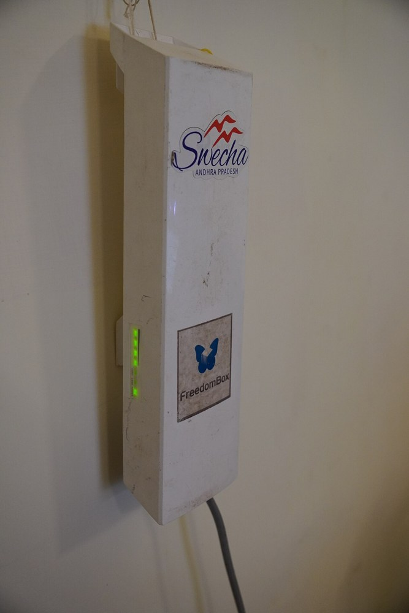
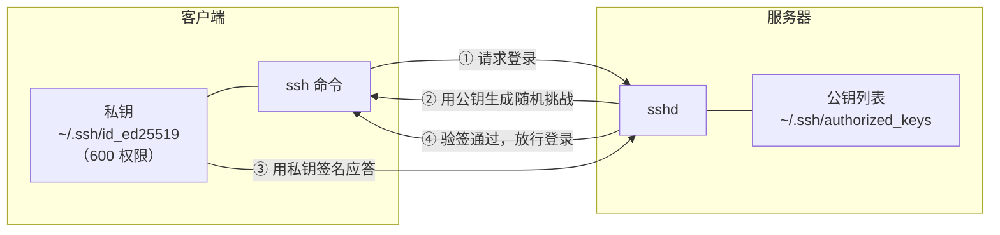

# 第 8 章 · 网络基础与远程连接

> 📍 位置：阶段 2 · 进阶篇 · 第 8 章 ｜ ⏱ 预计用时：45 分钟 ｜ 难度：★★★☆☆
>
> ⬅️ 上一章：[07-磁盘与文件系统](07-磁盘与文件系统.md) ｜ ➡️ 下一章：[09-Git与学习笔记协作](09-Git与学习笔记协作.md)

服务器装好了，但它还只是一台"孤岛"。本章让 Linux 与世界对话：看懂自己的 IP、排查"网站打不开"、用 SSH 安全登录远程主机、在机器之间传文件。下一章再用 Git 保存并共享实验笔记。

## 🎯 学习目标

学完本章，你将能够：

- 用 `ip a`、`ip r` 查看网卡地址与路由表，并说出它们取代了哪些老命令；
- 用 `ss -tlnp` 查清"谁在监听哪个端口"；
- 用 `ping`、`curl -I`、`wget` 三板斧快速判断连通性；
- 说清 DNS 解析链路：`/etc/hosts`、`/etc/resolv.conf` 与 `dig` 各自的角色；
- 用 `scp` 与 `rsync -avzP` 在机器间传文件，并说出 rsync 增量同步的原理；
- 配置 SSH 密钥免密登录，用一个 `~/.ssh/config` 管理多台主机；
- 用 `ssh -L` 建立本地端口转发隧道。

## 🧠 核心概念



[在学习站暂停、单步或重播](https://zhuguang-zfg.github.io/linux/#animation=tcp-handshake.svg)。动画中的输入输出为教学示意，需用本章实验验证。



[在学习站暂停、单步或重播](https://zhuguang-zfg.github.io/linux/#animation=dns-lookup.svg)。动画中的输入输出为教学示意，需用本章实验验证。


物理连接只是第一步，随后还要检查地址、路由和服务。照片：David Monniaux，CC BY-SA 3.0，见 [署名](../../assets/images/CREDITS.md)。



家用路由器把宽带接入、交换和无线接入集于一台设备，多数情况下你并不直接配置它，而是通过网页管理页操作。照片：Saiphani02，CC BY 4.0，见 [署名](../../assets/images/CREDITS.md)。



看动画时分清“客户端验证服务器”和“服务器验证用户”，私钥不会发送给服务端。

### 8.1 IP、路由与端口

- **IP 地址**（IP address）标识主机上的一个网络接口，如 `192.168.1.10/24`（`/24` 是子网掩码长度）；
- **路由表**（routing table）决定"去往某地址该从哪个口走、交给谁转发"，其中 `default via ...` 是所有未知目的地的默认出口；
- **端口**（port）标识主机上的具体服务，一台机器靠"IP + 端口"区分成百上千个连接。

### 8.2 一条数据的旅程

你在浏览器里打开一个网页时，请求大致经历：域名 → DNS 解析成 IP → 路由逐跳转发 → 到达服务器端口 → 服务应答返回。


### 8.3 SSH 与密钥认证

**SSH**（Secure Shell）是远程管理的标准协议。密码登录之外，更常用**密钥对**：私钥（private key）留在本地绝不外传，公钥（public key）放到服务器上。登录时服务器用公钥"出题"，你的私钥"签名"作答——密码从未在网络上出现过。



## 🛠 命令实操

> 以下命令可直接复制运行（Ubuntu 22.04 / Debian 12 验证通过）。远程操作（scp、rsync、ssh）需要另一台 Linux 主机或虚拟机，示例使用文档保留 IP `192.168.1.20`。

### 看自己：ip a 与 ip r

老一代的 `ifconfig`（来自 net-tools 包）已停止维护且默认不装，`ip` 命令（iproute2 包）是官方替代：

```bash
ip a        # ip address，看网卡与 IP 地址
ip r        # ip route，看路由表
```

`ip a` 预期输出（节选）：

```text
1: lo: <LOOPBACK,UP,LOWER_UP> mtu 65536 qdisc noqueue state UNKNOWN
    inet 127.0.0.1/8 scope host lo
2: ens33: <BROADCAST,MULTICAST,UP,LOWER_UP> mtu 1500 qdisc fq_codel state UP
    inet 192.168.1.10/24 brd 192.168.1.255 scope global dynamic ens33
```

`ip r` 预期输出：

```text
default via 192.168.1.1 dev ens33 proto dhcp metric 100
192.168.1.0/24 dev ens33 proto kernel scope link src 192.168.1.10
```

第一行就是默认网关：所有"不认识"的目的地都交给 `192.168.1.1`。

### 看端口：ss -tlnp

`ss`（socket statistics）取代了老的 `netstat`：

```bash
sudo ss -tlnp
```

预期输出：

```text
State   Recv-Q  Send-Q   Local Address:Port   Peer Address:Port  Process
LISTEN  0       4096         127.0.0.1:631          0.0.0.0:*      users:(("cupsd",pid=812,fd=7))
LISTEN  0       511              0.0.0.0:8000         0.0.0.0:*      users:(("python3",pid=3456,fd=3))
LISTEN  0       4096           0.0.0.0:22           0.0.0.0:*      users:(("sshd",pid=780,fd=3))
```

`-t` TCP、`-l` 只看监听（LISTEN）、`-n` 不做域名反解、`-p` 显示进程。读法：第 6 章 demo 服务监听 `0.0.0.0:8000`（所有网卡都能访问），而 `127.0.0.1:631` 只有本机能连。

### 连通性三板斧

```bash
ping -c 4 example.com        # 网络层通不通（ICMP）
curl -I https://example.com  # 应用层通不通，只取响应头
wget -q https://example.com/index.html && ls -lh index.html   # 下载文件
```

`ping -c 4` 预期输出：

```text
PING example.com (23.192.228.80) 56(84) bytes of data.
64 bytes from example.com (23.192.228.80): icmp_seq=1 ttl=56 time=13.2 ms
64 bytes from example.com (23.192.228.80): icmp_seq=2 ttl=56 time=12.8 ms

--- example.com ping statistics ---
4 packets transmitted, 4 received, 0% packet loss, time 3005ms
```

`curl -I` 预期输出：

```text
HTTP/1.1 200 OK
Content-Type: text/html; charset=UTF-8
```

排查口诀：**ping 不通查网络，ping 通但 curl 失败查服务与防火墙**（对端禁 ping 时前者也会误报）。

### DNS：域名是怎么变成 IP 的

查询顺序由 `/etc/nsswitch.conf` 决定，默认**先查本地 hosts，再问 DNS**：

- `/etc/hosts`：手工维护的静态映射，优先级最高。开发时把测试域名指向本机全靠它：

```text
127.0.0.1  myproject.local
```

- `/etc/resolv.conf`：声明"去问哪个 DNS 服务器"：

```text
nameserver 192.168.1.1
nameserver 223.5.5.5
```

- `dig`：直接向 DNS 服务器发起查询的"显像管"，绕过 hosts、便于诊断：

```bash
dig +short example.com
```

预期输出（IP 以实际解析为准，会随时间变化）：

```text
23.192.228.80
```

### scp 与 rsync：机器间传文件

`scp` 基于 SSH，简单直接：

```bash
scp notes.txt deploy@192.168.1.20:~/          # 推送单个文件
scp -r ~/project deploy@192.168.1.20:~/       # 递归传目录
scp deploy@192.168.1.20:~/log.txt .           # 拉取到本地
```

`rsync` 是大量文件同步的正解，`-a` 归档（递归并保留权限、时间戳等）、`-v` 详细、`-z` 压缩、`-P` 显示进度并支持断点续传：

```bash
rsync -avzP ~/project/ deploy@192.168.1.20:backup/project/
```

**增量同步原理**：rsync 先把目标端已存在的文件分块计算校验值发给源端，源端逐块比对（滚动校验），**只传输有差异的块**，再在目标端拼装成完整文件。改了一个 1 GB 文件里的几行，二次同步可能只传几十 KB。注意源路径结尾的 `/` 表示"复制目录**内容**"，不带 `/` 则多一层目录——rsync 第一大坑。同步方向带删除逻辑时（`--delete`），先加 `--dry-run` 预演再真跑。

### SSH 密钥登录三步

```bash
ssh-keygen -t ed25519 -C "zhugu@laptop"                # ① 生成密钥对，一路回车即可
ssh-copy-id -i ~/.ssh/id_ed25519.pub deploy@192.168.1.20  # ② 把公钥装到服务器（最后一次输密码）
ssh deploy@192.168.1.20                                # ③ 免密登录成功
```

`ssh-keygen` 预期输出：

```text
Generating public/private ed25519 key pair.
Your identification has been saved in /home/zhugu/.ssh/id_ed25519
Your public key has been saved in /home/zhugu/.ssh/id_ed25519.pub
```

### ~/.ssh/config：多主机管理

机器一多，`ssh -p 2222 -i ~/.ssh/id_ed25519 deploy@192.168.1.20` 这种长命令就该退役了。创建 `~/.ssh/config`（权限 600）：

```text
Host web
    HostName 192.168.1.20
    User deploy
    Port 2222
    IdentityFile ~/.ssh/id_ed25519
    ServerAliveInterval 60

Host db
    HostName 10.0.0.5
    User admin
    ProxyJump web

Host *
    Compression yes
```

之后 `ssh web` 等价于那一长串命令；`ProxyJump` 让你经 `web` 中转访问内网的 `db`；`Host *` 是所有主机的公共默认项。scp、rsync 也认这些别名，`scp file web:~/` 直接可用。

### 端口转发：ssh -L

服务只监听在服务器的 `127.0.0.1`（外部访问不到）时，用**本地转发**（local forwarding）把它的端口"借"到自己机器上来：

```bash
ssh -L 8080:localhost:80 deploy@web
```

这条命令在本机的 8080 端口开了一个监听，流量经 SSH 加密隧道到达 `web` 后，由它自己去连自己的 80 端口。期间浏览器访问 `http://localhost:8080`，看到的其实就是服务器上的那个网页。加 `-N` 表示只建隧道不打开远程 shell。

## 💡 避坑指南

1. **别再用 `ifconfig`/`netstat` 当第一选择**：它们属于 net-tools，已停止维护。记 `ip a`、`ip r`、`ss -tlnp` 这套现代组合。
2. **私钥权限太开放会被拒**：`chmod 700 ~/.ssh && chmod 600 ~/.ssh/id_ed25519`。SSH 检测到私钥全员可读时会拒绝使用它。
3. **首次连接的指纹校验不能跳过**：终端里那行 `ECDSA key fingerprint` 要与服务器方核对一致。生产环境严禁用 `StrictHostKeyChecking=no` 一关了之——那等于放弃中间人攻击防护。
4. **`Connection refused` 与超时是两种病**：refused 多是端口没监听或服务没起（用 `ss -tlnp` 验证）；超时多卡在网络或防火墙，逐跳排查。
5. **rsync 尾斜杠**：`src/` 传内容，`src` 连目录本身一起传。同步脚本写错它，目录层级当场翻倍。
6. **`~/.ssh/config` 用空格缩进、每台主机一个 `Host` 块**：多个匹配块时**先出现的先生效**，所以 `Host *` 放最后。
7. **ping 不通 ≠ 服务不通**：很多服务器禁 ICMP 回应。判断 Web 服务死活，`curl -I` 才是准绳。

## ✍️ 动手实验

### 实验 1：给本机服务做一次"体检"

不依赖远程主机：① 用 `ss -tlnp` 找出本机所有监听中的 TCP 端口及对应进程；② 对其中 HTTP 类服务（如第 6 章的 `localhost:8000`，没有就临时起一个）用 `curl -I` 确认返回 200；③ 把本次开机以来的本机 IP、默认网关、监听端口清单汇总保存到 `net-report.txt`。

<details>
<summary>💡 参考解法（先自己试！）</summary>

```bash
mkdir -p ~/net-lab && cd ~/net-lab
sudo ss -tlnp | tee ports.txt                     # ① 端口与进程
python3 -m http.server 8000 --bind 127.0.0.1 &    # ② 临时起个服务
curl -I http://localhost:8000                     # 预期 HTTP/1.1 200 OK
{ ip a; ip r; cat ports.txt; } > net-report.txt   # ③ 汇总
head -20 net-report.txt
kill %1                                           # 收尾：停掉临时服务
```

`{ ...; }` 是命令组，把三条命令的输出汇进一个重定向——第 1 章的知识的自然延伸。
</details>

### 实验 2：从零配置一台主机的免密登录

对一台可用的 Linux 主机（虚拟机即可，没有远程机时可用 `localhost` 配合本机 sshd 演示）完成：① 生成 ed25519 密钥对；② `ssh-copy-id` 安装公钥；③ 验证免密登录；④ 在 `~/.ssh/config` 里为它建别名并再次验证。

<details>
<summary>💡 参考解法（先自己试！）</summary>

```bash
sudo apt install openssh-server        # 本机演示才需要：装 sshd
sudo systemctl enable --now ssh
test -f ~/.ssh/id_ed25519.pub || ssh-keygen -t ed25519
ssh-copy-id -i ~/.ssh/id_ed25519.pub "$USER@localhost"
ssh "$USER@localhost" 'echo 登录成功 && hostname'   # 不再要密码
cat >> ~/.ssh/config <<'EOF'
Host lab
    HostName localhost
    User zhugu
    IdentityFile ~/.ssh/id_ed25519
EOF
sed -i "s/User zhugu/User $USER/" ~/.ssh/config
chmod 600 ~/.ssh/config
ssh lab 'echo 别名登录成功'
```

三个验证点：首次 `ssh-copy-id` 需要一次密码，之后不再要；`ssh-copy-id` 报错时先检查 `~/.ssh` 权限；别名方式与直连方式行为完全一致。最后把公钥内容与 `authorized_keys` 对比一下，理解"公钥上服务器、私钥留本地"。
</details>

## 📺 推荐视频

- [B站 · SSH 远程登录](https://www.bilibili.com/video/BV1Sv411r7vd/?p=14) — 韩顺平，P14，15分30秒。远程传输与 NAT 原理补充；网络配置与加固以本章为准。
- [B站 · 远程文件传输](https://www.bilibili.com/video/BV1Sv411r7vd/?p=15) — 韩顺平，P15，13分58秒。远程传输与 NAT 原理补充；网络配置与加固以本章为准。
- [B站 · NAT 网络原理图](https://www.bilibili.com/video/BV1Sv411r7vd/?p=63) — 韩顺平，P63，13分42秒。远程传输与 NAT 原理补充；网络配置与加固以本章为准。
- [B站 · SSH 远程连接实操](https://www.bilibili.com/video/BV1dd1yYGEfg/?p=1) — 热爱IT行业，P1，11分5秒。远程传输与 NAT 原理补充；网络配置与加固以本章为准。

[](https://www.bilibili.com/video/BV1Sv411r7vd/?p=14)

[在学习站查看配套媒体](https://zhuguang-zfg.github.io/linux/#read=docs%2F02-advanced%2F08-%E7%BD%91%E7%BB%9C%E5%9F%BA%E7%A1%80%E4%B8%8E%E8%BF%9C%E7%A8%8B%E8%BF%9E%E6%8E%A5.md) · [视频资料与核验说明](../../resources/videos.md)。标题、作者和分P已核对，未逐条完成实播，播放限制以原站为准。

## ✅ 自测清单

- [ ] 会用 `ip a` 与 `ip r` 查看地址和路由，并说出默认网关在路由表里长什么样
- [ ] 会用 `ss -tlnp` 判断某端口是否有服务监听、监听在哪个地址上
- [ ] 能说出 ping、curl -I、wget 各自回答的是什么问题
- [ ] 能按顺序说清一次域名解析经过 hosts、resolv.conf、dig 的角色分工
- [ ] 能解释 rsync 为什么第二次同步很快（增量同步原理）
- [ ] 能默写 SSH 密钥登录三步，并说出公钥、私钥各自放在哪里
- [ ] 会写 `~/.ssh/config` 的一个 Host 块，说出 `HostName`、`User`、`Port` 的作用
- [ ] 能解释 `ssh -L 8080:localhost:80 user@host` 这条隧道的数据流向

## 🔗 延伸阅读

- hosts(5)：本机静态解析表的官方说明：<https://www.man7.org/linux/man-pages/man5/hosts.5.html>
- socket(7)：理解端口与套接字的底层视角：<https://www.man7.org/linux/man-pages/man7/socket.7.html>
- Arch Wiki 的 SSH 权威实践页：<https://wiki.archlinux.org/title/OpenSSH>
- Arch Wiki 的网络配置总览：<https://wiki.archlinux.org/title/Network_configuration>
- TLDP《Network Administrators Guide》（经典网络教材）：<https://tldp.org/LDP/nag2/index.html>
- 📝 章节练习：[02-进阶篇练习](../../exercises/02-进阶篇练习.md)
- ⏭ 阶段 2 毕业旅行开始：[01-性能观测与调优](../03-pro/01-性能观测与调优.md)
