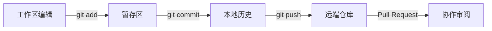

# 第 9 章 · Git 与学习笔记协作

> 📍 阶段 2 · 进阶篇 · 第 9 章 ｜ ⏱ 60 分钟 ｜ 难度：★★★☆☆
> ⬅️ [网络与远程连接](08-网络基础与远程连接.md) ｜ ➡️ [性能观测](../03-pro/01-性能观测与调优.md)

学到这里，你的笔记和实验记录已经不少了。问题在于：**三个月后你还记得清哪一条命令改过、为什么改、当时输出是什么吗？** 靠记忆和文件名（`笔记最终版-2-真的最终.md`）迟早会失效。

Git 解决的正是这个问题：它把你的每次修改变成**有说明、可回溯、能对比的快照**。它不是程序员的专利——写文档、做实验、维护知识库，同样的机制一样受益。本章不要求你会写代码，只要求你学会一件事：**让每次改动都留下能被检验的痕迹。**

## 🎯 学习目标

- 区分工作区、暂存区和提交历史。
- 在独立练习仓库中完成分支、提交和合并。
- 提交包含问题、证据与复验方式的文档改进。
- 说清「快进合并」与「真实合并」的区别。
- 写出经验证的贡献说明，不伪造运行结果。

## 🧠 核心概念



[在学习站暂停、单步或重播](https://zhuguang-zfg.github.io/linux/#animation=git-commit.svg)。动画中的输入输出为教学示意，需用本章实验验证。

### 9.1 三个区域：为什么需要「暂存」



很多新手困惑：「为什么不直接提交，非要先 add 一下？」

因为**一次提交应该只讲一件事**。你可能同时改了三处：修好一个错别字、补了一条命令、删掉一段过时说明。暂存区让你像挑水果一样，把「错别字」和「命令补充」分成两个提交——三个月后翻历史时，每条记录都干净、能读懂。

| 区域 | 内容 | 对应命令 |
|---|---|---|
| 工作区 | 你正在编辑的文件 | `git status` 查看哪些动了 |
| 暂存区 | 下一次提交要包含的改动 | `git add` 挑选、`git diff --cached` 检查 |
| 提交历史 | 已固化的快照，带说明与时间 | `git commit` 固化、`git log` 回看 |

### 9.2 提交是「快照」，不是「差异」

Git 保存的是**当时全部文件的快照**（用内容寻址去重，所以并不臃肿），你在 `git diff` 里看到的差异，是 Git 现算给你看的。理解这一点，很多行为就顺了：

- 每个提交都有唯一的哈希值（如 `a1b2c3d`），它是内容算出来的，内容一变哈希就变；
- 提交里记着作者、时间、说明，还有**父提交**——历史就是一张由父子关系连起来的网；
- 「回到某个提交」是切换指针，而不是「把差异反向套回去」。

### 9.3 分支只是「可移动的指针」

`main` 听起来像个文件夹，其实**只是一个指向某个提交的名字**。新建分支不是复制一份代码，只是多贴了一个标签。这正是 Git 分支飞快的原因。

- `HEAD` 指向你「现在在哪」——通常是某个分支名；
- `git switch -c 分支名` 创建并切换指针，瞬时完成；
- 提交时，当前分支指针跟着前移，旧提交纹丝不动。



### 9.4 快进合并 vs 真实合并

两条历史能不能「拉直」，取决于有没有分叉：

| 情况 | 现象 | 做法 |
|---|---|---|
| 快进合并 | 目标分支没有新提交，只是落后 | `git merge --ff-only` 直接把指针前移，历史是一条直线 |
| 真实合并 | 两边都各自有新提交 | 产生一个合并提交，或先理解冲突再处理 |

本章实验用 `--ff-only`：**不能快进时它会拒绝**，这是在提醒你「先看清分叉，别让工具替你悄悄做决定」。真实项目里的合并提交同样正常，关键是你要**知道刚才发生了什么**。

### 9.5 远端、PR 与「拖改到上游」

本地提交只有你自己看得见；`git push` 把提交送到远端（更早的章节里你已经用过远端仓库），协作才真正开始：

- `remote` 是远端地址的别名，通常叫 `origin`；
- 对公开知识库提改进的标准路径是：Fork（复制到自己名下）→ 克隆 → 新建分支改一个小问题 → push → 发起 **Pull Request**（PR，请求维护者把你的分支合并进去）；
- PR 是「讨论 + 审阅」的场所，维护者可能要求补充证据或调整措辞——这属于正常流程，不是被否定。

**冲突是什么？** 当你和别人的改动落在同一文件的同一位置，Git 无法替你们决定谁对，就会在文件里标出 `<<<<<<<`、`=======`、`>>>>>>>` 三段，让你手工取舍。冲突不是故障，是「需要人做决定的点」——保留正确内容、删掉标记、重新验证、再提交，冲突就消化完成了。

commit 是本地快照，push 才会把提交传到远端。Git 不会自动判断内容正确，也不能替代敏感信息管理；误提交密码后仅删除文件还不够，历史中可能仍有副本（要用专门的清理工具重写历史并轮换密钥）。

## 🛠 命令实操

本实验不修改教程仓库。安装 Git 后，在临时目录创建自己的练习仓库：

```bash
sudo apt install git
git_lab=$(mktemp -d)
cd "$git_lab"
git init -b main
# 只设置这个练习仓库的身份，不改全局配置
git config user.name 'Linux Learner'
git config user.email 'learner@example.invalid'
printf '# Linux notes\n\n查看目录：pwd\n' > notes.md
git status --short
git add notes.md
git diff --cached
git -c commit.gpgsign=false commit -m 'docs: record first Linux command'
```

预期第一次 `status` 显示 `?? notes.md`（未跟踪），`add` 后变成 `A notes.md`；提交后工作区干净。几个细节值得注意：

- `git init -b main`：直接以 `main` 为初始分支名，避免不同 Git 版本的默认名差异；
- `git config` 不带 `--global`：身份只写进这个练习仓库，不污染你的全局配置；
- `-c commit.gpgsign=false`：本次提交临时关闭签名要求（如果 `add` 提示要签名密钥）；
- `docs:` 前缀是**约定式提交**（Conventional Commits）的常见风格——一眼看出这次改的是文档。

接着开一个改进分支，体验「指针前移」：

```bash
git switch -c add-disk-note
printf '\n查看根文件系统：df -h /\n' >> notes.md
git diff
git add notes.md
git -c commit.gpgsign=false commit -m 'docs: add disk inspection note'
git switch main
git merge --ff-only add-disk-note
git log --oneline --graph --all
```

预期有两条提交，`main` 包含新增的磁盘命令。`git log --oneline --graph --all` 里的 `*` 与线条就是提交关系图的雏形——现在它是一条直线，将来分叉了你就能一眼看出。

再体验一次「回看自己的改动」：

```bash
git show HEAD
git log --oneline --stat
```

`git show HEAD` 展示最近一次提交的说明与内容差异；`--stat` 列出每个提交改了哪些文件、增删多少行。**这就是「可复现的记录」**：三个月后不必靠回忆，历史里写着当时改了什么。

### 从笔记到贡献

对公开知识库提改进时，先 Fork、克隆到自己的目录、创建分支；修改后按 [贡献说明](../../CONTRIBUTING.md) 运行检查，再提交 Pull Request。PR 描述写清：

```text
问题：哪一章、什么环境、哪一步出现了什么错误。
修改：具体改了哪条命令或解释。
证据：复现命令、实际输出、官方手册依据。
验证：修改后原来的操作是否成功，还有什么环境没测过。
```

这四行和你在实验章节里学到的方法完全一致：**问题 → 修改 → 证据 → 验证**，只是用在了协作场景。维护者最怕的不是「改错了」，而是「没说清当时怎么验证的」。

## 💡 避坑指南

- `git diff` 看未暂存改动，`git diff --cached` 看即将提交的改动；提交前扫一眼，避免把调试残留一起交出去。
- 不把 `.env`、私钥、真实日志和个人设备标识加入仓库。**提交前用 `git status` 最后确认一次**。
- 误提交密钥后：仅删除文件并再次提交**不等于**清除历史——需重写历史工具并**轮换全部相关密钥**，然后假设旧密钥已泄露。
- `git restore 文件` 会丢弃未提交修改，先看 diff；不要用 `reset --hard` 处理每一种问题（它会一并丢弃你还没提交的工作）。
- 多人同时编辑时先协调文件范围，遇到新改动不要直接覆盖别人的内容。
- 提交信息写「修了点东西」等于没写；写「docs: 修正 apt 章节的镜像源示例输出」才是三个月后能读懂的信息。

## ✍️ 动手实验

在新分支中给 notes.md 增加一个「常见误解与证据」，提交后回到 main 合并。最后能通过 `git show` 说明自己的修改，不依赖记忆。

<details><summary>参考验收</summary>

`git log --oneline` 包含你的新提交；`git show HEAD` 能看到新解释；`git status --short` 没有输出。不要伪造运行结果，没验证的环境直接写明。
</details>

**进阶挑战（选做）**：在练习仓库里故意制造一次冲突——建两个分支，在**同一行**写下不同内容，分别提交后合并，按 `<<<<<<<` 标记手工取舍并完成合并提交。你刚刚亲手走完了真实项目里最常见的协作场景。

## 📺 推荐视频

- [YouTube · Git 与 GitHub 入门](https://www.youtube.com/watch?v=RGOj5yH7evk) — freeCodeCamp.org，68分30秒。观看对应主题后，回到本章用实际输入和输出验证。

[](https://www.youtube.com/watch?v=RGOj5yH7evk)

[在学习站查看配套媒体](https://zhuguang-zfg.github.io/linux/#read=docs%2F02-advanced%2F09-Git%E4%B8%8E%E5%AD%A6%E4%B9%A0%E7%AC%94%E8%AE%B0%E5%8D%8F%E4%BD%9C.md) · [视频资料与核验说明](../../resources/videos.md)。标题、作者和分P已核对，未逐条完成实播，播放限制以原站为准。

## ✅ 自测清单

- [ ] 能解释 add、commit、push 分别改变哪里。
- [ ] 能说出暂存区存在的理由（一次提交只讲一件事）。
- [ ] 能解释「提交是快照」意味着什么（哈希由内容算出、diff 是现算的）。
- [ ] 能说出 main 与 HEAD 各自是什么。
- [ ] 能区分快进合并与真实合并，知道 `--ff-only` 为什么会拒绝。
- [ ] 能在自己的练习仓库完成分支与合并。
- [ ] 能写一份可复验的贡献说明（问题/修改/证据/验证）。

## 🔗 延伸阅读

- [Pro Git 中文书](https://git-scm.com/book/zh/v2)：免费官方书，第 2、3 章覆盖本章全部概念。
- [Conventional Commits](https://www.conventionalcommits.org/zh-hans/)：提交信息约定，看清 `docs:` 一类前缀的由来。
- [进阶篇练习](../../exercises/02-进阶篇练习.md)
- 下一章：[性能观测与调优](../03-pro/01-性能观测与调优.md)——机器变慢了，从哪里看起？