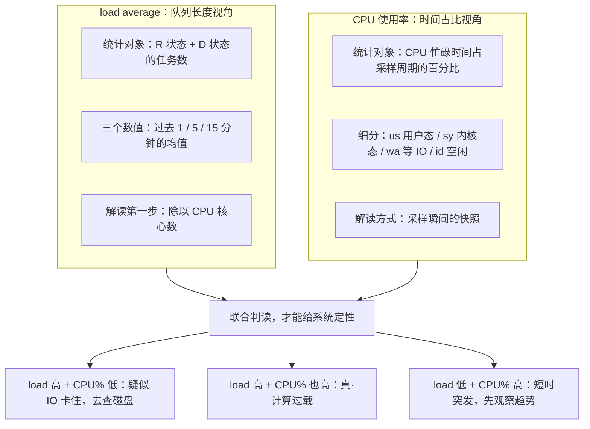

# 第 1 章 · 性能观测与调优

> 📍 位置：阶段 3 · 高级篇 · 第 1 章 ｜ ⏱ 预计用时：45-60 分钟 ｜ 难度：★★★★☆
>
> ⬅️ 上一章：[09 · Git 与学习笔记协作](../02-advanced/09-Git与学习笔记协作.md) ｜ ➡️ 下一章：[02 · 内核与系统调用](02-内核与系统调用.md)

进入高级篇了。前两个阶段你学会的是"怎么用 Linux"，从这一章开始要回答另一个问题：**当系统变慢时，怎么科学地找出原因**。性能排障的第一课不是背命令，而是建立方法论——先判断瓶颈属于哪一类资源，再挑合适的工具去验证，最后把问题落到具体的进程上。


> 📷 图片：Carl Lender，CC BY 2.0（Wikimedia Commons）

## 🎯 学习目标

- 建立"先方法论、后工具"的排查思路，理解 **USE 法**（Utilization / Saturation / Errors，使用率-饱和度-错误法）。
- 正确解读 `uptime` 的 **load average**（平均负载），能说清它与 CPU 使用率的区别。
- 看懂 `free -h` 的 **available**（可用内存）列，不再被很小的 free 列吓到。
- 熟练使用 `vmstat`、`iostat -x`、`pidstat`，完成"从系统层定位到进程层"的两步走。
- 会用 `strace`（系统调用跟踪）排障；会用 `lsof` 查端口占用、抢救误删的文件。
- 理解 `perf top` 与**火焰图**（Flame Graph）的定位思路，把一张瓶颈速查表存进笔记。

## 🧠 核心概念



[在学习站暂停、单步或重播](https://zhuguang-zfg.github.io/linux/#animation=load-vs-cpu.svg)。动画中的输入输出为教学示意，需用本章实验验证。


[在学习站暂停、单步或重播](https://zhuguang-zfg.github.io/linux/#animation=memory-cache.svg)。动画中的输入输出为教学示意，需用本章实验验证。

### 1. 性能方法论：USE 法

拿到一台"变慢"的服务器，最忌讳的是同时打开十几个工具乱看一气。**USE 法**（Use Method）由性能专家 Brendan Gregg 提出，要求你对**每一种资源**（CPU、内存、磁盘、网络……）依次回答三个问题：

| 问题 | 英文 | 一句话解释 | 典型证据 |
|---|---|---|---|
| 使用率高不高 | Utilization | 资源有多少时间在干活 | CPU 使用率、磁盘 %util |
| 饱和了吗 | Saturation | 排不上队的请求积压了多少 | load average、IO 队列长度 |
| 有没有出错 | Errors | 操作是否失败 | 内核日志里的 IO 错误、网卡丢包 |

推荐顺序：**先查错误，再查饱和度，最后看使用率**。错误最致命；饱和代表"已经堵车"；使用率高只是"很忙"，忙不等于有问题。本章后面的每一条命令，都能对应到 USE 三问中的某一问。

### 2. load average：它不是 CPU 占用率

`uptime` 末尾的三个数字，是过去 1、5、15 分钟的**平均负载**：处于**可运行状态（R）**与**不可中断睡眠状态（D）**的任务数的加权平均。理解它只需要记住两点：

1. 它统计运行/等待任务，不是 CPU 百分比。对以 CPU 计算为主的负载，可对照逻辑 CPU 数理解压力：4 个逻辑 CPU 上平均 4 个可运行任务，与 16 个逻辑 CPU 上的同样负载不同。但不能单凭 load 推断 CPU 已满载，必须结合 CPU 使用率和任务状态。
2. Linux 把 D 状态（正在等磁盘/网络 IO、连信号都不响应的任务）也算进负载。所以**磁盘卡死时，CPU 很闲、load 却很高**——这是它与 CPU 使用率最大的分野。



### 3. free -h：available 才是真相

Linux 的策略是"内存闲着就是浪费"：空闲内存会被拿去做**页缓存**（Page Cache，缓存磁盘读写），应用要用时随时归还。所以 `free` 列小是**常态**，不代表内存不足。真正该看的是 `available` 列——内核估算的"在不影响系统运行的前提下，还能分配给新应用的内存"，约等于"free + 可以立刻回收的缓存"。

### 4. 三层工具地图

- **系统层**：`uptime`（负载趋势）、`free`（内存）、`vmstat`（一屏总览）、`iostat`（磁盘）、`sar`（历史回放）。
- **进程层**：`top` / `htop`（实时榜单）、`pidstat`（按进程看 CPU / 内存 / IO）。
- **内核层**：`strace`（看进程请求内核做什么）、`lsof`（看进程打开了什么）、`perf`（看哪个函数最热）。

排查路径永远是：系统层发现异常 → 进程层锁定元凶 → 内核层抓现场。

## 🛠 命令实操

以下命令在 Ubuntu 22.04 / Debian 12 上均可直接运行，观测工具集中在 `procps` 与 `sysstat` 两个包里：

```bash
sudo apt install sysstat lsof strace
```

### uptime：先看趋势再动手

```bash
uptime
nproc        # 记下核心数，load 必须对照它解读
```

```text
 10:20:31 up 15 days,  3:12,  2 users,  load average: 0.52, 0.48, 0.45
```

4 核机器上 `0.52` 意味着平均每核约 0.13 个任务，非常空闲。判断口诀：**load 长期高于核数 = 饱和**；三个数字从左到右对比可以看出趋势（1 分钟值明显高于 15 分钟值，说明压力刚来）。

### free -h：人类可读的内存报告

```bash
free -h
```

```text
               total        used        free      shared  buff/cache   available
Mem:            15Gi       3.1Gi       9.6Gi       213Mi       2.7Gi        11Gi
Swap:          2.0Gi          0B       2.0Gi
```

只看两处：`available`（约 11Gi，健康）与 `Swap` 行的 used（0B，没有换出，健康）。若 `available` 长期低于总内存的 10%，才需要考虑加内存或排查泄漏。

### vmstat：一屏总览 CPU、内存、IO

```bash
vmstat 1 5        # 每秒刷新一次，共刷 5 次
```

```text
procs -----------memory---------- ---swap-- -----io---- -system-- ------cpu-----
 r  b   swpd   free   buff  cache    si   so    bi    bo   in   cs us sy id wa st
 1  0      0 9831212 245660 2712232   0    0    12    45  120  260  3  1 95  1  0
```

关键列速记：

| 列 | 含义 | 危险信号 |
|---|---|---|
| r | 等待 CPU 的任务数（运行队列长度） | 持续大于核心数 |
| b | 处于 D 状态（不可中断等待）的任务数 | 持续大于 0，多为 IO 瓶颈 |
| si / so | 每秒从 swap 换入 / 换出的内存量 | 持续非零：内存吃紧 |
| bi / bo | 每秒从块设备读入 / 写出的块数 | 配合 await 看磁盘 |
| wa | CPU 等待 IO 的时间占比 | 持续大于 20% 要警惕 |
| us / sy | 用户态 / 内核态 CPU 占比 | sy 长期过高，去查系统调用 |

### iostat -x：磁盘的体检报告

```bash
iostat -x 1       # sysstat 提供，-x 显示扩展统计，每秒刷新
```

```text
Device     r/s     w/s    rkB/s    wkB/s  aqu-sz  await  %util
vda       2.00   35.00    32.00    980.00    0.15   4.20   12.4
```

（节选关键列）三个指标最值得盯：

- **await**：单个 IO 请求的平均耗时（毫秒，含排队）。机械盘正常几毫秒，飙到几十上百毫秒说明磁盘或负载出了问题。
- **aqu-sz**：平均队列长度，持续大于 2~3 说明请求在排队（饱和）。
- **%util**：设备忙碌时间占比。注意：SSD 与 RAID 能并行处理请求，`%util` 接近 100% 不一定真饱和，必须结合 await 一起看。

### pidstat：把指标落到具体进程

```bash
pidstat 1 3       # 每进程的 CPU 占用，采样 3 次
pidstat -r 1 3    # 内存：缺页异常、常驻内存 RSS
pidstat -d 1 3    # 每进程的磁盘读写 kB/s
```

```text
12:00:01      UID       PID    %usr %system  %guest   %wait    %CPU   CPU  Command
12:00:02     1000      3421   45.00    5.00     0.00    2.00   50.00     2  python3
```

系统层发现"CPU 满"之后，`pidstat` 一步定位到具体进程——这就是 USE 法"从资源到进程"的落地动作。

### strace：跟着系统调用抓现场

程序卡住、启动慢、报错却看不出原因时，看它在向内核"要什么"。经典案例：某程序启动要干等 5 秒，怀疑 DNS。

```bash
sudo strace -T -e trace=open,connect,recvfrom -p 3421
```

```text
connect(4, {sa_family=AF_INET, sin_port=htons(53), ...}, 16) = 0 <0.000210>
recvfrom(4, "...", ..., 0, NULL, NULL)  = 66 <4.982113>
```

每个调用末尾的 `<4.982113>` 是耗时（秒），说明这次接收等待接近 5 秒；再结合连接目标和应用行为确认是不是 DNS。想先看汇总，可用统计模式，它减少输出，但仍存在系统调用跟踪开销：

```bash
strace -c ls /
```

```text
% time     seconds  usecs/call     calls    errors syscall
------ ----------- ----------- --------- --------- ----------------
 43.21    0.000931          11        85           mmap
 28.40    0.000612          13        47        12 openat
```

重点看 `errors` 列：大量失败的 `openat` 往往意味着配置里的文件路径写错了。

### lsof：查端口占用，抢救误删文件

谁占着 8080 端口：

```bash
sudo lsof -i :8080 -P -n
```

```text
COMMAND   PID   USER   FD   TYPE  DEVICE SIZE/OFF NODE NAME
python3  4510  alice    3u  IPv4   51234      0t0  TCP *:8080 (LISTEN)
```

**恢复"误删"的文件**：只要还有进程握着它的文件描述符（File Descriptor），数据就没有真正消失——删除只是移除了目录项。用 `lsof` 找到标记 `(deleted)` 的文件，再从 `/proc/<PID>/fd/<FD>` 拷回来：

```bash
lsof -nP | grep deleted               # 找到 PID 与 FD 号（FD 列的数字）
sudo cp /proc/4510/fd/4 /tmp/restored.log
```

### perf top 与火焰图：找到最热的函数

`perf top` 实时显示当前最"热"的函数（按 CPU 采样占比排序），能直接看出是内核函数还是用户态函数在烧 CPU：

```bash
# Ubuntu 的通用内核工具包
sudo apt install linux-tools-common linux-tools-generic
```

Debian 12 改用 `sudo apt install linux-perf`。工具还需要适配正在运行的内核；Ubuntu 如提示缺少当前内核工具，先确认对应的 `linux-tools-$(uname -r)` 包是否可用。WSL 或自定义内核可能需要专门的安装方式，不把包不存在当成命令拼写错误。

安装匹配的工具后运行 `sudo perf top`，按 q 退出。

**火焰图**（Flame Graph）是采样调用栈的可视化。横向宽度表示样本占比，不是时间线；普通火焰图的调用栈从底部向上增长，顶部显示采样时正在执行的函数，下方是调用者。宽框可能包含子调用，不能直接等同于该函数自身耗时；倒置的冰柱图则方向相反。先根据热点提出假设，再用测量验证优化效果。[原作者的读图说明](https://www.brendangregg.com/flamegraphs.html)

### 常见瓶颈速查表

把这张表存进笔记，遇到"慢"先对号入座：

| 资源 | 先看（USE 三问） | 再深入 |
|---|---|---|
| CPU | `uptime`、`vmstat 1` 看 r 与 us/sy | `pidstat -u 1`、`perf top` |
| 内存 | `free -h` 看 available、`vmstat 1` 看 si/so | `pidstat -r 1`、`ps aux --sort=-rss \| head` |
| 磁盘 IO | `iostat -x 1` 看 await、%util | `pidstat -d 1`、`iotop` |
| 网络 | `ss -s`、`sar -n DEV 1` | `ss -ti`、`ethtool -S 网卡名` |
| 全局 | `dmesg -T \| tail` 查硬件报错 | `sar` 回放历史数据 |

## 💡 避坑指南

- **把 buff/cache 当成内存泄漏**：缓存是"借不到再还"的设计，free 列小是常态，只认 `available`。
- **看到 load 高就急着扩容**：先看是不是 D 状态堆积（磁盘卡顿），这种情况加 CPU 完全无效。
- **`%util` 100% 就断定磁盘满速**：SSD/RAID 可并行处理请求，要结合 `await` 才能下结论。
- **在生产核心进程上长时间 strace**：ptrace 停顿会让进程明显变慢，生产环境优先 `strace -c` 短时采样。
- **swap 的 si/so 偶发非零就恐慌**：偶发换页正常，持续大量换入换出才是内存不足的实锤。
- **只看一次、没有基线**：性能是对比出来的，低峰期留一份 `vmstat` / `iostat` 快照作参照。

## ✍️ 动手实验

### 实验 1：给虚拟机做一次"体检"

1. 开三个终端，分别运行 `vmstat 1`、`iostat -x 1`、`free -h`。
2. 第四个终端运行 `yes > /dev/null &` 制造 CPU 压力，观察哪个指标先变化。
3. `kill %1` 结束压力，记录前后对比，并回答：这是 USE 三问中的哪一问？

<details><summary>💡 参考解法（先自己试！）</summary>

```bash
nproc          # 先记下核心数，例如 4
vmstat 1       # 观察 r 列上升、us 占比上升，wa 与 si/so 仍为 0
uptime         # 一两分钟后，1 分钟负载趋近 1（即每核 0.25）
kill %1        # 结束后台 yes
```

`yes` 是纯 CPU 压力：r 列与 us 占比上升、wa 不变、si/so 仍为 0。这是"使用率"维度的 CPU 瓶颈，且远未饱和——负载才 1，离 4 还远。
</details>

### 实验 2：抢救一个"误删"的文件

环境要求：真正的 Linux `/proc`，如 Linux 虚拟机或 WSL；不在 Windows 原生 Python 中执行。配套脚本只在全新目录创建自己的示例文件，先打开文件再删除目录项，不依赖后台进程是否及时启动。

从仓库根目录执行，目标目录必须尚不存在：

```bash
python3 scripts/labs/recover_deleted.py "$HOME/linux-recovery-01"
cat "$HOME/linux-recovery-01/restored.txt"
```

预期 JSON 中 `original_exists` 为 false、`verified` 为 true，恢复内容是 `hello from an open file`。再次运行相同目标时应拒绝覆盖。记录恢复前提，而不是尝试删除自己的真实文件。

<details><summary>💡 参考解法（先自己试！）</summary>

```bash
# 在 Linux 上也可用同一个 Bash 会话观察描述符：
recovery_lab=$(mktemp -d)
printf 'recover this text\n' > "$recovery_lab/original.txt"
exec 3< "$recovery_lab/original.txt"       # 先打开，再删除
rm -- "$recovery_lab/original.txt"
readlink "/proc/$$/fd/3"                  # 指向带 (deleted) 的文件
cp -- "/proc/$$/fd/3" "$recovery_lab/restored.txt"
exec 3<&-                                 # 恢复完成后关闭描述符
cat "$recovery_lab/restored.txt"
```

原理：目录项删除后，打开的描述符仍能引用文件；数据要等链接与打开引用都释放后才可能回收。示例只读取当前进程自己的文件，不需要 sudo，也不假定其他进程一定使用 fd 3。描述符关闭后不能靠同一入口恢复；这不是备份的替代品。实验脚本见 [源码](../../scripts/labs/recover_deleted.py)。
</details>

## 📺 推荐视频

- [B站 · ps 进程观察](https://www.bilibili.com/video/BV1Sv411r7vd/?p=69) — 韩顺平，P69，10分21秒。进程观察与 USE 方法的背景；性能结论按正文实验核对。
- [B站 · IO 读写监控](https://www.bilibili.com/video/BV1Sv411r7vd/?p=149) — 韩顺平，P149，10分55秒。进程观察与 USE 方法的背景；性能结论按正文实验核对。
- [YouTube · Linux 性能分析 60 秒](https://www.youtube.com/watch?v=ZdVpKx6Wmc8) — Brendan Gregg，1分12秒。进程观察与 USE 方法的背景；性能结论按正文实验核对。

[](https://www.bilibili.com/video/BV1Sv411r7vd/?p=69)

[在学习站查看配套媒体](https://zhuguang-zfg.github.io/linux/#read=docs%2F03-pro%2F01-%E6%80%A7%E8%83%BD%E8%A7%82%E6%B5%8B%E4%B8%8E%E8%B0%83%E4%BC%98.md) · [视频资料与核验说明](../../resources/videos.md)。标题、作者和分P已核对，未逐条完成实播，播放限制以原站为准。

## ✅ 自测清单

- [ ] 能说出 load average 统计的是哪两种状态的任务，以及为什么解读时要除以核心数。
- [ ] 能解释"load 很高但 CPU 使用率很低"最可能的原因与下一步排查动作。
- [ ] 不看笔记能说清 `free -h` 中 available 与 buff/cache 的区别。
- [ ] 能说出 `iostat -x` 里 await 与 %util 的含义，以及 %util 的局限。
- [ ] 会用 `pidstat` 分别查看某进程的 CPU、内存、磁盘占用。
- [ ] 能讲出用 `/proc/<PID>/fd` 恢复误删文件的原理与失效条件。
- [ ] 能描述火焰图的横轴、纵轴各代表什么，以及"平顶"意味着什么。

## 🔗 延伸阅读

- [Linux Performance（Brendan Gregg）](https://www.brendangregg.com/linuxperf.html)——USE 法与火焰图发明者的性能观测主页，那张工具全景图值得打印贴墙。
- [Linux man pages online](https://man7.org/linux/man-pages/)——`vmstat(8)`、`iostat(1)`、`strace(1)`、`lsof(8)` 的权威手册。
- 下一章：[02 · 内核与系统调用](02-内核与系统调用.md)——想真正看懂 strace 的输出，得先懂系统调用。

> 📝 学完本章，去完成 [《03-高级篇练习》](../../exercises/03-高级篇练习.md) 中的对应练习，检验学习效果。
