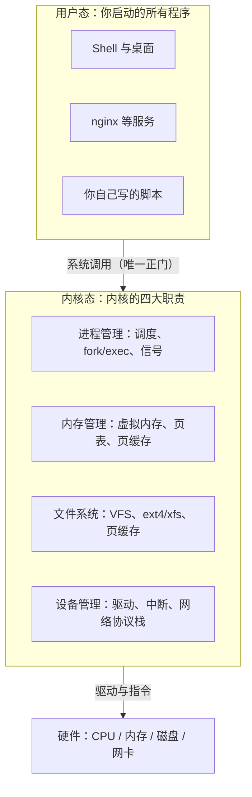
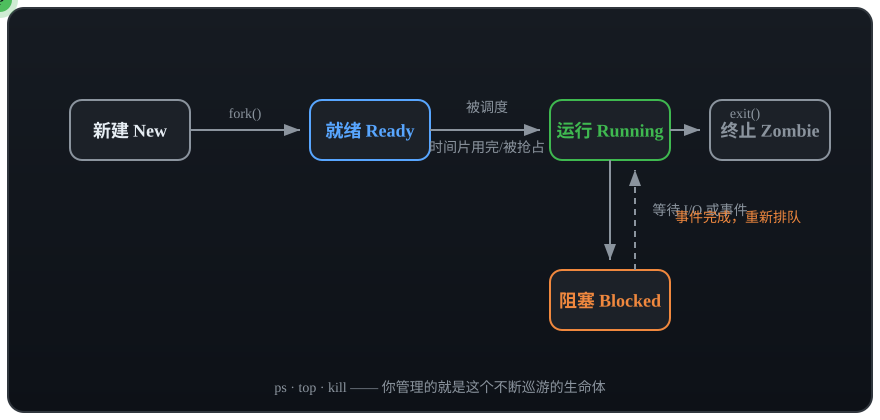
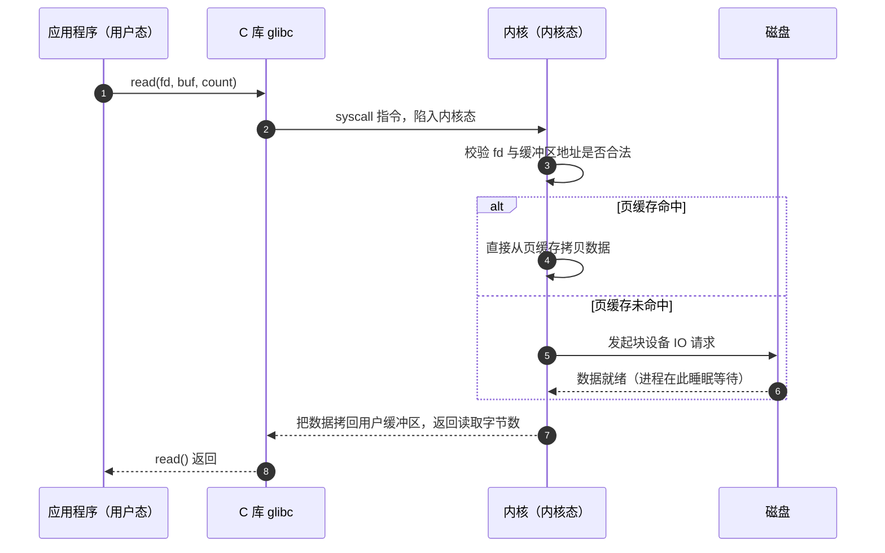

# 第 2 章 · 内核与系统调用

> 📍 位置：阶段 3 · 高级篇 · 第 2 章 ｜ ⏱ 预计用时：45-60 分钟 ｜ 难度：★★★★☆
>
> ⬅️ 上一章：[01 · 性能观测与调优](01-性能观测与调优.md) ｜ ➡️ 下一章：[03 · 安全加固](03-安全加固.md)

上一章我们用各种工具看"现象"，这一章掀开引擎盖：**内核（Kernel）**到底是什么？你的程序喊一声"读文件"，中间究竟发生了什么？搞懂本章，前面用过的 `/proc`、`strace`、`dmesg`、`sysctl` 会突然全部串起来——它们都是内核递给你的"窗口"。

## 🎯 学习目标

- 用一张图说清内核的四大职责：进程、内存、文件、设备。
- 区分**用户态**（User Mode）与**内核态**（Kernel Mode），理解**系统调用**（System Call）是两者之间唯一的正门。
- 学会在 `/proc` 里"寻宝"：全局信息与单个进程的信息分别去哪找。
- 知道 `/sys` 与 **udev**（设备管理守护进程）如何配合管理设备。
- 会用 `uname -r` 看版本，用 `lsmod` / `modinfo` / `modprobe` 管理内核模块。
- 会读 `dmesg` 内核日志，会用 `sysctl` 调整内核参数（以 `vm.swappiness` 为例）。

## 🧠 核心概念



[在学习站暂停、单步或重播](https://zhuguang-zfg.github.io/linux/#animation=syscall-switch.svg)。动画中的输入输出为教学示意，需用本章实验验证。

### 1. 内核只做四件事

剥掉所有神秘感，操作系统内核日常就在忙四件事：**管进程、管内存、管文件、管设备**。你学的每个命令，最终都踩在这四条线上。



四件事各司其职：进程管理决定"谁上 CPU 跑多久"；内存管理给每个进程发"我独占全部内存"的幻觉；文件系统把"一堆字节"翻译成"目录和文件"；设备管理则用驱动把千差万别的硬件统一成同样的接口。



进程在创建、运行、等待、终止之间流转。回忆上一章：调度器只会挑 R 状态的任务上 CPU，而 D 状态的任务连信号都收不到——这正是 load average 会偏大的原因。

### 2. 用户态、内核态与系统调用

CPU 把特权级分成两层：应用跑在**用户态**，权限受限，不能直接碰硬件和别人的内存；内核跑在**内核态**，无所不能。应用需要内核服务时（读文件、发网络包、申请内存），只能通过**系统调用**这扇"正门"，把 CPU 从用户态切到内核态，办完事再切回来。

以最常用的 `read()` 为例，看一次完整的跨界旅行：



看懂这张时序图，你就明白了两件事：为什么 `strace` 能看到程序的全部行为（每个动作都是系统调用）；为什么"页缓存"（上一章 free 里的 buff/cache）能大幅加速读文件。

### 3. /proc：把内核状态变成文件

**procfs** 是一个虚拟文件系统（不占磁盘），内核把自己的状态实时"写"成一个个文件。这里就是高级篇第一章那些命令的数据源——`free` 读 `/proc/meminfo`，`uptime` 读 `/proc/loadavg`。

全局信息寻宝图：

| 文件 | 里面有什么 |
|---|---|
| `/proc/cpuinfo` | CPU 型号、核心数、指令集 flags |
| `/proc/meminfo` | 内存总量与各细分项（MemTotal、MemAvailable……） |
| `/proc/uptime` | 开机秒数与累计空闲秒数 |
| `/proc/loadavg` | 平均负载（uptime 命令的数据源） |
| `/proc/cmdline` | 内核启动参数 |
| `/proc/version` | 内核版本与编译信息 |

单个进程的信息在 `/proc/<pid>/` 下，每个运行中的进程都有一个以自己 PID 命名的目录：

| 文件/目录 | 用途 |
|---|---|
| `cmdline` | 进程的启动命令（参数以空字节分隔） |
| `environ` | 进程的环境变量 |
| `status` | 人话版状态：Name、State、VmRSS、Threads |
| `fd/` | 打开的文件描述符，符号链接指向真实文件 |
| `maps` | 进程地址空间布局 |
| `limits` | 该进程受到的资源限制 |
| `cwd` 与 `exe` | 分别链接到工作目录与可执行文件 |

上一章抢救误删文件用的 `/proc/<PID>/fd/3`，就是这张表里的 `fd/`。

### 4. /sys 与 udev：设备的另一扇窗

如果说 `/proc` 是"进程与内核状态的窗口"，那 **sysfs**（挂载在 `/sys`）就是"设备与驱动的窗口"：总线、设备、驱动、内核子系统参数都以目录树的形式组织在那里，比如 `/sys/class/net/` 列出所有网卡，`/sys/block/` 列出所有块设备。与它配合的是 **udev**（用户态设备管理守护进程）：设备插拔时，内核发一个事件（uevent），udev 收到后负责创建 `/dev/` 下的设备节点、按 `/etc/udev/rules.d/` 里的规则改名字、设权限。你插上 U 盘就自动出现 `/dev/sdb1`，正是这套机制在工作。日常排障的实用姿势：设备出问题先去 `/sys` 看内核怎么"认识"它，再用 `dmesg` 看内核对它"说了什么"。

## 🛠 命令实操

### uname：一眼看清内核版本

```bash
uname -r
```

```text
5.15.0-91-generic
```

解读版本号：`主版本.次版本.修订号-Ubuntu打包号-风味`。Ubuntu 22.04 的 GA 内核是 5.15 系列（后续可通过 HWE 升到 6.x），Debian 12 默认是 6.1 系列。查内核问题、装对应版本的调试工具（如 perf）时，都要先报出这个号。

### 内核模块三件套：lsmod / modinfo / modprobe

驱动大多编译成**可加载模块**（Loadable Kernel Module），按需插入内核：

```bash
lsmod                 # 已加载的模块列表（数据来自 /proc/modules）
lsmod | head -3
```

```text
Module                  Size  Used by
btrfs                 156672  0
bluetooth             770048  34 rfkill,btusb,...
```

```bash
modinfo ext4          # 查看某个模块的详细信息
```

```text
filename:       /lib/modules/5.15.0-91-generic/kernel/fs/ext4/ext4.ko
license:        GPL
description:    Fourth Extended Filesystem
```

```bash
sudo modprobe loop    # 按需加载（自动处理依赖）
lsmod | grep loop     # 确认已加载
sudo modprobe -r loop # 空闲时卸载（-r = remove）
```

三个命令的分工：`lsmod` 看"现在装了什么"，`modinfo` 看"它是什么、在哪个文件"，`modprobe` 负责"装上 / 拆下"。模块文件都在 `/lib/modules/$(uname -r)/` 下。

### dmesg：内核的传声筒

硬件报错、驱动加载、磁盘掉线、OOM 杀进程——这些只有内核知道的事，都写在这里：

```bash
sudo dmesg -T | tail -20        # -T 把时间戳转成人类可读格式
sudo dmesg --level=err,warn     # 只看错误与警告
sudo dmesg -w                   # 实时跟踪，插拔设备时特别好用
```

最经典的场景：进程莫名消失，一查是内存不够被内核处决了：

```text
[ 8123.456789] Out of memory: Killed process 12345 (python3) total-vm:4096000kB
```

看到这行，别再怀疑程序有 bug——是它被 **OOM Killer**（内存不足杀手）选中了。

### sysctl：运行时调整内核参数

`/proc/sys/` 下的每个文件都是一个可读可写的内核参数，`sysctl` 就是操作它们的命令行工具：

```bash
sysctl vm.swappiness            # 查询
```

```text
vm.swappiness = 60
```

**vm.swappiness**（取值 0-100）控制内核在内存紧张时，更倾向"回收页缓存"还是"换出匿名内存到 swap"：数值越小越不愿意用 swap。数据库、低延迟服务常调低到 10 甚至更小；桌面保持默认 60 即可。调优示例：

```bash
sudo sysctl -w vm.swappiness=10                      # 临时生效，重启失效
echo "vm.swappiness=10" | sudo tee /etc/sysctl.d/99-vm.conf
sudo sysctl --system                                 # 重载所有配置文件，永久生效
```

### /proc 寻宝实战

```bash
grep -c ^processor /proc/cpuinfo            # 逻辑核心数
grep -m1 "model name" /proc/cpuinfo         # CPU 型号
grep MemTotal /proc/meminfo                 # 物理内存总量
cat /proc/loadavg                           # 平均负载原始数据

pid=$$                                      # 当前 Shell 的 PID
tr '\0' ' ' < /proc/$pid/cmdline; echo      # 它的启动命令
grep -E "^(Name|State|Threads)" /proc/$pid/status
ls /proc/$pid/fd | wc -l                    # 它打开了多少文件
```

## 💡 避坑指南

- **改 `/proc/sys/` 里的文件忘了持久化**：`echo` 或 `sysctl -w` 重启就打回原形，务必写进 `/etc/sysctl.d/*.conf`。
- **`swappiness=0` 不是"禁用 swap"**：它表示极不倾向换出，内存压力大时反而可能触发更猛烈的回收甚至 OOM；想禁用请用 `swapoff`。
- **`modprobe -r` 卸不掉就别硬卸**：模块被使用（`lsmod` 的 Used by 列非零）时内核会拒绝，先停掉占用它的服务。
- **把 `/proc` 当普通文件读写**：里面很多文件的内容格式是内核实现细节，脚本解析要容忍格式变化，能用现成命令（free、uptime）就不要自己抠 `/proc`。
- **`dmesg` 提示权限不足**：`kernel.dmesg_restrict=1` 时普通用户读不了，用 `sudo` 即可。
- **内核版本对不上工具**：perf、eBPF 工具对内核版本敏感，先 `uname -r` 再装匹配的工具包。

## ✍️ 动手实验

### 实验 1：/proc 寻宝任务

不借助 free、lscpu 等高级命令，只用 `/proc` 回答五个问题：①逻辑核心数与 CPU 型号；②物理内存总量；③开机了多少秒；④当前 Shell 的启动命令是什么；⑤当前 Shell 打开了多少个文件描述符。

<details><summary>💡 参考解法（先自己试！）</summary>

```bash
grep -c ^processor /proc/cpuinfo               # ① 核心数
grep -m1 "model name" /proc/cpuinfo            # ① 型号
grep MemTotal /proc/meminfo                    # ② 内存总量
awk '{print "开机秒数:", $1}' /proc/uptime     # ③ 开机时长

pid=$$
tr '\0' ' ' < /proc/$pid/cmdline; echo          # ④ 启动命令
grep -E "^(Name|State|Threads)" /proc/$pid/status
ls /proc/$pid/fd | wc -l                        # ⑤ fd 数量
```

延伸：对比 `cat /proc/loadavg` 与 `uptime` 的输出，找到它们的对应关系。
</details>

### 实验 2：模块的加载与"卸不掉"

依次执行下面的命令，观察输出，并解释最后一步为什么可能失败：

```bash
lsmod | head -5
modinfo ext4 | head -5
sudo modprobe loop
lsmod | grep loop
sudo modprobe -r loop
```

<details><summary>💡 参考解法（先自己试！）</summary>

在装了 snap 的 Ubuntu 上，`loop` 模块被 snap 的挂载点占着（`lsmod` 里 Used by 非零），`modprobe -r loop` 会报 `Module loop is in use`——内核拒绝卸载正在使用的模块，这是保护而不是故障。

想体验一次干净的加载/卸载，可以换一个空闲模块：

```bash
sudo modprobe dummy && lsmod | grep dummy
sudo modprobe -r dummy && lsmod | grep dummy    # 无输出即卸载成功
```

判断依据始终是 `lsmod` 的 Used by 列。
</details>

## 📺 推荐视频

- [B站 · Linux 内核与发行版](https://www.bilibili.com/video/BV1ZZ37zdEp2/?p=9) — Linux-老林，P9，21分16秒。内核源码阅读方法；本章的系统调用实验仍是验收依据。
- [B站 · 内核源码阅读及 main](https://www.bilibili.com/video/BV1Sv411r7vd/?p=131) — 韩顺平，P131，13分19秒。内核源码阅读方法；本章的系统调用实验仍是验收依据。
- [YouTube · Linux 知识全景](https://www.youtube.com/watch?v=LKCVKw9CzFo) — Fireship，12分22秒。内核源码阅读方法；本章的系统调用实验仍是验收依据。

[](https://www.bilibili.com/video/BV1ZZ37zdEp2/?p=9)

[在学习站查看配套媒体](https://zhuguang-zfg.github.io/linux/#read=docs%2F03-pro%2F02-%E5%86%85%E6%A0%B8%E4%B8%8E%E7%B3%BB%E7%BB%9F%E8%B0%83%E7%94%A8.md) · [视频资料与核验说明](../../resources/videos.md)。标题、作者和分P已核对，未逐条完成实播，播放限制以原站为准。

## ✅ 自测清单

- [ ] 能不看书画出内核四大职责的示意图，并各举一个对应的命令。
- [ ] 能用自己的话解释用户态/内核态的区别，以及系统调用为什么是"唯一正门"。
- [ ] 能说出 `free`、`uptime`、`lsmod` 分别读取的是哪个 `/proc` 文件。
- [ ] 能说出 `/proc/<pid>/` 下 cmdline、status、fd 三个文件的用途。
- [ ] 能解释 `/sys` 与 udev 如何配合完成设备管理。
- [ ] 会用 lsmod / modinfo / modprobe 完成一次模块的查询、加载、卸载。
- [ ] 会把 `vm.swappiness=10` 配置成重启后依然生效。

## 🔗 延伸阅读

- [Linux man pages online](https://man7.org/linux/man-pages/)——`proc(5)` 手册是 /proc 目录的官方说明书，`syscalls(2)` 列出全部系统调用。
- [Arch Wiki](https://wiki.archlinux.org)——搜索 sysctl、udev、kernel modules 词条，实践细节非常全。
- 下一章：[03 · 安全加固](03-安全加固.md)——懂了内核的权限模型，加固才有底气。

> 📝 学完本章，去完成 [《03-高级篇练习》](../../exercises/03-高级篇练习.md) 中的对应练习，检验学习效果。
