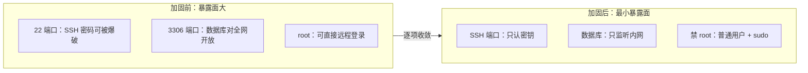

# 第 3 章 · 安全加固

> 📍 位置：阶段 3 · 高级篇 · 第 3 章 ｜ ⏱ 预计用时：45-60 分钟 ｜ 难度：★★★★☆
>
> ⬅️ 上一章：[02 · 内核与系统调用](02-内核与系统调用.md) ｜ ➡️ 下一章：[04 · 容器与虚拟化](04-容器与虚拟化.md)

性能决定体验，安全决定生死。一台暴露在公网上的服务器，平均几分钟内就会开始被扫描。这一章不教你成为安全专家，而是帮你建立一套**安全基线**（Security Baseline）：用十几项固定动作，把一台"默认安装"的服务器收拢成一台"敢于上公网"的服务器。

## 🎯 学习目标

- 理解安全基线的两大支柱：**最小权限**（Least Privilege）与**最小暴露面**（Minimal Attack Surface）。
- 独立完成 SSH 加固：禁 root、禁密码、改端口、白名单，并安全地验证。
- 会安装并配置 **fail2ban**（防暴力破解框架）抵御密码爆破。
- 掌握 **UFW** 防火墙全流程，并了解 **firewalld**（firewall-cmd）的对应操作。
- 建立 SELinux 与 AppArmor 的认知：三种模式、状态查看命令。
- 会用 `sha256sum` 做文件完整性校验，牢记 **3-2-1 备份原则**。

## 🧠 核心概念



[在学习站暂停、单步或重播](https://zhuguang-zfg.github.io/linux/#animation=firewall-chains.svg)。动画中的输入输出为教学示意，需用本章实验验证。

### 1. 基线思想：最小权限 + 最小暴露面

所有加固动作都能归结为两条原则：

- **最小权限**：任何程序、任何人都只给它"刚好够用"的权限。落实到操作上：不拿 root 干日常活（用 sudo 按需提权）、服务用专用低权用户跑。
- **最小暴露面**：攻击者能摸到的入口越少越好。落实到操作上：关掉不用的服务、只放行必要的端口、入口只留一种认证方式。



### 2. 纵深防御：一层不够，要叠很多层

基线不是一道墙，而是层层设防（Defense in Depth）：SSH 加固挡住登录 → fail2ban 挡住爆破 → 防火墙挡住端口 → SELinux/AppArmor 挡住越权 → 备份兜底"万一全丢"。任何一层被攻破，下一层还在。本章的顺序正是按这堵墙砌起来的。

### 3. SELinux 与 AppArmor：给 root 也戴上镣铐

传统的权限体系（DAC，自主访问控制）里，root 几乎无限制；**MAC**（Mandatory Access Control，强制访问控制）在此基础上给每个程序再套一层"只许做这些事"的策略：

- **SELinux**（RHEL/Fedora 系默认）有三种模式：**Enforcing**（强制，违规就拦）、**Permissive**（宽容，只记日志不拦）、**Disabled**（关闭）。查看与切换：`getenforce` 看当前模式，`sudo setenforce 0|1` 临时切换，永久修改在 `/etc/selinux/config`。
- **AppArmor**（Ubuntu/Debian 默认）思路类似，按"程序画像"写规则，模式分 enforce 与 complain（相当于宽容态），用 `sudo aa-status` 查看整体状态。

认知定位即可，不必深究策略语法：以后遇到"权限明明是对的却被拒绝"，第一反应应该是"是不是 MAC 拦的"，先跑 `getenforce` 或 `aa-status` 看状态，再去查对应日志。

## 🛠 命令实操

### SSH 加固：把大门换成保险门

前提：你已确认能用普通用户的密钥登录（阶段 2 已学过 `ssh-keygen` 与 `ssh-copy-id`），且该用户能使用 sudo。下面以 `deploy` 为例，必须把它换成你已验证的实际用户名。**改配置前，先保住退路**——保持当前会话不断开，另开一个终端验证。本节先保留 22 端口，认证加固确认有效后再考虑换端口。

Ubuntu/Debian 推荐用 drop-in 片段。OpenSSH 对大多数字段采用**先读取的值生效**，并不是“编号越大优先级越高”。确认主文件靠前包含 `Include /etc/ssh/sshd_config.d/*.conf`，检查已有片段，把本地策略放在较早的位置；如果以前照旧版教程创建了 `99-hardening.conf`，应迁移到下面的文件，避免留下两份冲突配置。最终仍以 `sshd -T` 的输出为准。[官方说明](https://documentation.ubuntu.com/server/how-to/security/openssh-server/)

```text
# /etc/ssh/sshd_config.d/00-local-hardening.conf
# 修改前自查：已验证普通用户的密钥登录与 sudo；替换下方 deploy
Port 22
PermitRootLogin no
PasswordAuthentication no
PubkeyAuthentication yes
KbdInteractiveAuthentication no
MaxAuthTries 3
LoginGraceTime 30
AllowUsers deploy
ClientAliveInterval 300
ClientAliveCountMax 2
```

逐行含义：保留现有端口；禁 root 登录；禁密码只认密钥；认证失败 3 次断开；连接建立后 30 秒内必须完成认证；只允许指定用户登录；空闲 5 分钟探测、2 次无响应断开。

应用并校验：

```bash
sudo sshd -t                 # 只验证语法，不代表加固已生效
sudo sshd -T | grep -E '^(port|permitrootlogin|passwordauthentication|pubkeyauthentication|kbdinteractiveauthentication|allowusers) '
# 预期包含：port 22、permitrootlogin no、passwordauthentication no、
# pubkeyauthentication yes、kbdinteractiveauthentication no、allowusers 你的用户名
# 有 Match 块时，用实际连接条件验证；下面的地址需替换为客户端地址：
sudo sshd -T -C user=deploy,host=client,addr=192.0.2.10 | grep -E '^(passwordauthentication|permitrootlogin|allowusers) '
# 输出符合策略后再加载：
sudo systemctl reload ssh
```

然后**另开一个新终端**验证（旧会话先别关！）：

```bash
ssh -o PreferredAuthentications=publickey deploy@服务器IP
```

还要做一次反向测试：`ssh -o PubkeyAuthentication=no -o PreferredAuthentications=password,keyboard-interactive deploy@服务器IP` 应当被拒绝，不能再出现密码认证成功。正向与反向测试都符合预期才关闭旧会话；失败时保留旧会话修复片段并重新校验。

**可选换端口**：先在主机防火墙和云安全组放行新端口，再修改 `Port`。使用 `ssh.socket` 激活的系统，其监听端口还受 socket 单元影响，不能仅凭 `reload ssh` 判断完成。用 `systemctl status ssh.socket`、`systemctl cat ssh.socket` 和 `sudo ss -ltnp` 核实；按当前发行版的 socket 配置方式调整，确认新终端能连上后才撤销旧端口规则。本章后续示例统一保持 22，若自行换到 2222，必须同步修改防火墙、客户端和 fail2ban。

### fail2ban：让爆破者自动进黑名单

密码再强也架不住每天几万次尝试，fail2ban 负责"输错几次就拉黑"：

```bash
sudo apt install fail2ban
```

不要直接改 `jail.conf`（升级会被覆盖），写本地覆盖文件：

```ini
# /etc/fail2ban/jail.local
[DEFAULT]
# 封禁时长、统计窗口、窗口内失败次数
bantime  = 1h
findtime = 10m
maxretry = 5

[sshd]
enabled = true
# 与实际 SSH 端口保持一致；使用 systemd journal 后端
port    = 22
backend = systemd
```

```bash
sudo systemctl enable --now fail2ban
sudo systemctl restart fail2ban       # 安装时可能已启动，修改 jail 后需重新加载
sudo fail2ban-client status sshd
```

```text
Status for the jail: sshd
|- Filter
|  |- Currently failed: 0
|  |- Total failed:     12
`- Actions
   |- Currently banned: 1
   |- Total banned:     1
   `- Banned IP list:   203.0.113.45
```

看到 Banned IP list 里出现地址，说明防线已经在工作了。

### UFW：把防火墙用起来

**UFW**（Uncomplicated Firewall）是 iptables 的人话外壳，Ubuntu 预装。全流程：

```bash
sudo apt install ufw
sudo ufw default deny incoming      # 默认拒绝一切入站
sudo ufw default allow outgoing     # 出站放开
sudo ufw allow 22/tcp comment "SSH"      # 先放行实际 SSH 端口，再启用！
sudo ufw allow 80,443/tcp comment "Web"
sudo ufw deny 3306/tcp              # 数据库绝不对公网开放
sudo ufw enable                     # 启用（开机自启）
sudo ufw status verbose
```

```text
Status: active
Logging: on (low)
Default: deny (incoming), allow (outgoing), disabled (routed)

To                         Action      From
--                         ------      ----
22/tcp                     ALLOW IN    Anywhere
80,443/tcp                 ALLOW IN    Anywhere
3306/tcp                   DENY IN     Anywhere
```

删除上面的拒绝规则用 `sudo ufw delete deny 3306/tcp`，查看编号再删用 `sudo ufw status numbered`。删除显式拒绝后，默认拒绝策略仍生效。


数据包到达主机后要依次经过防火墙规则、端口监听、应用处理；防火墙在最外层，规则匹配不上默认策略（deny incoming）就直接丢弃——这就是"默认拒绝"的威力。

### firewalld 对照：RHEL 系的另一套方言

RHEL/CentOS/Fedora 默认用 **firewalld**，管理命令是 `firewall-cmd`。两边对照着记：

| 目标 | UFW（Ubuntu/Debian） | firewalld（RHEL 系） |
|---|---|---|
| 查看状态 | `ufw status verbose` | `firewall-cmd --list-all` |
| 放行端口 | `ufw allow 443/tcp` | `firewall-cmd --permanent --add-port=443/tcp` 后 `--reload` |
| 放行预置服务 | `ufw allow OpenSSH` | `firewall-cmd --permanent --add-service=https` |
| 移除规则 | `ufw delete allow 443/tcp` | `--remove-port=443/tcp` 后 `--reload` |
| 启用并自启 | `ufw enable` | `systemctl enable --now firewalld` |

注意 firewalld 的 `--permanent` 只写盘，必须 `--reload` 才生效；不带 `--permanent` 则立即生效但重启丢失——这是它最著名的坑。

### 文件完整性：sha256sum 建立基线

下载镜像要核对校验值，关键系统文件同样可以建"指纹库"，被篡改立刻现形：

```bash
# 下载 ISO 后与官方公布的值比对
sha256sum ubuntu-22.04-live-server-amd64.iso

# 给关键文件建立基线（root 保管，权限 600）
sudo sh -c 'umask 077; sha256sum /etc/passwd /etc/group /etc/ssh/sshd_config /etc/ssh/sshd_config.d/*.conf > /root/integrity.sha256'

# 定期复核
sudo sha256sum -c /root/integrity.sha256
```

```text
/etc/passwd: OK
/etc/group: OK
/etc/ssh/sshd_config: OK
```

出现 FAILED 的文件，就是被改过（也可能是你自己合规改的——所以基线要跟着变更更新）。这里由提权后的 `sh` 完成重定向，`umask 077` 让新文件只对 root 可读写；仅给 `sha256sum` 加 sudo，外面的 `>` 仍由普通用户执行，会写入失败。输出还应包含本节的 `00-local-hardening.conf: OK`；新增配置文件后需要重新生成基线。

### 备份 3-2-1 原则

**3**：重要数据至少保留 **3 份**副本（1 份生产 + 2 份备份）；**2**：存放在 **2 种**不同介质上（比如磁盘 + 对象存储/磁带），避免一荣俱荣一损俱损；**1**：至少 **1 份**放在异地（另一个机房、另一个云区域），扛住火灾、勒索、误删整个目录这类"一锅端"事故。再补一条隐性原则：**没做过恢复演练的备份不算备份**——定期从备份里真实恢复一次，才知道它救不了命。

### 交付前的安全检查清单（10 条）

1. SSH 已禁用 root 直接登录与密码认证，仅允许密钥。
2. `sshd -T` 已确认认证策略与 `AllowUsers` 生效，实际端口与防火墙规则一致。
3. 防火墙默认拒绝入站，只放行业务必需端口。
4. fail2ban 已启用，且 jail 的端口与 SSH 实际端口一致。
5. 系统补丁保持更新（`sudo apt update && sudo apt upgrade` 已纳入例行动作）。
6. 日常使用普通用户 + sudo，root 密码只在救援时使用。
7. 关键文件已建立 sha256sum 完整性基线，并定期复核。
8. 备份满足 3-2-1，且最近一次恢复演练成功。
9. 无用服务已关闭：`sudo ss -ltnp` 审计所有监听端口，说不出用途的都关掉。
10. 日志可查可告警：知道 `journalctl`、`dmesg`、fail2ban 状态怎么看。

## 💡 避坑指南

- **改 SSH 端口把自己锁在门外**：改端口、禁密码前，先放行新端口、验证密钥可登录；操作期间永远保留一个已登录的会话当"救生索"。
- **fail2ban 拉黑不生效**：检查 journal 后端、过滤器匹配及封禁动作。`port` 控制封禁规则针对的端口，不是选择“哪个端口的日志”。
- **`ufw enable` 之后再放行 SSH**：顺序反了会当场断线；正确顺序是先 `allow` SSH 端口再 `enable`。
- **firewalld 改了规则却"没生效"**：忘了 `--reload`，或者反过来忘了 `--permanent`（重启丢失）。
- **SELinux 环境改 SSH 端口连不上**：新端口不在 SELinux 允许的端口类型里，需要用 semanage 给端口打标签，或暂时查 `getenforce` 定位问题。
- **只防外面、不防里面**：最小权限同样适用于内部——数据库别监听 `0.0.0.0`，服务之间用账号隔离。

## ✍️ 动手实验

### 实验 1：虚拟机完成一次完整的 SSH 加固

在一台测试虚拟机上完成：禁 root 与密码登录、配置 AllowUsers、用 `sshd -t` 验证语法、`sshd -T` 验证最终策略，reload 后从宿主机验证密钥登录成功、密码认证被拒。安装 fail2ban 后检查 jail 状态；已经禁用密码时，不要再用“输错密码 5 次”验证封禁。

<details><summary>💡 参考解法（先自己试！）</summary>

```bash
# 1. 写入加固片段，AllowUsers 写你的实际用户名
sudo vi /etc/ssh/sshd_config.d/00-local-hardening.conf
sudo sshd -t
sudo sshd -T | grep -E '^(passwordauthentication|permitrootlogin|allowusers) '
# 核对后执行
sudo systemctl reload ssh

# 2. 宿主机另开终端验证（保持旧会话）
ssh -o PreferredAuthentications=publickey 你的用户名@虚拟机IP
ssh -o PubkeyAuthentication=no -o PreferredAuthentications=password,keyboard-interactive 你的用户名@虚拟机IP

# 3. 安装并启用 fail2ban
sudo apt install fail2ban
sudo systemctl enable --now fail2ban

# 4. 查看 jail 状态；0 次封禁也可能是正常结果
sudo fail2ban-client status sshd
```

若被拉黑的是你自己，可手动解封：`sudo fail2ban-client set sshd unbanip 你的IP`。
</details>

### 实验 2：UFW 从零到启用

在一台虚拟机（或 WSL2/容器外的主机）上完成：默认拒绝入站、放行你的 SSH 端口与 80/443、拒绝 3306、启用防火墙；然后用 `status verbose` 截图留档，再练习删除一条规则。

<details><summary>💡 参考解法（先自己试！）</summary>

```bash
sudo apt install ufw
sudo ufw default deny incoming
sudo ufw default allow outgoing
sudo ufw allow 22/tcp comment "SSH"
sudo ufw allow 80,443/tcp comment "Web"
sudo ufw deny 3306/tcp
sudo ufw enable
sudo ufw status verbose
sudo ufw status numbered
sudo ufw delete deny 3306/tcp       # 练习删除显式拒绝规则
```

验证"默认拒绝"：在另一台机器上访问一个未放行的端口，应当连接超时（被丢弃），而不是拒绝连接。
</details>

## 📺 推荐视频

- [B站 · SSH 远程登录](https://www.bilibili.com/video/BV1Sv411r7vd/?p=14) — 韩顺平，P14，15分30秒。SSH 登录基础复习；加固策略与最终配置验证以正文为准。

[](https://www.bilibili.com/video/BV1Sv411r7vd/?p=14)

[在学习站查看配套媒体](https://zhuguang-zfg.github.io/linux/#read=docs%2F03-pro%2F03-%E5%AE%89%E5%85%A8%E5%8A%A0%E5%9B%BA.md) · [视频资料与核验说明](../../resources/videos.md)。标题、作者和分P已核对，未逐条完成实播，播放限制以原站为准。

## ✅ 自测清单

- [ ] 能各举一个例子说明"最小权限"与"最小暴露面"分别对应什么操作。
- [ ] 能说出修改 sshd 配置后，为什么必须先 `sshd -t` 并保留旧会话再验证。
- [ ] 能解释 fail2ban 中 bantime、findtime、maxretry 三个参数的含义。
- [ ] 能按正确顺序执行 UFW 全流程，并说出为什么 `enable` 前要先放行 SSH。
- [ ] 能说出 firewalld 中 `--permanent` 与 `--reload` 的关系。
- [ ] 能说出 SELinux 的三种模式与查看当前模式的命令。
- [ ] 能复述 3-2-1 备份原则，并说出"恢复演练"为什么是必需的。
- [ ] 会用 sha256sum 为关键文件建立完整性基线并复核。

## 🔗 延伸阅读

- [Linux man pages online](https://man7.org/linux/man-pages/)——`sshd_config(5)` 手册，本文出现的每个 SSH 指令都能查到权威定义。
- [Arch Wiki](https://wiki.archlinux.org)——搜索 OpenSSH、UFW、fail2ban 词条，配置细节与排障案例极全。
- 上一章回顾：[02 · 内核与系统调用](02-内核与系统调用.md)——MAC 权限模型与 dmesg 的基础都在那一章。

> 📝 学完本章，去完成 [《03-高级篇练习》](../../exercises/03-高级篇练习.md) 中的对应练习，检验学习效果。
