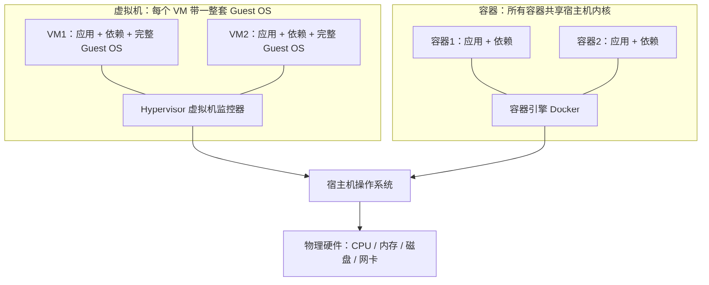

# 第 4 章 · 容器与虚拟化

> 📍 位置：阶段 3 · 高级篇 · 第 4 章 ｜ ⏱ 预计用时：45-60 分钟 ｜ 难度：★★★★☆
>
> ⬅️ 上一章：[03 · 安全加固](03-安全加固.md) ｜ ➡️ 下一章：[05 · 自动化运维](05-自动化运维.md)

前面三章你都在"一台机器"上工作。现实中的软件交付有一堆老问题：开发环境跑得好好的，生产机上就报错；多个服务挤在一台机器上，互相抢资源、抢依赖版本。**容器**（Container）就是为这两个问题而生的：**隔离**与**交付**。本章带你理解原理、上手 Docker，并对 Kubernetes 建立一张"知道它是什么"的认知地图。

## 🎯 学习目标

- 说清容器解决的两个核心问题：环境隔离与标准化交付。
- 用两个词讲明白容器原理：**Namespace**（隔离"看得见什么"）与 **Cgroups**（管住"能用多少"）。
- 会用官方脚本安装 Docker，掌握七个核心命令。
- 会编写并构建第一个 Dockerfile（Python HTTP 服务）。
- 会用 `-v` 挂数据卷、`-p` 做端口映射，理解数据持久化。
- 会用 Docker Compose 编排 web + db 两个服务，并对 K8s 的 Pod / Deployment / Service 建立认知。

## 🧠 核心概念



预测容器删除后哪些数据会留下，再通过后面的命名卷实验验证。

### 1. 为什么需要容器

先看两个痛点：

- **环境不一致**："在我机器上是好的"——开发机 Python 版本、依赖库、系统库与生产机不同。
- **资源与依赖互相干扰**：一台机器装两套服务，A 要 OpenSSL 1.1，B 要 OpenSSL 3，装在同一环境里必然打架。

容器把"应用 + 全部依赖"打成一个**镜像**（Image），到哪都能原样跑起来（交付）；每个容器有自己的文件系统、进程、网络视图，互不干扰（隔离）。它与**虚拟机**（Virtual Machine）的本质区别在下面这张图里：



VM 慢在"重"：每个虚拟机要启动一整个操作系统，GB 级、分钟级启动。容器快在"轻"：它只是宿主机上被隔离的普通进程，MB 级、秒级启动。代价是隔离强度弱于 VM（共享内核），所以安全敏感场景常用"VM 里再跑容器"的组合。

### 2. 两个词讲明白容器原理

- **Namespace**（命名空间）解决"看得见什么"：给进程发一副有色眼镜，让它以为独占系统——PID namespace 让容器内进程以为自己是 1 号进程，NET namespace 给它独立的网卡与端口空间，MNT namespace 给它独立的文件系统挂载视图。
- **Cgroups**（Control Groups，控制组）解决"能用多少"：把进程分组并施加配额，比如"这个容器最多用 2 核 CPU、1GB 内存"。

所以一句话总结：**容器不是轻量级虚拟机，而是被 Namespace 和 Cgroups 武装起来的普通 Linux 进程**。第 2 章学的内核知识，在这里全部兑现。

### 3. 镜像、容器、仓库

- **镜像**（Image）：只读的分层模板，相当于"程序的安装包 + 文件系统快照"。
- **容器**（Container）：镜像的运行实例 = 只读镜像 + 一层可写层。
- **仓库**（Registry）：存放镜像的服务，Docker Hub 是最大的公共仓库。

## 🛠 命令实操

### 安装 Docker（官方脚本）

Ubuntu 22.04 / Debian 12 通用，官方脚本会自动识别发行版：

```bash
# 1. 下载并执行官方安装脚本（以 docs.docker.com 的 Get Docker 页面为准）
curl -fsSL https://get.docker.com -o get-docker.sh
sudo sh get-docker.sh

# 2. 把当前用户加入 docker 组，免 sudo 使用（重新登录后生效）
sudo usermod -aG docker "$USER"

# 3. 验证
docker --version
docker run --rm hello-world
```

```text
Hello from Docker!
This message shows that your installation appears to be working correctly.
```

### 核心七命令：run / ps / images / pull / stop / rm / logs

```bash
docker run -d --name web -p 8080:80 nginx    # run：创建并启动容器（-d 后台）
docker ps                                     # ps：正在运行的容器
docker ps -a                                  # 加 -a 看包括已停止的所有容器
```

```text
CONTAINER ID   IMAGE       STATUS         PORTS                    NAMES
9f2c1a4b7e8d   nginx       Up 8 seconds   0.0.0.0:8080->80/tcp     web
```

```bash
docker images                 # images：本地镜像列表
docker pull ubuntu:22.04      # pull：从仓库拉取指定标签的镜像
```

```text
22.04: Pulling from library/ubuntu
Status: Downloaded newer image for ubuntu:22.04
docker.io/library/ubuntu:22.04
```

```bash
docker logs web               # logs：删除前查看容器输出
docker stop web               # stop：优雅停止（先 SIGTERM 再 SIGKILL）
docker rm web                 # rm：删除已停止的容器；删除后不能再 logs
```

这七个命令覆盖容器 90% 的日常：拉（pull）→ 跑（run）→ 看（ps / logs）→ 停（stop）→ 清（rm），中间用 images 盘点家底。

### 写第一个 Dockerfile：Python HTTP 服务

准备两个文件放在同一目录。可直接使用仓库的 [完整示例](../../scripts/docker-hello/)：从仓库根目录执行 `cd scripts/docker-hello` 后构建。下面展示核心实现，实际源码额外设置了 Content-Length 响应头。

```python
# app.py
#!/usr/bin/env python3
from http.server import BaseHTTPRequestHandler, HTTPServer

class Handler(BaseHTTPRequestHandler):
    def do_GET(self):
        self.send_response(200)
        self.send_header("Content-Type", "text/plain; charset=utf-8")
        self.end_headers()
        self.wfile.write("你好，来自容器！\n".encode("utf-8"))

if __name__ == "__main__":
    HTTPServer(("0.0.0.0", 8000), Handler).serve_forever()
```

```dockerfile
# Dockerfile
# 基础镜像：Python 3.12 的精简 Debian 镜像
FROM python:3.12-slim
WORKDIR /app
COPY app.py .
EXPOSE 8000
CMD ["python", "app.py"]
```

构建并运行：

```bash
docker build -t hello-pro .
docker run -d --name hello -p 127.0.0.1:8080:8000 hello-pro
curl --retry 5 --retry-connrefused --retry-delay 1 http://127.0.0.1:8080
docker logs hello
```

```text
172.17.0.1 - - [06/Oct/2026 10:00:00] "GET / HTTP/1.1" 200 -
```

在宿主机浏览器打开 `http://localhost:8080`，看到"你好，来自容器！"即成功。`CMD` 必须执行 `app.py`；`python -m http.server` 启动的是目录文件服务器。Dockerfile 的 `FROM`、`COPY` 等指令后不能用行尾 `#` 写注释，注释应独占一行。[官方语法](https://docs.docker.com/reference/dockerfile/#format)

完成后执行 `docker rm -f hello` 释放 8080 端口，再进入下一个实验。

### -v 数据卷与 -p 端口映射

容器删掉，可写层就没了——**数据必须放在容器外面**：

```bash
# -p 端口映射：宿主机端口:容器端口
docker run -d --name web1 -p 127.0.0.1:8080:8000 hello-pro
docker run -d --name web2 -p 127.0.0.1:8082:8000 hello-pro   # 不同容器使用不同宿主端口

# -v 命名卷：由 Docker 管理，适合数据库等数据
docker volume create appdata
docker run -d --name worker -v appdata:/data busybox sleep 3600

# -v 绑定挂载：直接映射宿主机目录，适合开发时热更新代码
docker run -d --name dev -v "$PWD":/app -p 8081:8000 hello-pro

docker volume ls
docker volume inspect appdata
# 释放本实验占用的端口和容器；命名卷仍保留
docker rm -f web1 web2 worker dev
```

记忆口诀：**-p 管"端口从哪进"，-v 管"数据放在哪"**；命名卷交给 Docker 管，绑定挂载自己管路径。

### Docker Compose：一个文件编排多容器

现实应用至少是"web + 数据库"两个容器。**Compose** 用一个 YAML 文件把多容器的配置固化下来，一条命令整体起停：

```yaml
# compose.yml
services:
  web:
    build: .                    # 用当前目录的 Dockerfile 构建
    ports:
      - "8080:8000"
    environment:
      DB_HOST: db               # 通过服务名 db 直接访问数据库容器
    depends_on:
      - db
    restart: unless-stopped

  db:
    image: postgres:16-alpine
    environment:
      POSTGRES_PASSWORD: changeme
    volumes:
      - dbdata:/var/lib/postgresql/data   # 数据落在命名卷里
    restart: unless-stopped

volumes:
  dbdata:
```

```bash
docker compose up -d          # 一条命令起两个容器
docker compose ps             # 查看编排状态
docker compose logs -f web    # 看某个服务日志
docker compose down           # 整体停止并删除（数据卷保留）
```

旧教程里的 `docker-compose`（带连字符）是独立版工具，如今官方发行版内置 `docker compose` 子命令，功能一致。

### K8s 认知地图：知道它是什么

**Kubernetes**（K8s）是容器编排系统，解决"成百上千个容器跨几十台机器怎么调度、怎么自愈、怎么扩缩容"的问题。入门只需记住三个对象：

| 对象 | 一句话解释 |
|---|---|
| **Pod** | 最小部署单元：一个或多个共享网络与存储的容器组 |
| **Deployment** | 声明"要几个 Pod 副本、用哪个镜像"，负责滚动更新与自愈 |
| **Service** | 给一组 Pod 提供固定的访问入口（虚拟 IP + 负载均衡） |

定位一句话：**Docker 管"单机怎么跑容器"，K8s 管"一个集群怎么跑成千上万个容器"**。学习策略：先把 Docker 与 Compose 玩熟，K8s 等工作或项目真用到再深入，概念先放着不丢人。

### 国内镜像加速：给 pull 提速

从 Docker Hub 直接拉镜像慢或失败时，配置镜像加速器：各大云厂商（阿里云、腾讯云等）的控制台都提供专属加速地址，把它填进下面的配置即可。

```bash
sudo tee /etc/docker/daemon.json <<'EOF'
{
  "registry-mirrors": ["把你从云厂商控制台获取的专属加速地址填在这里"]
}
EOF
sudo systemctl restart docker
docker info | grep -A 2 Mirrors
```

```text
 Registry Mirrors:
  https://你的专属加速地址/
```

## 💡 避坑指南

- **容器一删数据就没**：默认可写层随容器消失，数据库等有状态服务必须挂 `-v` 卷。
- **`-p 8080:8000` 方向记反**：永远是"宿主机:容器"；记住"流量从宿主机的 8080 进来"。
- **镜像只打 latest 标签**：半年后没人知道 latest 当时是什么，构建时永远带上有意义的版本标签。
- **`docker run` 忘了 `-d`**：前台模式占住终端，Ctrl-C 往往把容器一起带走；后台跑、日志用 `logs` 看。
- **把容器当虚拟机 SSH 进去**：容器是"用完即弃"的进程，要改配置就改 Dockerfile 重建，而不是进容器手改——否则下次部署全是"惊喜"。
- **生产容器裸奔无重启策略**：记得 `restart: unless-stopped`，宿主机重启后服务能自己爬起来。

## ✍️ 动手实验

### 实验 1：构建、运行并验证数据持久化

1. 按上文编写 `app.py` 与 `Dockerfile`，构建 `hello-pro` 并用 `-p 8080:8000` 运行。
2. 给它挂载一个命名卷，向卷里写入一个文件；随后删除容器、用同一卷新建容器，验证文件还在。
3. 全程只允许用本章七个核心命令完成观察。

<details><summary>💡 参考解法（先自己试！）</summary>

```bash
docker build -t hello-pro .
docker volume create appdata

# 用一个临时容器把数据写进卷
docker run --rm -v appdata:/data busybox sh -c "echo keep-me > /data/keep.txt"

# 删除旧容器后新建，验证数据仍在
docker run -d --name hello -v appdata:/data -p 8080:8000 hello-pro
docker rm -f hello
docker run --rm -v appdata:/data busybox cat /data/keep.txt   # 输出 keep-me
```

数据在卷里，容器只是"过客"——这就是有状态服务挂卷的原因。
</details>

### 实验 2：用 Compose 起 web + db

1. 把上文 `compose.yml` 落盘，`docker compose up -d` 启动。
2. 分别用 `docker compose ps` 与 `docker compose logs -f web` 观察两个服务。
3. `docker compose down` 后再 `up -d`，确认 db 的数据卷内容没有丢。

<details><summary>💡 参考解法（先自己试！）</summary>

```bash
docker compose up -d
docker compose ps                 # 两个服务都应为 running
docker compose logs -f web        # Ctrl-C 退出跟踪

docker compose exec db ls /var/lib/postgresql/data   # 记下内容
docker compose down
docker compose up -d
docker compose exec db ls /var/lib/postgresql/data   # 内容仍在
```

注意：`down` 不带 `-v` 时保留命名卷；加了 `-v` 会连数据一起删，生产环境慎用。
</details>

## 📺 推荐视频

本章不绑定新视频。建议回看第 1 章的 Fireship 快速回顾建立语境，然后把时间投入 docs.docker.com 的官方教程与下方实验——容器是手感活，敲一遍胜过看十遍。

## ✅ 自测清单

- [ ] 能各用一句话说出 Namespace 与 Cgroups 解决的问题。
- [ ] 能说清容器与虚拟机的本质区别（内核共享与否），以及各自的优劣势。
- [ ] 能区分镜像、容器、仓库三个概念。
- [ ] 不看笔记能写出 `-p 8080:8000` 与 `-v appdata:/data` 各自的方向含义。
- [ ] 能解释"为什么删容器前必须想清楚数据在哪"。
- [ ] 能说出 Compose 里 depends_on 与 volumes 的作用。
- [ ] 能用自己的话解释 Pod、Deployment、Service 三个 K8s 对象。
- [ ] 会配置镜像加速并用 `docker info` 验证生效。

## 🔗 延伸阅读

- [Docker 官方文档](https://docs.docker.com/)——Get Docker、Dockerfile 最佳实践与 Compose 手册，一切以官方为准。
- 下一章：[05 · 自动化运维](05-自动化运维.md)——容器跑起来了，接下来让整个运维流程自动化。

> 📝 学完本章，去完成 [《03-高级篇练习》](../../exercises/03-高级篇练习.md) 中的对应练习，检验学习效果。
