# 第 5 章 · 自动化运维

> 📍 位置：阶段 3 · 高级篇 · 第 5 章 ｜ ⏱ 预计用时：45-60 分钟 ｜ 难度：★★★★☆
>
> ⬅️ 上一章：[04 · 容器与虚拟化](04-容器与虚拟化.md) ｜ ➡️ 下一章：[06 · Shell 脚本进阶](06-Shell脚本进阶.md)

会一台上服务器只是起点。当你管理 3 台、10 台、100 台机器时，"登上去敲一遍"就变成了一场灾难：敲错一台、漏掉一台、时间全花在重复劳动上。这一章讲三件事：**定时任务**（让机器自己干活）、**批量编排**（一句话管一群机器）、**工程习惯**（配置即代码与幂等性）。

## 🎯 学习目标

- 理解自动化的价值阶梯，能判断自己当前的运维处于第几级。
- 掌握 cron 五字段语法，会写定时备份任务，并避开 PATH 与 `%` 两大坑。
- 知道什么场景该用 **systemd timer**（定时器单元）替代 cron。
- 完成 Ansible 入门：安装、inventory、ad-hoc 命令、第一个 playbook。
- 建立"用版本库管理服务器配置"的思想。
- 理解**幂等性**（Idempotency），写出重跑也安全的一键脚本。

## 🧠 核心概念



[在学习站暂停、单步或重播](https://zhuguang-zfg.github.io/linux/#animation=ansible-flow.svg)。动画中的输入输出为教学示意，需用本章实验验证。



[在学习站暂停、单步或重播](https://zhuguang-zfg.github.io/linux/#animation=cron-schedule.svg)。动画中的输入输出为教学示意，需用本章实验验证。

### 1. 自动化的价值阶梯

自动化不是一步登天，而是沿着阶梯逐级往上走：


每上一级，"人为失误"就少一层、"可复制性"就多一分。不必追求一步到位，但要知道上面还有什么——**当同一件事手工做第三遍时，就是该往上一级走的信号**。

### 2. 幂等性：一键脚本的灵魂

**幂等**（Idempotent）指同一个脚本执行一次和执行一百次，系统的最终状态相同。反面教材：`mkdir /data/backup` 第二次跑就报错退出；正面写法：`mkdir -p /data/backup` 已存在就跳过。写一键脚本时的检查口诀：**"先判断、再执行"**——目录有没有、配置在不在、服务起来没有，都先查一遍再动手。幂等的最大好处是：脚本随时可以重跑，出错了修一修再跑，永远不怕"多跑一次造成二次伤害"。

## 🛠 命令实操

### cron：五字段速记

**crontab** 是 Linux 最经典的定时任务工具。`crontab -e` 编辑当前用户的任务，每行一个任务，前五个字段定时间：

| 字段 | 含义 | 取值范围 | 常用写法示例 |
|---|---|---|---|
| 第 1 个 | 分钟 | 0-59 | `*/5`（每 5 分钟） |
| 第 2 个 | 小时 | 0-23 | `3`（凌晨 3 点） |
| 第 3 个 | 日 | 1-31 | `1`（每月 1 号） |
| 第 4 个 | 月 | 1-12 | `*`（每月） |
| 第 5 个 | 星期 | 0-7（0 与 7 都是周日） | `1-5`（周一到周五） |

先从仓库根目录安装配套 [backup.sh](../../scripts/backup.sh) 到个人目录，准备可读写的实验数据，并手动验证。以下不需要 root，也不向 `/var/log` 写文件：

```bash
mkdir -p "$HOME/.local/bin" "$HOME/.local/state/linux-course-backup"
mkdir -p "$HOME/linux-backup-lab/source" "$HOME/linux-backup-lab/archives"
install -m 755 scripts/backup.sh "$HOME/.local/bin/linux-course-backup"
if [[ ! -e "$HOME/linux-backup-lab/source/example.txt" ]]; then
    printf 'scheduled backup demo\n' > "$HOME/linux-backup-lab/source/example.txt"
fi
"$HOME/.local/bin/linux-course-backup" "$HOME/linux-backup-lab/source" "$HOME/linux-backup-lab/archives"
crontab -e
```

```cron
# 每天 03:30 执行；两个目录参数不可省略
30 3 * * * "$HOME/.local/bin/linux-course-backup" "$HOME/linux-backup-lab/source" "$HOME/linux-backup-lab/archives" >> "$HOME/.local/state/linux-course-backup/backup.log" 2>&1
```

```bash
crontab -l      # 查看当前用户的定时任务
```

```text
30 3 * * * "$HOME/.local/bin/linux-course-backup" "$HOME/linux-backup-lab/source" "$HOME/linux-backup-lab/archives" >> "$HOME/.local/state/linux-course-backup/backup.log" 2>&1
```

### @reboot 与 cron 的两个大坑

**@reboot** 表示 cron 服务启动时执行一次。下面改为运行已经准备好的备份；这是另一种调度示例，练习时选择一种即可：

```cron
@reboot "$HOME/.local/bin/linux-course-backup" "$HOME/linux-backup-lab/source" "$HOME/linux-backup-lab/archives" >> "$HOME/.local/state/linux-course-backup/backup.log" 2>&1
```

坑一：**cron 的 PATH 很瘦**。它不加载你的 `.bashrc`，默认 PATH 通常只有 `/usr/bin:/bin`——你自己装的 `python3`、`docker`（常在 `/usr/local/bin`）很可能找不到。对策：脚本里一律用**绝对路径**，或在 crontab 顶部显式声明：

```cron
PATH=/usr/local/sbin:/usr/local/bin:/usr/sbin:/usr/bin:/sbin:/bin
30 3 * * * "$HOME/.local/bin/linux-course-backup" "$HOME/linux-backup-lab/source" "$HOME/linux-backup-lab/archives" >> "$HOME/.local/state/linux-course-backup/backup.log" 2>&1
```

坑二：**`%` 在 crontab 的命令字段中有特殊含义**，直接写在这个字段中的 `%` 要转义为 `\%`。被调用的 `.sh` 文件内容不会再经过 crontab 解析，所以脚本内部 `date +%F` 不需要因此加反斜杠。cron 日志路径必须对该任务用户可写；长期追加时还应设置日志轮转。

### systemd timer：cron 的现代替代品

systemd 自带定时器：一个 **.service**（要干什么）+ 一个 **.timer**（什么时候干）。这里用**用户级单元**继续管理刚才的个人备份，先确认 `systemctl --user` 能连接用户管理器。完整文件在 [scripts/scheduling](../../scripts/scheduling/)。

从仓库根目录安装单元：

```bash
mkdir -p "$HOME/.config/systemd/user"
cp scripts/scheduling/linux-course-backup.service scripts/scheduling/linux-course-backup.timer "$HOME/.config/systemd/user/"
```

```ini
# ~/.config/systemd/user/linux-course-backup.service
[Unit]
Description=Linux course directory backup

[Service]
Type=oneshot
UMask=0077
ExecStart="%h/.local/bin/linux-course-backup" "%h/linux-backup-lab/source" "%h/linux-backup-lab/archives"
```

```ini
# ~/.config/systemd/user/linux-course-backup.timer
[Unit]
Description=Run Linux course backup daily at 03:30

[Timer]
OnCalendar=*-*-* 03:30:00
Persistent=true
RandomizedDelaySec=10min

[Install]
WantedBy=timers.target
```

```bash
systemctl --user daemon-reload
systemctl --user start linux-course-backup.service   # 先手动验证一次真实备份
journalctl --user -u linux-course-backup.service -n 20 --no-pager
systemctl --user enable --now linux-course-backup.timer
systemctl --user list-timers --all
```

预期日志中出现“备份完成”，timer 列表出现 `linux-course-backup.timer` 并指向同名 service。`%h` 是用户家目录占位符。用户服务默认依赖用户管理器的生命周期；需要退出登录后仍持续运行时，由管理员按需配置 linger，不能把 `enable --user` 等同于系统级开机运行。切换到 timer 前删除对应 cron 条目，避免重复调度。

什么时候用 timer 替代 cron？

- **错过要补跑**：`Persistent=true` 让停机错过的任务开机后补执行（cron 只能错过就错过）。
- **日志统一**：本例任务输出自动进 `journalctl --user -u linux-course-backup.service`。
- **要依赖与资源控制**：可以让任务排在网络就绪之后、限制它的内存用量——这些是 .service 的能力。
- **想随机错峰**：`RandomizedDelaySec` 避免上百台机器同一秒集体动手。

简单的一次性小任务用 cron 毫无问题；需要"可靠性 + 可观测性"时，用 timer。

### Ansible 入门：一句话管一群机器

**Ansible** 是无 Agent 的自动化工具：通过 SSH 连到目标机器执行任务，被管机器什么都不用装（只需 Python）。三步入门：

```bash
sudo apt install ansible
```

第一步，写 **inventory**（主机清单），告诉 Ansible 管谁：

```ini
# inventory.ini
[webservers]
web1 ansible_host=192.168.10.11
web2 ansible_host=192.168.10.12

[databases]
db1 ansible_host=192.168.10.21
```

第二步，用 **ad-hoc 命令**做一次性操作：

```bash
ansible webservers -i inventory.ini -m ping          # 连通性测试
ansible all -i inventory.ini -m apt -a "name=nginx state=present" --become
```

第三步，把多步操作写成 **playbook**（剧本）——装 nginx 并部署页面：

```yaml
# site.yml
---
- name: 部署静态站点
  hosts: webservers
  become: true

  tasks:
    - name: 安装 nginx
      ansible.builtin.apt:
        name: nginx
        state: present
        update_cache: true

    - name: 拷贝站点首页
      ansible.builtin.copy:
        src: files/index.html
        dest: /var/www/html/index.html
        mode: "0644"
      notify: 重载 nginx

    - name: 确保 nginx 已启动并开机自启
      ansible.builtin.service:
        name: nginx
        state: started
        enabled: true

  handlers:
    - name: 重载 nginx
      ansible.builtin.service:
        name: nginx
        state: reloaded
```

配套一个极简首页 `files/index.html`（一个带 `<h1>部署成功</h1>` 的 HTML 文件即可），然后执行：

```bash
ansible-playbook -i inventory.ini site.yml
```

```text
PLAY [部署静态站点] ***********************************************************

TASK [安装 nginx] *************************************************************
ok: [web1]

TASK [拷贝站点首页] ***********************************************************
changed: [web1]

PLAY RECAP ********************************************************************
web1 : ok=3  changed=1  unreachable=0  failed=0
```

注意 `ok` 与 `changed` 的区别：模块都是幂等的——nginx 已装好就显示 `ok` 跳过，文件有变化才 `changed`。**立刻再跑一遍**，`changed` 会归零——这就是幂等性在编排工具里的体现。

### 用 Git 管理服务器配置的思想

把你的脚本、playbook、inventory、配置文件统统放进一个版本库（Git 仓库），带来的不是工具升级，而是工作方式的改变：**每次变更有记录**——谁改的、什么时候改的、为什么改，翻历史一目了然；**出问题可回滚**——昨天还能跑今天不行？先 diff 一下昨晚的提交；**新机器可复制**——换机、扩容就是"拉下仓库、跑一遍 playbook"。这就是"基础设施即代码"（Infrastructure as Code, IaC）思想的起点：不需要先学复杂平台，从"服务器配置也当代码管"这个习惯开始，你已经在正确的路上。

## 💡 避坑指南

- **cron 任务"手动跑正常，定时跑就挂"**：九成是 PATH 或环境变量问题，用绝对路径、在脚本内自行 source 必要环境。
- **命令里的 `%` 没转义**：crontab 里 `date +%F` 要写成 `date +\%F`，否则字段被截断。
- **改了 timer 不生效**：`.service` / `.timer` 文件修改后必须 `systemctl daemon-reload`，再 `restart` timer。
- **Ansible 连不上目标机**：它走 SSH，先确认手动 `ssh` 免密能通（公钥已分发、端口正确），再谈自动化。
- **playbook 缩进错乱**：YAML 对缩进敏感，统一用空格（不用 Tab），交给编辑器的 YAML 插件检查。
- **脚本没有幂等性**：一键脚本重跑就报错或产生重复数据，用 `mkdir -p`、`grep -q` 判断、`systemctl is-active` 判断来兜底。

## ✍️ 动手实验

### 实验 1：把备份任务从 cron 迁移到 systemd timer

1. 按正文准备个人备份脚本、源目录和目标目录，手动运行成功。
2. 临时把 cron 时间字段改成 `* * * * *`，观察个人日志和新归档。
3. 删除这条 cron 记录，再安装并手动启动用户 service 验证；timer 临时用 `OnCalendar=*-*-* *:*:00`，并把随机延迟改为 0，观察每分钟执行。
4. 完成后停用实验 timer，或恢复正文的每日时间配置。

<details><summary>💡 参考解法（先自己试！）</summary>

```bash
# 删除本实验的 cron 条目后，编辑已安装的个人 timer
sed -i.bak -e 's/^OnCalendar=.*/OnCalendar=*-*-* *:*:00/' -e 's/^RandomizedDelaySec=.*/RandomizedDelaySec=0/' "$HOME/.config/systemd/user/linux-course-backup.timer"
systemctl --user daemon-reload
systemctl --user restart linux-course-backup.timer
systemctl --user list-timers --all
journalctl --user -u linux-course-backup.service --since '5 minutes ago' --no-pager
# 完成练习后停止调度
systemctl --user disable --now linux-course-backup.timer
```

验收时不仅看 timer 已启动，还要查看 service 日志与实际归档。恢复 `.timer.bak` 后需重新 daemon-reload；下一次启用时才会使用恢复后的调度。不要对整份 crontab 使用 `crontab -r`，它会删掉其他任务。
</details>

### 实验 2：用 Ansible 管理"本机"

没有第二台机器也能练 Ansible——把本机配置成 inventory，让 playbook 对 localhost 生效：

1. 写一个只有本机、连接方式为 `local` 的 inventory。
2. 跑通上文的 `site.yml`（装 nginx + 拷贝页面）。
3. 连续执行两遍 playbook，观察第二遍 `changed` 归零。

<details><summary>💡 参考解法（先自己试！）</summary>

```ini
# inventory-local.ini
[webservers]
thishost ansible_connection=local
```

```bash
mkdir -p files
echo '<h1>部署成功</h1>' > files/index.html
ansible thishost -i inventory-local.ini -m command -a "uptime"   # ad-hoc 热身
ansible-playbook -i inventory-local.ini site.yml
ansible-playbook -i inventory-local.ini site.yml   # 第二遍：changed=0
```

如果本机 sudo 需要密码，在 ansible-playbook 命令上增加 `--ask-become-pass`（`-K`），不要把密码写入 inventory。浏览器打开 `http://localhost` 看到"部署成功"；第二遍 RECAP 里 `changed=0` 表示这次检查中无需再次修改。
</details>

## 📺 推荐视频

- [B站 · crond 时间规则](https://www.bilibili.com/video/BV1Sv411r7vd/?p=53) — 韩顺平，P53，5分5秒。观看对应主题后，回到本章用实际输入和输出验证。
- [YouTube · Ansible 101：入门](https://www.youtube.com/watch?v=goclfp6a2IQ) — Jeff Geerling，63分42秒。观看对应主题后，回到本章用实际输入和输出验证。

[](https://www.bilibili.com/video/BV1Sv411r7vd/?p=53)

[在学习站查看配套媒体](https://zhuguang-zfg.github.io/linux/#read=docs%2F03-pro%2F05-%E8%87%AA%E5%8A%A8%E5%8C%96%E8%BF%90%E7%BB%B4.md) · [视频资料与核验说明](../../resources/videos.md)。标题、作者和分P已核对，未逐条完成实播，播放限制以原站为准。

## ✅ 自测清单

- [ ] 能默写 cron 五字段的顺序与含义，并写出一条每天 03:30 的备份任务。
- [ ] 能解释为什么 cron 任务手动跑正常、定时跑就找不到命令，并给出两种对策。
- [ ] 知道 crontab 中 `%` 需要转义为 `\%`。
- [ ] 能说出 systemd timer 相比 cron 的三个优势（补跑、日志、依赖/错峰）。
- [ ] 能解释 inventory、ad-hoc、playbook 三个 Ansible 概念的关系。
- [ ] 能说出 playbook 第二遍执行时 `changed` 归零说明什么。
- [ ] 能用自己的话向别人解释"幂等性"以及"配置即代码"的价值。
- [ ] 会用 `systemctl --user list-timers` 查看本例个人定时器的下次触发时间。

## 🔗 延伸阅读

- [Ansible 官方文档](https://docs.ansible.com/)——从 inventory 到 playbook 的权威手册，模块查询也在这里。
- [Arch Wiki](https://wiki.archlinux.org)——搜索 cron、systemd/Timers 词条，字段语法与陷阱总结得很全。
- [The Linux Documentation Project](https://tldp.org)——老牌 Linux 文档库，Bash 脚本与系统管理资料丰富。
- 下一章：[06 · Shell 脚本进阶](06-Shell脚本进阶.md)——自动化的原料是脚本，下一章把它写好。

> 📝 学完本章，去完成 [《03-高级篇练习》](../../exercises/03-高级篇练习.md) 中的对应练习，检验学习效果。
