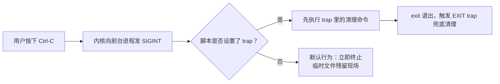

# 第 6 章 · Shell 脚本进阶

> 📍 位置：阶段 3 · 高级篇 · 第 6 章 ｜ ⏱ 预计用时：45-60 分钟 ｜ 难度：★★★★☆
>
> ⬅️ 上一章：[05 · 自动化运维](05-自动化运维.md) ｜ ➡️ 下一章：[07 · AI 辅助学习与运维](07-AI辅助学习与运维.md)

前两个阶段你已经能写"能跑"的脚本了，这一章教你写"**可靠**"的脚本：有像样的参数接口、出事能自己清理、慢活会并发跑、代码能复用能检查。学完本章，你就具备了进入项目实战的全部脚本功力。

## 🎯 学习目标

- 会用 **getopts** 给脚本写出专业的命令行参数接口。
- 会用 `read` 做交互输入，用 `select` 做菜单。
- 会用 **trap** 捕获信号，保证脚本无论怎么退出都"善终"。
- 会用后台任务 `&` 与 `wait` 控制并发数量，批量任务提速。
- 会用 `source` 组织函数库，用 `local` 管住变量作用域。
- 了解 sh 与 bash 的差异、**expect**（自动化交互工具）的适用场景。
- 建立脚本质量习惯：`set -euo pipefail` + ShellCheck + 日志函数，并完成一个综合脚本。

## 🧠 核心概念



[在学习站暂停、单步或重播](https://zhuguang-zfg.github.io/linux/#animation=bash-trap.svg)。动画中的输入输出为教学示意，需用本章实验验证。

### 1. 从"能跑"到"可靠"

入门脚本与生产脚本的差距不在功能，而在**边角**：参数没传怎么办？用户中途 Ctrl-C，临时文件谁清理？一百台机器逐个 ping 要等多久？本章每个小节都对应其中一个边角。先记住总纲：**脚本是给"未来手忙脚乱的自己"写的，越可靠，越省命**。

### 2. 信号与 trap：脚本的善终

脚本被 Ctrl-C 时收到 **SIGINT**，被 `kill` 时收到 **SIGTERM**，正常结束则触发 **EXIT**。`trap` 允许你在这些时刻执行指定动作（清理临时文件、打印状态）：



### 3. sh 与 bash 的差异

Ubuntu 上 `/bin/sh` 是 **dash** 的符号链接，不是 bash：dash 快、省内存，但**没有数组、没有 `[[ ]]`、没有进程替换与 here-string**。执行脚本时用的是 shebang 指定的解释器——`#!/bin/sh` 就按 dash 跑，`#!/usr/bin/env bash` 才是 bash。实践建议：日常运维脚本直接声明 bash，享受完整特性；写 `/usr/lib` 级系统脚本或追求极致兼容时才用 POSIX sh。用 `ls -l /bin/sh` 可以亲眼确认链接关系。

### 4. expect：自动化交互的老武器

有些老设备、老安装器只肯"人肉问答"，不肯读配置文件。**expect** 专门自动化这类交互，三板斧是 `spawn`（启动程序）、`expect`（等待特定输出）、`send`（替你敲字）。新体系下应优先用密钥、配置文件解决问题，expect 只作为遗留系统的兜底手段，知道它存在即可：

```expect
#!/usr/bin/expect -f
set timeout 10
spawn ssh admin@192.168.1.1
expect "assword:"
send "设备密码\r"
interact
```

## 🛠 命令实操


下面每个例子都是完整可运行的脚本，逐个敲进虚拟机体会。

### getopts：专业的参数解析

```bash
#!/usr/bin/env bash
# parse-demo.sh —— getopts 参数解析示例
set -euo pipefail

usage() {
    cat <<EOF
用法: $(basename "$0") [-v] [-n 名称] [-c 次数] [-h]
  -v        显示详细输出
  -n 名称   指定目标名称
  -c 次数   循环次数（默认 3）
EOF
}

verbose=0
name="world"
count=3

while getopts ":vn:c:h" opt; do
    case "$opt" in
        v) verbose=1 ;;
        n) name="$OPTARG" ;;        # OPTARG 是选项的参数值
        c) count="$OPTARG" ;;
        h) usage; exit 0 ;;
        \?) echo "未知选项: -$OPTARG" >&2; usage; exit 1 ;;
        :)  echo "选项 -$OPTARG 缺少参数" >&2; exit 1 ;;
    esac
done
shift $((OPTIND - 1))              # OPTIND：下一个待解析参数的位置

echo "verbose=$verbose name=$name count=$count 剩余位置参数: $*"
```

```bash
./parse-demo.sh -v -n 张三 -c 5 extra
```

```text
verbose=1 name=张三 count=5 剩余位置参数: extra
```

串首的 `:` 让错误交给我们自己处理（`\?` 未知选项、`:` 缺参数），而不是 bash 默认的报错。

### read 与 select：交互两件套

```bash
read -rp "请输入要备份的目录: " src            # -r 防转义，-p 提示语
read -rsp "请输入密码: " passwd; echo          # -s 静默，密码不回显
read -t 5 -rp "5 秒内输入 yes 确认: " ans \
    || { echo "超时，已取消"; exit 1; }        # -t 超时兜底

PS3="请选择操作: "                              # PS3 是 select 的提示符
select choice in "查看磁盘" "查看内存" "退出"; do
    case "$choice" in
        "查看磁盘") df -h / ;;
        "查看内存") free -h ;;
        "退出")     echo "再见"; break ;;
        *)          echo "输入编号无效" ;;
    esac
done
```

`select` 会自动把选项编成菜单，循环直到 `break`——几分钟就能给脚本装上一个体面的菜单。

### trap：清理临时文件的完整示例

```bash
#!/usr/bin/env bash
# cleanup-demo.sh —— 无论怎么退出都清理临时目录
set -euo pipefail
workdir=$(mktemp -d)
echo "工作目录: $workdir"
trap 'echo "清理 $workdir"; rm -rf "$workdir"' EXIT

head -c 1M /dev/zero > "$workdir/data.bin"   # 模拟产生中间文件
sleep 30      # 试着在这期间按 Ctrl-C，观察清理输出后再退出
echo "处理完成"
```

关键点：EXIT trap 处理 Shell 的退出清理，不能处理 `kill -9`、断电等强制终止。需要明确处理中断时，像下方综合示例一样为 INT/TERM 设置退出处理；`set -u` 下 trap 引用的变量必须先定义。

### 并发：& 与 wait 控制并发数

逐个 ping 254 个地址太慢，全部一起发又会把系统打满。正确姿势：后台任务 `&` 丢出去，用 `wait -n` 等"任意一个"结束，把并发数摁在上限内：

```bash
#!/usr/bin/env bash
# host-alive.sh —— 并发批量检测主机存活（并发上限可调）
set -u

MAX_JOBS=10                      # 最大并发数
NETWORK="192.168.1"              # 要扫描的网段
result_file=$(mktemp)
trap 'rm -f "$result_file"' EXIT

check_host() {
    local ip="$1"
    if ping -c 1 -W 1 "$ip" >/dev/null 2>&1; then
        echo "$ip 存活" >> "$result_file"
    fi
}

for i in $(seq 2 254); do
    # 已有任务数达到上限时，先等任意一个后台任务结束
    while (( $(jobs -rp | wc -l) >= MAX_JOBS )); do
        wait -n
    done
    check_host "${NETWORK}.${i}" &
done
wait                             # 等全部收尾

echo "===== 扫描结果 ====="
cat "$result_file"
echo "存活主机数: $(wc -l < "$result_file")"
```

`jobs -rp` 列出运行中的后台任务，`wait -n` 需要 bash 4.3 以上（Ubuntu 22.04 自带 bash 5.1，无压力）。这套"令牌桶"式的并发控制，适用于批量拉取、批量部署一切场景。

### 函数库与 source：代码复用

把通用函数抽进库文件，各脚本按需引入：

```bash
# lib.sh —— 可复用函数库
log()  { echo "[$(date '+%F %T')] [INFO ] $*"; }
die()  { echo "[$(date '+%F %T')] [FATAL] $*" >&2; exit 1; }
need() { command -v "$1" >/dev/null 2>&1 || die "缺少命令: $1"; }
```

```bash
#!/usr/bin/env bash
set -euo pipefail
source "$(dirname "$(readlink -f "$0")")/lib.sh"   # 按脚本自身位置引入

need rsync
log "开始备份"
```

### local：管住变量的作用域

函数内不带 `local` 的赋值会**污染全局**，循环变量名撞车是经典 bug：

```bash
count=0
bump() {
    local count=0        # 去掉 local 试试：全局 count 被改掉
    count=$((count + 1))
    echo "函数内: $count"
}
bump; bump
echo "函数外: $count"    # 有 local 时输出 0；去掉 local 后每次都先重置为 0，最终为 1
```

纪律：**函数内所有临时变量一律 `local`**。

### 脚本质量清单

1. **`set -euo pipefail`**：`-e` 出错即停、`-u` 未定义变量报错、`pipefail` 管道中任何一环失败都算失败。放在所有脚本第一行附近。
2. **ShellCheck 静态检查**：`sudo apt install shellcheck && shellcheck your.sh`，或直接用 [shellcheck.net](https://www.shellcheck.net) 在线检查；它报的问题九成是真 bug。
3. **统一日志函数**：`log` / `err` 带时间戳输出，别用裸 `echo` 满天飞。
4. 所有变量引用加双引号 `"$var"`，临时文件一律 `mktemp`。
5. 有 `usage()` 帮助与参数校验，错误信息写到 stderr。

### 综合示例：带参数、日志与 trap 的日志归档脚本

下面是按天清理的教学示例。实际备份还需考虑并发、恢复验证和目录边界；可运行的完整备份工具见 [backup.sh](../../scripts/backup.sh)。

```bash
#!/usr/bin/env bash
# archive-logs.sh —— 带参数、日志与 trap 的日志归档脚本
# 用法: ./archive-logs.sh -s <源目录> [-d <备份目录>] [-k <保留天数>]
set -euo pipefail

# ---------- 日志函数 ----------
ts()   { date '+%F %T'; }
log()  { echo "[$(ts)] [INFO ] $*"; }
err()  { echo "[$(ts)] [ERROR] $*" >&2; }

usage() {
    cat <<EOF
用法: $(basename "$0") -s <源目录> [-d <备份目录>] [-k <保留天数>]
  -s  要归档的目录（必填）
  -d  备份存放目录（默认 /backup）
  -k  保留最近多少天的备份（默认 7）
EOF
}

# ---------- 临时文件与 trap：保证善终 ----------
tmp_tar=""
cleanup() { [[ -z "$tmp_tar" ]] || rm -f -- "$tmp_tar"; }
trap cleanup EXIT
trap 'err "收到中断信号，正在退出"; exit 130' INT TERM

# ---------- getopts 参数解析 ----------
src_dir=""
dst_dir="/backup"
keep_days=7
dry_run=0

while getopts ":s:d:k:hn" opt; do
    case "$opt" in
        s) src_dir="$OPTARG" ;;
        d) dst_dir="$OPTARG" ;;
        k) keep_days="$OPTARG" ;;
        n) dry_run=1 ;;
        h) usage; exit 0 ;;
        :)  err "选项 -$OPTARG 缺少参数"; usage; exit 1 ;;
        \?) err "未知选项 -$OPTARG"; usage; exit 1 ;;
    esac
done
shift $((OPTIND - 1))

# ---------- 参数校验 ----------
[[ -n "$src_dir" ]] || { err "-s 源目录不能为空"; usage; exit 1; }
[[ -d "$src_dir" ]] || { err "源目录不存在: $src_dir"; exit 1; }
[[ "$keep_days" =~ ^[0-9]+$ ]] || { err "-k 必须是非负整数"; exit 1; }

# ---------- 归档：临时文件 + 原子移动，绝不留半成品 ----------
src_dir=$(realpath -e -- "$src_dir")
dst_dir=$(realpath -m -- "$dst_dir")
[[ "$src_dir" != / && "$dst_dir" != "$src_dir" && "$dst_dir" != "$src_dir/"* ]] \
    || { err "备份目录必须在源目录外"; exit 1; }
stamp=$(date '+%Y%m%d_%H%M%S')
base_name=$(basename "$src_dir")
archive="$dst_dir/${base_name}_${stamp}.tar.gz"

if (( dry_run )); then
    log "[DRY-RUN] 将归档 $src_dir 到 $archive"
    if [[ -d "$dst_dir" ]]; then
        find "$dst_dir" -maxdepth 1 -type f -name "${base_name}_*.tar.gz" -mtime +"$keep_days" -print
    fi
    exit 0
fi
mkdir -p -- "$dst_dir"
[[ ! -e "$archive" ]] || { err "同名归档已存在，请勿并发运行"; exit 1; }
tmp_tar=$(mktemp "$dst_dir/.logs.XXXXXXXX")

log "开始归档: $src_dir"
tar -czf "$tmp_tar" -C "$(dirname "$src_dir")" "$base_name"
tar -tzf "$tmp_tar" >/dev/null
mv -- "$tmp_tar" "$archive"
tmp_tar=""
log "归档完成: $archive（大小 $(du -h "$archive" | cut -f1)）"

# ---------- 清理过期备份 ----------
log "清理 $keep_days 天前的旧备份"
find "$dst_dir" -maxdepth 1 -type f -name "${base_name}_*.tar.gz" -mtime +"$keep_days" -print -delete \
    | while read -r old; do log "删除过期备份: $old"; done

log "全部完成"
```

运行与输出：

```bash
./archive-logs.sh -s /var/log/myapp -d /backup -k 7
```

```text
[2026-10-06 10:30:01] [INFO ] 开始归档: /var/log/myapp
[2026-10-06 10:30:01] [INFO ] 归档完成: /backup/myapp_20261006_103001.tar.gz（大小 2.3M）
[2026-10-06 10:30:01] [INFO ] 清理 7 天前的旧备份
[2026-10-06 10:30:01] [INFO ] 全部完成
```

## 💡 避坑指南

- **`set -e` 不是万能开关**：`if grep ...`、`cmd || true` 这类"预期失败"不会触发退出；反过来，函数内未预期的失败要靠它兜底——理解规则再用，别硬背。
- **trap 里引用未定义变量**：`set -u` 下 trap 语句在变量未定义时会报错，把清理用的变量放在 trap 设置之前初始化。
- **并发输出乱序**：多个后台任务同时 echo 会交错，让子任务只写文件（如本例的 result_file），最后统一输出。
- **`local` 用在函数外**：`local` 只能出现在函数内，脚本顶层使用直接报错。
- **shebang 写错解释器**：脚本用了数组却写 `#!/bin/sh`（dash），运行报语法错误——检查第一行。
- **shellcheck 警告手动压掉**：`# shellcheck disable=` 是"确认无害"后的标记，不是逃避检查的挡箭牌。

## ✍️ 动手实验

### 实验 1：给归档脚本加 `-n` 干跑（dry-run）选项

正文脚本已支持 `-n`，验证它只打印计划，不创建备份目录和临时归档，也不删除旧文件。检查初始化、参数解析、预演分支和真正写盘的顺序。

<details><summary>💡 参考解法（先自己试！）</summary>

```bash
# dry_run=0 必须在 getopts 之前初始化；否则会覆盖 -n 解析结果。
./archive-logs.sh -s /var/log/myapp -d "$HOME/archive-dry-run-test" -n
test ! -e "$HOME/archive-dry-run-test" && echo '未创建目标目录'
```

测试前确保源目录存在，目标目录原本不存在。预演应列出计划，文件系统保持不变；正常执行的临时文件放在目标目录中，避免跨文件系统移动破坏原子发布。
</details>

### 实验 2：改造并发扫描脚本

把 `host-alive.sh` 改造为：网段与并发数由 `-n 网段 -j 并发数` 参数传入（用 getopts），并通过 shellcheck 检查零警告。

<details><summary>💡 参考解法（先自己试！）</summary>

```bash
#!/usr/bin/env bash
set -u
usage() { echo "用法: $(basename "$0") -n 192.168.1 [-j 并发数(默认10)]"; exit 1; }
network=""; max_jobs=10
while getopts ":n:j:h" opt; do
    case "$opt" in
        n) network="$OPTARG" ;;
        j) max_jobs="$OPTARG" ;;
        h|*) usage ;;
    esac
done
[[ -n "$network" ]] || usage
# 其余逻辑同正文，把 MAX_JOBS 换成 "$max_jobs"、NETWORK 换成 "$network"
```

```bash
shellcheck host-alive.sh     # 无输出即通过
./host-alive.sh -n 192.168.1 -j 20
```
</details>

## 📺 推荐视频

- [B站 · Shell 编程入门](https://www.bilibili.com/video/BV1Sv411r7vd/?p=91) — 韩顺平，P91，11分41秒。Shell 基础、函数与实战补充；并发、trap 和失败处理仍需按本章验证。
- [B站 · Shell 自定义函数](https://www.bilibili.com/video/BV1Sv411r7vd/?p=104) — 韩顺平，P104，5分21秒。Shell 基础、函数与实战补充；并发、trap 和失败处理仍需按本章验证。
- [B站 · 定时备份数据库（实战）](https://www.bilibili.com/video/BV1Sv411r7vd/?p=106) — 韩顺平，P106，25分27秒。Shell 基础、函数与实战补充；并发、trap 和失败处理仍需按本章验证。

[](https://www.bilibili.com/video/BV1Sv411r7vd/?p=91)

[在学习站查看配套媒体](https://zhuguang-zfg.github.io/linux/#read=docs%2F03-pro%2F06-Shell%E8%84%9A%E6%9C%AC%E8%BF%9B%E9%98%B6.md) · [视频资料与核验说明](../../resources/videos.md)。标题、作者和分P已核对，未逐条完成实播，播放限制以原站为准。

## ✅ 自测清单

- [ ] 能解释 getopts 中串首 `:`、`OPTARG`、`OPTIND` 各自的作用。
- [ ] 能说出 trap 挂在 EXIT 与 INT 上的触发时机有什么不同。
- [ ] 能解释 `jobs -rp | wc -l` 与 `wait -n` 配合如何限制并发数。
- [ ] 能演示去掉 `local` 后函数如何污染全局变量。
- [ ] 能说出 Ubuntu 上 `/bin/sh` 实际是什么，以及 dash 缺少哪些 bash 特性。
- [ ] 能逐词解释 `set -euo pipefail` 三个字母各自的含义。
- [ ] 会用 shellcheck 检查脚本并修复它指出的第一个问题。
- [ ] 能指出综合归档脚本中 getopts、trap、日志、幂等清理各在哪些行。

## 🔗 延伸阅读

- [The Linux Documentation Project](https://tldp.org)——《Advanced Bash-Scripting Guide》所在地，Bash 进阶的完整免费教材。
- [ShellCheck 在线版](https://www.shellcheck.net)——把脚本粘进去立刻出体检报告。
- [Arch Wiki](https://wiki.archlinux.org)——搜索 Bash、cron 词条，大量一线实践细节。
- 下一章：[AI 辅助学习与运维](07-AI辅助学习与运维.md)——先学习如何核对模型建议，再进入实战项目。

> 📝 学完本章，去完成 [《03-高级篇练习》](../../exercises/03-高级篇练习.md) 中的对应练习，检验学习效果。
