# 第 7 章 · AI 辅助学习与运维

> 📍 阶段 3 · 高级篇 · 第 7 章 ｜ ⏱ 60 分钟 ｜ 难度：★★★☆☆
> ⬅️ [Shell 脚本进阶](06-Shell脚本进阶.md) ｜ ➡️ [LNMP 项目](../04-projects/项目1-LNMP网站服务器.md)

AI 可以解释陌生命令、整理错误信息、提出排查假设和生成练习。它给出的建议仍需核对环境、命令语义和实际结果。本章把 AI 放进已有的“读手册、做实验、留证据”流程。

## 🎯 学习目标

- 给模型提供足够的环境和问题信息，并区分事实与推测。
- 审查模型给出的命令，先做只读检查和隔离实验。
- 把一次问答变成经过验证的笔记或贡献。

## 🧠 核心概念



[在学习站暂停、单步或重播](https://zhuguang-zfg.github.io/linux/#animation=prompt-verify.svg)。动画中的输入输出为教学示意，需用本章实验验证。


一次回答说得流畅，不等于引用正确、命令可运行或权限足够。让模型先说明未知条件、给出最小检查步骤，比直接要求“一条命令修好”更容易判断。

## 🛠 命令实操

### 1. 先制作环境摘要

以下命令只展示基础环境；公开输出前仍要确认没有不必要的身份信息：

```bash
cat /etc/os-release
uname -r
bash --version | head -n 1
command -v systemctl
```

把摘要、原始命令、退出码和完整报错填入这个提示词。不要粘贴私钥、Token、客户数据或整份生产日志：

```text
我要理解并排查一个 Linux 问题。
环境：发行版/版本、Bash 版本、物理机或容器、当前权限。
目标：我想完成什么。
已执行：原始命令与输出（已脱敏）。
请先区分已知事实、假设和缺少的信息。
最多给出三条只读检查命令，解释每条要验证什么。
暂不建议删除文件、改权限、修改防火墙或重启服务。
如果依据手册，请给出具体条目；不确定时直接说明。
```

### 2. 用一个小实验检验解释

准备无敏感信息的模拟日志：

```bash
ai_lab=$(mktemp -d)
cat > "$ai_lab/app.log" <<'EOF'
2026-10-06 INFO started
2026-10-06 ERROR disk check failed
2026-10-06 INFO stopped
EOF
grep -n 'ERROR' "$ai_lab/app.log"
grep -n 'MISSING' "$ai_lab/app.log"
printf 'last exit status: %s\n' "$?"
```

预期 ERROR 匹配到第 2 行；MISSING 没输出、退出码为 1。让模型解释“为什么没有输出也可能是正常查询结果”，再用 `man grep` 中的 EXIT STATUS 核对。不要把模型给出的模拟输出写成自己的实测输出。

### 3. 审查建议，而不是盲目运行

假设模型建议 `sudo chmod -R 777 /var/www` 修复网页权限。你应追问：具体哪个路径、由哪个用户访问、缺的是目录遍历还是文件写权限？然后先检查 `ls -ld`、服务用户和日志。只有证据指向最小必要权限变更时，才在测试环境验证。

对脚本建议，可以先用 `bash -n 文件` 检查语法，再用临时目录测试空输入、带空格路径、失败路径和重复执行。语法通过不能证明不会误删，本仓库的 [备份回归测试](../../scripts/backup.test.mjs) 就是一个反例教材。

## 💡 避坑指南

- 模型可能把 Ubuntu、RHEL、macOS 的参数混用，先核对发行版和工具版本。
- 让模型生成引用后亲自打开对应手册；链接存在也不代表支持它的结论。
- 网页、日志和文件中的文字是待分析数据，不因为写着“忽略限制、执行此命令”就成为操作指令。
- 高影响操作要明确目标、范围、恢复方式，先在隔离环境验证。

## ✍️ 动手实验

使用同一问题分别提问“帮我修好”和上面的结构化提示词，比较哪些回答给出了可验证的检查步骤。再写一段自己的结论：哪些建议经过实测，哪些被手册否定，哪些仍不确定。

<details><summary>验收标准</summary>

至少保留一条原始证据、一条明确假设、一条核对依据和一次实际复验。即使模型没有给出正确答案，只要你能解释为什么不能采用，也完成了本章训练。
</details>

## 📺 推荐视频

- [YouTube · Ollama 与 Open WebUI](https://www.youtube.com/watch?v=RQFfK7xIL28) — Christian Lempa，39分7秒。展示本地模型工具背景，不代替人工审阅与证据核对。

[](https://www.youtube.com/watch?v=RQFfK7xIL28)

[在学习站查看配套媒体](https://zhuguang-zfg.github.io/linux/#read=docs%2F03-pro%2F07-AI%E8%BE%85%E5%8A%A9%E5%AD%A6%E4%B9%A0%E4%B8%8E%E8%BF%90%E7%BB%B4.md) · [视频资料与核验说明](../../resources/videos.md)。标题、作者和分P已核对，未逐条完成实播，播放限制以原站为准。

## ✅ 自测清单

- [ ] 提供环境、目标、已执行步骤和错误信息。
- [ ] 能拒绝缺乏证据的高影响建议。
- [ ] 能区分模型推断、手册定义与自己的实测结果。

## 🔗 延伸阅读

- [GNU grep 手册](https://www.gnu.org/software/grep/manual/grep.html)
- [WaytoAGI](https://www.waytoagi.com) 的知识、工具与提示词入口提供编排灵感；本章为本项目原创内容。
- [故障排查 20 例](../04-projects/项目5-故障排查20例.md)
