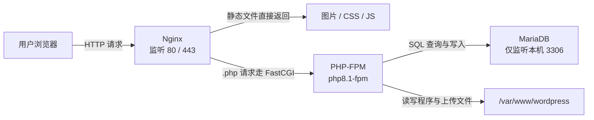

# 项目 1 · LNMP 网站服务器：从裸机到 WordPress 可访问

> 📍 位置：阶段 4 · 实战篇 · 项目 1 ｜ ⏱ 预计用时：2-4 小时 ｜ 难度：★★★★☆

> ⬅️ 上一章：[06 · Shell 脚本进阶](../03-pro/06-Shell脚本进阶.md) ｜ ➡️ 下一章：[项目 2 · 服务器巡检脚本](项目2-服务器巡检脚本.md)

练完了前几章的基本功，这一章我们真刀真枪下一回山：把一台刚开好的云服务器（Cloud Server），变成一台全世界都能访问的网站服务器。你要亲手搭起经典的 LNMP 架构（Linux + Nginx + MariaDB/MySQL + PHP），并在上面跑起全球使用最广的建站系统 WordPress。做完这个项目，"服务器"三个字对你来说就不再是黑盒子了。


## 🎯 项目目标

完成本章后，你应该能够：

1. 在云控制台完成主机初始化，看懂并配置安全组（Security Group）；
2. 用 apt 一键装好 Nginx、MariaDB、PHP-FPM 及 WordPress 所需的常用扩展；
3. 独立写出带 FastCGI（Fast Common Gateway Interface）段的 Nginx server 块（Server Block）；
4. 完成 MariaDB 安全初始化，并用 SQL 完成"建库、建用户、授权"三连；
5. 部署 WordPress 并在浏览器中完成安装向导；
6. 面对 502、白屏，能按固定三步定位问题，不再瞎猜。

## 🧠 方案设计

### LNMP 四个角色怎么协作？

- **Nginx**：门童。只负责接待 HTTP 请求，静态文件（图片、CSS、JS）自己返回，PHP 请求转交给 PHP-FPM；
- **PHP-FPM**：厨师。FastCGI 进程管理器（Process Manager），真正执行 WordPress 的 PHP 代码；
- **MariaDB**：账房。存放文章、评论、用户等所有数据；它是 MySQL 的社区分支，用法完全兼容；
- **WordPress**：菜单。以上三者都是为它服务的。



### 端口与账号规划

动手前先立规矩，这张表建议抄进你的笔记：

| 组件 | 端口 | 监听范围 | 说明 |
|---|---|---|---|
| Nginx | 80 / 443 | 公网 | 对外服务的唯一入口 |
| PHP-FPM | unix socket | 本机 | 不走 TCP，更安全 |
| MariaDB | 3306 | 仅 127.0.0.1 | 绝不暴露公网 |
| SSH | 22 | 公网 | 管理入口，建议改密钥登录 |

### 文件与目录规划

| 路径 | 作用 |
|---|---|
| `/etc/nginx/sites-available/wordpress.conf` | 站点配置原件 |
| `/etc/nginx/sites-enabled/` | 启用站点的软链接目录 |
| `/var/www/wordpress` | 网站根目录，属主必须是 `www-data` |
| `/etc/php/8.1/fpm/pool.d/www.conf` | PHP-FPM 进程池配置（重点看 `listen =`） |

## 🛠 动手实施

### 第 1 步 ｜ 云主机准备与安全组

- 准备一台 Ubuntu 22.04 LTS 云主机（1 核 2G 能跑，2 核 4G 更从容）；
- 在云控制台的**安全组**里放行：TCP 22（SSH）、TCP 80（HTTP）、TCP 443（HTTPS）；
- 优先用 SSH 密钥登录，比密码安全得多（云控制台绑定密钥即可）。

登录后先做例行初始化：

```bash
sudo apt update && sudo apt upgrade -y
sudo hostnamectl set-hostname web01
```

### 第 2 步 ｜ apt 安装 LNMP 三件套

```bash
# Web 服务器与数据库
sudo apt install -y nginx mariadb-server mariadb-client

# PHP-FPM 与 WordPress 必需的常用扩展
sudo apt install -y php8.1-fpm php8.1-mysql php8.1-curl php8.1-gd \
    php8.1-xml php8.1-mbstring php8.1-zip php8.1-intl php8.1-imagick

# 确认三个服务都已启动
systemctl status nginx php8.1-fpm mariadb --no-pager
```

> 💡 `php8.1` 是 Ubuntu 22.04 官方仓库自带的 PHP 版本，后面 `php8.1-fpm.sock` 这个名字也由此而来。

### 第 3 步 ｜ 编写 Nginx server 块

新建 `/etc/nginx/sites-available/wordpress.conf`，完整内容如下：

```nginx
server {
    listen 80;
    server_name _;                     # 有域名就写域名，暂时没有就保持 _
    root /var/www/wordpress;
    index index.php index.html;

    # 主路由：WordPress 的伪静态（Permalink）全靠这一行
    location / {
        try_files $uri $uri/ /index.php?$args;
    }

    # FastCGI 段：把 .php 请求转交给 PHP-FPM
    location ~ \.php$ {
        include snippets/fastcgi-php.conf;
        fastcgi_pass unix:/run/php/php8.1-fpm.sock;
        fastcgi_param SCRIPT_FILENAME $document_root$fastcgi_script_name;
        include fastcgi_params;
    }

    # 禁止隐藏配置文件（如 .htaccess）被下载
    location ~ /\.ht {
        deny all;
    }
}
```

启用并验证：

```bash
sudo rm -f /etc/nginx/sites-enabled/default      # 摘掉默认欢迎页
sudo ln -s /etc/nginx/sites-available/wordpress.conf /etc/nginx/sites-enabled/
sudo nginx -t                                    # 必须看到 syntax is ok
sudo systemctl reload nginx
```

### 第 4 步 ｜ MariaDB 安全初始化与建库授权

```bash
sudo mysql_secure_installation
```

按提示回答：设置 root 密码 → 移除匿名用户 Y → 禁止 root 远程登录 Y → 移除 test 库 Y → 立即重载权限 Y。然后进入数据库控制台：

```bash
sudo mariadb
```

```sql
-- 建库：WordPress 必须用 utf8mb4，否则 emoji 存不进去
CREATE DATABASE wordpress
  DEFAULT CHARACTER SET utf8mb4
  COLLATE utf8mb4_unicode_ci;

-- 建用户并授权（把示例密码换成你自己的强密码）
CREATE USER 'wpuser'@'localhost' IDENTIFIED BY 'Wp#2026_Str0ng';
GRANT ALL PRIVILEGES ON wordpress.* TO 'wpuser'@'localhost';
FLUSH PRIVILEGES;
EXIT;
```

### 第 5 步 ｜ 下载 WordPress 并配置 wp-config

```bash
cd /tmp
sudo apt install -y curl unzip
curl -O https://wordpress.org/latest.zip
sudo unzip latest.zip -d /var/www/
sudo chown -R www-data:www-data /var/www/wordpress
```

生成配置文件：

```bash
cd /var/www/wordpress
sudo cp wp-config-sample.php wp-config.php
sudo nano wp-config.php
```

修改这三行（对应第 4 步的库、用户、密码）：

```php
define( 'DB_NAME', 'wordpress' );
define( 'DB_USER', 'wpuser' );
define( 'DB_PASSWORD', 'Wp#2026_Str0ng' );
```

再往下找到 8 行 `put your unique phrase here` 的密钥（从 AUTH_KEY 到 LOGGED_IN_SALT），逐行替换成随机字符串——每行都可以用 `openssl rand -base64 48` 本地生成，不必联网。

### 第 6 步 ｜ 放行防火墙

```bash
sudo ufw allow OpenSSH
sudo ufw allow 80/tcp
sudo ufw allow 443/tcp
sudo ufw enable
sudo ufw status
```

> ⚠️ 一定要先放行 OpenSSH 再 enable，否则下一步你就把自己锁在门外了。

### 第 7 步 ｜ curl 验证 + 浏览器完成安装

```bash
curl -I http://localhost                 # 期望：HTTP/1.1 200 OK
curl -I http://localhost/wp-login.php    # 200 或 302 都正常，关键是不要 502
curl -I http://你的云主机公网IP            # 从外部再验一次
```

浏览器打开 `http://公网IP/wp-admin/setup-config.php`：

1. 选择「简体中文」；
2. 因为数据库信息已写进 wp-config.php，向导会直接带你进入「运行安装程序」；
3. 填写站点标题、管理员用户名与密码（这个密码管着整个后台）、邮箱；
4. 点「安装 WordPress」→ 用管理员账号登录 → 看到仪表盘，大功告成。

最后发一篇文章、传一张图，确认写权限也正常。

## 💡 避坑指南

**502 Bad Gateway 三步定位法**（90% 的 502 都栽在这三步里）：

1. **看服务**：`systemctl status php8.1-fpm nginx mariadb`——谁没起来一目了然，PHP-FPM 挂掉是 502 的头号原因；
2. **看日志**：`sudo tail -n 30 /var/log/nginx/error.log`，若出现 `connect() failed ... php8.1-fpm.sock`，说明 Nginx 找不到 PHP-FPM；
3. **核对配置一致性**：server 块里 `fastcgi_pass` 的 sock 路径，必须与 `/etc/php/8.1/fpm/pool.d/www.conf` 中 `listen =` 的值完全一致。

**白屏（Blank Page）三步定位法**：

1. 打开调试开关：把 wp-config.php 里的 `WP_DEBUG` 改为 `true`，刷新页面看具体报错；
2. 十有八九是缺扩展：补装 `php8.1-mbstring`、`php8.1-gd` 等后 `systemctl restart php8.1-fpm`；
3. 仍无输出就看 `/var/log/php8.1-fpm.log`，确认是不是内存不足导致进程被杀。

其他高频坑：

- **权限**：网站目录属主必须是 `www-data:www-data`，否则后台装主题、传图片统统要 FTP；
- **数据库绝不暴露公网**：3306 只许监听本机，公网上的爆破脚本 24 小时在线；
- **改完 Nginx 先 `nginx -t` 再 reload**：错误配置直接 restart 会让服务起不来，reload 则不会。

## ✍️ 进阶挑战

1. **上 HTTPS**：`sudo apt install -y certbot python3-certbot-nginx`，给自己的域名自动签发 Let's Encrypt 证书，并开启 80 → 443 跳转；
2. **验证伪静态**：在 WordPress 后台把固定链接改为「文章名」，逐页点开确认不报 404——背后正是 server 块里那行 `try_files`；
3. **每日备份**：写一个 cron 任务，每天凌晨用 `mysqldump` 备份数据库、打包 `wp-content` 目录，保存到本机另一块盘或对象存储。

## 📺 推荐视频

[](https://www.bilibili.com/video/BV1ZZ37zdEp2)

配着视频部署一遍更稳：重点看与服务部署、Nginx 配置相关的集数，其余集数当作随身手册按需回看。

## ✅ 验收清单

- [ ] 云主机安全组放行了 22 / 80 / 443，SSH 密钥可登录
- [ ] `systemctl status nginx php8.1-fpm mariadb` 三个服务均为 active (running)
- [ ] `nginx -t` 输出 syntax is ok / test is successful
- [ ] MariaDB 存在 wordpress 库与 wpuser 用户，且 root 不能远程登录
- [ ] `/var/www/wordpress` 属主为 `www-data:www-data`
- [ ] `curl -I http://localhost/wp-login.php` 返回 200 或 302
- [ ] 浏览器完成 WordPress 安装向导，能登录后台并发布一篇文章
- [ ] `ufw status` 显示仅放行 22 / 80 / 443
- [ ] 能独立说出 502 的三步排查顺序

## 🔗 延伸阅读

- [Nginx 官方文档（http 模块与 server 块）](https://nginx.org/en/docs/)
- [📝 阶段 4 实战篇练习](../../exercises/04-实战篇练习.md)
- 下一章把服务器的日常运维自动化：[项目 2 · 服务器巡检脚本](项目2-服务器巡检脚本.md)
