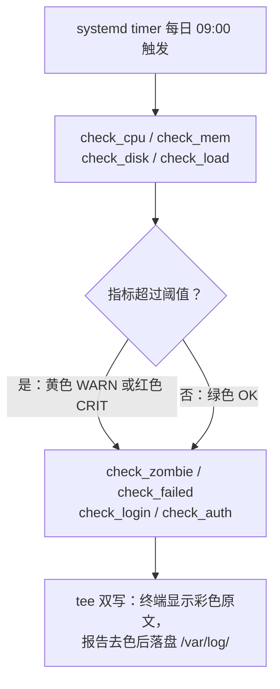

# 项目 2 · 服务器巡检脚本：给你的服务器做体检

> 📍 位置：阶段 4 · 实战篇 · 项目 2 ｜ ⏱ 预计用时：2-4 小时 ｜ 难度：★★★★☆

> ⬅️ 上一章：[项目 1 · LNMP 网站服务器](项目1-LNMP网站服务器.md) ｜ ➡️ 下一章：[项目 3 · 个人云盘与内网穿透](项目3-个人云盘与内网穿透.md)

项目 1 里我们把服务器建起来了，但真正的运维（Operations, Ops）不是"建好"，而是"天天都好"。本章你要写出一个 100 多行的服务器巡检（Health Check）脚本：每天自动给服务器做一次体检，把 CPU、内存、磁盘、安全日志统统查一遍，生成一份可留档的报告。这可能是你写过的最实用的一系列 Bash 程序的开端。


> 📷 图片：Carl Lender，CC BY 2.0（Wikimedia Commons）


## 🎯 项目目标

- 独立完成一份巡检需求拆解，搞清楚"体检到底要查哪些项目"；
- 写出一个 100+ 行、函数化、带彩色输出的巡检脚本，可直接复制到任何 Ubuntu 22.04 机器运行；
- 报告自动落盘到 `/var/log/health-report-日期.log`，方便日后回溯对比；
- 用 systemd timer（定时器）替代 cron，让脚本每天自动执行。

## 🧠 方案设计

### 需求拆解：体检要查什么？

| 巡检项 | 用到的命令 | 判定标准 |
|---|---|---|
| 系统概况 | hostname、uname、uptime | 仅展示 |
| CPU 使用率 | top、awk | ≥ 80% 告警 |
| 内存使用率 | free、awk | ≥ 80% 告警 |
| 磁盘使用率 | df、awk | ≥ 85% 告警 |
| 系统负载（Load Average） | nproc、/proc/loadavg | 超过核数 × 2 告警 |
| 僵尸进程（Zombie Process） | ps | 数量 ≥ 1 告警 |
| 失败服务 | systemctl list-units | 有 failed 即告警 |
| 最近登录 | last | 展示前 5 条 |
| 安全日志 | grep /var/log/auth.log | 有 SSH 失败尝试即提示 |

### 执行流程



### 设计决策

- **函数化**：每个巡检项一个函数，将来加"新体检项"就是加一个函数；
- **颜色输出**：绿 OK、黄 WARN、红 CRIT，人眼 3 秒扫完；
- **双写**：终端看彩色，文件存纯文本（去掉 ANSI 转义码），避免日志里全是乱码；
- **systemd timer 优于 cron**：`Persistent=true` 错过了自动补跑，且执行记录可用 `journalctl` 追查。

## 🛠 动手实施

### 第 1 步 ｜ 编写脚本 health-check.sh

在任意目录创建 `health-check.sh`，完整源码如下（约 115 行，可直接复制运行）：

```bash
#!/usr/bin/env bash
# ============================================================
# health-check.sh —— 服务器每日巡检脚本（Ubuntu 22.04 LTS）
# 用法：sudo bash health-check.sh [报告目录]，报告默认写入 /var/log/
# ============================================================
set -u
export LC_ALL=C

REPORT_DIR="${1:-/var/log}"
REPORT_FILE="${REPORT_DIR}/health-report-$(date +%F).log"

# 颜色定义（这些转义码在写入报告文件前会被 sed 去除）
RED='\033[31m'; GREEN='\033[32m'; YELLOW='\033[33m'; CYAN='\033[36m'; RESET='\033[0m'

# 告警阈值，按机器情况调整
CPU_LIMIT=80        # CPU 使用率（%）
MEM_LIMIT=80        # 内存使用率（%）
DISK_LIMIT=85       # 磁盘使用率（%）
ZOMBIE_LIMIT=1      # 僵尸进程数量

ok()      { echo -e "${GREEN}[ OK ]${RESET} $1"; }
warn()    { echo -e "${YELLOW}[WARN]${RESET} $1"; }
crit()    { echo -e "${RED}[CRIT]${RESET} $1"; }
section() { echo -e "\n${CYAN}======== $1 ========${RESET}"; }

# ---------- 1. CPU 使用率 ----------
check_cpu() {
    section "CPU 使用率"
    # 取第二个采样窗口，用 100 - idle 估算非空闲比例，不只读取 user 一列
    local usage; usage=$(top -bn2 -d 1 | awk '/Cpu\(s\)/ {for (i=1; i<=NF; i++) if ($i ~ /^id/) value=100-$(i-1)} END {if (value != "") printf "%d", value}')
    [[ "$usage" =~ ^[0-9]+$ ]] || { warn "无法解析 CPU 采样，需人工检查"; return; }
    [ "$usage" -ge "$CPU_LIMIT" ] && crit "CPU 使用率 ${usage}%，已超过阈值 ${CPU_LIMIT}%" || ok "CPU 使用率 ${usage}%"
}

# ---------- 2. 内存使用率 ----------
check_mem() {
    section "内存使用"
    local usage; usage=$(free | awk '/Mem:/ {printf "%d", ($2-$7)/$2*100}')
    if [ "$usage" -ge "$MEM_LIMIT" ]; then
        crit "内存使用率 ${usage}%"
        free -h | sed 's/^/       /'
    else
        ok "内存使用率 ${usage}%"
    fi
}

# ---------- 3. 磁盘使用率 ----------
check_disk() {
    section "磁盘使用"
    df -hP | awk 'NR>1 && $1!~/tmpfs|udev|loop/ {print $6, $5}' | while read -r mnt pct; do
        pct=${pct%\%}
        [ "$pct" -ge "$DISK_LIMIT" ] && crit "挂载点 ${mnt} 已用 ${pct}%" || ok "挂载点 ${mnt} 已用 ${pct}%"
    done
}

# ---------- 4. 系统负载 ----------
check_load() {
    section "系统负载"
    local ncpu load1; ncpu=$(nproc); load1=$(awk '{print int($1)}' /proc/loadavg)
    [ "$load1" -ge $((ncpu * 2)) ] && crit "1 分钟负载 ${load1}，已超过 ${ncpu} 核的 2 倍" || ok "1 分钟负载 ${load1} / ${ncpu} 核"
}

# ---------- 5. 僵尸进程 ----------
check_zombie() {
    section "僵尸进程"
    local count; count=$(ps -eo stat | grep -c '^Z')
    if [ "$count" -ge "$ZOMBIE_LIMIT" ]; then
        warn "发现 ${count} 个僵尸进程："
        ps -eo pid,ppid,stat,comm | awk '$3 ~ /^Z/' | sed 's/^/       /'
    else
        ok "无僵尸进程"
    fi
}

# ---------- 6. 失败的 systemd 服务 ----------
check_failed() {
    section "失败服务"
    local failed; failed=$(systemctl list-units --state=failed --no-legend --no-pager | wc -l)
    if [ "$failed" -gt 0 ]; then
        crit "有 ${failed} 个服务处于 failed 状态："
        systemctl list-units --state=failed --no-legend --no-pager | sed 's/^/       /'
    else
        ok "无失败服务"
    fi
}

# ---------- 7. 最近登录 ----------
check_login() {
    section "最近登录（前 5 条）"
    last -n 5 | sed 's/^/       /'
}

# ---------- 8. 安全日志：SSH 失败尝试 ----------
check_auth() {
    section "安全日志（SSH 失败尝试）"
    if [[ ! -r /var/log/auth.log ]]; then
        warn "auth.log 不存在或不可读，请用 journalctl -u ssh 检查，不能据此判断无失败登录"
        return 0
    fi
    if ! grep -q 'Failed password' /var/log/auth.log 2>/dev/null; then
        ok "无 SSH 失败登录记录"
        return 0
    fi
    warn "累计 $(grep -c 'Failed password' /var/log/auth.log) 次 SSH 密码失败尝试，最近 3 条："
    grep 'Failed password' /var/log/auth.log | tail -n 3 | sed 's/^/       /'
}

# ---------- 主流程 ----------
main() {
    echo "=============================================="
    echo " 服务器巡检报告　生成时间：$(date '+%F %T')"
    echo " 主机名：$(hostname)　内核：$(uname -r)　运行：$(uptime -p)"
    echo "=============================================="
    for check in check_cpu check_mem check_disk check_load check_zombie check_failed check_login check_auth; do
        "$check"        # 循环调用检查函数，将来新增检查项只需在此追加名字
    done
    echo "=============================================="
    echo " 巡检完成"
}

mkdir -p "$REPORT_DIR"    # 报告目录不存在则创建
# tee 双写：终端显示彩色原文，sed 去色后写入报告文件
main | tee >(sed -r 's/\x1B\[[0-9;]*m//g' > "$REPORT_FILE")
echo "报告已保存：${REPORT_FILE}"
```

### 第 2 步 ｜ 试运行并部署

```bash
# 试运行（auth.log 需要 root 权限读取）
sudo bash health-check.sh

# 查看生成的报告
cat /var/log/health-report-$(date +%F).log

# 部署到全局路径
sudo cp health-check.sh /usr/local/bin/
sudo chmod +x /usr/local/bin/health-check.sh
```

### 第 3 步 ｜ systemd timer 每日执行

创建 `/etc/systemd/system/health-check.service`：

```ini
[Unit]
Description=Daily server health check report
After=network-online.target

[Service]
Type=oneshot
User=root
ExecStart=/usr/local/bin/health-check.sh
```

创建 `/etc/systemd/system/health-check.timer`：

```ini
[Unit]
Description=Run health check every day at 09:00

[Timer]
OnCalendar=*-*-* 09:00:00
Persistent=true
Unit=health-check.service

[Install]
WantedBy=timers.target
```

启用与验证：

```bash
sudo systemctl daemon-reload
sudo systemctl enable --now health-check.timer
systemctl list-timers --no-pager | grep health
sudo journalctl -u health-check.service -n 20 --no-pager   # 查看执行记录
```

报告格式示例（数值仅用于说明，验收以实际输出为准）：

```text
==============================================
 服务器巡检报告　生成时间：2026-10-06 09:00:02
 主机名：web01　内核：5.15.0-xx-generic　运行：up 12 days
==============================================

======== CPU 使用率 ========
[ OK ] CPU 使用率 6%

======== 内存使用 ========
[ OK ] 内存使用率 41%

======== 磁盘使用 ========
[ OK ] 挂载点 / 已用 57%
[ OK ] 挂载点 /data 已用 23%

======== 系统负载 ========
[ OK ] 1 分钟负载 0 / 2 核

======== 僵尸进程 ========
[ OK ] 无僵尸进程

======== 失败服务 ========
[CRIT] 有 1 个服务处于 failed 状态：
       ● nginx.service  loaded  failed  failed  A high performance web server and reverse proxy

======== 最近登录（前 5 条） ========
       ubuntu   pts/0        203.0.113.7      Mon Oct  5 21:47   still logged in

======== 安全日志（SSH 失败尝试） ========
[WARN] 累计 34 次 SSH 密码失败尝试，最近 3 条：
       Oct  5 21:50:12 web01 sshd[20411]: Failed password for root from 203.0.113.9 port 51234 ssh2
       ...
==============================================
 巡检完成
```

## 💡 避坑指南

- **脚本在 timer 里"没反应"**：systemd 服务的环境变量极简，务必用绝对路径；脚本已按 `/usr/local/bin` 部署位编写，别放家目录；
- **报告里全是乱码**：出现了 `[033[32m` 这类字符说明忘了去转义码——检查 `sed -r 's/\x1B\[...'` 那行是否原样复制；
- **权限不够读 auth.log**：脚本必须以 root 运行（timer 里 `User=root` 已保证），手动测试请加 `sudo`；
- **`grep -c` 的退出码陷阱**：grep 没匹配到时退出码是 1，所以这个脚本不能开 `set -e`，否则"没有失败登录"反而会让它中途退出；
- **改阈值**：直接改脚本头部的四个变量，不要把魔法数字（Magic Number）散落各处。

## ✍️ 进阶挑战

1. **加一项 inode 巡检**：仿照 check_disk 写一个 check_inode，用 `df -i` 监控索引节点（inode）使用率，并加入主流程的 for 循环；
2. **接入 syslog**：给脚本加一行 `logger -t health-check "报告已生成"`，然后在 `journalctl -t health-check` 里验证；
3. **阈值参数化**：把四个阈值改成 `CPU_LIMIT=${CPU_LIMIT:-80}` 这种写法，实现"一台机器一份配置"。

## 📺 推荐视频

[](https://www.youtube.com/watch?v=v392lEyM29A)

英文系统课，其中 Shell 脚本与服务管理部分与本项目的动作高度重合，适合当作课后加餐慢慢消化。

## ✅ 验收清单

- [ ] 脚本在本机 `sudo bash health-check.sh` 可直接跑通
- [ ] `/var/log/health-report-日期.log` 生成且内容无乱码
- [ ] 至少一项指标被正确告警（可临时把阈值改成 1 验证）
- [ ] 脚本已部署在 `/usr/local/bin/health-check.sh` 且有执行权限
- [ ] `systemctl list-timers` 能看到 health-check.timer 且下次触发时间正确
- [ ] `journalctl -u health-check.service` 能查到执行记录
- [ ] 能说清 timer 相比 cron 的两个优点
- [ ] 已完成"新增一个自定义检查项"（挑战 1）

## 🔗 延伸阅读

- [复习：06 · Shell 脚本进阶（函数与管道）](../03-pro/06-Shell脚本进阶.md)
- [📝 阶段 4 实战篇练习](../../exercises/04-实战篇练习.md)
- 下一章用 Docker 打造私人云盘：[项目 3 · 个人云盘与内网穿透](项目3-个人云盘与内网穿透.md)
