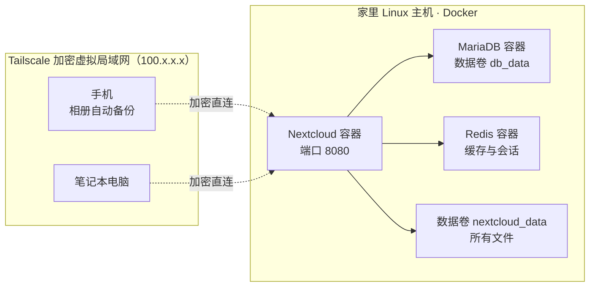

# 项目 3 · 个人云盘与内网穿透：打造你自己的 Nextcloud

> 📍 位置：阶段 4 · 实战篇 · 项目 3 ｜ ⏱ 预计用时：2-4 小时 ｜ 难度：★★★★☆

> ⬅️ 上一章：[项目 2 · 服务器巡检脚本](项目2-服务器巡检脚本.md) ｜ ➡️ 下一章：[项目 4 · Linux 跑本地 AI](项目4-Linux跑本地AI.md)

受够了网盘的限速和隐私条款？本章用 Docker Compose（容器编排工具）在家里或实验室的 Linux 主机上，部署一套完全属于自己的云盘 Nextcloud，再通过 Tailscale 组一张加密的虚拟局域网（Virtual Private Network, VPN），让手机、笔记本在全世界任何角落都能安全访问——不用公网 IP、不用再买云服务器。

## 🎯 项目目标

1. 说清 Nextcloud 与 Seafile 的取舍，独立完成方案选型；
2. 用一份 `docker-compose.yml` 一键拉起 Nextcloud + MariaDB + Redis 三个容器；
3. 完成首次配置向导，上传并同步第一批文件；
4. 理解 Tailscale 的组网原理，三步完成安装组网；
5. 了解 frp 传统方案，知道什么时候该轮到它出场；
6. 让手机相册自动备份，并用 Tailscale 证书开启 HTTPS。

## 🧠 方案设计



[在学习站暂停、单步或重播](https://zhuguang-zfg.github.io/linux/#animation=ssh-tunnel.svg)。动画中的输入输出为教学示意，需用本章实验验证。



[在学习站暂停、单步或重播](https://zhuguang-zfg.github.io/linux/#animation=intranet-tunnel.svg)。动画中的输入输出为教学示意，需用本章实验验证。

### 选型：Nextcloud 还是 Seafile？

| 对比项 | Nextcloud | Seafile |
|---|---|---|
| 定位 | 功能全面的私有云平台（文件 + 相册 + 日历 + 协作） | 专注文件同步与分享，轻快 |
| 文件存储 | 按原样落盘，服务器上可直接浏览 | 分块加密存储，需走客户端导出 |
| 插件生态 | 数百个官方与社区应用（App） | 相对精简 |
| 性能 | 功能多则略重，小机器建议配 Redis 缓存 | 同步速度快，资源占用低 |
| 适合人群 | 想要"个人 Google 全家桶" | 只想要"自己的 Dropbox" |

本项目选 **Nextcloud**：功能覆盖面广、社区资料多、相册自动备份体验完整。若你只追求极致同步速度、机器配置紧张，Seafile 值得一试。

### 硬件与网络前提

- 一台 7×24 开机的 Linux 主机：旧笔记本、迷你主机、家用服务器都行，建议 2 核 4G 内存起步；
- 磁盘按"想存多少照片和视频"来规划，不够就外接一块硬盘挂进数据卷；
- 家里宽带**不需要**公网 IP——这正是选 Tailscale 而不是 frp 的核心原因；
- 已安装 Docker 与 Compose 插件：`docker compose version` 能打印出版本号即可。

### 总体架构



## 🛠 动手实施

### 第 1 步 ｜ Docker Compose 部署 Nextcloud

确认 Docker 已安装（`docker --version`），然后新建项目目录：

```bash
mkdir -p ~/nextcloud && cd ~/nextcloud
# 仅首次初始化密码，后续运行复用 .env
if [[ ! -e .env ]]; then
    (umask 077; printf 'MYSQL_ROOT_PASSWORD=%s\nMYSQL_PASSWORD=%s\n' "$(openssl rand -hex 24)" "$(openssl rand -hex 24)" > .env)
fi
nano docker-compose.yml
```

`docker-compose.yml` 完整内容（app + mariadb + redis，含数据卷）：

```yaml
services:
  db:
    image: mariadb:11.4              # 不盲目跨数据库大版本升级
    restart: always
    command: --transaction-isolation=READ-COMMITTED --log-bin=binlog --binlog-format=ROW
    environment:
      - MYSQL_ROOT_PASSWORD=${MYSQL_ROOT_PASSWORD:?set MYSQL_ROOT_PASSWORD}
      - MYSQL_DATABASE=nextcloud
      - MYSQL_USER=nextcloud
      - MYSQL_PASSWORD=${MYSQL_PASSWORD:?set MYSQL_PASSWORD}
    volumes:
      - db_data:/var/lib/mysql

  redis:
    image: redis:alpine
    restart: always

  app:
    image: nextcloud:apache
    restart: always
    ports:
      - "127.0.0.1:8080:80"
    depends_on:
      - db
      - redis
    environment:
      - MYSQL_HOST=db
      - MYSQL_DATABASE=nextcloud
      - MYSQL_USER=nextcloud
      - MYSQL_PASSWORD=${MYSQL_PASSWORD:?set MYSQL_PASSWORD}
      - REDIS_HOST=redis
    volumes:
      - nextcloud_data:/var/www/html

volumes:
  db_data:
  nextcloud_data:
```

启动并观察：

```bash
docker compose up -d
docker compose ps            # 三个容器都应是 running
docker compose logs -f app   # 看到初始化完成即可 Ctrl+C
```

> 💡 新版 Docker Compose 已不需要文件顶部的 `version:` 字段，写了反而会有警告。

### 第 2 步 ｜ 首次配置向导

先从客户端建立 SSH 隧道：`ssh -N -L 127.0.0.1:8080:127.0.0.1:8080 用户名@主机IP`，再打开 `http://127.0.0.1:8080`。这样安装器只供本机和已认证的隧道访问：

1. 设置管理员账号与密码——这就是你云盘的"root"；
2. 数据库一页已由环境变量预填，向导会自动跳过，稍等初始化完成；
3. 进入仪表盘后，点右上角「+」上传一个文件试试；
4. 打开 设置 → 概览，按提示处理安全警告（部分提醒可按需忽略）。

### 第 3 步 ｜ Tailscale 内网穿透

Tailscale 基于 WireGuard 为设备建立私有网络。连接优先尝试直连，无法打洞时可能经过 DERP 中继；不能把所有连接都当成直连。使用 `tailscale status` 和 `tailscale ping 目标` 查看实际路径。

个人设备之间访问可使用 tailnet，不必自己做公网端口映射。是否允许另一台设备访问，仍由 tailnet 的访问策略和 Nextcloud 的账号权限共同决定；网络连通不替代应用认证。

**安装三步**（Linux 主机、手机、笔记本各做一遍）：

```bash
# 1. 一条命令安装官方客户端
curl -fsSL https://tailscale.com/install.sh | sh

# 2. 启动并登录（会打印一个网页授权链接）
sudo tailscale up

# 3. 查看本机拿到的虚拟网 IP（100.x.x.x）
tailscale ip -4
```

手机安装 Tailscale App 并加入获授权的 tailnet。完成第 5 步的 HTTPS 入口后，在手机使用 Serve 输出的域名访问；本章不直接向网络接口发布 8080。

### 第 4 步 ｜ 手机相册自动备份思路

1. 手机安装 Nextcloud App 并登录；
2. 设置 →「自动上传」（Auto Upload）→ 勾选相册目录；
3. 触发条件选「仅 Wi-Fi 且充电时」，避免偷跑流量与耗电；
4. 上传目录建议按 `Photos/年-月` 归档，方便日后翻找。

原理：App 在后台监听相册新增照片 → 通过 Tailscale 加密通道上传到 Nextcloud → 文件最终落在 `nextcloud_data` 数据卷中持久保存。

### 第 5 步 ｜ 用 Tailscale 证书开启 HTTPS

使用 Tailscale Serve 为本地应用提供 tailnet 内的 HTTPS 入口；按命令提示开启所需的 MagicDNS/HTTPS 设置。以下在运行 Nextcloud 的主机上执行：

```bash
sudo tailscale serve --bg http://127.0.0.1:8080
tailscale serve status
```

从输出中取主机域名（不带 `https://` 和路径），在部署目录把它加入 Nextcloud 的受信域名并配置反向代理：

```bash
read -rp 'Serve 输出的完整主机域名: ' tail_domain
docker compose exec -u www-data app php occ config:system:set trusted_domains 1 --value="$tail_domain"
docker compose exec -u www-data app php occ config:system:set overwriteprotocol --value=https
docker compose exec -u www-data app php occ config:system:set overwrite.cli.url --value="https://$tail_domain"
# 本示例 app 只有默认 bridge 网络，来自宿主机的代理请求经该网络网关进入
proxy_ip=$(docker inspect -f '{{range .NetworkSettings.Networks}}{{.Gateway}}{{end}}' "$(docker compose ps -q app)")
docker compose exec -u www-data app php occ config:system:set trusted_proxies 0 --value="$proxy_ip"
```

Serve 管理自己的 TLS 证书；单独执行 `tailscale cert` 导出到磁盘的证书需要自己安排续期。其他代理或网络拓扑要按真实代理地址配置 `trusted_proxies`，不能信任所有来源。[Serve 文档](https://tailscale.com/kb/1242/tailscale-serve) · [Nextcloud 代理配置](https://docs.nextcloud.com/server/latest/admin_manual/configuration_server/reverse_proxy_configuration.html)

### 第 6 步 ｜ 走一遍完整链路验收

关掉手机的 Wi-Fi，用流量做一次"人在公司"的模拟：

```text
手机（Tailscale 已登录）→ tailnet HTTPS → Tailscale Serve → 本机 8080 → Nextcloud 容器 → 数据卷
```

浏览器打开 Serve 输出的 `https://主机名.网络名.ts.net`，登录后下载刚上传的文件并核对内容。重建 app 容器后重复验证，确认数据卷被正确复用。

### 附 ｜ frp 传统方案简表

有些场景（例如想给没装客户端的朋友分享文件）仍然需要传统穿透：公网服务器跑 frps，家里主机跑 frpc。

frps 端最小配置 `frps.ini`：

```ini
[common]
bind_port = 7000                # frpc 连接 frps 用的端口
token = 请改成自己的随机字符串      # 与 frpc 保持一致
```

frpc 端最小配置 `frpc.ini`：

```ini
[common]
server_addr = 你的公网服务器IP
server_port = 7000
token = 同上

[nextcloud]
type = tcp
local_ip = 127.0.0.1
local_port = 8080
remote_port = 8081              # 访问 公网IP:8081 即可到达家里云盘
```

| 对比项 | Tailscale | frp |
|---|---|---|
| 公网服务器 | 不需要 | 必须自备（frps 跳板机） |
| 公网端口暴露 | 无 | remote_port 对全网开放 |
| 加密 | WireGuard 全链路 | 取决于被代理协议本身 |
| 配置量 | 一条命令登录即用 | server / client 两份配置 |
| 适合场景 | 个人多设备自用 | 给第三方提供公网访问 |

> ⚠️ 走 frp 时务必配上 HTTPS 与强密码，公网扫描的强度远超你的想象。

## 💡 避坑指南

- **8080 被占用**：`sudo ss -ltnp | grep 8080` 找到占用者，或把 compose 里的映射改成 `"8081:80"`；
- **换地址访问报"不受信任的域名"**：Nextcloud 会校验 `trusted_domains`，进入容器编辑 `config/config.php`，把新地址追加进数组即可；
- **数据到底在哪**：`docker volume inspect nextcloud_data`——备份云盘 = 备份这个数据卷 + 导出数据库，只备份容器镜像是没用的；
- **改了数据库密码容器不认**：MariaDB 镜像只在首次初始化时应用密码，改密码后需 `docker compose down` 再删除数据卷重建（先备份！）；
- **Tailscale 连不上**：先 `tailscale status` 确认双方在线，个别受限网络下考虑更换网络环境再试；
- **手机后台上传被杀**：安卓系统会清理后台，去系统设置里给 Nextcloud App 关闭电池优化，自动上传才稳定；
- **拉镜像太慢**：给 Docker 配置国内镜像加速器（`/etc/docker/daemon.json` 的 `registry-mirrors` 字段），改完 `sudo systemctl restart docker` 生效。

## ✍️ 进阶挑战

1. **强制 HTTPS**：配置好 Tailscale 证书后，在 Nextcloud 设置里开启强制 HTTPS，并用 `curl -I` 验证 8080 的跳转行为；
2. **外部分享的安全边界**：用「分享链接」给朋友发一个只读文件，对比它与"整站公开"的权限差异，写三句话总结；
3. **定时备份**：把项目 2 的 timer 思路迁移过来，每天打包一次 `nextcloud_data` 数据卷（提示：`docker run --rm -v` 挂卷 + tar）。

## 📺 推荐视频

- [YouTube · Docker 容器入门](https://www.youtube.com/watch?v=fqMOX6JJhGo) — freeCodeCamp.org，130分18秒。内网穿透原理与工具演示；方案选择与暴露面控制见正文。
- [B站 · 内网穿透基本原理](https://www.bilibili.com/video/BV1ShqBYdEDC/?p=1) — 二叉树树，P1，23分10秒。内网穿透原理与工具演示；方案选择与暴露面控制见正文。
- [B站 · NPS 内网穿透工具](https://www.bilibili.com/video/BV1Ed4y1f7jZ/?p=1) — 大橘炸了，P1，32分11秒。内网穿透原理与工具演示；方案选择与暴露面控制见正文。

[](https://www.youtube.com/watch?v=fqMOX6JJhGo)

[在学习站查看配套媒体](https://zhuguang-zfg.github.io/linux/#read=docs%2F04-projects%2F%E9%A1%B9%E7%9B%AE3-%E4%B8%AA%E4%BA%BA%E4%BA%91%E7%9B%98%E4%B8%8E%E5%86%85%E7%BD%91%E7%A9%BF%E9%80%8F.md) · [视频资料与核验说明](../../resources/videos.md)。标题、作者和分P已核对，未逐条完成实播，播放限制以原站为准。

## ✅ 验收清单

- [ ] `docker compose ps` 显示三个容器均为 running
- [ ] 浏览器能登录 Nextcloud 并成功上传、下载文件
- [ ] `tailscale status` 能看到手机与主机同网在线
- [ ] 手机 App 开启自动上传，拍一张照片验证已落盘
- [ ] 能用 `docker volume inspect` 说出数据卷位置，并完成一次手工备份
- [ ] （挑战）HTTPS 证书生效，浏览器地址栏出现锁形图标
- [ ] 能口头讲清 Tailscale 与 frp 的本质区别
- [ ] 速查表已抄进笔记：8080 被占、trusted_domains、数据卷位置三个坑

## 🔗 延伸阅读

- [Docker 官方文档（Compose 部分）](https://docs.docker.com/)
- [Nextcloud 官网与用户手册](https://nextcloud.com)
- [Tailscale 官网与文档](https://tailscale.com)
- [📝 阶段 4 实战篇练习](../../exercises/04-实战篇练习.md)
