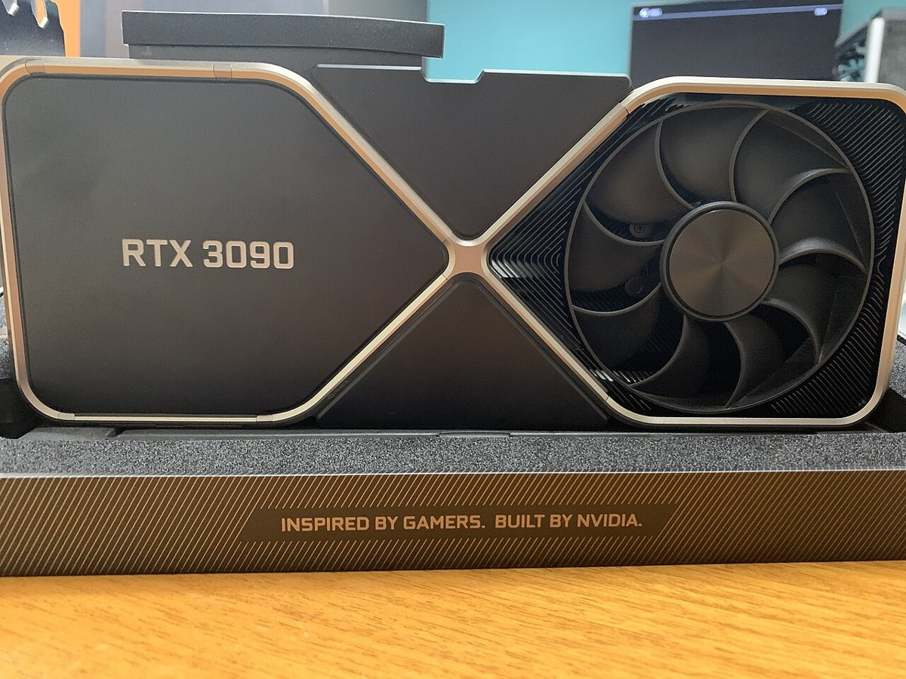
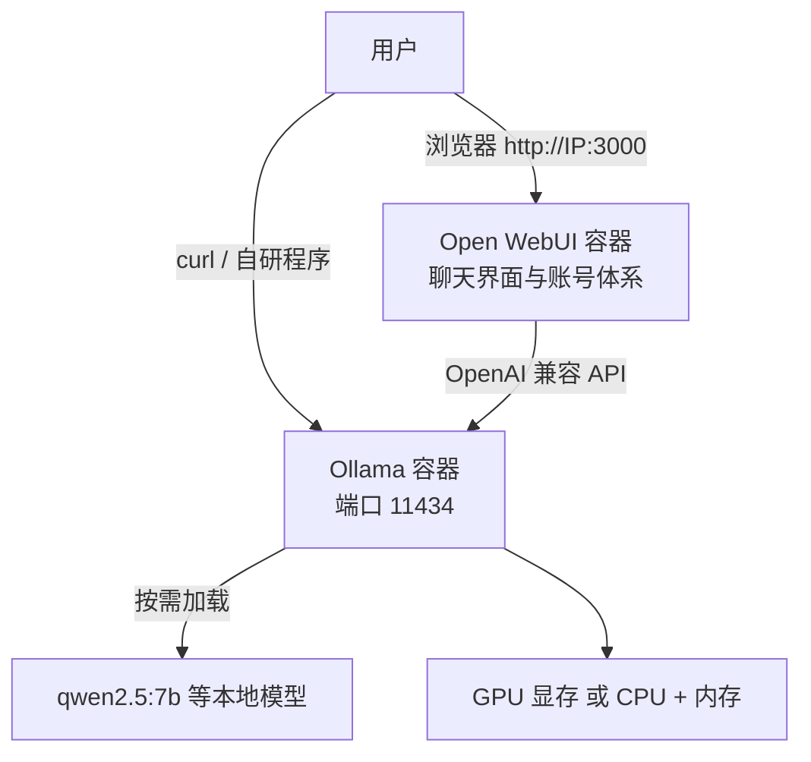

# 项目 4 · Linux 跑本地 AI：Ollama + Open WebUI 私有大模型

> 📍 位置：阶段 4 · 实战篇 · 项目 4 ｜ ⏱ 预计用时：2-4 小时 ｜ 难度：★★★★☆

> ⬅️ 上一章：[项目 3 · 个人云盘与内网穿透](项目3-个人云盘与内网穿透.md) ｜ ➡️ 下一章：[项目 5 · 故障排查 20 例](项目5-故障排查20例.md)

我们这套课程叫「通往 Linux 之路」，而更远处还有一条「通往 AGI 之路」——通用人工智能（Artificial General Intelligence, AGI）。本章是两条路的交汇点：在你的 Linux 机器上，用 Ollama（本地大模型运行框架）跑起自己的大语言模型（Large Language Model, LLM），再给套上 Open WebUI 这个堪比商业产品的聊天界面。数据不出门、断网能用、按次零成本。

## 🎯 项目目标

1. 讲清"为什么把大模型搬回家"：隐私、离线、成本三条理由；
2. 根据自己的硬件选对模型规模，不再被"跑不动"劝退；
3. 用 Docker 部署 Ollama，并拉取 qwen2.5:7b 等常用模型；
4. 熟练使用 ollama 的 run / pull / list / rm 基本命令；
5. 部署 Open WebUI 并完成初始设置，形成日常可用的聊天界面；
6. 用 curl 调通 OpenAI 兼容（OpenAI-compatible）API，为写程序接入打基础。

## 🧠 方案设计



[在学习站暂停、单步或重播](https://zhuguang-zfg.github.io/linux/#animation=model-fit.svg)。动画中的输入输出为教学示意，需用本章实验验证。



[在学习站暂停、单步或重播](https://zhuguang-zfg.github.io/linux/#animation=local-ai-request.svg)。动画中的输入输出为教学示意，需用本章实验验证。

### 为什么本地跑大模型？

- **隐私（Privacy）**：笔记、代码、合同发给云端 API 就是把数据交了出去；本地推理（Inference）的数据永远不出网卡；
- **离线（Offline）**：飞机上、内网里、断网的出租屋，本地模型照常工作；
- **成本（Cost）**：云端 API 按量计费，本地只花电费——尤其当任务交给项目 2 那样的脚本定时处理时，边际成本为零。

代价是硬件门槛与模型能力上限，所以先看硬件，再谈模型。

### 硬件要求：模型大小 vs 机器配置

| 模型规模 | 纯 CPU 体验 | 最低内存 | 建议 GPU 显存 | 典型模型 |
|---|---|---|---|---|
| 1.5B-3B | 流畅 | 8 GB | 4 GB | qwen2.5:3b |
| 7B-8B | 可用，速度尚可 | 16 GB | 8 GB | qwen2.5:7b、llama3.1:8b |
| 14B | 偏慢 | 32 GB | 12 GB | qwen2.5:14b |
| 32B 及以上 | 不推荐 | 64 GB | 24 GB 起或多卡 | deepseek-r1:32b |

> 💡 显存不足时，Ollama 会自动把部分层放进内存做混合推理，速度介于纯 CPU 与纯 GPU 之间；默认下发的已是量化（Quantization）版本，门槛比原生精度低得多。



显存决定模型推理速度；图中为 RTX 3090，实际部署前先跑 `nvidia-smi` 核对驱动与显存。照片：Adam Kapetanakis，CC BY-SA 4.0，见 [署名](../../assets/images/CREDITS.md)。

### 本地模型与云端 API 的分工

别把"本地跑 AI"理解成彻底替代云端，聪明的做法是按场景分工：

| 场景 | 建议 |
|---|---|
| 日常问答、脱敏后的代码补全 | 本地模型足够 |
| 需要最新资讯、联网检索 | 云端 API |
| 批量处理敏感文档与日志 | 本地模型（配合项目 2 的 timer 定时跑） |
| 追求顶级智力水平的硬仗 | 云端大杯模型 |

### 总体架构



## 🛠 动手实施

### 第 1 步 ｜ Docker 部署 Ollama

```bash
# 0) 建一个容器网络，让 Ollama 与 WebUI 互相"喊话"
docker network create ai-net

# 1) 启动 Ollama（CPU 版）
docker run -d --name ollama \
  --network ai-net \
  -v ollama:/root/.ollama \
  -p 127.0.0.1:11434:11434 \
  --restart unless-stopped \
  ollama/ollama
```

NVIDIA 显卡用户只需在第 1) 条命令中追加一行 `--gpus=all`（前提：显卡驱动与 NVIDIA Container Toolkit 已装好），其余不变。

### 第 2 步 ｜ 拉取模型并跑通对话

```bash
docker exec -it ollama ollama pull qwen2.5:7b
docker exec -it ollama ollama run qwen2.5:7b
```

进入对话后直接输入问题即可，`>>>` 是 Ollama 的对话提示符（不是 Shell 命令）：

```text
>>> 用一句话解释什么是 inode
```

常用模型怎么选（模型名即参数，`:` 后是规格）：

| 模型 | 擅长 | 一句话点评 |
|---|---|---|
| qwen2.5:7b | 中文综合 | 中文场景的默认首选 |
| llama3.1:8b | 英文生态 | 处理英文资料更顺手 |
| qwen2.5-coder:7b | 代码 | 写脚本、读代码的利器 |
| deepseek-r1:7b | 推理 | 会先输出思考过程，适合难题 |

### 第 3 步 ｜ ollama 基本命令速成

| 命令 | 作用 |
|---|---|
| `ollama pull qwen2.5:7b` | 下载模型到本地（数 GB，耐心等） |
| `ollama run qwen2.5:7b` | 运行模型，进入终端对话 |
| `ollama list` | 列出已下载模型与体积 |
| `ollama ps` | 查看当前加载进内存的模型 |
| `ollama rm qwen2.5:7b` | 删除模型，释放磁盘 |

> 模型是"按需加载"的：`list` 里有不代表常驻内存，`ps` 里的才是此刻真正在跑的。

### 第 4 步 ｜ Open WebUI 接入

首次部署先在私有文件中生成固定密钥；已有 `.env` 时复用它，不要重新生成。配置目录不要提交到仓库：

```bash
mkdir -p "$HOME/local-ai-secrets"
if [[ ! -e "$HOME/local-ai-secrets/webui.env" ]]; then
    (umask 077; printf 'WEBUI_SECRET_KEY=%s\n' "$(openssl rand -hex 32)" > "$HOME/local-ai-secrets/webui.env")
fi
docker run -d --name open-webui \
  --network ai-net \
  -p 127.0.0.1:3000:8080 \
  --env-file "$HOME/local-ai-secrets/webui.env" \
  -e OLLAMA_BASE_URL=http://ollama:11434 \
  -v open-webui:/app/backend/data \
  --restart unless-stopped \
  ghcr.io/open-webui/open-webui:main
```

初始设置四步：

1. 本机浏览器打开 `http://127.0.0.1:3000`；远端服务器先从客户端建立 `ssh -N -L 127.0.0.1:3000:127.0.0.1:3000 用户名@服务器IP` 隧道；
2. 首次注册的**第一个账号自动成为管理员**；
3. 左上角模型下拉框选中 qwen2.5:7b，开聊；
4. 在设置里把界面语言切换为中文，按需开启聊天记录保存。

### 第 5 步 ｜ curl 调 OpenAI 兼容 API

Ollama 提供 OpenAI 兼容接口。下面在服务所在主机调用 `http://127.0.0.1:11434/v1`；本章不把未加认证的模型 API 发布到公网。客户端可通过 SSH 隧道访问：

```bash
curl http://localhost:11434/v1/chat/completions \
  -H "Content-Type: application/json" \
  -d '{
    "model": "qwen2.5:7b",
    "messages": [
      { "role": "system", "content": "你是一位耐心的 Linux 老师，回答不超过三句话。" },
      { "role": "user",   "content": "用一句话解释什么是僵尸进程？" }
    ],
    "temperature": 0.7
  }'
```

返回 JSON 中 `choices[0].message.content` 就是模型的回答。用 Python / Shell 调用它的代码结构，与调用云端 API 完全一致——这正是"OpenAI 兼容"的价值。

### 进阶 ｜ AnythingLLM：给你的笔记装上大模型

AnythingLLM 是一款开源的知识库问答应用：把你的 PDF、Markdown、网页丢进"工作区"，它会自动切片、建立向量索引；提问时先检索最相关的片段，再交给大模型组织答案。这种"检索增强生成"（Retrieval-Augmented Generation, RAG）的思路，能显著减少模型一本正经地胡说八道。它支持把 Ollama 设为底层模型（LLM Provider），Docker 一行命令即可部署，很适合做"个人 Linux 笔记问答机器人"。

### 第 6 步 ｜ 把模型做成 systemd 开机自启

**Docker 部署（本章方案）**，两行搞定：

```bash
sudo systemctl enable docker                  # Docker 本体开机自启
docker update --restart unless-stopped ollama open-webui
```

**原生安装（可选方案）**：官方脚本会自动注册 systemd 服务——

```bash
curl -fsSL https://ollama.com/install.sh | sh
systemctl status ollama     # enabled + running，重启机器无需任何操作
```

若是手动二进制部署，可以自写一个最小单元 `/etc/systemd/system/ollama.service`：

```ini
[Unit]
Description=Ollama Local LLM Service
After=network-online.target

[Service]
ExecStart=/usr/local/bin/ollama serve
Restart=always
RestartSec=3

[Install]
WantedBy=multi-user.target
```

```bash
sudo systemctl daemon-reload && sudo systemctl enable --now ollama
```

### 第 7 步 ｜ 容器日常管理三板斧

跑起来只是开始，日常照顾这两个容器靠下面几条命令：

```bash
docker logs -f ollama               # 看启动日志与报错
docker stats ollama open-webui      # 实时 CPU / 内存占用
docker restart ollama               # 改了配置或卡死时重启
docker exec -it ollama ollama list  # 不进容器也能执行 ollama 子命令
```

> 💡 想升级时先记录当前镜像 digest 并备份数据，再拉取新镜像、停止并重建容器；模型在 `ollama` 数据卷里，重建时必须继续挂同一个卷。官方移动标签会变化，正式部署应固定到验证过的版本或 digest。

配套 [Compose 配置](../../scripts/local-ai/compose.yaml) 提供另一种等价部署方式：复制到私人目录，在同目录 `.env` 中设置 `WEBUI_SECRET_KEY`，再 `docker compose up -d`。两种方式选择一种即可，不要同时占用 3000 端口；Compose 方案只在内部网络开放 Ollama，调用模型用 `docker compose exec ollama ollama run 模型名`。

### 常见问题三连

**Q：CPU 能跑，为什么这么慢？**
A：大模型推理是算力密集型任务，纯 CPU 的生成速度以"秒/字"计；想流畅请上显卡，或改用更小的模型（如 qwen2.5:3b）。

**Q：模型下载到一半断网了，要重来吗？**
A：不用。`ollama pull` 支持断点续传，重跑同一条命令接着下。

**Q：能同时挂两个模型吗？**
A：可以。Ollama 会按请求自动加载与卸载；内存吃紧时会频繁换入换出，用 `ollama ps` 留意驻留情况。

## 💡 避坑指南

- **模型拉一半失败**：重跑 `ollama pull` 会断点续传；也可在网络顺畅的机器上拉好，再把 `/root/.ollama` 目录整包拷过来；
- **小内存别硬上大模型**：7B 模型建议至少 16 GB 内存，否则疯狂换页（Swap）卡成幻灯片——先 `free -h` 再选模型；
- **端口冲突**：3000 / 11434 被占用时用 `sudo ss -ltnp | grep 端口` 查占用者，或改 `-p` 左边的宿主机端口；
- **容器时区不对**：日志时间对不上时，给两个容器都加 `-e TZ=Asia/Shanghai`；
- **别把 11434 暴露公网**：API 默认无鉴权，等于把算力白送陌生人；要远程访问就套上项目 3 的 Tailscale；
- **GPU 版容器起不来**：九成是宿主机驱动没就位——先在宿主机跑 `nvidia-smi`，能亮再查 NVIDIA Container Toolkit；
- **首次对话卡住**：`docker logs -f ollama` 里若显示模型在加载，那是冷启动，7B 级模型首次加载要等几十秒，属正常现象；
- **注册入口要关**：Open WebUI 建好管理员后，在管理面板关闭新用户注册（默认开启），免得局域网里谁都能来开号。

## ✍️ 进阶挑战

1. **模型对比**：用同一个问题分别问 qwen2.5:7b 与 deepseek-r1:7b，从答案质量与响应速度两个维度写三句点评；
2. **写个命令行助手**：用 curl + jq 把你的问题传给本地模型（jq 需要 `sudo apt install jq`），做成一个一条命令就出答案的小工具；
3. **联动项目 2**：让巡检脚本跑完后，把报告摘要发给本地模型"点评"，点评结果一并写进日志。

## 📺 推荐视频

- [YouTube · Ollama 与 Open WebUI](https://www.youtube.com/watch?v=RQFfK7xIL28) — Christian Lempa，39分7秒。观看对应主题后，回到本章用实际输入和输出验证。

[](https://www.youtube.com/watch?v=RQFfK7xIL28)

[在学习站查看配套媒体](https://zhuguang-zfg.github.io/linux/#read=docs%2F04-projects%2F%E9%A1%B9%E7%9B%AE4-Linux%E8%B7%91%E6%9C%AC%E5%9C%B0AI.md) · [视频资料与核验说明](../../resources/videos.md)。标题、作者和分P已核对，未逐条完成实播，播放限制以原站为准。

## ✅ 验收清单

- [ ] `docker ps` 中 ollama 与 open-webui 两个容器均为 running
- [ ] `ollama list` 至少有一个模型，`ollama run` 能正常对话
- [ ] Open WebUI 完成注册，界面为中文并能成功对话
- [ ] `curl` 调用 `/v1/chat/completions` 返回合法 JSON
- [ ] 重启宿主机后两个容器自动恢复运行
- [ ] 能说出本地部署相对云端 API 的两个优点与一个缺点
- [ ] 所选模型与自身硬件匹配，对话时无明显换页卡顿

## 🔗 延伸阅读

- [Ollama 官网与模型库](https://ollama.com)
- [Open WebUI 官网与文档](https://openwebui.com)
- [Docker 官方文档](https://docs.docker.com/)
- [📝 阶段 4 实战篇练习](../../exercises/04-实战篇练习.md)
