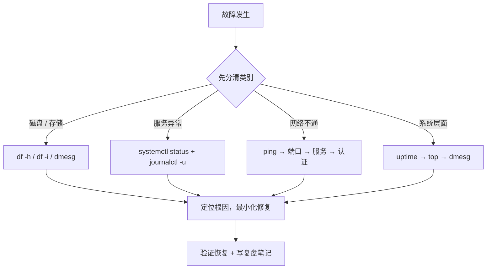
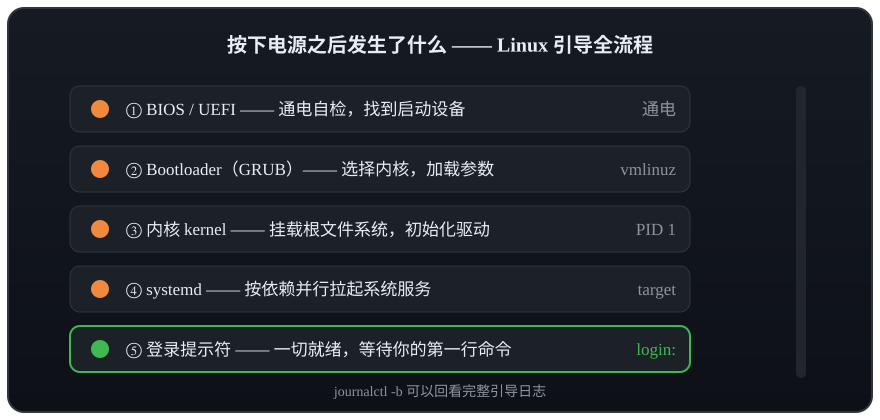

# 项目 5 · 故障排查 20 例：从现象到根因

> 📍 位置：阶段 4 · 实战篇 · 项目 5 ｜ ⏱ 预计用时：2-4 小时 ｜ 难度：★★★★☆

> ⬅️ 上一章：[项目 4 · Linux 跑本地 AI](项目4-Linux跑本地AI.md) ｜ ➡️ 下一章：[01 · 树莓派是什么与选购](../05-raspberry-pi/01-树莓派是什么与选购.md)

实战篇的最后一课，也是市面上最值钱的一课：排障（Troubleshooting）。真实故障从不按章节出现，本章 20 个案例全部来自一线高频事故，每例固定四段格式：**现象 → 一句话原因 → 排查命令 → 解决命令**。请务必配一台可随意折腾的测试机（或先打好云主机快照）逐例复现——做完之后，你面对报错时会发现：恐慌没了，套路有了。

## 🎯 项目目标

1. 掌握四段式排障格式，养成"先看现象、再定层级、后动手"的习惯；
2. 磁盘、服务、网络、系统四类共 20 个高频故障，每类至少亲手复现 2 个；
3. 建立速查表肌肉记忆：看到报错，第一反应用哪条命令脱口而出；
4. 内化排障纪律：改前备份、一次一改、记录复盘。

## 🧠 方案设计


[在学习站暂停、单步或重播](https://zhuguang-zfg.github.io/linux/#animation=triage-flow.svg)。动画中的输入输出为教学示意，需用本章实验验证。

### 四类故障的思考路径



### 速查总表

| 类别 | 案例 | 现象关键词 | 第一反应命令 |
|---|---|---|---|
| 磁盘空间 | 1 | df 满、du 找不到 | `lsof +L1` |
| 磁盘空间 | 2 | 有空间却写不进 | `df -i` |
| 磁盘空间 | 3 | 文件系统只读 | `dmesg \| tail -n 20` |
| 磁盘空间 | 4 | rm 极慢 | `du --inodes -s 目录` |
| 磁盘空间 | 5 | /var/log 巨大 | `journalctl --disk-usage` |
| 服务 | 6 | 502 Bad Gateway | `systemctl status php8.1-fpm` |
| 服务 | 7 | Address already in use | `ss -ltnp` |
| 服务 | 8 | 服务反复重启 | `journalctl -u 服务名 -n 50` |
| 服务 | 9 | 进程莫名消失 | `dmesg -T \| grep -i oom` |
| 服务 | 10 | 定时任务没跑 | `grep CRON /var/log/syslog` |
| 网络 | 11 | ping 通 curl 不通 | `curl -v` + `ss -ltnp` |
| 网络 | 12 | Could not resolve host | `resolvectl query 域名` |
| 网络 | 13 | SSH 连不上 | `ping → nc → sshd → ssh -v` |
| 网络 | 14 | 证书报错 | `timedatectl` |
| 网络 | 15 | 重启后 IP 变了 | `ip addr` + `netplan try` |
| 系统 | 16 | 忘记密码 | GRUB 加 `init=/bin/bash` |
| 系统 | 17 | emergency mode | `journalctl -xb` |
| 系统 | 18 | 误删文件 | 立即停写 + 快照恢复 |
| 系统 | 19 | top 有不明进程 | `ls -l /proc/PID/exe` |
| 系统 | 20 | 服务器突然卡死 | `uptime` → `top` → `iostat -x` |

## 🛠 动手实施：20 个案例

### 磁盘空间类

#### 案例 1 ｜ df 显示已满，du 却找不到大文件
**现象**：`df -h` 显示根分区 100%，但 `du -sh /*` 加起来远小于磁盘容量。
**一句话原因**：文件已被 `rm` 删除，但仍被运行中的进程持有句柄，空间不会真正释放。
**排查命令**：
```bash
df -h /
lsof +L1 | head -n 10        # 列出"已删除但仍被占用"的文件
```
**解决命令**：
```bash
sudo systemctl restart rsyslog   # 重启持有该文件的进程（最常见是日志服务）
```

#### 案例 2 ｜ 磁盘有空间，却报 No space left on device
**现象**：`df -h` 明明还有余量，创建文件却报 `No space left on device`。
**一句话原因**：磁盘的 inode（索引节点）耗尽——海量小文件把"文件身份证"用光了。
**排查命令**：
```bash
df -i /
sudo du --inodes -s /var/* 2>/dev/null | sort -rn | head
```
**解决命令**：
```bash
sudo find /var/lib/php/sessions -type f -mtime +7 -delete   # 按实际情况清理小文件
```

#### 案例 3 ｜ 文件系统突然变只读
**现象**：保存文件报 `Read-only file system`，但机器还能 SSH 上去。
**一句话原因**：ext4 检测到底层存储错误后自我保护，把分区降级为只读挂载。
**排查命令**：
```bash
dmesg | tail -n 20          # 找 ext4 / I/O error 字样
mount | grep ' / '
```
**解决命令**：
```bash
sudo reboot                 # 重要数据先备份；重启后对出问题的分区做检查
sudo fsck -y /dev/vdb1      # 必须在未挂载的分区上执行
```

#### 案例 4 ｜ rm 一个目录卡了半小时没动静
**现象**：`rm -rf 目录` 长时间无响应，连 `ls` 该目录都卡。
**一句话原因**：目录里躺着百万级小文件，逐个展开与删除极慢。
**排查命令**：
```bash
sudo du --inodes -s /path/to/dir    # inode 数 ≈ 文件数
time ls -f /path/to/dir | head
```
**解决命令**（rsync 空目录法，比 rm 快一个量级）：
```bash
mkdir /empty && rsync -a --delete /empty/ /path/to/dir/
```

#### 案例 5 ｜ /var/log 把磁盘吃满了
**现象**：根分区告警，`du` 定位到 `/var/log/journal` 占了几十 GB。
**一句话原因**：systemd-journald 长期累积日志且从未设置上限。
**排查命令**：
```bash
journalctl --disk-usage
du -sh /var/log/*
```
**解决命令**：
```bash
sudo journalctl --vacuum-size=500M
sudo journalctl --vacuum-time=30d
```
并在 `/etc/systemd/journald.conf` 中设置 `SystemMaxUse=500M`，然后 `sudo systemctl restart systemd-journald`。

### 服务类

#### 案例 6 ｜ 网站全页 502 Bad Gateway
**现象**：Nginx 活着，页面却全部 502。
**一句话原因**：Nginx 把请求转给后端（常见是 PHP-FPM）时对方没应答——进程没起或 socket 路径不对。
**排查命令**：
```bash
systemctl status php8.1-fpm
sudo tail -n 30 /var/log/nginx/error.log
```
**解决命令**：
```bash
sudo systemctl restart php8.1-fpm
```
若日志提示找不到 sock 文件，核对 server 块 `fastcgi_pass` 与 `/etc/php/8.1/fpm/pool.d/www.conf` 的 `listen` 是否一致（详见项目 1）。

#### 案例 7 ｜ 启动报 Address already in use
**现象**：`systemctl start nginx` 报 `bind() to 0.0.0.0:80 failed (98: Address already in use)`。
**一句话原因**：80 端口已被别的进程占用（常见：Apache、docker-proxy）。
**排查命令**：
```bash
sudo ss -ltnp | grep :80
sudo lsof -i :80
```
**解决命令**：
```bash
sudo systemctl stop apache2 && sudo systemctl disable apache2
```
若两者都要保留，改自己的 `listen` 端口，`nginx -t` 通过后再 reload。

#### 案例 8 ｜ 服务不停"重启-崩溃"循环
**现象**：`systemctl status` 里状态在 activating 与 auto-restart 之间反复横跳。
**一句话原因**：主进程一启动就崩溃，被 `Restart=always` 无限拉起。
**排查命令**：
```bash
systemctl status 你的服务名
journalctl -u 你的服务名 -n 50 --no-pager
```
**解决命令**：
```bash
sudo systemctl stop 你的服务名      # 先止血，再按日志修配置/权限/依赖
```

#### 案例 9 ｜ 服务半夜莫名消失
**现象**：服务日志里没有任何退出记录，进程直接不见了。
**一句话原因**：内存耗尽，内核 OOM Killer（内存不足终结者）按评分杀掉了最占内存的进程。
**排查命令**：
```bash
sudo dmesg -T | grep -i "out of memory"
journalctl -k | grep -i oom
```
**解决命令**（加 swap 缓冲，示例 2G）：
```bash
sudo fallocate -l 2G /swapfile && sudo chmod 600 /swapfile
sudo mkswap /swapfile && sudo swapon /swapfile
```
长期方案：限制服务内存、优化程序，或升级配置。

#### 案例 10 ｜ 定时任务就是不执行
**现象**：命令手敲一切正常，写进 crontab 就石沉大海。
**一句话原因**：cron 的环境变量与登录 shell 不同——PATH 极简、没有当前目录、没有终端。
**排查命令**：
```bash
grep CRON /var/log/syslog | tail
systemctl status cron
```
**解决命令**：crontab 里一律用绝对路径，并把输出重定向到日志方便取证：
```bash
* * * * * /usr/local/bin/job.sh >> /var/log/job.log 2>&1
```

### 网络类

#### 案例 11 ｜ ping 得通，curl 却超时
**现象**：`ping IP` 正常，`curl http://IP` 却连接超时。
**一句话原因**：ICMP 通不代表 TCP 端口通——服务没监听、防火墙或云安全组拦了。
**排查命令**：
```bash
curl -v --connect-timeout 3 http://目标IP
sudo ss -ltnp | grep :80        # 在服务端确认是否监听
sudo ufw status
```
**解决命令**：
```bash
sudo ufw allow 80/tcp           # 服务端放行；云主机还要同步改安全组
```

#### 案例 12 ｜ Could not resolve host
**现象**：`curl: (6) Could not resolve host: example.com`，但直接 curl IP 正常。
**一句话原因**：DNS（Domain Name System）解析不可用——`/etc/resolv.conf` 指向的 DNS 失效或被覆盖。
**排查命令**：
```bash
resolvectl status
resolvectl query baidu.com
```
**解决命令**（临时）：
```bash
sudo resolvectl dns 网卡名 223.5.5.5 119.29.29.29
```
永久方案是把 nameservers 写进 netplan 配置（Ubuntu 22.04）。

#### 案例 13 ｜ SSH 连不上：四层排查法
**现象**：ssh 超时、拒绝连接或认证失败，不知从何下手。
**一句话原因**：链路 → 端口 → 服务 → 认证，四层必有一层断了，自下而上逐层验证。
**排查命令**：
```bash
ping 目标IP                      # 第 1 层：网络通不通
nc -zv 目标IP 22                 # 第 2 层：22 端口开没开
sudo systemctl status ssh        # 第 3 层：服务端 sshd 活着吗
ssh -v 用户@目标IP                # 第 4 层：认证卡在哪一步
```
**解决命令**：按断点处理；若是密钥问题，多半是权限不对：
```bash
chmod 700 ~/.ssh && chmod 600 ~/.ssh/authorized_keys
```

#### 案例 14 ｜ 证书校验失败，原来是表走快了
**现象**：浏览器报 `NET::ERR_CERT_DATE_INVALID`，程序报 certificate verify failed。
**一句话原因**：系统时间不准（时区错或 NTP 未同步），而证书的"生效/过期"是相对系统时间判断的。
**排查命令**：
```bash
timedatectl
```
**解决命令**：
```bash
sudo timedatectl set-timezone Asia/Shanghai
sudo timedatectl set-ntp true
```

#### 案例 15 ｜ 重启之后 IP 变了 / 新网卡不生效
**现象**：重启后服务器 IP 不再是原来那个，或新加网卡死活不出来。
**一句话原因**：Ubuntu 22.04 由 netplan（网络配置渲染器）管理网卡，配置未应用或格式有误。
**排查命令**：
```bash
ip addr
cat /etc/netplan/*.yaml
```
**解决命令**：
```bash
sudo chmod 600 /etc/netplan/*.yaml
sudo netplan try                 # 先试运行，超时不确认会自动回滚
```

### 系统类



下面四个系统级案例都发生在这条启动链或运行时上，先看一遍开机流程心里更有底。

#### 案例 16 ｜ 忘记密码：GRUB 救援
**现象**：root 与普通用户密码全忘，SSH 和 su 都进不去。
**一句话原因**：GRUB 引导菜单允许临时改内核参数，进入一个无需密码的 shell——这也提醒我们机房物理安全同样重要。
**排查命令**（SSH 不可用时走云控制台 / VNC）：
```text
重启 → GRUB 菜单按 e → 找到 linux 开头的行 → 行尾追加 init=/bin/bash → Ctrl+X 启动
```
**解决命令**（进入该 shell 后）：
```bash
mount -o remount,rw /
passwd 用户名
sync
exec /sbin/init
```

#### 案例 17 ｜ 开机进 emergency mode
**现象**：开机停在 `Give root password for maintenance: (or press Control-D to continue)`。
**一句话原因**：多数是 `/etc/fstab`（开机挂载表）写错——设备名或 UUID 不存在，系统拒绝带病启动。
**排查命令**（输入 root 密码进入维护 shell）：
```bash
journalctl -xb          # 红色报错行就是元凶
systemctl status local-fs.target
```
**解决命令**：
```bash
mount -o remount,rw /
nano /etc/fstab         # 注释或修正出错的那一行
reboot
```
好习惯：改 fstab 前先 `findmnt --verify` 校验，网络盘永远带 `nofail` 参数。

#### 案例 18 ｜ 手抖 rm -rf 了重要目录
**现象**：误删了还没提交、没备份的目录，心态当场爆炸。
**一句话原因**：Linux 没有回收站，rm 直接摘除目录项；数据块在被覆盖前仍在磁盘上，恢复是和时间赛跑。
**排查 / 自救命令**（第一时间停止一切写入）：
```bash
sudo umount /dev/vdb1                                        # 能卸载就立刻卸载
sudo extundelete /dev/vdb1 --restore-file docs/report.md     # 尝试按路径恢复
```
**解决命令**：云主机优先用快照回滚——那才是真正的"后悔药"；extundelete / testdisk 只能尽力而为。根治办法：定期快照 + 异地备份 + 高危命令前先 `ls` 确认。

#### 案例 19 ｜ top 里有个看不懂的进程吃满 CPU
**现象**：一个从没见过的进程名占满 CPU，疑似异常。
**一句话原因**：可能是正常组件，也可能是伪装成系统进程的挖矿木马——先查清身份，再决定杀不杀。
**排查命令**（把 PID 换成实际进程号）：
```bash
ls -l /proc/PID/exe         # 真实可执行文件路径
systemctl status PID        # 是否由某个 systemd 服务拉起
crontab -l                  # 有没有陌生的定时任务
```
**解决命令**：
```bash
sudo kill -9 PID
```
随后删除其文件与开机自启项、修改密码、封端口；确信被入侵时，重装系统再加恢复数据才是正解。

#### 案例 20 ｜ 服务器突然卡成幻灯片
**现象**：SSH 能连上但命令半天没反应，网站全部超时。
**一句话原因**：负载（Load Average）超过核数——CPU 打满、内存疯狂换页、磁盘 I/O 打满，三者必有其一。
**排查命令**：
```bash
uptime                  # 负载持续超过核数就是过载
top                     # 按 P 看 CPU 元凶，按 M 看内存元凶
iostat -x 1 3           # %util 接近 100% 说明磁盘是瓶颈
free -h                 # available 告急说明内存是瓶颈
```
**解决命令**：定位到元凶后精准处理：
```bash
sudo systemctl restart 元凶服务名    # 或限流、扩容；iowait 高先查日志与磁盘
```

## 💡 避坑指南

- **改前备份**：动任何配置前先 `cp 配置文件 配置文件.bak.日期`，一条命令保平安；
- **一次只改一处**：改完立刻验证，别攒一堆变更再重启——出了问题你不知道是谁的锅；
- **SSH 进不去别慌**：云主机都有控制台 VNC / 串口入口，那是你的最后一道保险；
- **先止血再根治**：生产环境先让服务恢复（重启/回滚），再慢慢找根因；
- **写复盘笔记**：现象、根因、命令、耗时四项记下来，下次同类故障就是 5 分钟的事。

## ✍️ 进阶挑战

1. **故意搞破坏**：在打好快照的测试机上用 `dd if=/dev/zero of=/bigfile` 把磁盘填满，走完案例 1 与案例 5 的完整排障闭环后回滚；
2. **合入巡检脚本**：把案例 2 的 inode 检查写进项目 2 的 health-check.sh，实现故障的"自动发现"；
3. **画自己的决策树**：为案例 13 的 SSH 四层排查画一张专属流程图，贴在工位或存进笔记。

## 📺 推荐视频

- [YouTube · systemd 服务管理](https://www.youtube.com/watch?v=Kzpm-rGAXos) — Learn Linux TV，47分40秒。排障的工具背景；案例根因需要自己的现场证据。
- [YouTube · Linux 系统课程](https://www.youtube.com/watch?v=v392lEyM29A) — Boot dev，153分30秒。排障的工具背景；案例根因需要自己的现场证据。

[](https://www.youtube.com/watch?v=Kzpm-rGAXos)

[在学习站查看配套媒体](https://zhuguang-zfg.github.io/linux/#read=docs%2F04-projects%2F%E9%A1%B9%E7%9B%AE5-%E6%95%85%E9%9A%9C%E6%8E%92%E6%9F%A520%E4%BE%8B.md) · [视频资料与核验说明](../../resources/videos.md)。标题、作者和分P已核对，未逐条完成实播，播放限制以原站为准。

## ✅ 验收清单

- [ ] 能默写"现象 → 原因 → 排查 → 解决"四段格式并套用到新故障
- [ ] 磁盘类 5 例中至少亲手复现并修复 2 例
- [ ] 不查资料能说出 502 的三个可能原因
- [ ] 用"四层法"在 10 分钟内定位过一次 SSH 故障
- [ ] 在测试机上完成过 emergency mode 的进入与修复（先打快照）
- [ ] 知道 OOM 的日志位置（dmesg / journalctl -k）
- [ ] 复现过的故障都有复盘记录，测试机快照已回滚干净
- [ ] 速查总表已保存到常用笔记，随时能翻

## 🔗 延伸阅读

- [📝 阶段 4 实战篇练习](../../exercises/04-实战篇练习.md)
- 下一站，换一块更小的硬件继续折腾：[01 · 树莓派是什么与选购](../05-raspberry-pi/01-树莓派是什么与选购.md)
