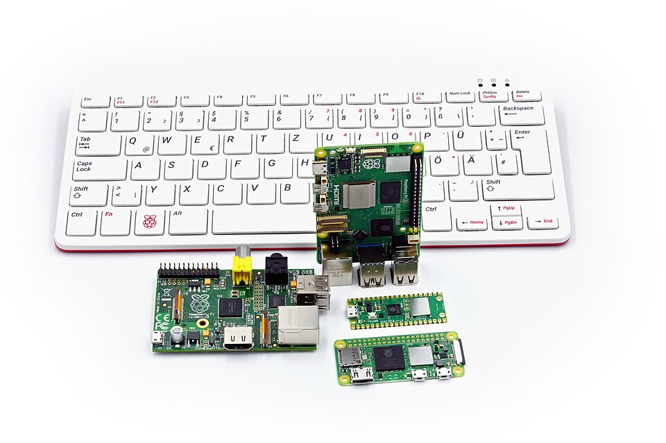
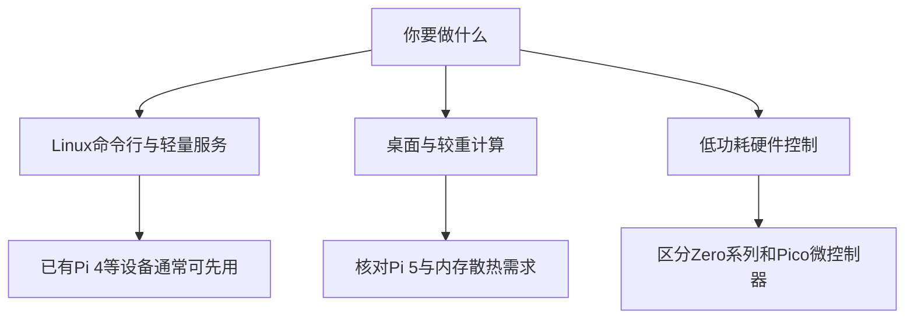
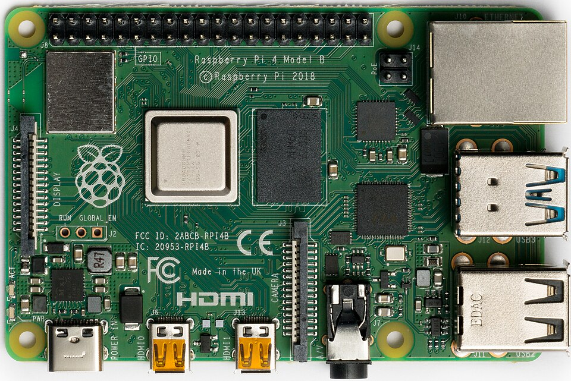
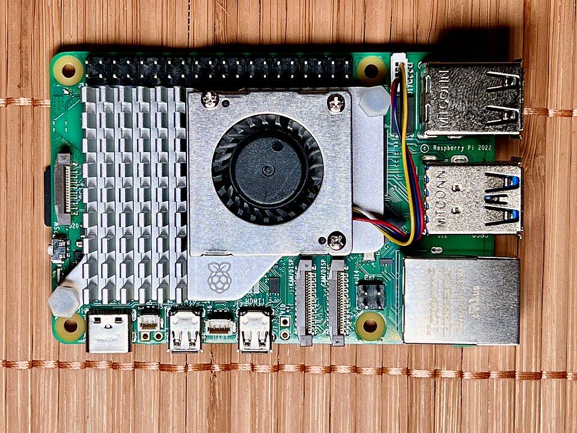

# 第 1 章 · 树莓派是什么与选购

> 📍 树莓派支线 · 第 1 章 ｜ ⏱ 30 分钟 ｜ 难度：★☆☆☆☆
> ⬅️ [学习地图](../../README.md) ｜ ➡️ [烧录系统与首次启动](02-烧录系统与首次启动.md)

把树莓派想象成一台被压缩进信用卡大小电路板的 Linux 电脑。它没有风扇轰鸣的机箱，但内核、文件系统、进程和网络一样不少；它还额外伸出一排「GPIO 引脚」，像一扇朝硬件世界敞开的小窗——你可以让程序点灯、读按钮、接传感器。

它不是学习 Linux 的必需品：没有硬件时，先用虚拟机完成主线完全可行。但如果你想要「代码改变物理世界」的那一瞬间——LED 因为你敲的一行命令亮起来——树莓派是最划算的入口。



图片作者及许可见 [素材署名](../../assets/images/CREDITS.md)。

## 🎯 学习目标

- 分清能运行 Linux 的树莓派与 Pico 微控制器。
- 按任务核对电源、存储、散热、网络和接口，而不是只看板子价格。
- 写出一份可开机的配件清单。

## 🧠 核心概念



[在学习站暂停、单步或重播](https://zhuguang-zfg.github.io/linux/#animation=pi-buying.svg)。动画中的输入输出为教学示意，需用本章实验验证。

### 1.1 为什么叫「单板计算机」

普通台式机由主板、CPU、内存条、硬盘、电源等**多块**部件拼装而成。树莓派把 CPU、内存、视频输出、网卡、USB 控制器全部焊在**一块**印刷电路板上，插上存储卡和电源就能启动——所以叫 Single Board Computer（SBC，单板计算机）。

这个「麻雀虽小五脏俱全」的设计，让树莓派一出生就带着两条使命：

- **当电脑用**：跑完整的 Linux，接显示器、键盘、鼠标，或干脆不接（无头模式，第 2 章详述）；
- **当开发板用**：通过 GPIO 引脚，让程序直接操控硬件电平。

把这两个身份放在心里，后面每章的内容就不容易迷路。

### 1.2 它运行的是「和你学的一样的 Linux」

树莓派默认系统叫 **Raspberry Pi OS**，它属于 **Debian 系**——也就是和 Ubuntu 同宗。你在主线学到的大部分命令（apt、systemd、权限、管道）在这里**原样可用**，差别主要在：

| 差别 | 说明 |
|---|---|
| CPU 架构 | 树莓派是 ARM 架构（64 位系统显示 `aarch64`），不是 x86_64 |
| 软件来源 | 官方源为 arm64 架构打包；「这软件不支持 ARM」是真实存在的限制 |
| 管理工具 | 有 `raspi-config` 等专属配置工具（第 3 章） |

一句话：**主线学的是 Linux，支线学的是「Linux 跑在一块小板子上」**。命令不用重学，需要适应的是硬件边界。

### 1.3 Pi 与 Pico：一字之差，天壤之别

「树莓派」是产品家族的名字，但家族里有两类完全不同的产品。买错等于第一天就翻车：

| | Raspberry Pi（4/5/Zero） | Raspberry Pi Pico 系列 |
|---|---|---|
| 本质 | 单板计算机 | 微控制器开发板 |
| 系统 | 运行完整 Linux 与用户程序 | 没有操作系统，跑裸机固件（MicroPython/C/C++） |
| 使命 | 命令行、服务、网络、GPIO | 实时控制、低功耗采集、嵌入式 |
| 和本教程 | 本支线的主角 | 不可用来完成本章起的所有实验 |

**Pico 不是「更小的树莓派」**，而是一条不同的物种：CPU 只有几 MB 内存级，跑不了 Linux，更跑不了 apt 和 systemd。想学 Linux 就买 Pi 系列；想玩微控制器再考虑 Pico。



[在学习站暂停、单步或重播](https://zhuguang-zfg.github.io/linux/#animation=pi-vs-pico.svg)。动画中的输入输出为教学示意，需用本章实验验证。

### 1.4 选型先问「任务」，再谈「配置」

把「买哪块板」换成「我要它做什么」：



| 类型 | 适合的学习方式 | 先核对什么 |
|---|---|---|
| Pi 4 / Pi 5 | 完整 Linux、网络、Docker、GPIO | 电源、内存、散热和外设兼容性 |
| Zero 系列 | 轻量命令行与小型设备 | 型号的 CPU 架构、无线网络和接口转接 |
| Pico 系列 | MicroPython/C/C++ 固件与实时控制 | 它不运行本教程的完整 Linux 系统 |

本支线以 **Pi 4 或 Pi 5 + 64 位 Raspberry Pi OS** 为基线。不要把其他型号默认视为功能、架构和引脚接口完全相同。



Pi 4 正面视图，选购时核对内存与接口。照片：Laserlicht，CC BY-SA 4.0，见 [署名](../../assets/images/CREDITS.md)。



长时间负载需要合适的散热器，接口与外壳匹配。照片：SimonWaldherr，CC BY 4.0，见 [署名](../../assets/images/CREDITS.md)。

选型时的三条心法：

1. **先决定「跑什么」再决定「哪块板」**：只做 SSH 跳板和 NAS 共享，旧 Pi 4 完全够；要跑桌面和浏览器，Pi 5 + 大内存才不憋屈；
2. **内存按任务上限买**：4GB 和 8GB 的差价不大，但内存决定你能不能同时跑 Docker 容器、桌面和浏览器；
3. **新手优先「买得到、资料多」**：里程碑不是「最新」，是「能开机、能 SSH、能点灯」。

## 🛠 命令实操

购买前先按下面的清单核对已有设备；具体电源规格和接口以 [官方产品资料](https://www.raspberrypi.com/products/) 为准，价格和库存不在教程中固定。

| 配件 | 检查项 |
|---|---|
| 主板 | 确认准确型号，选择与你的任务相符的内存 |
| 电源 | 电压、电流和供电线满足该型号要求，不用低功率手机充电器凑合 |
| 存储 | 可靠的 microSD 与读卡器；长期服务可评估 USB SSD |
| 散热 | 长时间负载时有合适散热器，风扇接口与外壳匹配 |
| 联网 | 初次启动优先有线网；无线型号核对 Wi-Fi 频段 |
| 可选外设 | 显示线接口、键鼠、GPIO 面包板、LED 与限流电阻 |

**供电是新手第一堂课。** 树莓派对电源电压极其挑剔：插上一个大功率但「电压不稳」的手机充电头，可能开机正常、一跑满负载就重启。官方给出的供电规格（Pi 5 系列为 27W USB-C PD，Pi 4 为 5V/3A）不是建议，是验收线。选购时把「合规格的电源」当作板子的一部分，而不是配件。

如果已经有一块能启动的板子，运行：

```bash
tr -d '\0' < /proc/device-tree/model
printf '\n'
uname -m
free -h
lsblk -o NAME,SIZE,TYPE,MOUNTPOINTS
```

预期获得型号、架构、内存和存储布局。64 位系统通常显示 `aarch64`；普通 PC 上没有 `/proc/device-tree/model` 很正常，这条命令不是通用 Linux 硬件检测命令。

这条命令本身藏着一个知识点：树莓派的固件会把自己的硬件描述信息写进 `/proc/device-tree/`，`model` 文件里是型号字符串。`tr -d '\0'` 把文件里的空字节删掉、让输出干净可读——**Linux 的世界里，连「读一行型号」都用得上工具链**，这正是主线第 5 章「命令的组合」的预告。

## 💡 避坑指南

- 把 Pico 当 Pi 买：看到「Pico」就以为能跑本教程，开机发现是 MicroPython 命令行。**先确认型号，再下单。**
- “能亮灯”不等于电源稳定，负载一高出现掉盘或重启要检查供电。
- 只看价格不看接口：二手板缺电源线、microSD 插座损坏或 GPIO 针脚弯折，反而更贵。
- Pi 5 的部分硬件接口与旧教程有差异，旧摄像头排线和 GPIO 库需要核对。
- 二手板先确认能启动、接口完好，再判断配件是否划算。
- GPIO 是信号接口，不直接驱动电机或大功率负载（第 4 章会讲为什么）。

## ✍️ 动手实验

写一份“我已有 / 我缺少 / 为什么需要”的清单，并选一个第一周目标：远程 SSH 登录、家庭共享目录或 LED 点灯。

<details><summary>完成标准示例</summary>

已有 Pi 4、网线和笔记本；缺合规格电源、microSD 和读卡器；第一周只完成无头安装与 SSH，不先购买传感器套装。确认型号后，从官方规格页逐项核对配件。
</details>

对照检查你的清单是不是「任务驱动」：把「为什么需要」一列读一遍，如果某个配件答不上来为什么，它大概率不在首批采购名单里。**购物车克制 = 学习阻力小。**

## 📺 推荐视频

- [YouTube · 树莓派课程介绍](https://www.youtube.com/watch?v=fCPM5072YPA) — SSTec Tutorials，1分22秒。仅为课程介绍与硬件背景，不是完整树莓派课程。

[](https://www.youtube.com/watch?v=fCPM5072YPA)

[在学习站查看配套媒体](https://zhuguang-zfg.github.io/linux/#read=docs%2F05-raspberry-pi%2F01-%E6%A0%91%E8%8E%93%E6%B4%BE%E6%98%AF%E4%BB%80%E4%B9%88%E4%B8%8E%E9%80%89%E8%B4%AD.md) · [视频资料与核验说明](../../resources/videos.md)。标题、作者和分P已核对，未逐条完成实播，播放限制以原站为准。

## ✅ 自测清单

- [ ] 能说明 Pico 与运行 Linux 的 Pi 有什么区别。
- [ ] 能说出「单板计算机」比台式机少组装了什么、多提供了一个什么接口（GPIO）。
- [ ] 知道树莓派默认系统 Raspbian/Raspberry Pi OS 属于 Debian 系，主线命令基本可复用。
- [ ] 配件清单能支持首次启动，电源和接口匹配。
- [ ] 能说出一条命令里 `tr -d '\0'` 在做什么（不是背语法，而是知道它在清理什么）。
- [ ] 有明确的第一个实验，而不是只买硬件。

## 🔗 延伸阅读

- [Raspberry Pi 官方产品](https://www.raspberrypi.com/products/)
- [树莓派支线练习](../../exercises/05-树莓派练习.md)
- 下一章：[烧录系统与首次启动](02-烧录系统与首次启动.md)——让这块小板子「学会讲话」。