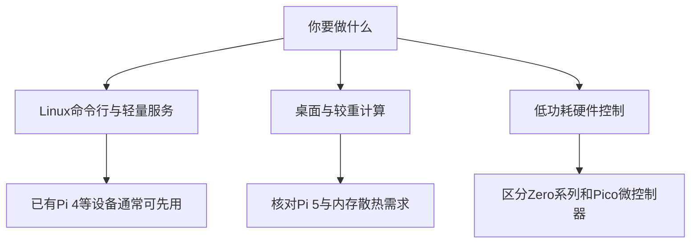

# 第 1 章 · 树莓派是什么与选购

> 📍 树莓派支线 · 第 1 章 ｜ ⏱ 30 分钟 ｜ 难度：★☆☆☆☆
> ⬅️ [学习地图](../../README.md) ｜ ➡️ [烧录系统与首次启动](02-烧录系统与首次启动.md)

树莓派（Raspberry Pi）是一类单板计算机。它可以运行 Linux，也把 GPIO 引脚暴露给你接入电子元件。它不是学习 Linux 的必需品；没有硬件时可以先用虚拟机完成主线。


图片作者及许可见 [素材署名](../../assets/images/CREDITS.md)。

## 🎯 学习目标

- 分清能运行 Linux 的树莓派与 Pico 微控制器。
- 按任务核对电源、存储、散热、网络和接口，而不是只看板子价格。
- 写出一份可开机的配件清单。

## 🧠 核心概念



| 类型 | 适合的学习方式 | 先核对什么 |
|---|---|---|
| Pi 4 / Pi 5 | 完整 Linux、网络、Docker、GPIO | 电源、内存、散热和外设兼容性 |
| Zero 系列 | 轻量命令行与小型设备 | 型号的 CPU 架构、无线网络和接口转接 |
| Pico 系列 | MicroPython/C/C++ 固件与实时控制 | 它不运行本教程的完整 Linux 系统 |

本支线以 **Pi 4 或 Pi 5 + 64 位 Raspberry Pi OS** 为基线。不要把其他型号默认视为功能、架构和引脚接口完全相同。

## 🛠 命令实操

购买前先按下面的清单核对已有设备；具体电源规格和接口以 [官方产品资料](https://www.raspberrypi.com/products/) 为准，价格和库存不在教程中固定。

| 配件 | 检查项 |
|---|---|
| 主板 | 确认准确型号，选择与你的任务相符的内存 |
| 电源 | 电压、电流和供电线满足该型号要求，不用低功率手机充电器凑合 |
| 存储 | 可靠的 microSD 与读卡器；长期服务可评估 USB SSD |
| 散热 | 长时间负载时有合适散热器，风扇接口与外壳匹配 |
| 联网 | 初次启动优先有线网；无线型号核对 Wi-Fi 频段 |
| 可选外设 | 显示线接口、键鼠、GPIO 面包板、LED 与限流电阻 |

如果已经有一块能启动的板子，运行：

```bash
tr -d '\0' < /proc/device-tree/model
printf '\n'
uname -m
free -h
lsblk -o NAME,SIZE,TYPE,MOUNTPOINTS
```

预期获得型号、架构、内存和存储布局。64 位系统通常显示 `aarch64`；普通 PC 上没有 `/proc/device-tree/model` 很正常，这条命令不是通用 Linux 硬件检测命令。

## 💡 避坑指南

- “能亮灯”不等于电源稳定，负载一高出现掉盘或重启要检查供电。
- Pi 5 的部分硬件接口与旧教程有差异，旧摄像头排线和 GPIO 库需要核对。
- 二手板先确认能启动、接口完好，再判断配件是否划算。
- GPIO 是信号接口，不直接驱动电机或大功率负载。

## ✍️ 动手实验

写一份“我已有 / 我缺少 / 为什么需要”的清单，并选一个第一周目标：远程 SSH 登录、家庭共享目录或 LED 点灯。

<details><summary>完成标准示例</summary>

已有 Pi 4、网线和笔记本；缺合规格电源、microSD 和读卡器；第一周只完成无头安装与 SSH，不先购买传感器套装。确认型号后，从官方规格页逐项核对配件。
</details>

## 📺 推荐视频

- [YouTube · 树莓派课程介绍](https://www.youtube.com/watch?v=fCPM5072YPA) — SSTec Tutorials，1分22秒。仅为课程介绍与硬件背景，不是完整树莓派课程。

[](https://www.youtube.com/watch?v=fCPM5072YPA)

[在学习站查看配套媒体](https://zhuguang-zfg.github.io/linux/#read=docs%2F05-raspberry-pi%2F01-%E6%A0%91%E8%8E%93%E6%B4%BE%E6%98%AF%E4%BB%80%E4%B9%88%E4%B8%8E%E9%80%89%E8%B4%AD.md) · [视频资料与核验说明](../../resources/videos.md)。标题、作者和分P已核对，未逐条完成实播，播放限制以原站为准。

## ✅ 自测清单

- [ ] 能说明 Pico 与运行 Linux 的 Pi 有什么区别。
- [ ] 配件清单能支持首次启动，电源和接口匹配。
- [ ] 有明确的第一个实验，而不是只买硬件。

## 🔗 延伸阅读

- [Raspberry Pi 官方产品](https://www.raspberrypi.com/products/)
- [树莓派支线练习](../../exercises/05-树莓派练习.md)
