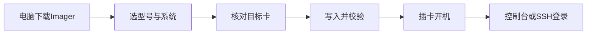
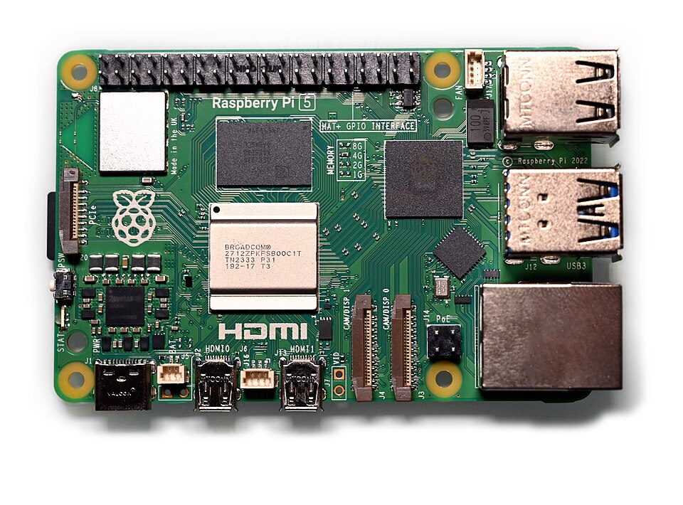
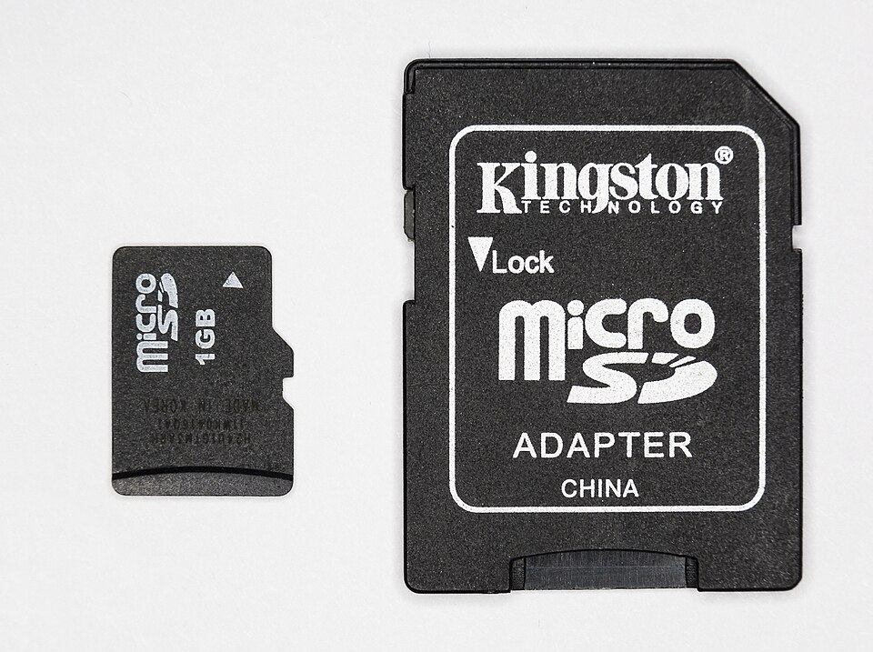

# 第 2 章 · 烧录系统与首次启动

> 📍 树莓派支线 · 第 2 章 ｜ ⏱ 45-60 分钟 ｜ 难度：★★☆☆☆
> ⬅️ [树莓派是什么与选购](01-树莓派是什么与选购.md) ｜ ➡️ [远程连接与基础配置](03-远程连接与基础配置.md)

装 Windows 是「运行安装程序，一步步点下一步」；装树莓派系统却是「**先把系统写进一张卡，再让板子从卡里启动**」。为什么差这么多？

因为树莓派没有内置硬盘，也没有 BIOS 设置界面——它的大脑（固件）只会做一件事：从存储卡的第一块区域读取启动信息，然后把自己交出去。所以你的任务是**提前把一份「可启动的系统」完整地写到 microSD 卡上**，这个动作叫「烧录」（Flashing）：像把印章盖进蜡里一样，整个覆盖目标卡。

烧录会抹掉卡上一切旧数据。**选对存储设备，是本章最重要的一步**——写错盘符，心里想的是卡，手上格式化的是电脑系统盘。

## 🎯 学习目标

- 使用 Raspberry Pi Imager 选择适合硬件的系统。
- 设置自己的用户名、网络和 SSH，而不是依赖旧教程的默认密码。
- 首次登录后验证系统、存储与网络。

## 🧠 核心概念



[在学习站暂停、单步或重播](https://zhuguang-zfg.github.io/linux/#animation=flash-first-boot.svg)。动画中的输入输出为教学示意，需用本章实验验证。

### 2.1 烧录流程里的三个角色



一张卡要能启动树莓派，里面要有三个部分各司其职：

1. **固件与引导**：板子的 ROM 上电后从卡上读取引导程序；
2. **系统镜像**：完整的操作系统（内核 + 根文件系统 + 预装工具）；
3. **配置文件**：主机名、用户名、网络、SSH 开关——**烧录时就能预先写好**，不用插显示器。

把第 3 点想清楚，你立刻理解「无头安装」（Headless）：树莓派不接显示器、键盘，直接连网线和电源，从另一台电脑 SSH 进去干活。现代 Imager 写好网络和 SSH 后，无头安装是出生即就绪的，而不是像老教程那样「先进桌面再配」。



[在学习站暂停、单步或重播](https://zhuguang-zfg.github.io/linux/#animation=headless-setup.svg)。动画中的输入输出为教学示意，需用本章实验验证。

### 2.2 选哪个系统：桌面版、Lite 还是 64 位

| 系统 | 适合 | 代价 |
|---|---|---|
| Raspberry Pi OS（桌面） | 需要图形界面和浏览器 | 更吃内存和存储，远程维护更重 |
| Raspberry Pi OS Lite | 无头服务器、SSH 工作流 | 没有桌面，一切靠终端 |
| 32 位 / 64 位 | 64 位拥有更完整现代软件生态 | 64 位需要兼容硬件（本支线 Pi 4/5 可以） |

本支线主线用 **Lite（64-bit）**：它逼你走 SSH——而 SSH 正是后面远程配置、服务器、自动化各章的公共地基。桌面版图形环境只在需要时再补装，不要一开始就背着包袱上路。



本支线以 Pi 4/5 为基线；照片为 Pi 5 实机，实际安装前按硬件型号核对。照片：SimonWaldherr，CC BY 4.0，见 [署名](../../assets/images/CREDITS.md)。

## 🛠 命令实操

### 1. 写入系统



写入目标是 microSD 卡：烧录覆盖整张目标卡，选对存储设备最是关键。照片：Jacek Halicki，CC BY-SA 4.0，见 [署名](../../assets/images/CREDITS.md)。

1. 从 [官方软件下载页](https://www.raspberrypi.com/software/) 安装 Raspberry Pi Imager。
2. 插入 microSD 读卡器，按容量与设备信息确认目标；**先备份卡中已有数据**——烧录会把这张卡当白纸。
3. 选择实际设备型号，选择 **Raspberry Pi OS Lite（64-bit）**，需要桌面时改选桌面版。
4. 在系统自定义设置里配置唯一主机名（如 `pi-lab`）、自己的用户名、时区和网络；无头安装需启用 SSH，优先配置已有的 SSH 公钥。
5. 如果使用 Wi-Fi，填写正确的 SSID、密码与国家/地区；不要把这些设置文件或截图上传到仓库。
6. 再次核对目标卡，开始写入并等待校验完成，安全弹出后插入树莓派。

Imager 的界面文字会随版本变化；按当前官方界面完成同样的六项检查即可。不再使用“默认 pi/raspberry”或在 boot 分区放旧式 wpa_supplicant.conf 的过时流程。

**为什么不再用默认账户 `pi/raspberry`？** 这个名字和密码全网公开，任何连上网络的人都可以先试一把。现代策略是「每个设备一个属于自己的账户」——烧录时写进去，比开机后再改更干净。

### 2. 首次启动与定位地址

连接网线后接通合规格电源，留时间让首次启动完成。可以从路由器 DHCP 租约列表查找 `pi-lab`，或尝试客户端的 mDNS：

```bash
ping pi-lab.local
ssh 你设置的用户名@pi-lab.local
```

`.local` 解析依赖网络和客户端支持；失败时使用路由器显示的 IP。首次 SSH 指纹应通过本地控制台等可信方式核对，无法核对时不要把未知主机当成自己的设备。

这里有两个值得记住的知识点：

- **mDNS 是「局域网里的 DNS」**：`pi-lab.local` 不是互联网域名，而是设备在局域网里自己广播的名字。它把「我记不住 IP」变成「我记名字就行」，但前提是网络允许 mDNS 广播。
- **首次 SSH 的指纹核对**：第一把 SSH 连接时显示的主机指纹，相当于第一次见面时的名片。如果以后指纹变了，说明对面这台机器可能不是你以为的那台（详见主线安全章节）。

登录成功后，像体检一样逐项检查：

```bash
hostname
cat /etc/os-release
uname -m
ip -br address
df -h /
```

预期主机名正确、架构为 `aarch64`、至少一个接口有可用地址，根文件系统容量符合所用存储。若容量异常小，先核对启动介质与分区，不要直接格式化。

`df -h /` 显示"根分区只有几 GB"通常是**镜像没烧进整个卡**（烧录工具只写了镜像大小），或系统把剩余空间留给其他分区——先看清分区布局再动手。

## 💡 避坑指南

- **烧录目标是整张 microSD，不是电脑系统盘**；不确定就拔插读卡器对比设备列表。这条值得用一分钟的核对换来一百分钟的后悔药。
- 无头安装忘记配置网络与 SSH 时，用显示器或重新配置镜像解决，不反复猜密码。
- 首次启动期间不要拔电源。需要关机时运行 `sudo poweroff`，待活动停止后再断电——直接拔电像「正写到一半合上书本」，可能损坏存储卡文件系统。
- 一张卡启动失败先核对镜像型号、写入校验、电源和读卡器，别同时更换所有变量。**一次只改一个变量**，才能知道哪个是病根。
- 看到绿灯狂闪不是故障信号，那通常是「系统正在读写卡」；完全不动才是需要重新检视的信号。

## ✍️ 动手实验

完成一次正常关机和重新启动，记录地址是否变化：

```bash
sudo poweroff
```

待板子关机后重新上电，从路由器查地址并再次 SSH 登录。将“型号、系统版本、用户名、主机名、地址获取方式”写入笔记，不记录私钥或明文密码。

**为什么做这个实验？** 服务器常识里有一条：「能用 IP 找到它，不算会运维；**关机能找回它，才算入门**。」DHCP 分配的地址可能在重启后变化，地址获取方式（DHCP 还是保留地址）决定了你明天还找不找得到它——这是第 3 章「稳定寻址」的引子。

## 📺 推荐视频

- [YouTube · 树莓派工作坊概览](https://www.youtube.com/watch?v=xiR14tSfc-U) — Core Electronics，0分38秒。仅为工作坊概览；当前 Imager 烧录流程以正文和官方说明为准。

[](https://www.youtube.com/watch?v=xiR14tSfc-U)

[在学习站查看配套媒体](https://zhuguang-zfg.github.io/linux/#read=docs%2F05-raspberry-pi%2F02-%E7%83%A7%E5%BD%95%E7%B3%BB%E7%BB%9F%E4%B8%8E%E9%A6%96%E6%AC%A1%E5%90%AF%E5%8A%A8.md) · [视频资料与核验说明](../../resources/videos.md)。标题、作者和分P已核对，未逐条完成实播，播放限制以原站为准。

## ✅ 自测清单

- [ ] 亲自核对过目标存储，完成写入校验。
- [ ] 用**自己的账户**（不是 pi/raspberry）成功登录。
- [ ] 能说出「烧录」和「运行安装程序」的区别（写卡 vs 装盘）。
- [ ] 能解释 `pi-lab.local` 靠什么解析（mDNS），失败时如何回退。
- [ ] 能解释为什么首次 SSH 要核对指纹。
- [ ] 能正常关机并再次找到设备。

## 🔗 延伸阅读

- [官方 Getting started](https://www.raspberrypi.com/documentation/computers/getting-started.html)
- [网络基础与远程连接](../02-advanced/08-网络基础与远程连接.md)
- 下一章：[远程连接与基础配置](03-远程连接与基础配置.md)——把「能登录」升级为「远程可维护」。