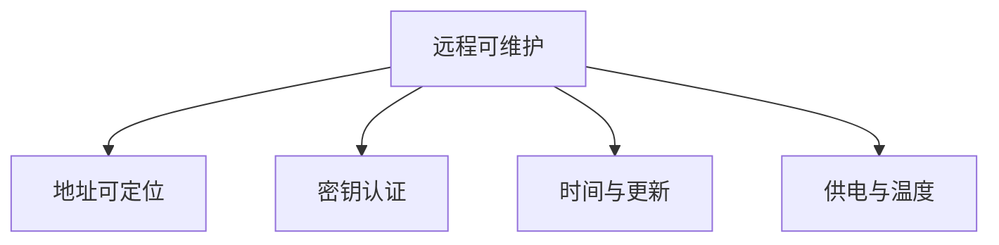

# 第 3 章 · 远程连接与基础配置

> 📍 树莓派支线 · 第 3 章 ｜ ⏱ 45-60 分钟 ｜ 难度：★★☆☆☆
> ⬅️ [烧录系统与首次启动](02-烧录系统与首次启动.md) ｜ ➡️ [GPIO 硬件编程](04-GPIO硬件编程.md)

能登录只是开始。一台真正「远程可维护」的树莓派，要满足四个条件：**找得到它、进得去它、时间对得上、供电撑得住**。缺了任何一个，白天能用的服务，半夜就可能失联——而你不在它身边。

这一章把「碰巧能 SSH」升级为「长期可靠地远程使用」。

## 🎯 学习目标

- 用公钥登录并记录稳定的寻址方式。
- 掌握 raspi-config 的用途，避免混用不同版本的网络配置方法。
- 检查时区、温度与限频信息，理解桌面远程访问的前提。

## 🧠 核心概念



[在学习站暂停、单步或重播](https://zhuguang-zfg.github.io/linux/#animation=pi-network.svg)。动画中的输入输出为教学示意，需用本章实验验证。


[在学习站暂停、单步或重播](https://zhuguang-zfg.github.io/linux/#animation=pi-remote.svg)。动画中的输入输出为教学示意，需用本章实验验证。

### 3.1 密码登录的致命弱点

密码是「你**知道什么**」（something you know），它有两个天然缺陷：**可以被猜**，**可以在传输中被截获**（除非协议加密）。公钥认证换成了「你**拥有什么**」（something you have）：你的私钥文件不出门，服务器只验证「持有私钥」这件事。

```
客户端（你有私钥）                服务器（它只有公钥）
      │  ① 用私钥签名一个挑战        │
      │ ──────────────────────────▶ │  ② 用公钥验签，通过则放行
```

- 密码：两个人共享一个秘密，秘密越多人知道越危险（而且还要定期改）；
- 公钥：服务器根本不保存你的私钥，**即使服务器被攻破，攻击者拿到的公钥也推不出私钥**。

所以安全章节里「禁用密码登录」的前提，是先让公钥认证稳稳工作——本章先把它跑通。

### 3.2 配置之前先问「网络归谁管」

Raspberry Pi OS 的网络配置，历史上经过 dhcpcd、NetworkManager 等多个时代。**最大的坑不是配置难，而是三种方法同时抢一个接口**——你改的 `interfaces` 文件被 NetworkManager 覆盖，或者反过来。

口诀：**先看 `systemctl is-active NetworkManager`，再决定动哪里。**



本章针对当前 Raspberry Pi OS 的常见配置方式。先读取版本和正在运行的网络管理服务，再决定修改哪里；不要同时用 NetworkManager、dhcpcd 和手工接口配置争抢同一接口。


侧面视角观察接口与排针；远程连接依赖稳定的网络与电源。照片：Laserlicht，CC BY-SA 4.0，见 [署名](../../assets/images/CREDITS.md)。

## 🛠 命令实操

### 1. 配置密钥登录

在客户端配置密钥，下面的用户名和主机名替换为你自己的：

```bash
test -f "$HOME/.ssh/id_ed25519.pub" || ssh-keygen -t ed25519
ssh-copy-id 用户名@pi-lab.local
ssh -o PreferredAuthentications=publickey 用户名@pi-lab.local
```

你只会用到三条命令：

| 命令 | 它在做什么 |
|---|---|
| `ssh-keygen -t ed25519` | 生成一对密钥：私钥留在本机 `~/.ssh/`，公钥是 `id_ed25519.pub` |
| `ssh-copy-id 用户@主机` | 把你的公钥追加到服务器的授权列表 `~/.ssh/authorized_keys` |
| `ssh -o PreferredAuthentications=publickey` | 强制只用公钥验证——成功说明钥匙已被信任，也顺便测出「密码登录已依赖但公钥没生效」的问题 |

最后一条 `-o` 选项是排除法：不经过密码输入，直接验证公钥路径是否打通。

在树莓派上：

```bash
cat /etc/os-release
sudo raspi-config
```

按菜单检查主机名、区域语言、时区和接口设置。一次只改一项；提示重启时先保存工作。命令行也可检查时间：

```bash
timedatectl
sudo timedatectl set-timezone Asia/Shanghai
sudo apt update
sudo apt full-upgrade
```

更新前阅读 apt 的变更列表，更新期间保证供电；需要重启时用 `sudo reboot`。不要把 Raspberry Pi OS 的软件源直接替换成 Ubuntu 源。

**时区为什么重要？** 服务器日志、定时任务、证书验证都依赖正确的时间。`timedatectl` 显示的 `System clock synchronized: yes`，背后是 NTP（网络时间协议）在不停地与世界时钟对齐——时间错乱会让 HTTPS 失败、日志对不上号、定时任务半夜发作。这是「看着小事、坏了大事」的典型。

### 2. 稳定地址与网络

```bash
systemctl is-active NetworkManager
nmcli device status
nmcli connection show
ip route
```

如果系统不使用 NetworkManager，先查该版本官方说明再继续。家庭环境可在路由器设置 DHCP 地址保留，既固定地址又减少板子侧的配置变更。通过 SSH 改网络有断连风险，先准备本地控制台；不要在唯一远程会话中随意执行连接删除。

两种「固定地址」的路由：

| 方式 | 原理 | 优点 | 注意 |
|---|---|---|---|
| 路由器 DHCP 地址保留 | 路由器每次给同一 MAC 发同一 IP | 不碰树莓派配置，改动集中 | 依赖路由器设置界面 |
| 板子侧静态 IP | 系统自己固定地址 | 不依赖路由器 DHCP | 与 DHCP 冲突风险高，需预留地址段 |

家庭环境优先第一种：少改树莓派，改动都在路由器一处，排查也更简单。

### 3. 温度和供电

```bash
vcgencmd measure_temp
vcgencmd get_throttled
uptime
```

预期温度输出形如 `temp=45.0'C`，无相关状态时 `get_throttled` 输出 `throttled=0x0`。非零是位掩码，可能包含“曾经发生”的欠压或限频，不等于当前一直故障；查官方定义并结合电源、散热和日志判断。

这里解释两个容易被误读的细节：

- **温度 45°C 高不高？** 对树莓派来说，80°C 以上才接近降频线，45°C 是很健康的数字。别被「人体体温 37°C」的感觉骗了——芯片和人是两种生物。
- **`get_throttled` 是「历史记录」**：`0x0` 表示现在和过去都没欠压过；非零值可能表示「某个时刻电源掉过链子」。它不报「现在坏没坏」，报的是「证据册子」。带着它一起查电源、散热和日志，而不是看到非零就换硬件。

### 4. 需要远程桌面时

Lite 系统没有桌面，不能只启用一个 VNC 开关就得到图形界面。先决定是否确实需要桌面，再安装/使用匹配的桌面系统。Raspberry Pi OS 的 Wayland/X11 与远程桌面实现会随版本变化，通过 raspi-config 和该版本官方文档配置；不要把 VNC 端口直接暴露到公网。

判断标准很朴素：**你的任务需要看窗口吗？** 需要图形界面设计、浏览器调试才值得装桌面；写代码、跑服务、看日志，SSH 足够——而且 SSH 更快、更省资源、更容易自动化。桌面是「按需加载」的选项，不是默认配置。

## 💡 避坑指南

- 公钥认证成功后才考虑禁用密码，操作方式见 [SSH 加固](../03-pro/03-安全加固.md)。**顺序反了 = 把自己锁在门外。**
- 频繁掉线不一定是 SSH 问题，检查供电、无线信号和地址变化。
- `/etc/resolv.conf` 可能由网络管理器生成，手工改动可能被覆盖。
- 换源先确认发行版代号、架构和签名，不直接复制别人的 sources.list。
- 「昨天还能连，今天就进不去」先查 IP 是否变了：点一下路由器地址保留，很多「失联」瞬间消失。
- 时间不对导致 HTTPS 报证书错误时，先 `timedatectl status` 看同步状态，别急着怀疑证书。

## ✍️ 动手实验

重启设备，验证主机名、公钥登录和时区保持不变；各保存一次空闲时和运行任务时的温度。若无需图形桌面，只用 SSH 完成后续章节。

<details><summary>验收记录</summary>

记录 `hostname`、`timedatectl`、`vcgencmd measure_temp` 的输出，以及路由器的地址保留设置。只有不依赖“碰巧记住当前 IP”也能重新登录，才算配置完成。
</details>

**为什么这个实验值得做？**「重启后一切如常」是远程运维的第一块压舱石。如果你的系统依赖「开机后手动改点什么」才能工作，那它还不是一台可靠的服务器——第 5 章搭建的家庭服务会建立在「重启即回归」的基础上。

## 📺 推荐视频

- [B站 · SSH 远程登录](https://www.bilibili.com/video/BV1Sv411r7vd/?p=14) — 韩顺平，P14，15分30秒。观看对应主题后，回到本章用实际输入和输出验证。
- [B站 · SSH 远程连接实操](https://www.bilibili.com/video/BV1dd1yYGEfg/?p=1) — 热爱IT行业，P1，11分5秒。观看对应主题后，回到本章用实际输入和输出验证。

[](https://www.bilibili.com/video/BV1Sv411r7vd/?p=14)

[在学习站查看配套媒体](https://zhuguang-zfg.github.io/linux/#read=docs%2F05-raspberry-pi%2F03-%E8%BF%9C%E7%A8%8B%E8%BF%9E%E6%8E%A5%E4%B8%8E%E5%9F%BA%E7%A1%80%E9%85%8D%E7%BD%AE.md) · [视频资料与核验说明](../../resources/videos.md)。标题、作者和分P已核对，未逐条完成实播，播放限制以原站为准。

## ✅ 自测清单

- [ ] 重启后仍能找到并用密钥登录设备。
- [ ] 能说出公钥认证比密码安全的核心原因（私钥不出门 / 服务器没有你的私钥）。
- [ ] 知道网络由哪个服务管理，不混用配置方法。
- [ ] 能查看温度、供电状态和系统时间。
- [ ] 能解释 `get_throttled` 非零值的历史含义，不慌着换硬件。
- [ ] 知道何时需要远程桌面，VNC 不外暴露公网。

## 🔗 延伸阅读

- [官方配置文档](https://www.raspberrypi.com/documentation/computers/configuration.html)
- [树莓派速查](../../cheatsheets/树莓派速查.md)
- 下一章：[GPIO 硬件编程](04-GPIO硬件编程.md)——让程序第一次碰到真实世界的引脚。