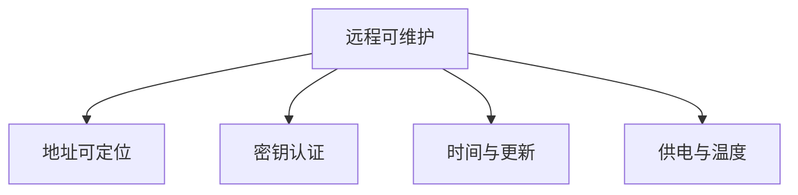

# 第 3 章 · 远程连接与基础配置

> 📍 树莓派支线 · 第 3 章 ｜ ⏱ 45-60 分钟 ｜ 难度：★★☆☆☆
> ⬅️ [烧录系统与首次启动](02-烧录系统与首次启动.md) ｜ ➡️ [GPIO 硬件编程](04-GPIO硬件编程.md)

能登录只是开始。把时间、网络和软件更新配置清楚，再检查温度与供电，树莓派才适合持续运行。

## 🎯 学习目标

- 用公钥登录并记录稳定的寻址方式。
- 掌握 raspi-config 的用途，避免混用不同版本的网络配置方法。
- 检查时区、温度与限频信息，理解桌面远程访问的前提。

## 🧠 核心概念



[在学习站暂停、单步或重播](https://zhuguang-zfg.github.io/linux/#animation=pi-remote.svg)。动画中的输入输出为教学示意，需用本章实验验证。



本章针对当前 Raspberry Pi OS 的常见配置方式。先读取版本和正在运行的网络管理服务，再决定修改哪里；不要同时用 NetworkManager、dhcpcd 和手工接口配置争抢同一接口。


侧面视角观察接口与排针；远程连接依赖稳定的网络与电源。照片：Laserlicht，CC BY-SA 4.0，见 [署名](../../assets/images/CREDITS.md)。

## 🛠 命令实操

在客户端配置密钥，下面的用户名和主机名替换为你自己的：

```bash
test -f "$HOME/.ssh/id_ed25519.pub" || ssh-keygen -t ed25519
ssh-copy-id 用户名@pi-lab.local
ssh -o PreferredAuthentications=publickey 用户名@pi-lab.local
```

在树莓派上：

```bash
cat /etc/os-release
sudo raspi-config
```

按菜单检查主机名、区域语言、时区和接口设置。一次只改一项；提示重启时先保存工作。命令行也可检查时间：

```bash
timedatectl
sudo timedatectl set-timezone Asia/Shanghai
sudo apt update
sudo apt full-upgrade
```

更新前阅读 apt 的变更列表，更新期间保证供电；需要重启时用 `sudo reboot`。不要把 Raspberry Pi OS 的软件源直接替换成 Ubuntu 源。

### 稳定地址与网络

```bash
systemctl is-active NetworkManager
nmcli device status
nmcli connection show
ip route
```

如果系统不使用 NetworkManager，先查该版本官方说明再继续。家庭环境可在路由器设置 DHCP 地址保留，既固定地址又减少板子侧的配置变更。通过 SSH 改网络有断连风险，先准备本地控制台；不要在唯一远程会话中随意执行连接删除。

### 温度和供电

```bash
vcgencmd measure_temp
vcgencmd get_throttled
uptime
```

预期温度输出形如 `temp=45.0'C`，无相关状态时 `get_throttled` 输出 `throttled=0x0`。非零是位掩码，可能包含“曾经发生”的欠压或限频，不等于当前一直故障；查官方定义并结合电源、散热和日志判断。

### 需要远程桌面时

Lite 系统没有桌面，不能只启用一个 VNC 开关就得到图形界面。先决定是否确实需要桌面，再安装/使用匹配的桌面系统。Raspberry Pi OS 的 Wayland/X11 与远程桌面实现会随版本变化，通过 raspi-config 和该版本官方文档配置；不要把 VNC 端口直接暴露到公网。

## 💡 避坑指南

- 公钥认证成功后才考虑禁用密码，操作方式见 [SSH 加固](../03-pro/03-安全加固.md)。
- 频繁掉线不一定是 SSH 问题，检查供电、无线信号和地址变化。
- `/etc/resolv.conf` 可能由网络管理器生成，手工改动可能被覆盖。
- 换源先确认发行版代号、架构和签名，不直接复制别人的 sources.list。

## ✍️ 动手实验

重启设备，验证主机名、公钥登录和时区保持不变；各保存一次空闲时和运行任务时的温度。若无需图形桌面，只用 SSH 完成后续章节。

<details><summary>验收记录</summary>

记录 `hostname`、`timedatectl`、`vcgencmd measure_temp` 的输出，以及路由器的地址保留设置。只有不依赖“碰巧记住当前 IP”也能重新登录，才算配置完成。
</details>

## 📺 推荐视频

- [B站 · SSH 远程登录](https://www.bilibili.com/video/BV1Sv411r7vd/?p=14) — 韩顺平，P14，15分30秒。观看对应主题后，回到本章用实际输入和输出验证。

[](https://www.bilibili.com/video/BV1Sv411r7vd/?p=14)

[在学习站查看配套媒体](https://zhuguang-zfg.github.io/linux/#read=docs%2F05-raspberry-pi%2F03-%E8%BF%9C%E7%A8%8B%E8%BF%9E%E6%8E%A5%E4%B8%8E%E5%9F%BA%E7%A1%80%E9%85%8D%E7%BD%AE.md) · [视频资料与核验说明](../../resources/videos.md)。标题、作者和分P已核对，未逐条完成实播，播放限制以原站为准。

## ✅ 自测清单

- [ ] 重启后仍能找到并用密钥登录设备。
- [ ] 知道网络由哪个服务管理，不混用配置方法。
- [ ] 能查看温度、供电状态和系统时间。

## 🔗 延伸阅读

- [官方配置文档](https://www.raspberrypi.com/documentation/computers/configuration.html)
- [树莓派速查](../../cheatsheets/树莓派速查.md)
