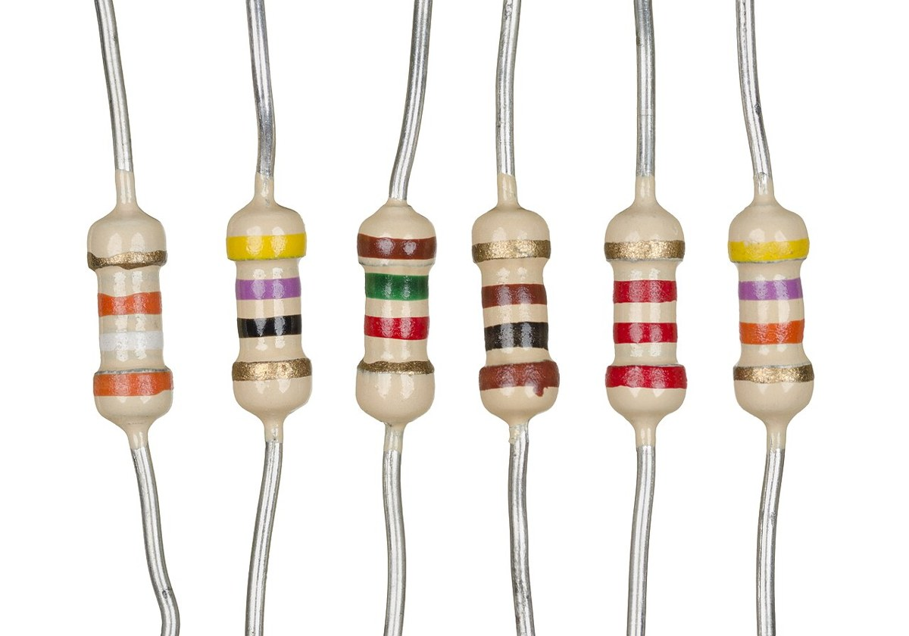

# 第 4 章 · GPIO 硬件编程

> 📍 树莓派支线 · 第 4 章 ｜ ⏱ 60 分钟 ｜ 难度：★★★☆☆
> ⬅️ [远程连接与基础配置](03-远程连接与基础配置.md) ｜ ➡️ [家庭服务器实战](05-家庭服务器实战.md)

GPIO（General Purpose Input/Output）让程序控制电平、读取按键。本章只做低压 LED 和按键实验，先弄清引脚编号，再接线。

## 🎯 学习目标

- 区分 BCM 编号和物理针脚编号。
- 用 gpiozero 控制 LED，并在退出时释放引脚。
- 用内部上拉读取按钮，解释为什么输入需要确定的默认电平。

## 🧠 核心概念



照片帮助识别色环与引脚，图中元件并非本实验的 330Ω 配件清单。实际连接前按标识或测量确认阻值。照片：Evan-Amos，公有领域，见 [署名](../../assets/images/CREDITS.md)。


本章针对 Pi 4/5 的 40 针排针。gpiozero 的 `LED(17)` 使用 **BCM GPIO17**，不是物理第 17 针。GPIO 信号为 3.3V 逻辑，不能接入 5V 信号；接线前关机断电，LED 必须串联限流电阻，不直接驱动电机。


动画表达工作原理，实际针脚方向以主板和 `pinout` 输出为准。

## 🛠 命令实操

在 Raspberry Pi OS 中安装发行版提供的库，避免把旧款 GPIO 库直接套到 Pi 5：

```bash
sudo apt update
sudo apt install python3-gpiozero python3-lgpio
pinout
id
```

核对图上的 GPIO17 与 GND。关机断电后按上图连接 LED，检查极性和电阻，再上电。完整程序见 [blink.py](../../scripts/pi/blink.py)，从仓库根目录运行：

```bash
python3 scripts/pi/blink.py
```

预期 LED 每半秒切换亮灭，Ctrl-C 后关闭。程序用 `with LED(17)` 管理资源，用 `pause()` 等待信号，不用占满 CPU 的无限切换循环。

### 增加按钮输入

断电后，将按钮接在 **GPIO27（物理 13 针）与 GND** 之间；按钮四脚中同侧可能已连通，先核对器件内部连接。保存下面程序为 `button.py`：

```python
from signal import pause
from gpiozero import Button, LED

with LED(17) as led, Button(27, pull_up=True, bounce_time=0.05) as button:
    button.when_pressed = led.on
    button.when_released = led.off
    try:
        pause()
    except KeyboardInterrupt:
        pass
```

运行 `python3 button.py`：按下亮、松开灭。`pull_up=True` 用内部上拉让松开时电平确定；`bounce_time` 减少机械触点抖动带来的重复事件。

## 💡 避坑指南

- BCM 与物理编号混用会接错电源或引脚，先断电对图。
- “LED 不亮”依次检查公共地、极性、电阻、针脚编号与程序错误，不短接电阻试亮。
- 无硬件的 PC 上运行可能找不到 pin factory，这是环境不支持，不是加 sudo 就能解决。
- 权限错误先检查发行版的 GPIO 组与设备节点权限；新增组成员后重新登录，不把设备设为全员可写。
- 传感器的供电电压与输出信号电压是两回事，接入前分别核对。

## ✍️ 动手实验

把闪烁改为亮 0.2 秒、灭 0.8 秒，观察周期与占空比；再完成按钮控制。没有硬件时可用 gpiozero 的 MockFactory 检查逻辑，但模拟测试不能证明接线正确。

<details><summary>参考答案</summary>

把 `led.blink(on_time=0.5, off_time=0.5)` 改成 `led.blink(on_time=0.2, off_time=0.8)`，周期仍为 1 秒，亮灯占 20%。按钮实验的默认状态应熄灭，按下后才亮。
</details>

## 📺 推荐视频

[树莓派专题](../../resources/videos.md) 的 GPIO 演示可辅助识别接线，编号以本板型号为准。

## ✅ 自测清单

- [ ] 能指出 GPIO17 的物理位置，接线前会断电。
- [ ] LED 串联电阻，程序退出后熄灭。
- [ ] 能解释按钮上拉与消抖的作用。

## 🔗 延伸阅读

- [gpiozero 官方基础示例](https://gpiozero.readthedocs.io/en/stable/recipes.html)
- [gpiozero 引脚工厂](https://gpiozero.readthedocs.io/en/stable/api_pins.html)
