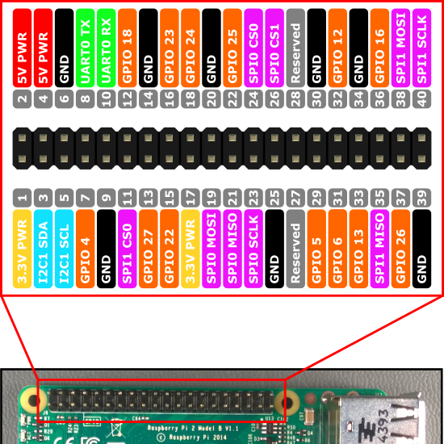
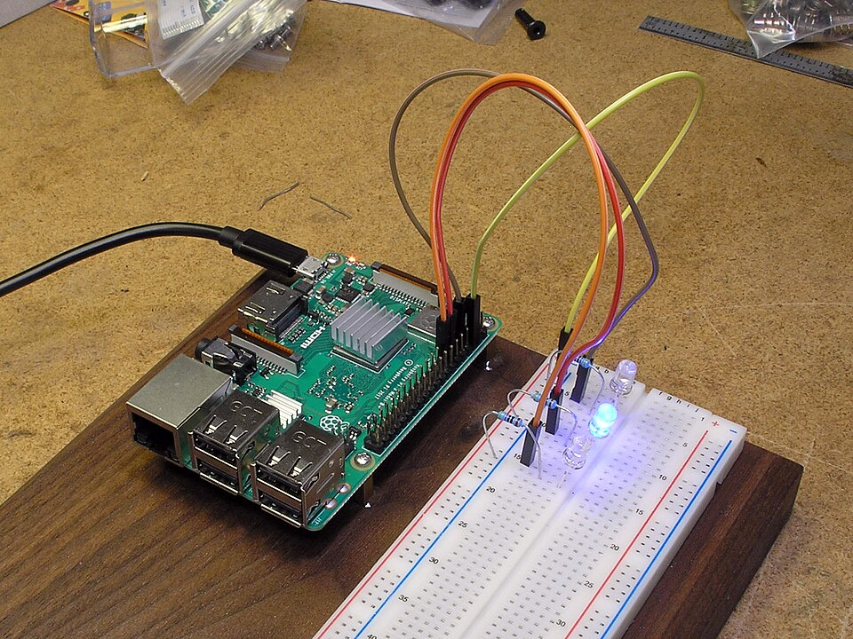

# 第 4 章 · GPIO 硬件编程

> 📍 树莓派支线 · 第 4 章 ｜ ⏱ 60 分钟 ｜ 难度：★★★☆☆
> ⬅️ [远程连接与基础配置](03-远程连接与基础配置.md) ｜ ➡️ [家庭服务器实战](05-家庭服务器实战.md)

前面几章，程序活在「文件、进程、网络」的抽象世界里；这一章，程序第一次碰到**真实世界的引脚**。GPIO（General Purpose Input/Output）的意思是：这些引脚既可以当「输出」——程序决定它的电平高低，也可以当「输入」——程序读取外部给它的电平。

别急着接线。GPIO 第一课不是代码，是**敬畏**：这是一排能通电的金属针，接错可能烧板子。只要遵守两条铁律——**接线前断电、LED 必须串联限流电阻**——它就是你最听话的玩具。

## 🎯 学习目标

- 区分 BCM 编号和物理针脚编号。
- 用 gpiozero 控制 LED，并在退出时释放引脚。
- 用内部上拉读取按钮，解释为什么输入需要确定的默认电平。

## 🧠 核心概念



[在学习站暂停、单步或重播](https://zhuguang-zfg.github.io/linux/#animation=gpio-button.svg)。动画中的输入输出为教学示意，需用本章实验验证。


照片帮助识别色环与引脚，图中元件并非本实验的 330Ω 配件清单。实际连接前按标识或测量确认阻值。照片：Evan-Amos，公有领域，见 [署名](../../assets/images/CREDITS.md)。

### 4.1 电平：GPIO 世界里唯一的语言

数字电路没有「一半高一半低」，只有两个状态：

- **高电平（HIGH）**：接近供电电压（树莓派是 **3.3V**）；
- **低电平（LOW）**：接近 0V（地线 GND）。

程序控制一个引脚输出，就是「把它设为 3.3V 或 0V」；读取一个引脚，就是「看它现在是 3.3V 还是 0V」。LED 亮不亮、按钮按没按，本质都是电平问题——**先想通这一点，后面所有硬件实验都只是电平的排列组合**。

### 4.2 为什么是 3.3V，为什么不能碰 5V

树莓派的 GPIO 信号引脚工作在 **3.3V 逻辑**。如果你把一个 5V 设备的信号直接接进 GPIO 引脚，3.3V 的输入保护电路会被 5V「击穿」，轻则读值异常，重则烧掉这个引脚甚至整块 SoC（处理器）。

所以：**接入 GPIO 之前，先确认对方输出的是 3.3V 逻辑**。需要 5V 时用「电平转换」方案，而不是直接怼上去。这条规则记不住的话，记住它的后果就够了——GPIO 引脚烧了，板子往往也救不回来。

### 4.3 LED 为什么必须串联电阻：一次欧姆定律

发光二极管（LED）本身几乎不阻止电流——如果直接接到 3.3V，它会像短路一样狂吸电流直到烧毁。物理学早就给了答案，欧姆定律：

```
电流 = 电压 ÷ 电阻      I = (3.3V − LED压降) ÷ R
```

一个典型 LED 的正向压降约 2V，我们希望电流 ≈ 10mA（0.01A）：

```
R = (3.3 − 2) ÷ 0.01 = 130Ω
```

所以实验用 **330Ω**（留足安全裕量，也容忍元件误差）。电阻在这里是「限流器」：把电流钳在 LED 承受范围内。**没有电阻的 LED 电路，就是一根等待短路的导线。**


**怎么分清 LED 正负极？** 看两个细节：长脚是正极（阳极）；或者看灯体内部，大的那块金属片通常是负极（阴极）。接反了不会烧，只是不亮——换过来就好。

### 4.4 BCM 编号 vs 物理针脚：同一排针的两套身份证

本章针对 Pi 4/5 的 40 针排针。gpiozero 的 `LED(17)` 使用 **BCM GPIO17**，不是物理第 17 针。GPIO 信号为 3.3V 逻辑，不能接入 5V 信号；接线前关机断电，LED 必须串联限流电阻，不直接驱动电机。



BCM 编号与物理针脚对照，接线前断电对图。图片：Andy Oakley，CC0，见 [署名](../../assets/images/CREDITS.md)。

**为什么要两套编号？** 物理编号（最左列 1-40）是「排针的第几根」，固定不变；BCM 编号是「芯片内部 GPIO 通道号」，是程序里用的名字。`LED(17)` 说的是 GPIO17，它落在物理第 11 针。接线时对图、写程序时用 BCM——混用是新手最经典的接错电源事故源头。


动画表达工作原理，实际针脚方向以主板和 `pinout` 输出为准。

## 🛠 命令实操

在 Raspberry Pi OS 中安装发行版提供的库，避免把旧款 GPIO 库直接套到 Pi 5：

```bash
sudo apt update
sudo apt install python3-gpiozero python3-lgpio
pinout
id
```

核对图上的 GPIO17 与 GND。关机断电后按上图连接 LED，检查极性和电阻，再上电。完整程序见 [blink.py](../../scripts/pi/blink.py)，从仓库根目录运行：

```bash
python3 scripts/pi/blink.py
```

预期 LED 每半秒切换亮灭，Ctrl-C 后关闭。程序用 `with LED(17)` 管理资源，用 `pause()` 等待信号，不用占满 CPU 的无限切换循环。

看一遍 [blink.py](../../scripts/pi/blink.py) 的骨架，你会理解 gpiozero 的哲学：

```python
from gpiozero import LED
from signal import pause

with LED(17) as led:
    led.blink(on_time=0.5, off_time=0.5)
    pause()
```

- `with LED(17)`：进入时占用引脚，退出时**自动释放**——程序崩溃、Ctrl-C 都不会把引脚留在「点亮」状态；
- `blink(on_time=0.5, off_time=0.5)`：硬件定时器驱动闪烁，**不占 CPU**；
- `pause()`：把控制权交给系统信号，等 Ctrl-C 到来。

GPIO 编程最隐蔽的坑不是「不亮」，而是「程序死了引脚还开着」——用 `with` 上下文管理，从根上避免。



面包板点灯的实际连接形态；本实验的 330Ω 限流电阻按标识或测量确认。照片：Mitch Barrie，CC BY-SA 2.0，见 [署名](../../assets/images/CREDITS.md)。

### 增加按钮输入

断电后，将按钮接在 **GPIO27（物理 13 针）与 GND** 之间；按钮四脚中同侧可能已连通，先核对器件内部连接。保存下面程序为 `button.py`：

```python
from signal import pause
from gpiozero import Button, LED

with LED(17) as led, Button(27, pull_up=True, bounce_time=0.05) as button:
    button.when_pressed = led.on
    button.when_released = led.off
    try:
        pause()
    except KeyboardInterrupt:
        pass
```

运行 `python3 button.py`：按下亮、松开灭。`pull_up=True` 用内部上拉让松开时电平确定；`bounce_time` 减少机械触点抖动带来的重复事件。

**为什么输入需要「确定的默认电平」？** 一个悬空的引脚（没接任何东西）电压是不确定的，读出来的值可能是 0 也可能是 1，还会受电磁干扰跳动。内部上拉（pull-up）把默认电平**钉**在高电平：松开按钮时引脚读到 HIGH，按下按钮把引脚接到 GND 读到 LOW——状态清清楚楚。`bounce_time` 则是物理世界的脏活：机械触点按下瞬间会弹跳几十毫秒，产生一连串虚假的开/关信号，50ms 的消抖把它们过滤成一个干净的「按下」。

## 💡 避坑指南

- BCM 与物理编号混用会接错电源或引脚，先断电对图。
- “LED 不亮”依次检查公共地、极性、电阻、针脚编号与程序错误，不短接电阻试亮。**不要用「去掉电阻试试」来排障**——那是在拿烧板子探路。
- 无硬件的 PC 上运行可能找不到 pin factory，这是环境不支持，不是加 sudo 就能解决。
- 权限错误先检查发行版的 GPIO 组与设备节点权限；新增组成员后重新登录，不把设备设为全员可写。
- 传感器的供电电压与输出信号电压是两回事，接入前分别核对。
- 树莓派是 3.3V 逻辑；任何 5V 信号进 GPIO 前都要先做电平适配。

## ✍️ 动手实验

把闪烁改为亮 0.2 秒、灭 0.8 秒，观察周期与占空比；再完成按钮控制。没有硬件时可用 gpiozero 的 MockFactory 检查逻辑，但模拟测试不能证明接线正确。

<details><summary>参考答案</summary>

把 `led.blink(on_time=0.5, off_time=0.5)` 改成 `led.blink(on_time=0.2, off_time=0.8)`，周期仍为 1 秒，亮灯占 20%。按钮实验的默认状态应熄灭，按下后才亮。
</details>

**额外挑战（选做）**：把按钮改成「按一次切换 LED 状态」而不是「按住亮、松开灭」。思考：这需要程序记住上一次的状态——你刚刚学会了 GPIO，现在开始学「状态」了。这是第 7 章数据记录的思想种子。

## 📺 推荐视频

- [YouTube · GPIO 与 gpiozero](https://www.youtube.com/watch?v=iL_oZGHLHvU) — DroneBot Workshop，48分39秒。观看对应主题后，回到本章用实际输入和输出验证。

[](https://www.youtube.com/watch?v=iL_oZGHLHvU)

[在学习站查看配套媒体](https://zhuguang-zfg.github.io/linux/#read=docs%2F05-raspberry-pi%2F04-GPIO%E7%A1%AC%E4%BB%B6%E7%BC%96%E7%A8%8B.md) · [视频资料与核验说明](../../resources/videos.md)。标题、作者和分P已核对，未逐条完成实播，播放限制以原站为准。

## ✅ 自测清单

- [ ] 能指出 GPIO17 的物理位置，接线前会断电。
- [ ] 会用欧姆定律估算限流电阻（知道 330Ω 在干什么，而不是死记）。
- [ ] 能说出 GPIO 为什么只认 3.3V 逻辑，5V 信号不能直接接入。
- [ ] LED 串联电阻，程序退出后熄灭（`with` 释放引脚）。
- [ ] 能解释按钮上拉与消抖的作用。
- [ ] 知道 BCM 编号和物理针脚不是一回事。

## 🔗 延伸阅读

- [gpiozero 官方基础示例](https://gpiozero.readthedocs.io/en/stable/recipes.html)
- [gpiozero 引脚工厂](https://gpiozero.readthedocs.io/en/stable/api_pins.html)
- 下一章：[家庭服务器实战](05-家庭服务器实战.md)——从「点一个灯」回到「跑一个服务」。