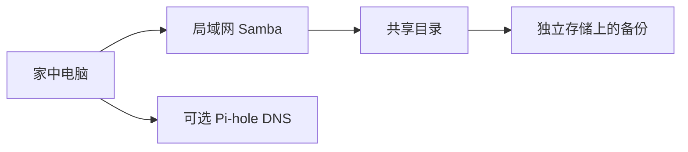
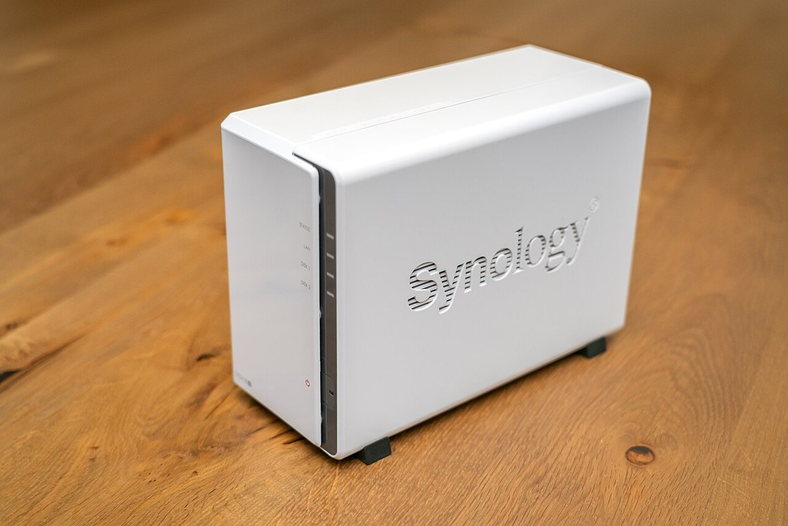

# 第 5 章 · 家庭服务器实战

> 📍 树莓派支线 · 第 5 章 ｜ ⏱ 1-2 小时 ｜ 难度：★★★☆☆
> ⬅️ [GPIO 硬件编程](04-GPIO硬件编程.md) ｜ ➡️ [树莓派与边缘 AI](06-树莓派与边缘AI.md)

「服务器」听起来遥远，但本质就一句话：**一台不停机、等待别人来请求的电脑**。家里的树莓派接上电、开着 SSH，就已经是一台（只服务你一个人的）服务器了。本章把它升级成真正有用的形态：一个**需要认证、能备份、重启后还在**的局域网共享存储。

目标不是「把 Samba 配出来」，而是建立三个概念锚点——**共享不是备份、服务要能恢复、家庭网络的改动要可回退**。记住这三个锚点，配出来的不是玩具，是可维护的基础设施。

## 🎯 学习目标

- 用 Samba 提供一个有独立认证的共享目录。
- 区分系统盘、服务数据与备份，验证客户端写入和重启后读取。
- 理解 DNS 去广告的工作位置，不盲目修改全家网络。

## 🧠 核心概念



[在学习站暂停、单步或重播](https://zhuguang-zfg.github.io/linux/#animation=pi-homeserver.svg)。动画中的输入输出为教学示意，需用本章实验验证。

### 5.1 Samba 在协议世界里扮演什么角色

Windows 访问网络共享用的是 SMB（Server Message Block）协议；Linux 自己原生不吃这一套，Samba 就是「**在 Linux 上实现 SMB 服务**」的软件。它像一个翻译官：Windows 客户端说 SMB，树莓派内部说 POSIX 文件系统，Samba 在中间把两者互相翻译。



**共享不是备份。** 客户端对共享目录的删除、覆盖，会**实时**作用到服务器上的真文件——共享是「同一个文件的多个入口」，不是「多一份拷贝」。所以本章的备份环节绝不可以省略。



NAS 是独立存储的常见形态；本方案用树莓派 + Samba 搭建共享目录，备份放在系统盘之外。照片：DYVER，CC BY-SA 4.0，见 [署名](../../assets/images/CREDITS.md)。

### 5.2 备份的三道防线

专业说法叫「3-2-1 原则」，翻译成人话：

| 数字 | 含义 | 本章的落点 |
|---|---|---|
| 3 | 数据至少有三份 | 原件 + 共享 + 备份目录 |
| 2 | 存在两种介质 | microSD 系统卡 + 独立 SSD/移动盘 |
| 1 | 至少一份离线 | 备份目标在源目录**之外**的另一块介质 |

「备份到同一张卡的不同文件夹」不算备份——卡坏了，两份一起没。本章验证你至少做到了「不同目录 + 不同介质」，这是家庭数据的底线。

### 5.3 Pi-hole：看清它到底拦在哪里

Pi-hole 是「DNS 去广告」：它接管你设备的域名解析请求，把广告域名解析为空地址（返回无效 IP），设备自然加载不到广告服务器。

- **它工作的位置是 DNS**，所以只对「通过它解析域名」的设备生效；
- 它**不是**防火墙、不是内容过滤、也拦不住所有广告（有些广告直接内嵌在页面和 App 里）；
- 改 DHCP 下发的 DNS 会影响**全家**设备——所以必须先单机测试、记录原配置、可随时回退。

想清楚这三点，Pi-hole 就是家里最省心的网络成员；想不清楚，它就是全家断网的嫌疑人。

## 🛠 命令实操

### 创建受认证保护的共享

在 Raspberry Pi OS 上执行：

```bash
sudo apt install samba smbclient
share_user=$(id -un)
sudo install -d -o "$share_user" -g "$(id -gn)" -m 0770 /srv/pi-share
sudo smbpasswd -a "$share_user"
sudo cp -a /etc/samba/smb.conf /etc/samba/smb.conf.before-pi-share
sudoedit /etc/samba/smb.conf
```

在配置末尾增加以下段落，`你的实际用户名` 必须替换成 `id -un` 的输出；如果已有 `[pi-share]`，修改原段，不重复追加：

```ini
[pi-share]
    path = /srv/pi-share
    browseable = yes
    read only = no
    guest ok = no
    valid users = 你的实际用户名
    create mask = 0660
    directory mask = 0770
```

验证再加载：

```bash
testparm -s
sudo systemctl enable --now smbd
sudo systemctl reload smbd
smbclient -L localhost -U "$share_user"
```

预期能列出 `pi-share`。在 Windows 文件管理器访问 `\\树莓派IP\pi-share`，或 macOS Finder 连接 `smb://树莓派IP/pi-share`；用刚设置的 Samba 用户名和密码登录。防火墙只对家庭 LAN 放行所需 SMB 端口，不将 445 映射到公网。

**配置文件里的每个词都有用意**，挑三个最关键的：

| 配置项 | 含义 |
|---|---|
| `guest ok = no` | 不允许匿名访问——共享必须认证 |
| `valid users = 你的实际用户名` | 白名单：只有这个系统用户能共享 |
| `create mask` / `directory mask` | 新文件/新目录的权限上限，防止共享里意外产生世界可读文件 |

先备份配置（`smb.conf.before-pi-share`）再 `sudoedit`，是「改动可回退」的第一课——改坏了，一行 `sudo cp` 就能回到改之前。

**Samba 密码 ≠ Linux 登录密码。** `smbpasswd -a` 设置的是 Samba 认证数据库里的独立密码。忘了一点：即使树莓派系统登录密码改过，Samba 密码也不会跟随变化——要单独管。

### 存储与备份

```bash
findmnt -T /srv/pi-share
df -h /srv/pi-share
```

这能确认数据实际写在哪个文件系统。要换到 SSD，先完成 [挂载章节](../02-advanced/07-磁盘与文件系统.md)，确认盘已挂载，再迁移共享路径。备份可使用 [backup.sh](../../scripts/backup.sh)，备份目标应在源目录之外；需要防存储故障时还必须位于不同介质。

**为什么先看 `findmnt`？** 「路径在哪个文件系统上」是个容易被忽略的事实：`/srv/pi-share` 可能其实落在系统 microSD 卡上，也可能落在外接 SSD 上。备份脚本如果不先确认挂载点，会把「备份」写进同一张卡——表面一片祥和，实际在同一个坑里转。

### Docker 与 Pi-hole 的扩展方向

Docker 镜像必须支持设备的 `arm64` 架构；遇到 `exec format error` 先查镜像架构，不能靠重试解决。安装与卷管理沿用 [容器章节](../03-pro/04-容器与虚拟化.md)。

**`exec format error` 是什么？** 容器里的程序是给 x86 编译的二进制，而树莓派是 ARM——不是「跑不起来重试一次就好」，是「这份代码根本不是给这颗 CPU 的」。检查镜像标签（带 `arm64`/`linux/arm64` 的镜像），或改用官方多架构镜像。

Pi-hole 通过 DNS 屏蔽命中的域名，不会移除所有广告。按 [官方 Docker 示例](https://docs.pi-hole.net/docker/) 部署时，先检查本机 53 端口是否被占用；Pi-hole v6 的管理员密码环境变量是 `FTLCONF_webserver_api_password`，不要混用旧版 `WEBPASSWORD` 示例。

先只把一台测试客户端的 DNS 指向 Pi-hole，确认解析和管理界面正常，再决定是否修改路由器 DHCP 下发的 DNS。记录原来的 DNS 设置，停机前恢复；不向公网开放递归 DNS 服务。

## 💡 避坑指南

- Samba 密码是独立设置的，不一定等于 Linux 登录密码。
- Windows 缓存了旧凭据时，先清理该服务器的缓存凭据，再测试新账号。
- 目标 SSD 未挂载时，程序可能写进系统卡上的空目录；启动前检查挂载点。
- **把「共享」当「备份」**：客户端误删会同步影响共享内容，备份必须另存。
- 家庭服务要能恢复：保留配置备份、数据备份与地址记录。
- 改 DHCP/DNS 前记录原值，回退永远比修复快。

## ✍️ 动手实验

从客户端上传一个文件，在树莓派运行 `sha256sum /srv/pi-share/文件名` 记录校验值；正常重启，再从客户端下载并比对。然后把文件备份到另一个目录并恢复到第三个目录，不能直接覆盖原件来验证。

**这个实验的设计意图看得见吗？** 三份拷贝、两次校验、一次重启——它把「3-2-1 原则」和「重启即回归」全部落到实处。校验值（sha256）是你的证据链：文件经过共享、重启、备份、恢复，内容必须纹丝不动，一个字都不能差。

## 📺 推荐视频

- [YouTube · Docker 容器入门](https://www.youtube.com/watch?v=fqMOX6JJhGo) — freeCodeCamp.org，130分18秒。容器基础补充，Samba 与家庭存储配置见正文。

[](https://www.youtube.com/watch?v=fqMOX6JJhGo)

[在学习站查看配套媒体](https://zhuguang-zfg.github.io/linux/#read=docs%2F05-raspberry-pi%2F05-%E5%AE%B6%E5%BA%AD%E6%9C%8D%E5%8A%A1%E5%99%A8%E5%AE%9E%E6%88%98.md) · [视频资料与核验说明](../../resources/videos.md)。标题、作者和分P已核对，未逐条完成实播，播放限制以原站为准。

## ✅ 自测清单

- [ ] 未认证用户不能访问共享，自己的用户可以读写。
- [ ] 知道共享数据落在哪个文件系统，重启后文件还在。
- [ ] 能把备份恢复到独立目录，并核对内容。
- [ ] 能说出「共享不是备份」并解释为什么。
- [ ] 知道 Pi-hole 拦在 DNS 层，改 DHCP 前要单机验证和可回退。

## 🔗 延伸阅读

- [Samba smb.conf 手册](https://www.samba.org/samba/docs/current/man-html/smb.conf.5.html)
- [Pi-hole Docker 文档](https://docs.pi-hole.net/docker/)
- 下一章：[树莓派与边缘 AI](06-树莓派与边缘AI.md)——把「本地」两个字变成真正的计算力。