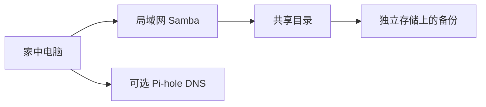

# 第 5 章 · 家庭服务器实战

> 📍 树莓派支线 · 第 5 章 ｜ ⏱ 1-2 小时 ｜ 难度：★★★☆☆
> ⬅️ [GPIO 硬件编程](04-GPIO硬件编程.md) ｜ ➡️ [树莓派与边缘 AI](06-树莓派与边缘AI.md)

把树莓派一直开着之前，先完成一个最小可维护服务。本章搭建需要认证的局域网共享目录，再说明 Docker、Pi-hole 和数据备份如何接入。

## 🎯 学习目标

- 用 Samba 提供一个有独立认证的共享目录。
- 区分系统盘、服务数据与备份，验证客户端写入和重启后读取。
- 理解 DNS 去广告的工作位置，不盲目修改全家网络。

## 🧠 核心概念


[在学习站暂停、单步或重播](https://zhuguang-zfg.github.io/linux/#animation=pi-homeserver.svg)。动画中的输入输出为教学示意，需用本章实验验证。



共享盘不是备份：客户端误删会同步影响共享内容。长期运行时考虑可靠供电、散热和存储寿命，数据库及频繁写入的数据可以迁移到已正确挂载的 SSD。

## 🛠 命令实操

### 创建受认证保护的共享

在 Raspberry Pi OS 上执行：

```bash
sudo apt install samba smbclient
share_user=$(id -un)
sudo install -d -o "$share_user" -g "$(id -gn)" -m 0770 /srv/pi-share
sudo smbpasswd -a "$share_user"
sudo cp -a /etc/samba/smb.conf /etc/samba/smb.conf.before-pi-share
sudoedit /etc/samba/smb.conf
```

在配置末尾增加以下段落，`你的实际用户名` 必须替换成 `id -un` 的输出；如果已有 `[pi-share]`，修改原段，不重复追加：

```ini
[pi-share]
    path = /srv/pi-share
    browseable = yes
    read only = no
    guest ok = no
    valid users = 你的实际用户名
    create mask = 0660
    directory mask = 0770
```

验证再加载：

```bash
testparm -s
sudo systemctl enable --now smbd
sudo systemctl reload smbd
smbclient -L localhost -U "$share_user"
```

预期能列出 `pi-share`。在 Windows 文件管理器访问 `\\树莓派IP\pi-share`，或 macOS Finder 连接 `smb://树莓派IP/pi-share`；用刚设置的 Samba 用户名和密码登录。防火墙只对家庭 LAN 放行所需 SMB 端口，不将 445 映射到公网。

### 存储与备份

```bash
findmnt -T /srv/pi-share
df -h /srv/pi-share
```

这能确认数据实际写在哪个文件系统。要换到 SSD，先完成 [挂载章节](../02-advanced/07-磁盘与文件系统.md)，确认盘已挂载，再迁移共享路径。备份可使用 [backup.sh](../../scripts/backup.sh)，备份目标应在源目录之外；需要防存储故障时还必须位于不同介质。

### Docker 与 Pi-hole 的扩展方向

Docker 镜像必须支持设备的 `arm64` 架构；遇到 `exec format error` 先查镜像架构，不能靠重试解决。安装与卷管理沿用 [容器章节](../03-pro/04-容器与虚拟化.md)。

Pi-hole 通过 DNS 屏蔽命中的域名，不会移除所有广告。按 [官方 Docker 示例](https://docs.pi-hole.net/docker/) 部署时，先检查本机 53 端口是否被占用；Pi-hole v6 的管理员密码环境变量是 `FTLCONF_webserver_api_password`，不要混用旧版 `WEBPASSWORD` 示例。

先只把一台测试客户端的 DNS 指向 Pi-hole，确认解析和管理界面正常，再决定是否修改路由器 DHCP 下发的 DNS。记录原来的 DNS 设置，停机前恢复；不向公网开放递归 DNS 服务。

## 💡 避坑指南

- Samba 密码是独立设置的，不一定等于 Linux 登录密码。
- Windows 缓存了旧凭据时，先清理该服务器的缓存凭据，再测试新账号。
- 目标 SSD 未挂载时，程序可能写进系统卡上的空目录；启动前检查挂载点。
- 家庭服务要能恢复：保留配置备份、数据备份与地址记录。

## ✍️ 动手实验

从客户端上传一个文件，在树莓派运行 `sha256sum /srv/pi-share/文件名` 记录校验值；正常重启，再从客户端下载并比对。然后把文件备份到另一个目录并恢复到第三个目录，不能直接覆盖原件来验证。

## 📺 推荐视频

- [YouTube · Docker 容器入门](https://www.youtube.com/watch?v=fqMOX6JJhGo) — freeCodeCamp.org，130分18秒。容器基础补充，Samba 与家庭存储配置见正文。

[](https://www.youtube.com/watch?v=fqMOX6JJhGo)

[在学习站查看配套媒体](https://zhuguang-zfg.github.io/linux/#read=docs%2F05-raspberry-pi%2F05-%E5%AE%B6%E5%BA%AD%E6%9C%8D%E5%8A%A1%E5%99%A8%E5%AE%9E%E6%88%98.md) · [视频资料与核验说明](../../resources/videos.md)。标题、作者和分P已核对，未逐条完成实播，播放限制以原站为准。

## ✅ 自测清单

- [ ] 未认证用户不能访问共享，自己的用户可以读写。
- [ ] 知道共享数据落在哪个文件系统，重启后文件还在。
- [ ] 能把备份恢复到独立目录，并核对内容。

## 🔗 延伸阅读

- [Samba smb.conf 手册](https://www.samba.org/samba/docs/current/man-html/smb.conf.5.html)
- [Pi-hole Docker 文档](https://docs.pi-hole.net/docker/)
