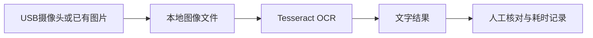

# 第 6 章 · 树莓派与边缘 AI

> 📍 树莓派支线 · 第 6 章 ｜ ⏱ 1-2 小时 ｜ 难度：★★★★☆
> ⬅️ [家庭服务器实战](05-家庭服务器实战.md) ｜ ➡️ [从按钮到数据记录](07-从按钮到数据记录.md)

边缘 AI 是把部分数据处理和推理放到设备本地。先做一个能验收的小任务：拍下一张文字图片，在树莓派上识别文字，并测量耗时。

## 🎯 学习目标

- 完成采集、保存、推理、核对结果的完整链路。
- 区分相机访问问题与识别模型问题。
- 记录延迟、内存和温度，知道何时应该缩小任务规模。

## 🧠 核心概念




[在学习站暂停、单步或重播](https://zhuguang-zfg.github.io/linux/#animation=edge-inference.svg)。动画中的输入输出为教学示意，需用本章实验验证。


本节 USB 采集路径对应这种外接摄像头；CSI 排线相机要使用匹配的软件栈。照片：WrS.tm.pl，CC0，见 [署名](../../assets/images/CREDITS.md)。



本章以 Pi 4/5 的 64 位 Raspberry Pi OS 为基线，用 Tesseract 完成 OCR（Optical Character Recognition，光学字符识别）。这是可复现的本地识别任务，不把“能够启动一个大模型”当成实时体验保证。

## 🛠 命令实操

### 1. 安装本地工具

```bash
sudo apt update
sudo apt install python3-opencv v4l-utils tesseract-ocr tesseract-ocr-eng
v4l2-ctl --list-devices
```

USB 摄像头通常通过 Video4Linux 设备访问；设备编号不一定是 0。CSI 排线摄像头应使用该系统支持的 rpicam/Picamera2 流程，不能默认当作 USB 摄像头。

从仓库根目录调用 [capture-frame.py](../../scripts/pi/capture-frame.py)，让一张印着大号 `HELLO LINUX` 的纸进入画面：

```bash
python3 scripts/pi/capture-frame.py "$HOME/ocr-sample.jpg" --device 0
file "$HOME/ocr-sample.jpg"
```

程序支持 `.jpg`、`.jpeg`、`.png`，父目录需已存在；`--device` 必须是非负整数。图像先编码再以独占方式创建文件，即使同名文件在采集过程中出现，也会拒绝覆盖。`--help` 不需要安装 OpenCV。采集失败时释放摄像头并报告原因；重复实验用新文件名。没有相机时，把自己准备的清晰文字图片保存到同一路径，也能完成后续识别。

### 2. 本地 OCR 与结果核对

```bash
time tesseract "$HOME/ocr-sample.jpg" stdout -l eng --psm 6
free -h
vcgencmd measure_temp
```

预期识别结果包含纸上的文字，但精确内容取决于清晰度、光线、角度和版式。`--psm 6` 假设图像是单块文字，复杂布局需要不同模式。中文识别需安装 `tesseract-ocr-chi-sim`，再改用 `-l chi_sim+eng`。

### 3. 延伸到本地模型与语音

想测试小语言模型，可沿用 [本地 AI 项目](../04-projects/项目4-Linux跑本地AI.md)，先确认镜像支持 ARM64，再从小模型开始，记录实际内存和响应时间。CPU 路线可能较慢，不要把桌面 GPU 的演示速度套到树莓派。

语音助手可拆成“麦克风采集 → 语音转文字 → 意图处理 → 语音输出”四个阶段。先用 `arecord -l` 确认设备，在获得参与者同意的情况下采集测试音频；逐阶段验证，再加入持续监听。不要一开始就把摄像头或麦克风数据自动上传到外部服务。

## 💡 避坑指南

- 打不开摄像头先查设备节点、用户权限和其他占用者，不先换识别模型。
- 图像尺寸越大，处理量越大；先保证目标文字清楚，再决定分辨率。
- 多线程不一定加速：观察温度、限频、内存和进程占用。
- 测试集要固定，同一张图像改参数后才能比较结果。

## ✍️ 动手实验

用相同文字分别拍摄正面、倾斜和低光照片，各识别三次，记录正确字数和耗时。选一种改善措施（补光、裁剪或摆正）再测，解释结果变化。

<details><summary>记录示例</summary>

| 图片条件 | 期望文字 | 识别文字 | 用时 | 改进 |
|---|---|---|---|---|
| 正面清晰 | HELLO LINUX | 填实际输出 | 填实际秒数 | 基线 |
| 倾斜 | HELLO LINUX | 填实际输出 | 填实际秒数 | 摆正后复测 |

不预填“100% 准确”，验收依据是自己的图像和实测数据。
</details>

## 📺 推荐视频

本章暂不收录不匹配的泛用视频。先完成图像采集与 OCR 实验，后续加入明确对应硬件和软件版本的演示。

[在学习站查看配套媒体](https://zhuguang-zfg.github.io/linux/#read=docs%2F05-raspberry-pi%2F06-%E6%A0%91%E8%8E%93%E6%B4%BE%E4%B8%8E%E8%BE%B9%E7%BC%98AI.md) · [视频资料与核验说明](../../resources/videos.md)。标题、作者和分P已核对，未逐条完成实播，播放限制以原站为准。

## ✅ 自测清单

- [ ] 图像可以保存，本地 OCR 能输出文字。
- [ ] 能区分采集失败、识别错误和资源不足。
- [ ] 有三组测试记录，能解释一个有效改进。

## 🔗 延伸阅读

- [Tesseract 官方使用指南](https://tesseract-ocr.github.io/tessdoc/Command-Line-Usage.html)
- [Raspberry Pi 官方相机文档](https://www.raspberrypi.com/documentation/computers/camera_software.html)
- [树莓派练习与答案](../../exercises/05-树莓派练习.md)
