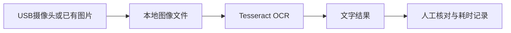

# 第 6 章 · 树莓派与边缘 AI

> 📍 树莓派支线 · 第 6 章 ｜ ⏱ 1-2 小时 ｜ 难度：★★★★☆
> ⬅️ [家庭服务器实战](05-家庭服务器实战.md) ｜ ➡️ [从按钮到数据记录](07-从按钮到数据记录.md)

「边缘 AI」这个词听起来像营销话术，其实定义很朴素：**把数据处理和推理放在设备本地，而不是全部送到云端**。你手机上的人脸解锁、打印机里的文字识别，都是边缘 AI——计算发生在「产生数据的现场」，而不是遥远的数据中心。

树莓派是练习边缘 AI 的好场地，因为它**足够慢**：慢到你能亲眼看见每一个环节的耗时，慢到「优化」不再是一句口号。本章要完成一个可验收的小任务：拍下一张文字图片，在树莓派上识别文字，并测量耗时。

## 🎯 学习目标

- 完成采集、保存、推理、核对结果的完整链路。
- 区分相机访问问题与识别模型问题。
- 记录延迟、内存和温度，知道何时应该缩小任务规模。

## 🧠 核心概念


[在学习站暂停、单步或重播](https://zhuguang-zfg.github.io/linux/#animation=edge-inference.svg)。动画中的输入输出为教学示意，需用本章实验验证。

### 6.1 为什么把计算搬到「边缘」

云和边缘不是二选一，是两种成本的权衡：

| | 云端推理 | 边缘推理（本设备） |
|---|---|---|
| 延迟 | 取决于网络，可能数百毫秒 | 本地完成，毫秒级 |
| 隐私 | 数据要传出去 | 数据不出设备 |
| 离线 | 断网即停摆 | 断网照常工作 |
| 算力 | 几乎无限 | 受 CPU/内存限制 |
| 运维 | 服务器与费用 | 自己维护 |

树莓派的价值不在「跑得多快」，而在**让「修数据、传数据、算数据」三条路都发生在你眼皮底下**——这是理解 AI 系统第一手材料。等你亲眼看过一次 OCR 的耗时，再回到 03-pro 的本地 AI 项目，很多概念会自动对号入座。



[在学习站暂停、单步或重播](https://zhuguang-zfg.github.io/linux/#animation=edge-vs-cloud.svg)。动画中的输入输出为教学示意，需用本章实验验证。


本节 USB 采集路径对应这种外接摄像头；CSI 排线相机要使用匹配的软件栈。照片：WrS.tm.pl，CC0，见 [署名](../../assets/images/CREDITS.md)。

### 6.2 OCR 管线：四个环节，四个瓶颈



- **采集**：摄像头把光变成像素（瓶颈：曝光、对焦、分辨率）；
- **保存**：像素写入图像文件（瓶颈：写入速度、磁盘空间）；
- **推理**：Tesseract 把图像变成文字（瓶颈：CPU 算力——小块头要啃大图）；
- **核对**：人眼比对识别结果（瓶颈：永远是你自己）。

**「不亮/不出字」先按环节定位，而不是整体重试。** 图片拍出来是黑的？那是采集环节。图是清晰的但文字全错？那是识别环节。两个环节的排查手段完全不同——区分它们，是本章核心技能之一。

本章以 Pi 4/5 的 64 位 Raspberry Pi OS 为基线，用 Tesseract 完成 OCR（Optical Character Recognition，光学字符识别）。这是可复现的本地识别任务，不把“能够启动一个大模型”当成实时体验保证。

## 🛠 命令实操

### 1. 安装本地工具

```bash
sudo apt update
sudo apt install python3-opencv v4l-utils tesseract-ocr tesseract-ocr-eng
v4l2-ctl --list-devices
```

USB 摄像头通常通过 Video4Linux 设备访问；设备编号不一定是 0。CSI 排线摄像头应使用该系统支持的 rpicam/Picamera2 流程，不能默认当作 USB 摄像头。

**`v4l2-ctl --list-devices` 是排查的起点**：它列出所有视频设备及设备节点。设备可能是 `/dev/video0`、`/dev/video2` 甚至更高——不要假设第一个就是你那个摄像头，先让系统告诉你它叫什么。

从仓库根目录调用 [capture-frame.py](../../scripts/pi/capture-frame.py)，让一张印着大号 `HELLO LINUX` 的纸进入画面：

```bash
python3 scripts/pi/capture-frame.py "$HOME/ocr-sample.jpg" --device 0
file "$HOME/ocr-sample.jpg"
```

程序支持 `.jpg`、`.jpeg`、`.png`，父目录需已存在；`--device` 必须是非负整数。图像先编码再以独占方式创建文件，即使同名文件在采集过程中出现，也会拒绝覆盖。`--help` 不需要安装 OpenCV。采集失败时释放摄像头并报告原因；重复实验用新文件名。没有相机时，把自己准备的清晰文字图片保存到同一路径，也能完成后续识别。

### 2. 本地 OCR 与结果核对

```bash
time tesseract "$HOME/ocr-sample.jpg" stdout -l eng --psm 6
free -h
vcgencmd measure_temp
```

预期识别结果包含纸上的文字，但精确内容取决于清晰度、光线、角度和版式。`--psm 6` 假设图像是单块文字，复杂布局需要不同模式。中文识别需安装 `tesseract-ocr-chi-sim`，再改用 `-l chi_sim+eng`。

三个参数各管一件事：

- `-l eng`：用英语语言包（先装 `tesseract-ocr-eng` 才能用）；
- `--psm 6`：Page Segmentation Mode =「一整块文本」，告诉引擎你的图是整齐的一段字；
- `time`：测量命令耗时——**这一章的验收指标就是它**。

**为什么纸质文字要求「大号、正对、光足」？** OCR 引擎不怕「字多」，怕「字糊」。把环境变量（光照、角度、分辨率）先做到最有利，才能区分「是引擎不行」还是「是我输入不行」——这是所有机器学习实验的共同第一课。

### 3. 延伸到本地模型与语音

想测试小语言模型，可沿用 [本地 AI 项目](../04-projects/项目4-Linux跑本地AI.md)，先确认镜像支持 ARM64，再从小模型开始，记录实际内存和响应时间。CPU 路线可能较慢，不要把桌面 GPU 的演示速度套到树莓派。

**ARM64 限制在这条路上反复出现**：很多 AI 权重、容器镜像默认只有 x86 版本，或只给 NVIDIA GPU 优化。在小板子上跑 AI 的第一问永远是「它支持 ARM 吗」，第二问才是「它跑得多快」。从最小的模型（几个亿参数级别的量化版本都未必合适）开始，用 `free -h` 观察内存水位——内存被吃满开始换页（Swap），速度会断崖式下跌。

语音助手可拆成“麦克风采集 → 语音转文字 → 意图处理 → 语音输出”四个阶段。先用 `arecord -l` 确认设备，在获得参与者同意的情况下采集测试音频；逐阶段验证，再加入持续监听。不要一开始就把摄像头或麦克风数据自动上传到外部服务。

**四阶段拆分是边缘 AI 的通用方法论**：任何一个大任务，先切成能独立验收的小环节，逐个跑通再拼装。一上来做「完整的语音助手」，你面对的是四个叠在一起的未知数，出问题根本无从下手。

## 💡 避坑指南

- 打不开摄像头先查设备节点、用户权限和其他占用者，不先换识别模型。
- 图像尺寸越大，处理量越大；先保证目标文字清楚，再决定分辨率。
- 多线程不一定加速：观察温度、限频、内存和进程占用。
- 测试集要固定，同一张图像改参数后才能比较结果。
- 把云端模型的速度当作树莓派的承诺速度——性能是测出来的，不是想象出来的。
- 摄像头/麦克风数据默认留在本地，上传任何采集内容前先确认合规与同意。

## ✍️ 动手实验

用相同文字分别拍摄正面、倾斜和低光照片，各识别三次，记录正确字数和耗时。选一种改善措施（补光、裁剪或摆正）再测，解释结果变化。

<details><summary>记录示例</summary>

| 图片条件 | 期望文字 | 识别文字 | 用时 | 改进 |
|---|---|---|---|---|
| 正面清晰 | HELLO LINUX | 填实际输出 | 填实际秒数 | 基线 |
| 倾斜 | HELLO LINUX | 填实际输出 | 填实际秒数 | 摆正后复测 |

不预填“100% 准确”，验收依据是自己的图像和实测数据。
</details>

**为什么倾斜会导致识别变差？** 想象引擎在图像里「找一行行的字」：倾斜让行不再是水平的，文本行检测就会出错，后面的字符识别跟着连锁失败。你亲手记录这个现象，比背十遍「预处理很重要」都管用——因为下次你会主动问「我的图像预处理到哪一步了」。

## 📺 推荐视频

- [B站 · 树莓派 5 部署大模型（Ollama 与交互界面）](https://www.bilibili.com/video/BV14EP7ebE92/?p=2) — 创乐博智能科技，P2，15分24秒。第三方厂商教程演示 Pi 5 部署流程；模型选择、内存与温度按本章实验记录。
- [B站 · LLaVA 多模态模型](https://www.bilibili.com/video/BV14EP7ebE92/?p=11) — 创乐博智能科技，P11，6分56秒。第三方厂商教程演示 Pi 5 部署流程；模型选择、内存与温度按本章实验记录。

[](https://www.bilibili.com/video/BV14EP7ebE92/?p=2)

[在学习站查看配套媒体](https://zhuguang-zfg.github.io/linux/#read=docs%2F05-raspberry-pi%2F06-%E6%A0%91%E8%8E%93%E6%B4%BE%E4%B8%8E%E8%BE%B9%E7%BC%98AI.md) · [视频资料与核验说明](../../resources/videos.md)。标题、作者和分P已核对，未逐条完成实播，播放限制以原站为准。

## ✅ 自测清单

- [ ] 图像可以保存，本地 OCR 能输出文字。
- [ ] 能区分采集失败、识别错误和资源不足（四个环节，各自排查）。
- [ ] 有三组测试记录，能解释一个有效改进。
- [ ] 能说出边缘推理与云端推理的一个本质差异（延迟或隐私）。
- [ ] 知道 ARM64 限制：模型/镜像先问架构，再看性能。

## 🔗 延伸阅读

- [Tesseract 官方使用指南](https://tesseract-ocr.github.io/tessdoc/Command-Line-Usage.html)
- [Raspberry Pi 官方相机文档](https://www.raspberrypi.com/documentation/computers/camera_software.html)
- [树莓派练习与答案](../../exercises/05-树莓派练习.md)
- 下一章：[从按钮到数据记录](07-从按钮到数据记录.md)——把硬件反应变成能分析的数据。