# 第 7 章 · 从按钮到数据记录

> 📍 树莓派支线 · 第 7 章 ｜ ⏱ 60 分钟 ｜ 难度：★★★☆☆
> ⬅️ [树莓派与边缘 AI](06-树莓派与边缘AI.md) ｜ ➡️ [学习路线与作品清单](../../LEARNING_PATHS.md)

前几章的程序大多是「即时反应」：亮灯、读取、输出。这一章做一件新的事——**把硬件的行为变成可以拿回来的数据**。点亮 LED 是输出控制，记录按钮是输入采集：把状态保存成 CSV，再用命令行分析，你就把硬件、Linux 工具和数据实践连成了一条完整的链。

这也是一道重要的观念分水岭：**真实采样 ≠ 模拟数据**。本章模拟模式先跑通流程，再上真机记录——两份数据来源标志始终保留，绝不混同。

## 🎯 学习目标

- 用明确的数据字段保存 GPIO 输入状态变化。
- 区分真实采样与模拟数据，避免把演示结果当成硬件验证。
- 统计按下次数，记录采样和消抖的局限。

## 🧠 核心概念



[在学习站暂停、单步或重播](https://zhuguang-zfg.github.io/linux/#animation=event-record.svg)。动画中的输入输出为教学示意，需用本章实验验证。



[在学习站暂停、单步或重播](https://zhuguang-zfg.github.io/linux/#animation=gpio-debounce.svg)。动画中的输入输出为教学示意，需用本章实验验证。

### 7.1 轮询与事件：采集数据的两种世界观

程序怎么知道按钮被按下了？两条路：

| 方式 | 原理 | 优点 | 代价 |
|---|---|---|---|
| **轮询（Polling）** | 程序循环不停地「看一眼」引脚状态 | 实现简单，逻辑直白 | 看的时候才看得见，看得越勤越耗 CPU |
| **事件/中断（Interrupt）** | 引脚电平变化时硬件主动通知 CPU | 不漏事件，不空耗 CPU | 机制复杂，边界条件多 |

本章的脚本走「事件轮询」的务实路线：**只在状态变化时写一行，不把每次轮询都当成一次按钮操作**。配套脚本 [record-button.py](../../scripts/pi/record-button.py) 把这个思想直接写进了实现。


### 7.2 为什么「变化时记录」而不是「每秒记录十次」

想象你每分钟记一次天气，你永远只知道「整点那一刻的温度」；而按下按钮的瞬间可能只持续 30 毫秒——**固定的轮询间隔会错过它**。反之，如果每秒记十次，一次 3 秒的长按就会产生 30 行完全相同的「pressed」。

「状态变化时记录」是第三种方案：没变化时静默，变化瞬间留痕。它让数据**既完整又精简**——这正是日志（不仅是 GPIO 日志）的设计哲学：只记录有意义的变化。

沿用 [GPIO 章节](04-GPIO硬件编程.md) 的按钮接线：GPIO27（物理 13 针）与 GND 之间接按钮，使用内部上拉。接线前断电，不外加 5V。已经有 LED 时，它仍接 GPIO17，不要混接。

### 7.3 CSV：为什么偏偏是它

CSV（逗号分隔值）是数据交换的「世界语」：纯文本、任何编辑器都能打开、awk/Python/Excel 都能直接读。它简单到没有任何锁、任何依赖——而这恰恰是它的力量：**几十年后，你最早记录的那份 CSV 依然可读**。

本章的记录包含三个字段，每个都有用意：

| 字段 | 含义 | 为什么重要 |
|---|---|---|
| `elapsed_s` | 距启动的秒数 | 按时间排序、计算间隔 |
| `state` | pressed / released | 状态本身，统计的基础 |
| `source` | simulated / gpio27 | **数据来源标签**——模拟与真实永不混同 |

第三列是全章最用心的一处设计，训练是一个工程师习惯：**数据必须自带「身世」**。混合了模拟与实测的数据，在后续分析（比如计数、训练）时会悄悄引入错误——来源标签就是后悔药。

## 🛠 命令实操

配套脚本 [record-button.py](../../scripts/pi/record-button.py) 只在状态变化时写一行，不把每次轮询都当成一次按钮操作。

### 无硬件也能先跑通文件流程

从仓库根目录运行；Python 3 即可，不需要 gpiozero：

```bash
python3 scripts/pi/record-button.py button-demo.csv --simulate --seconds 2
cat button-demo.csv
```

预期输出：

```csv
elapsed_s,state,source
0.000,released,simulated
0.500,pressed,simulated
1.000,released,simulated
1.500,pressed,simulated
2.000,released,simulated
```

模拟模式直接生成确定的样本，不等待真实时间，也不访问 GPIO；`source=simulated` 会一直保留在数据中。

**注意观察模拟数据的规律**：每 0.5 秒一次切换，整整齐齐。真实世界绝不会这么整齐——按下时机是人，抖动是物理。这两者的差别，正是 7.2 节「真实 ≠ 模拟」的直观教材。

### 在树莓派上记录真实操作

安装好 `python3-gpiozero`、确认接线后，使用不同的文件名：

```bash
python3 scripts/pi/record-button.py button-real.csv --seconds 10
head button-real.csv
awk -F, 'NR>1 && $2=="pressed" {n++} END {print "按下记录数:", n+0}' button-real.csv
```

在 10 秒内有意识地按 3 次，比较结果。真实数据的 source 为 `gpio27`，时间间隔不会像模拟数据那样整齐。输出文件已存在时脚本拒绝覆盖，重复实验需更换名称。

**awk 一行命令在做什么？** 拆开看就是英语：

- `-F,`：按逗号分段（告诉 awk 我们的分隔符）；
- `NR>1`：跳过表头行；
- `$2=="pressed"`：第二列是 pressed 才计数；
- `END {print ...}`：扫完全部行后输出总数。

这就是主线「管道与处理文本」知识在真实任务上的落点——硬件数据进了 CSV，命令行把它变成答案。**上一章的硬件在这一章变成了文本，Linux 工具链正式登场。**

## 💡 避坑指南

- 记录的是状态变化，不是高精度硬件中断计数；20ms 轮询可能漏掉很短的脉冲。
- 机械触点会抖动，50ms 消抖适合这个慢速手动按钮实验，不适合所有传感器。
- 程序启动时按钮已按住，会记录初始 pressed 状态；它不一定代表启动后的新点击。
- CSV 中的来源标签不能删掉后当成“实测数据”。
- 「按下次数」≠「真实点击数」：太快的小动作可能漏采，结论要写清楚测量方法。

## ✍️ 动手实验

记录慢按、快按、长按三组数据，各保存一个独立文件。分别统计 pressed 行数，解释为何长按不会不断产生新的按下记录，以及快速操作可能漏采的原因。

<details><summary>参考验收</summary>

三组 CSV 都有表头和来源字段，真实数据标记 gpio27；长按期间状态不变，所以不持续写新行。分析结论写明轮询与消抖限制，不宣称计数适用于高频设备。
</details>

**三个动作，三堂物理课：**

- **慢按**：每次按下 = 一条 pressed + 一条 released，计数干净；
- **长按**：按住期间状态一直不变，**不会**不断产生新记录——「状态变化才写行」的设计直接决定了这个结果；
- **快按**：如果两次按下的间隔短于采样周期，就可能只看到一次变化——这就是 7.1 节提到的轮询局限，此刻它不再是概念，是你亲手撞上的墙。

## 📺 推荐视频

- [YouTube · GPIO 与 gpiozero](https://www.youtube.com/watch?v=iL_oZGHLHvU) — DroneBot Workshop，48分39秒。GPIO 基础复习，CSV 记录程序和采样限制以本章为准。

[](https://www.youtube.com/watch?v=iL_oZGHLHvU)

[在学习站查看配套媒体](https://zhuguang-zfg.github.io/linux/#read=docs%2F05-raspberry-pi%2F07-%E4%BB%8E%E6%8C%89%E9%92%AE%E5%88%B0%E6%95%B0%E6%8D%AE%E8%AE%B0%E5%BD%95.md) · [视频资料与核验说明](../../resources/videos.md)。标题、作者和分P已核对，未逐条完成实播，播放限制以原站为准。

## ✅ 自测清单

- [ ] 模拟和真实记录使用不同文件、保留来源标签。
- [ ] 能解释每一列，以及按下记录与真实点击数的区别。
- [ ] 能说出「状态变化时记录」与「固定频率记录」的差别（完整 vs 精简）。
- [ ] 能用一条 awk 命令统计 CSV 里的按下次数。
- [ ] 至少记录一次可复做的实验过程。

## 🔗 延伸阅读

- [gpiozero Button 文档](https://gpiozero.readthedocs.io/en/stable/api_input.html#button)
- [树莓派练习](../../exercises/05-树莓派练习.md)
- ➡️ 主线一路走到这里，去 [学习路线与作品清单](../../LEARNING_PATHS.md) 看看你的树莓派作品集还剩什么可以补。