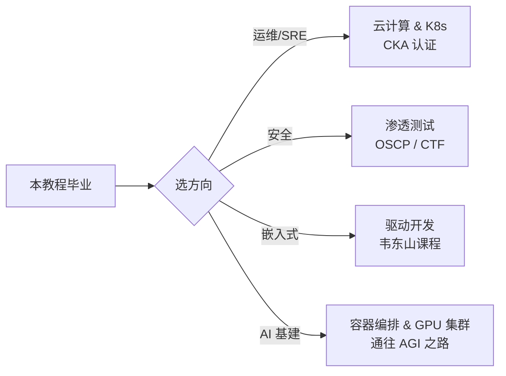

# 📚 书单与网站

> 只收录经典与官方来源。书不在多，一本一本啃完。

## 📕 中文经典书籍

| 书 | 作者 | 适合阶段 | 一句话推荐 |
|----|------|---------|-----------|
| 《鸟哥的 Linux 私房菜 · 基础学习篇》 | 鸟哥 | 阶段 0-1 | 华语世界最著名的 Linux 入门书，讲透了「为什么」 |
| 《Linux 命令行与 Shell 脚本编程大全》 | Richard Blum | 阶段 2 | 脚本编程案头字典 |
| 《Linux 就该这么学》 | 刘遄 | 阶段 0-1 | 免费在线，节奏轻快 |
| 《Linux 内核设计与实现》 | Robert Love | 阶段 3 | 内核入门第一本，薄而精 |
| 《性能之巅》（第 2 版） | Brendan Gregg | 阶段 3 | 系统性能方法论圣经 |

## 🌐 必收藏网站

### 自学求助类
- [explainshell.com](https://explainshell.com) —— 把任意命令拆成逐参数解释，学习神器
- [tldr.sh](https://tldr.sh) —— man 手册的「人话版」，例子优先
- [命令行的艺术](https://github.com/jlevy/the-art-of-command-line) —— GitHub 百万星开源小册（有中文）
- [MIT Missing Semester](https://missing.csail.mit.edu) —— MIT 给计算机学生的「工具课」，有中文字幕

### 权威文档类
- [The Linux Documentation Project](https://tldp.org) —— 最老的 Linux 文档计划，指南/手册/FAQ
- [ArchWiki](https://wiki.archlinux.org) —— 公认最全的 Linux Wiki，发行版无关
- [Ubuntu Server 文档](https://documentation.ubuntu.com/server/) —— Ubuntu 官方服务器文档
- [kernel.org 文档](https://www.kernel.org/doc/html/latest/) —— 内核官方文档

### 动手练习类
- [OverTheWire Bandit](https://overthewire.org/wargames/bandit/) —— 用闯关游戏学命令行与安全
- [Linux Journey](https://linuxjourney.com) —— 闯关式免费课程
- [Vim Adventures](https://vim-adventures.com) —— 玩游戏学 Vim

### 中文社区
- [Linux 中国](https://linux.cn) —— 中文新闻与翻译
- [掘金 / 知乎 Linux 话题](https://juejin.cn/tag/Linux) —— 实战文章集散地

## 🗺️ 学完本教程后的进阶方向

> 🤖 延伸致敬：本教程的编排灵感来自 [通往 AGI 之路](https://www.waytoagi.com)。学完 Linux，你就拥有了通往 AGI 世界的地基 —— 每一个 GPU 集群上都跑着 Linux。
