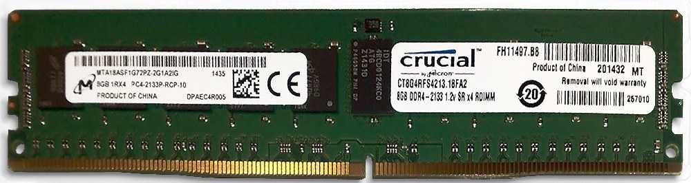
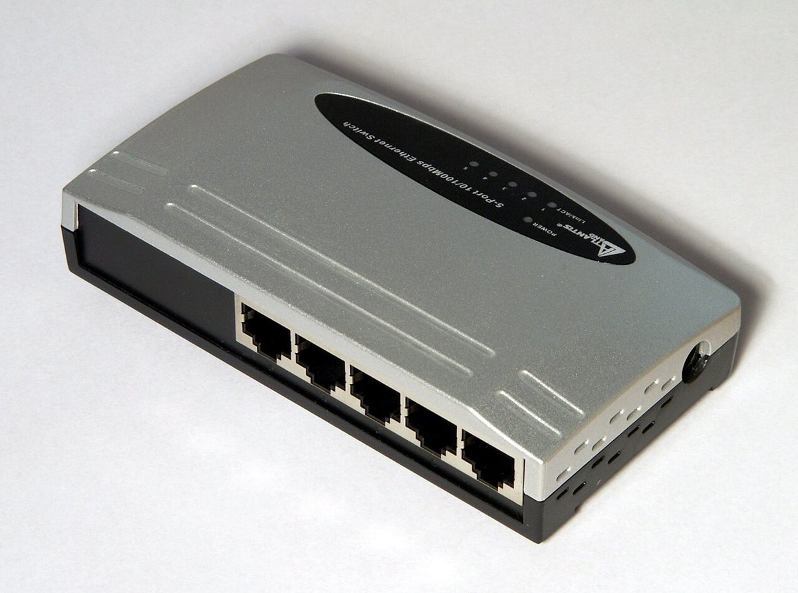
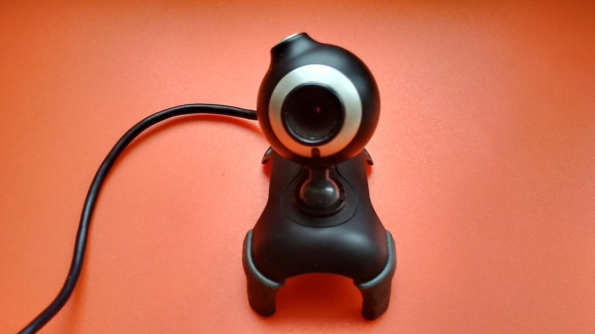
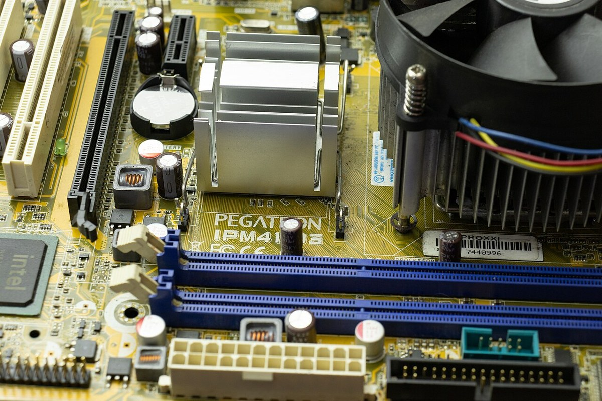
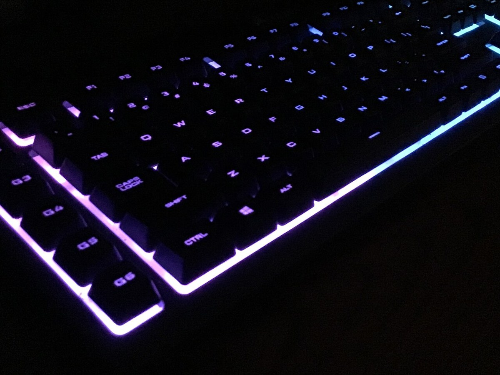
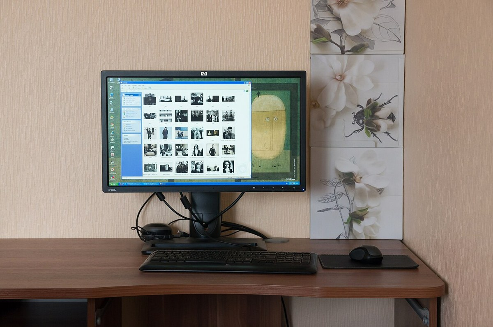
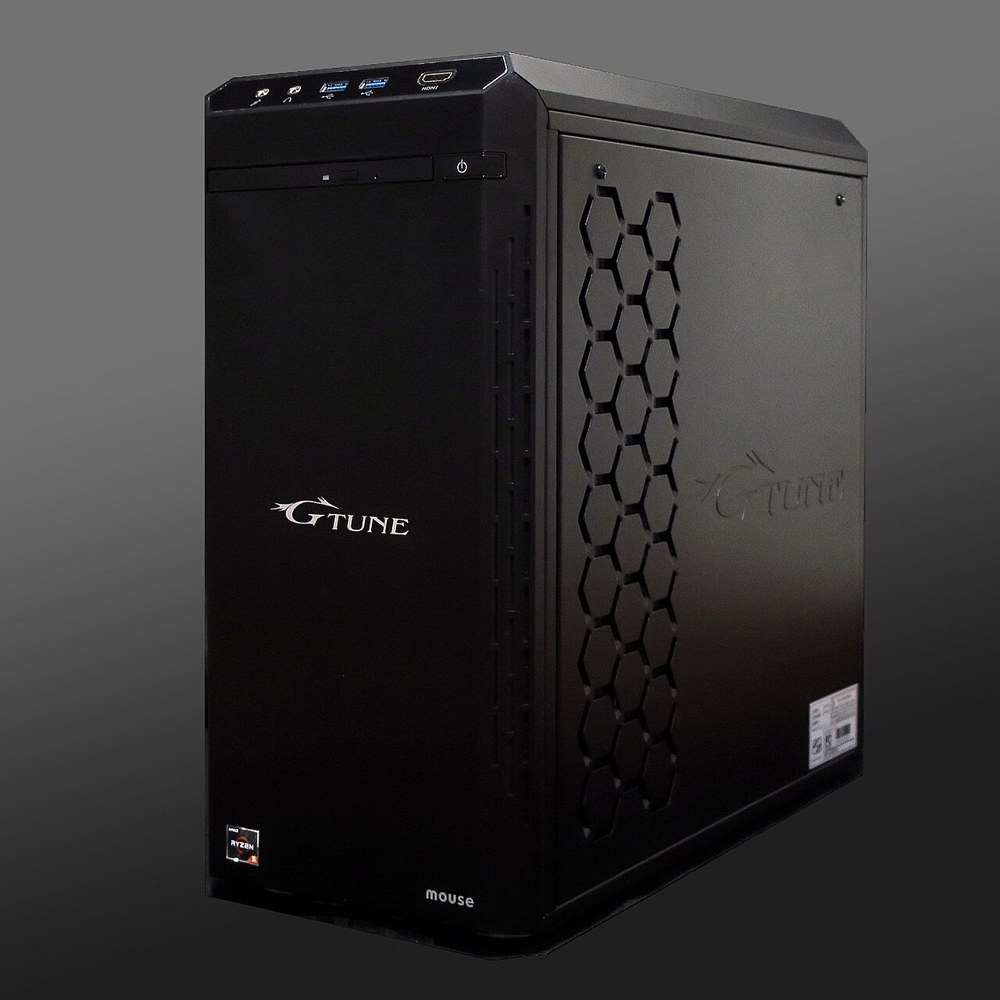
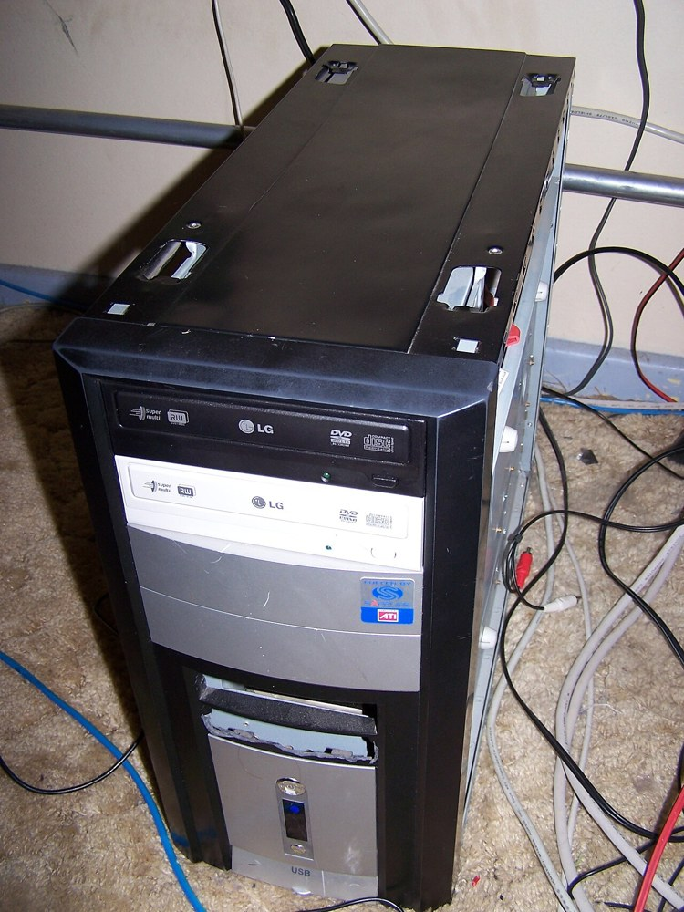

# 实物图鉴：把终端里的名词和真实设备对上

照片用于识别部件，具体兼容性以设备手册为准。新增照片均来自 Wikimedia Commons，完整作者、许可、来源及调整记录见 [CREDITS](../assets/images/CREDITS.md) 和 [来源元数据](../assets/images/SOURCES.json)。它们不是 AI 生成的硬件示意。

## 1. 内存条：看缺口，不只看容量

观察金手指、定位缺口和存储颗粒。照片为服务器 RDIMM 示例，不代表普通桌面或树莓派可安装。对应命令：`free -h`。完成 [硬件识别章节](../docs/01-basics/09-从实物认识Linux硬件.md) 后，解释物理容量与 available 的区别。

## 2. NVMe SSD：不是另一种内存条

观察固定孔、接口端和器件标签。外形相似不等于协议与主板兼容。对应命令：`lsblk`、`findmnt`。配合 [挂载动画](visual-lab.md) 回答“路径怎样找到持久存储”。

## 3. 网线接头：物理链路只是第一步

通常称作 RJ45 网口接头，图中可观察触点、卡扣与线缆。`ip -br link`、`ip -br address` 分别看接口与地址；插上网线不保证已经获得 IP。对应 [网络章节](../docs/02-advanced/08-网络基础与远程连接.md)。

## 4. 交换机：连接局域网设备

观察多个网络端口与电源接口。交换机、路由器和无线接入点的职责不同；这张旧型号照片用于认识结构，不用于推荐速度或性能。

## 5. USB 摄像头：设备存在不代表采集成功

先用 `lsusb` 判断枚举，再用 `v4l2-ctl --list-devices` 判断视频设备，最后真正采集图像。照片不代表 CSI 排线相机的接口与软件栈。对应 [边缘 AI 实验](../docs/05-raspberry-pi/06-树莓派与边缘AI.md)。

## 6. 电阻：先确认阻值，再接 LED

色环表示阻值和容差，但不能仅凭照片颜色选元件。图中是一组不同阻值的电阻，**不是本实验的 330Ω 配件清单**。点灯实验按 [GPIO 章节](../docs/05-raspberry-pi/04-GPIO硬件编程.md) 使用合适的限流电阻，接线前断电。

## 7. 显卡：显存决定本地推理体验

观察散热器、供电与接口。本地大模型的推理速度与显存强相关，选模型规模前先看硬件。对应命令：`nvidia-smi`。配合 [本地 AI 项目](../docs/04-projects/项目4-Linux跑本地AI.md) 的硬件要求表选择模型。

## 8. NAS：独立存储的形态

NAS 把多块硬盘放进专用设备并联网共享，是独立存储的一种常见形态；本教程的家庭服务器用树莓派 + Samba 实现更小的共享目录。对应 [家庭服务器实战](../docs/05-raspberry-pi/05-家庭服务器实战.md)。

## 9. 主板：所有部件的中枢

观察 CPU 插座、内存槽、SATA 接口与供电电容。具体兼容性以主板型号为准，不能凭外形判断接口代际。对应命令：`lspci`、`lsblk`。配合 [硬件识别章节](../docs/01-basics/09-从实物认识Linux硬件.md) 对照系统视图与实物。

## 10. 键盘：最直接的输入设备

机械键盘每个按键下有独立开关，手感与寿命和薄膜键盘不同；彩色灯光只影响外观。键盘是即插即用输入设备，无需在 Linux 里安装驱动即可识别。

## 11. 路由器：家庭网络的出口

路由器把宽带接入、交换与无线接入集于一台设备。家用场景通常在网页管理页配置它，不用命令行；物理连接正常后才去排查地址与路由。对应 [网络章节](../docs/02-advanced/08-网络基础与远程连接.md)。

## 12. 显示器：观察一切结果的窗口

分辨率、接口与刷新率决定显示体验；Linux 桌面设置可以调整，命令行用 `xrandr` 查询。显示器本身不参与计算，是纯输出设备。

## 13. 鼠标：最常见的指针输入

鼠标与键盘是最基础的输入设备，通常即插即用。`xinput list` 查看已识别输入设备；滚轮与侧键的功能由桌面或应用解释。

## 14. 塔式机箱：主机的常见形态

中塔/全塔机箱容纳主板、电源、硬盘与扩展卡，尺寸决定可装部件数量。台式机、迷你主机与服务器的区别常在形态与扩展性。

## 延伸观察

已有的 [树莓派全家福](../assets/images/raspberry-pi-family.jpg)、[GPIO 排针](../assets/images/raspberry-pi-gpio-header.jpg)、[microSD](../assets/images/microsd-card.jpg) 和 [服务器机架](../assets/images/datacenter-racks.jpg) 可以继续对照设备与系统视图。每看一张图，写下“它负责什么、Linux 用什么接口观察它、还不能从图中判断什么”。

返回 [学习路线](../LEARNING_PATHS.md) · 下一步 [动画实验室](visual-lab.md)。
